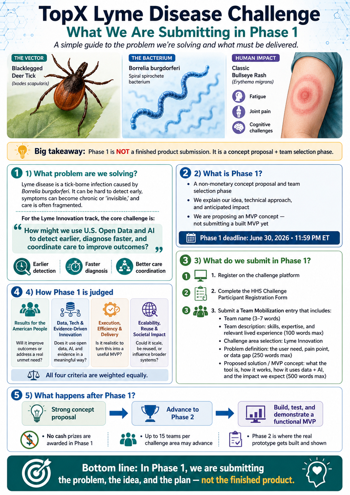

# TopX Lyme Challenge LLM Wiki



This repository is an implementation of an Andrej Karpathy-style LLM wiki for the TopX Lyme Challenge: a structured, source-grounded workspace where research materials, prompts, notes, findings, and submission thinking can accumulate into a navigable knowledge base.

The TopX Lyme Challenge focuses on identifying high-value AI opportunities related to Lyme disease. This repo is designed to support Phase 1 research: understanding the challenge, finding relevant public datasets and source material, documenting evidence, shaping research questions, and turning that work into a credible submission narrative.

## How This Wiki Is Organized

- `wiki/` contains the human-readable knowledge base: challenge brief, dataset inventory, research questions, findings, opportunities, and submission planning.
- `raw_sources/` is for original source material such as downloaded documents, API results, papers, and challenge references. Do not overwrite these files.
- `research/` contains working research configuration and notes that belong in the repo, including Gemini Deep Research job configuration.
- `prompts/` contains reusable prompt templates for research assistance, dataset scoring, and opportunity scoring.
- `findings/` is for more developed evidence notes and synthesized research outputs that should become part of the project record.
- `scripts/` contains automation for ingestion, discovery, Notion sync, and Gemini Deep Research.
- `outputs/` contains generated artifacts. Review outputs before promoting important content into `wiki/` or `findings/`.
- `resources/` contains README and project assets such as images.
- `project_scaffolding/` contains setup and maintenance scripts for the repo itself.
- `.codex/skills/topx-lyme-llm-wiki/` contains the project-local Codex skill and workflow reference for operating the LLM wiki.

## Current Wiki Pages

- `wiki/00_home.md` - entry point for the TopX Lyme Challenge wiki
- `wiki/01_challenge_brief.md` - goals, requirements, assumptions, and open questions
- `wiki/02_dataset_inventory.md` - candidate datasets and source tracking
- `wiki/03_research_questions.md` - active research questions
- `wiki/04_findings.md` - finding template and synthesized evidence
- `wiki/05_opportunities.md` - opportunity scoring table
- `wiki/06_submission_plan.md` - Phase 1 deliverables and narrative checklist
- `wiki/log.md` - research activity log
- `wiki/index.md` and `wiki/overview.md` - wiki navigation and summary pages

## Gemini Deep Research

This project includes a Gemini Deep Research runner for launching one or more markdown prompts in parallel. The runner and configuration are part of the repo; individual input prompts and generated report files are local run artifacts and are intentionally ignored by git.

Install dependencies:

```powershell
pip install -r requirements.txt
```

Create `.env` from `.env.example` and set:

```dotenv
GEMINI_API_KEY=your_gemini_api_key_here
```

Create one or more markdown prompts under:

```text
input/deep_research/
```

Then edit:

```text
research/deep_research_config.json
```

Set each job's `enabled` field to `true` when it should run. The config controls the output directory, maximum parallel jobs, prompt paths, optional per-job agent overrides, and output filename prefixes.

List configured jobs:

```powershell
python scripts/run_deep_research.py list
```

Run all enabled jobs:

```powershell
python scripts/run_deep_research.py run
```

Retrieve a completed Gemini interaction:

```powershell
python scripts/run_deep_research.py retrieve --interaction-id v1_your_interaction_id_here --job-id lyme_followup
```

Generated reports are written to `outputs/deep_research/`. Promote only reviewed, useful conclusions into `wiki/` or `findings/`, and keep sourced facts distinct from analysis or inference.

## Codex Workflows

This repo includes a project-local Codex skill:

```text
.codex/skills/topx-lyme-llm-wiki/
```

Use it for source-grounded wiki work, artifact review, dataset scoring, opportunity scoring, Deep Research status checks, catalog smoke tests, and submission gap analysis. The detailed workflow reference lives at:

```text
.codex/skills/topx-lyme-llm-wiki/references/workflows.md
```

The main workflow equivalents are:

- `wiki-status` - summarize the current wiki state, gaps, stale areas, and next research moves.
- `promote-artifact` - review a generated report from `outputs/` and promote only defensible conclusions into `wiki/` or `findings/`.
- `research-question` - answer from repository evidence first, separating sourced facts from analysis and uncertainty.
- `dataset-score` - evaluate a dataset using `prompts/dataset_scorer.md`.
- `opportunity-score` - evaluate an AI/product opportunity using `prompts/opportunity_scorer.md`.
- `deep-research-status` - inspect configured Deep Research jobs and recent outputs.
- `catalog-smoke-test` - safely test the open-data catalog explorer with narrow limits.
- `submission-gap-check` - compare the wiki against Phase 1 submission needs.

These are Codex workflow names rather than required CLI commands. Ask Codex for one by name, or describe the task in plain language.

## Working Principles

- Read relevant source and wiki files before adding conclusions.
- Ground claims in repository content and cite source paths or headings.
- Keep raw source material unchanged.
- Prefer small, reviewable updates.
- Treat Deep Research as an input to the wiki, not as the wiki itself.
