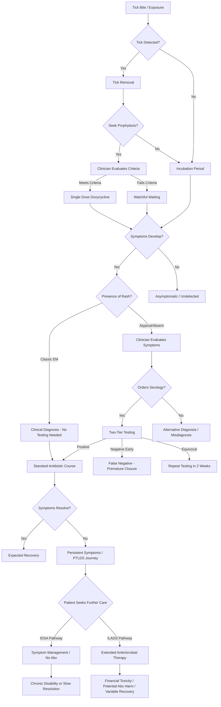

# Research Workflow Artifact: 2. Patient and clinician journeys

- Artifact ID: `patient_and_clinician_journeys`
- Provider: `gemini`
- External ID: `v1_ChdMUFVsYXZya0ZLcUV6N0lQenUtaHlBZxIXTFBVbGF2cmtGS3FFejdJUHp1LWh5QWc`
- Input file: `C:\codex_programming\lyme_llm_wiki\input\deep_research\patient_and_clinician_journeys.md`
- Generated at: `2026-06-07T16:56:50`

---

# Comprehensive Analysis of Lyme Disease Patient and Clinician Journeys

## Deliverable 1: Executive Journey Synthesis

The trajectory of Lyme disease from potential exposure to resolution or chronicity represents a fragmented, highly variable continuum characterized by profound informational asymmetries, systemic friction, and deeply divergent clinical philosophies. An analysis of qualitative patient experiences, clinical workflows, and public health data reveals that the real-world delivery of care rarely mirrors the idealized pathways outlined in established clinical guidelines [cite: 1, 2, 3].

At the earliest stages of the journey, preventive behaviors are heavily undermined by behavioral friction, safety concerns regarding chemical repellents, and geographically static risk perceptions [cite: 4, 5, 6]. As ticks expand into historically low-incidence regions, such as the Blue Ridge Mountains of North Carolina and Virginia, clinicians are often caught off guard, leading to missed diagnoses and premature reassurance [cite: 7, 8, 9, 10]. 

The most consequential clinical decision points frequently occur in contexts of high diagnostic uncertainty. Early in the disease course, clinicians rely heavily on the presence of an erythema migrans (EM) rash. However, this manifestation is frequently absent, atypical, or missed entirely—a failure mode particularly prevalent and harmful among patients with darker skin tones, whose presentations are critically underrepresented in medical education [cite: 11, 12, 13]. When clinical presentation is ambiguous, reliance shifts to standard two-tiered serologic testing. Designed primarily for epidemiological specificity, this testing protocol frequently yields false-negative results during early localized infection, creating a diagnostic vacuum [cite: 14, 15, 16]. In these moments, patients seek validation and early intervention, while clinicians seek objective confirmation to prevent overdiagnosis, leading to significant trust breakdowns and anchoring bias [cite: 17, 18, 19, 20].

Information fragmentation accelerates as patients traverse emergency departments, primary care clinics, and specialized care. Critical contextual data—such as geographic exposure history, exact tick attachment duration, and early transient symptoms—are routinely lost in unstructured clinical notes or during handoffs between non-interoperable electronic health records (EHR) [cite: 21, 22, 23, 24]. Care navigation becomes a severe burden for the estimated 10% to 20% of patients who develop Post-Treatment Lyme Disease Syndrome (PTLDS) or chronic symptoms [cite: 18, 25]. These individuals are frequently trapped in iterative loops of repeated testing and conflicting specialist opinions, reflecting the profound schism between Infectious Diseases Society of America (IDSA) guidelines and International Lyme and Associated Diseases Society (ILADS) guidelines [cite: 26, 27, 28]. Patients in this phase endure immense financial toxicity, out-of-pocket expenses for complementary therapies, and systemic invalidation [cite: 18, 29, 30, 31].

At the macro level, manual public health disease reporting is plagued by administrative delays and massive under-reporting. Emerging health informatics research demonstrates that the true incidence of Lyme disease, when extracted via automated EHR phenotyping (combining diagnosis codes and antibiotic prescriptions), may be four to eight times higher than what is captured by traditional surveillance [cite: 32, 33]. While open data and artificial intelligence present compelling opportunities for automated surveillance, ambient clinical documentation, and enhanced diagnostic pattern recognition [cite: 34, 35, 36], many core journey breakdowns remain fundamentally rooted in biological uncertainty, structural inequities in healthcare access, and polarized clinical consensus [cite: 28, 37, 38, 39].

## Deliverable 2: Journey Archetype Catalog

The following catalog defines the 14 primary journey archetypes representing the diverse manifestations of the Lyme disease experience.

| Journey ID | Journey name | Trigger | Patient context | Clinical context | Primary patient goal | Primary clinician goal | Major stages | Primary decision points | Main information gaps | Common failure modes | Potential outcomes | Evidence strength | Important variations | Open-data relevance | AI relevance | Key research gaps | Sources |
| :--- | :--- | :--- | :--- | :--- | :--- | :--- | :--- | :--- | :--- | :--- | :--- | :--- | :--- | :--- | :--- | :--- | :--- |
| JRN-001 | Prevention before known exposure | Outdoor activity planning or property maintenance | Resident in or traveling to endemic area | Public health / Outpatient | Avoid tick bites | Educate on risk | Risk assessment, barrier adoption, property treatment | Choosing to use repellents or property pesticides | Granular local tick prevalence data | Forgetting preventive measures, safety concerns over chemicals | Prevention, undetected tick bite | Strong | Urban vs. rural recreation, socioeconomic limits | High | Low | Drivers of long-term behavioral adherence | [cite: 4, 6, 40, 41] |
| JRN-002 | Known tick encounter without symptoms | Finding attached tick | Anxious, seeking reassurance | Urgent care / Telehealth | Safe removal, prevent infection | Determine prophylaxis eligibility | Removal, identification, symptom monitoring | Prophylactic doxycycline vs. watchful waiting | Tick attachment duration, tick species | Retaining tick for unvalidated commercial testing, premature serology | Watchful waiting, prophylaxis, self-medication | Strong | Geographic location | Medium | Medium | Accuracy of patient-estimated attachment time | [cite: 3, 42, 43, 44, 45] |
| JRN-003 | Typical early presentation | Emergence of classic EM rash | Symptomatic, aware of exposure | Primary care | Receive diagnosis and symptom relief | Confirm clinical diagnosis | Evaluation, diagnosis, antibiotic initiation | Diagnosing clinically without serology | Recent travel history | Unnecessary testing despite classic EM | Full recovery, treatment failure | Established | Clinician experience | Low | Low | Adherence to clinical diagnosis without testing | [cite: 2, 46, 47] |
| JRN-004 | Early symptoms without remembered tick | Nonspecific viral-like symptoms | Confused about symptom origin | Primary care / Urgent Care | Determine cause of illness | Formulate differential diagnosis | History taking, ruling out mimics, serology | Ordering tests vs. waiting | Tick exposure history | Missed diagnosis, ordering serology too early | Delayed diagnosis, eventual recovery | Strong | Endemic vs non-endemic region | Medium | Medium | Frequency of missed exposures | [cite: 15, 47, 48] |
| JRN-005 | Atypical or absent rash | Onset of symptoms or atypical lesion | Seeking dermatologic/systemic clarity | ED / Primary Care | Obtain accurate diagnosis | Distinguish from cellulitis/spider bites | Examination, differential diagnosis | Initiation of empiric treatment | Recognizing atypical EM | Missing EM on dark skin, misdiagnosis | Delayed treatment, disseminated disease | Strong | Patient skin tone (Fitzpatrick IV-VI) | Low | High | Prevalence of truly absent vs. missed rashes | [cite: 11, 12, 13] |
| JRN-006 | Initial negative/equivocal testing | Lab results return negative/equivocal | Seeking explanation for symptoms | Outpatient / Lab | Prove illness etiology | Interpret 2-tier results accurately | Blood draw, EIA, Immunoblot, Result communication | Repeating test vs. ruling out Lyme | Timing of initial infection relative to test | Treating negative result as definitive exclusion early on | Frustration, repeat testing, misdiagnosis | Established | Lab variation (standard vs modified 2-tier) | Low | High | Patient interpretation of "equivocal" | [cite: 15, 16, 49, 50] |
| JRN-007 | Delayed diagnosis or multiple encounters | Escalating disseminated symptoms | Chronically ill, financially stressed | Multiple specialists | Find definitive answer | Solve complex diagnostic puzzle | Repeated ED/Specialist visits, exhaustive testing | Diagnosing late-stage disease | Fragmented EHR data from previous visits | Anchoring bias on alternate diagnoses (e.g., viral meningitis) | Late intervention, permanent damage | Strong | Rural access barriers | Low | High | Impact of EHR discontinuity on diagnosis | [cite: 19, 20, 22, 24, 51] |
| JRN-008 | Appropriate diagnosis & recovery | Post-treatment follow-up | Relieved, recovering | Primary care | Return to baseline | Confirm resolution | Treatment completion, follow-up | Discharging patient | None | Failure to report to public health | Complete resolution | Established | Access to follow-up care | Medium | Low | Long-term asymptomatic recurrence | [cite: 2, 3] |
| JRN-009 | Persistent symptoms after treatment (PTLDS) | Ongoing fatigue/cognitive issues | Frustrated, feeling invalidated | Specialists / Alternative care | Symptom relief, validation | Manage symptoms, avoid antibiotic harm | Re-evaluation, alternative diagnosis hunting, CAM therapy | Re-treating with antibiotics (IDSA vs ILADS) | Biomarker for active infection vs post-infectious | Dismissal of patient, fracture of trust | Chronic disability, financial ruin | Strong | Financial means for out-of-pocket CAM | Low | High | Biological root cause of PTLDS | [cite: 1, 18, 28, 30, 52] |
| JRN-010 | Complex case with possible coinfection | Severe, atypical, or refractory symptoms | Highly symptomatic | Infectious Disease | Identify all pathogens | Distinguish overlapping syndromes | Advanced serology, molecular testing | Empiric broad-spectrum treatment | Validity of coinfection commercial tests | Indiscriminate testing, missing Babesia/Anaplasma | Complex treatment regimens | Emerging | Local tick coinfection prevalence | High | Medium | True prevalence of coinfections in humans | [cite: 28, 39] |
| JRN-011 | Rural or underserved patient | Symptoms arise in resource-poor area | Financially strained | Rural ED / Clinic | Access affordable care | Triage and stabilize | Travel to care, delayed evaluation | Referring to distant specialist | Local epidemiological data | Patient foregoes care due to travel/cost | Advanced disease presentation | Strong | Broadband access for telehealth | High | Low | Outcome disparities by zip code | [cite: 37, 38, 53, 54] |
| JRN-012 | Pediatric patient and caregiver | Child develops symptoms or arthritis | Parent anxious, vigilant | Pediatric ED | Protect child, resolve symptoms | Distinguish Lyme from septic arthritis | Joint aspiration, serology, monitoring | Performing invasive joint procedure | Objective symptom articulation by child | Caregiver identity loss, misinterpreting behavior | Recovery, emotional trauma | Strong | Parental health literacy | Low | Medium | Long-term cognitive impacts on children | [cite: 13, 55, 56, 57, 58] |
| JRN-013 | Clinician in emerging-risk area | Patient presents in low-incidence state | Uncertain, defensive | Primary Care | Gain validation of illness | Prevent overdiagnosis | History taking, guideline consultation | Ordering Lyme serology | Current geographic spread data | Alert fatigue, lack of awareness of local spread | Missed diagnosis | Strong | Years in practice locally | High | High | Clinician continuing education effectiveness | [cite: 7, 10, 42, 59] |
| JRN-014 | Public-health reporting journey | Positive lab result triggers alert | Unaware of surveillance | State Health Dept | Protect privacy | Track epidemiology | Lab reporting, case investigation, CDC transmission | Classifying case (confirmed/probable) | Clinical symptoms (if lab-only reporting not used) | Delayed reporting, duplicate records | Surveillance aggregation | Established | High-incidence vs low-incidence state rules | High | High | True incidence multiple | [cite: 33, 60, 61, 62] |

## Deliverable 3: Detailed Journey Maps

The following matrices provide a granular reconstruction of the decisions, emotions, and systemic failures defining each distinct archetype.

### JRN-001: Prevention before known exposure

| Stage | Trigger | Patient goal | Patient actions | Patient questions | Patient emotions | Clinician goal | Clinician actions | Decisions | Information available | Information missing | Data created | Systems involved | Handoffs | Pain points | Failure modes | Outcomes | Evidence strength |
| :--- | :--- | :--- | :--- | :--- | :--- | :--- | :--- | :--- | :--- | :--- | :--- | :--- | :--- | :--- | :--- | :--- | :--- |
| **Risk Assessment** | Planning outdoor activity | Understand local risk | Search online, read health advisories | Are there ticks here? | Mild concern | Educate patient | Provide brochures (rarely) | Determining necessity of prevention | General CDC maps | Hyper-local neighborhood tick density | Web search logs | Public Health sites | None | Risk maps lack real-time granularity | Patient underestimates risk | No precautions taken | Strong [cite: 4, 41] |
| **Action** | Entering tick habitat | Prevent bites | Apply repellent, treat yard | Are these chemicals safe for kids/pets? | Anxiety regarding chemicals | Promote safe EPA-approved products | Advise on permethrin | To use chemical vs natural deterrents | Product labels | Efficacy of "natural" alternatives | Purchase data | Commercial | None | Behavioral friction, forgetting | Reliance on ineffective natural oils | Vulnerability to bites | Strong [cite: 5, 6] |
| **Post-Exposure** | Returning indoors | Detect ticks early | Shower, visual check | Did I miss any spots? | Vigilance | Emphasize <24hr removal | Advise routine checks | Showering within 2 hours | Visual inspection | Ticks in hard-to-see areas | None | None | None | Ticks are nymphal and tiny | Inadequate visual check | Tick attachment | Established [cite: 40, 63] |

### JRN-002: Known tick encounter without symptoms

| Stage | Trigger | Patient goal | Patient actions | Patient questions | Patient emotions | Clinician goal | Clinician actions | Decisions | Information available | Information missing | Data created | Systems involved | Handoffs | Pain points | Failure modes | Outcomes | Evidence strength |
| :--- | :--- | :--- | :--- | :--- | :--- | :--- | :--- | :--- | :--- | :--- | :--- | :--- | :--- | :--- | :--- | :--- | :--- |
| **Discovery** | Finding attached tick | Remove tick safely | Use tweezers, search removal methods | How long was it attached? | Fear, disgust | Provide clear removal instructions | Triage via phone/telehealth | Seek care vs self-monitor | Visual of tick | Exact duration of attachment | Patient portal message | Web, Telehealth | Patient to Triage | Mouthparts breaking off in skin | Using heat/chemicals to remove tick | Tick removed | Established [cite: 44] |
| **Testing Decision** | Tick is removed | Know if tick is infected | Bag tick, search testing services | Should I test this tick? | Anxious urgency | Discourage tick testing | Advise watchful waiting | To mail tick to commercial lab | Tick species | Pathogen transmission status | Lab order | Commercial tick lab | Patient to Lab | Waiting for mail-in tick results | Clinical decisions delayed for tick results | Financial cost, delayed care | Strong [cite: 43, 45, 64] |
| **Prophylaxis** | Contacting clinician | Prevent Lyme | Request antibiotics | Can I get Doxycycline just in case? | Seeking reassurance | Adhere to IDSA criteria | Prescribe 200mg Doxycycline or monitor | Determine if tick was attached >36 hours | Local endemicity | Exact attachment time | Rx record | EHR, Pharmacy | Triage to PCP | Patient frustration if denied antibiotics | Prescribing prophylactic Abx for low-risk bites | Reassurance or overtreatment | Established [cite: 3, 42] |

### JRN-003: Typical early presentation

| Stage | Trigger | Patient goal | Patient actions | Patient questions | Patient emotions | Clinician goal | Clinician actions | Decisions | Information available | Information missing | Data created | Systems involved | Handoffs | Pain points | Failure modes | Outcomes | Evidence strength |
| :--- | :--- | :--- | :--- | :--- | :--- | :--- | :--- | :--- | :--- | :--- | :--- | :--- | :--- | :--- | :--- | :--- | :--- |
| **Symptom Onset** | Expanding EM rash | Cure infection | Photograph rash, schedule visit | Is this a bull's-eye? | Alarm | Confirm clinical presentation | Measure rash (>5cm) | Diagnose clinically | Rash appearance | Prior tick bite memory | Rash photo | EHR, Smartphone | Patient to PCP | Getting timely appointment | Rash fades before appointment | Prompt care | Established [cite: 2, 65] |
| **Evaluation** | PCP Visit | Obtain antibiotics | Describe symptoms | Do I need a blood test? | Relief at being seen | Avoid unnecessary testing | Prescribe 10-21 days Doxycycline | Treat without serology | Clinical signs | None | Clinical note, Rx | EHR | PCP to Pharmacy | Explaining why testing is unnecessary | Ordering 2-tier testing despite clear EM | Treatment initiated | Strong [cite: 3, 46] |
| **Recovery** | Antibiotic completion | Return to normal | Monitor symptoms | Am I cured? | Reassured | Monitor for resolution | Follow-up visit | Discharge patient | Patient report | Test of cure | Follow-up note | EHR | None | Patient anxiety over lingering fatigue | Failure to educate on slow symptom resolution | Full recovery | Established [cite: 3, 66] |

### JRN-004: Early symptoms without a remembered tick bite

| Stage | Trigger | Patient goal | Patient actions | Patient questions | Patient emotions | Clinician goal | Clinician actions | Decisions | Information available | Information missing | Data created | Systems involved | Handoffs | Pain points | Failure modes | Outcomes | Evidence strength |
| :--- | :--- | :--- | :--- | :--- | :--- | :--- | :--- | :--- | :--- | :--- | :--- | :--- | :--- | :--- | :--- | :--- | :--- |
| **Presentation** | Fever, fatigue, myalgia | Identify illness | Seek urgent care | Do I have the flu or COVID? | Confusion | Formulate differential | Order viral panels, consider tick-borne | Include Lyme in differential | Vitals, symptoms | Exposure history | Lab orders | EHR, LIS | UC to Lab | Differentiating from summer viral illnesses | Failing to elicit outdoor exposure history | Diagnostic uncertainty | Strong [cite: 15, 47, 48] |
| **Testing** | Clinician suspicion | Rule out Lyme | Provide blood sample | Why are we testing for Lyme? | Apprehension | Confirm suspicion | Order EIA / Immunoblot | Empiric treatment vs wait | Initial clinical picture | Antibody presence | Lab result | LIS | Lab to Clinician | Antibody lag time (window period) | Testing too early leading to false negative | Delayed treatment | Established [cite: 50] |
| **Resolution** | Test returns negative | Find real cause | Return for worsening symptoms | Why am I still sick? | Frustration | Re-evaluate | Order repeat Lyme serology in 14 days | Revisit differential | False negative result | True etiology | Progress note | EHR | UC to PCP | Patient relies on false negative | Misdiagnosis | Disseminated disease | Strong [cite: 14, 50] |

### JRN-005: Atypical or absent rash

| Stage | Trigger | Patient goal | Patient actions | Patient questions | Patient emotions | Clinician goal | Clinician actions | Decisions | Information available | Information missing | Data created | Systems involved | Handoffs | Pain points | Failure modes | Outcomes | Evidence strength |
| :--- | :--- | :--- | :--- | :--- | :--- | :--- | :--- | :--- | :--- | :--- | :--- | :--- | :--- | :--- | :--- | :--- | :--- |
| **Symptom Onset** | Faint, bruise-like, or non-bull's-eye rash appears | Understand skin change | Self-examine, search internet | Is this a spider bite? | Confusion | N/A | N/A | Seek medical care | Patient's observation | Awareness that EM looks different on dark skin | None | Web search | Self to Clinician | Lack of visual reference for dark skin tones | Patient dismisses symptom | Delay | Strong [cite: 11, 67] |
| **Clinical Eval** | Appointment / ED visit | Get accurate diagnosis | Describe exposure | Will the doctor recognize this? | Anxiety | Diagnose skin lesion | Physical exam, history | Is this cellulitis, ringworm, or EM? | Visual appearance | Training on dark skin EM | Clinical note | EHR | Triage to Provider | Clinician unfamiliarity with atypical presentation | Misdiagnosis as cellulitis (Anchoring bias) | Wrong treatment | Strong [cite: 12, 13] |
| **Testing/Tx** | Diagnostic uncertainty | Start treatment | Comply with plan | Why am I taking this antibiotic? | Frustration | Rule out infections | Prescribe alternative Abx or order serology | Order EIA | Equivocal rash | Diagnostic certainty | Lab order, Rx | EHR, Lab | Provider to Pharmacy | Serology ordered too early yields false negative | False negative ends investigation prematurely | Disease disseminates | Established [cite: 15, 49] |

### JRN-006: Initial negative, equivocal, or conflicting testing

| Stage | Trigger | Patient goal | Patient actions | Patient questions | Patient emotions | Clinician goal | Clinician actions | Decisions | Information available | Information missing | Data created | Systems involved | Handoffs | Pain points | Failure modes | Outcomes | Evidence strength |
| :--- | :--- | :--- | :--- | :--- | :--- | :--- | :--- | :--- | :--- | :--- | :--- | :--- | :--- | :--- | :--- | :--- | :--- |
| **Result Generation** | Lab processes 2-tier | Fast result | Wait for notification | Is it positive? | Impatient | Ensure test quality | Process EIA, reflex to WB | Interpret bands | Serum sample | Patient clinical status | Lab report | LIS | Lab to EHR | Subjective interpretation of Western Blot bands | Lab interpretation error | Confusing report | Established [cite: 16, 50] |
| **Portal Release** | Auto-release to portal | Interpret data | Read lab report online | What does "equivocal" mean? | Highly anxious, confused | Review results prior to patient | Read lab report | Contact patient | Lab report | Patient's state of mind | Portal message | EHR | Portal to Patient | Dense medical jargon without context | Patient misinterprets IgG memory bands as active infection | Patient panic | Strong [cite: 49, 68] |
| **Communication** | Follow-up message | Gain clarity | Message doctor | Do I need treatment? | Distrustful if dismissed | Contextualize results | Explain 1-month rule | Repeat testing | Pretest probability | Definitive biomarker | Secure message | EHR | Clinician to Patient | Explaining complex serology kinetics | Clinician over-relies on negative test, ignoring symptoms | Repeat testing loop | Strong [cite: 15, 47] |

### JRN-007: Delayed diagnosis or multiple clinical encounters

| Stage | Trigger | Patient goal | Patient actions | Patient questions | Patient emotions | Clinician goal | Clinician actions | Decisions | Information available | Information missing | Data created | Systems involved | Handoffs | Pain points | Failure modes | Outcomes | Evidence strength |
| :--- | :--- | :--- | :--- | :--- | :--- | :--- | :--- | :--- | :--- | :--- | :--- | :--- | :--- | :--- | :--- | :--- | :--- |
| **Escalation** | Severe neurological or joint pain | Find the root cause | Visit ED or specialists | Why is nobody finding the answer? | Despair (Hypothesis) | Triage severe symptoms | Order MRI, LP, broad labs | Admission vs Discharge | Current vitals | Original tick exposure | Encounters, codes | Fragmented EHRs | ED to neuro/rheum | Repeating tests due to data silos | Anchoring on viral/autoimmune | Ongoing symptoms | Strong [cite: 19, 20, 23] |
| **Investigation** | Specialist consult | Obtain definitive diagnosis | Advocate, recount history | Do you believe me? | Exhaustion | Formulate complex differential | Review fragmented records | Re-order Lyme serology? | Late-stage IgG | Early clinical notes | Specialist note | HIE / EHR | PCP to Specialist | Time limits prevent full history reconstruction | Missed geographical exposure history | No diagnosis | Strong [cite: 24, 37, 51] |
| **Diagnosis** | Positive late-stage serology | Begin treatment | Receive results | Will this cure me? | Relief | Treat late-stage disease | Prescribe IV Ceftriaxone or Doxycycline | Duration of therapy | Positive 2-tier | Knowledge of permanent damage | Diagnosis code | EHR, Public Health | Spec to PCP | Insurer prior auth for IV antibiotics | Treatment delay due to insurance | Partial recovery | Established [cite: 30, 39] |

### JRN-008: Appropriate diagnosis and treatment with expected recovery

| Stage | Trigger | Patient goal | Patient actions | Patient questions | Patient emotions | Clinician goal | Clinician actions | Decisions | Information available | Information missing | Data created | Systems involved | Handoffs | Pain points | Failure modes | Outcomes | Evidence strength |
| :--- | :--- | :--- | :--- | :--- | :--- | :--- | :--- | :--- | :--- | :--- | :--- | :--- | :--- | :--- | :--- | :--- | :--- |
| **Treatment Adherence** | Rx dispensed | Complete treatment | Take antibiotics daily | Can I go in the sun with Doxycycline? | Hopeful | Ensure compliance | Educate on side effects | Duration of treatment | IDSA Guidelines | Individual microbiome response | Pharmacy claim | PBM | Pharmacy to Patient | Managing GI side effects or sun sensitivity | Patient stops antibiotics early due to side effects | Resolution | Established [cite: 2, 3, 28] |
| **Resolution Phase** | Antibiotics finished | Assess health | Monitor body | Am I fully cured? | Relieved | Confirm clinical cure | Check for residual symptoms | Need for further action | Patient report | Serological proof of cure | Progress note | EHR | None | Residual fatigue lingering for weeks | Misinterpreting normal post-viral-like fatigue as active infection | Full recovery | Strong [cite: 3, 66] |

### JRN-009: Persistent symptoms after treatment (PTLDS)

| Stage | Trigger | Patient goal | Patient actions | Patient questions | Patient emotions | Clinician goal | Clinician actions | Decisions | Information available | Information missing | Data created | Systems involved | Handoffs | Pain points | Failure modes | Outcomes | Evidence strength |
| :--- | :--- | :--- | :--- | :--- | :--- | :--- | :--- | :--- | :--- | :--- | :--- | :--- | :--- | :--- | :--- | :--- | :--- |
| **Persistence** | Symptoms remain post-antibiotics | Feel normal again | Return to PCP | Did the treatment fail? | Fear, Isolation | Reassure patient | Assess for alternate causes | Re-treat vs wait | Prior treatment history | Biomarker for active infection | Progress note | EHR | PCP to self | Differing expectations of recovery timeline | Dismissal of symptoms | Patient seeks alternative care | Strong [cite: 1, 18, 66] |
| **Alternative Care** | Loss of trust in mainstream | Validation and symptom relief | Seek LLMD or CAM | Is there a hidden coinfection? | Hopeful, Stressed | Eradicate presumed infection | Order unvalidated labs, prolonged Abx | Adopt ILADS vs IDSA guidelines | Subjective symptom reports | Gold-standard trial data for long-term Abx | Out-of-network claims | Specialty EHR | Mainstream to Alternative | Extreme out-of-pocket costs | Financial toxicity, potential Abx harm | Variable | Strong [cite: 25, 29, 30] |
| **Chronic Management** | Years of symptoms | Quality of life maintenance | Lifestyle changes, self-advocacy | Will I ever recover? | Resignation | Mitigate symptom impact | Prescribe symptom modulators | Focus on function | Patient reported outcomes | Cure | Disability paperwork | EHR, Gov systems | Clinical to Social Services | Exclusion from clinical trials | Complete breakdown of care continuity | Chronic disability | Strong [cite: 51, 57, 69] |

### JRN-010: Complex case with possible coinfection

| Stage | Trigger | Patient goal | Patient actions | Patient questions | Patient emotions | Clinician goal | Clinician actions | Decisions | Information available | Information missing | Data created | Systems involved | Handoffs | Pain points | Failure modes | Outcomes | Evidence strength |
| :--- | :--- | :--- | :--- | :--- | :--- | :--- | :--- | :--- | :--- | :--- | :--- | :--- | :--- | :--- | :--- | :--- | :--- |
| **Severe Presentation** | High fever, anemia, or profound fatigue | Stop the severity | Present to ED | Why is Lyme treatment not working? | Terrified | Broaden differential | Assess for Babesia or Anaplasma | Test for coinfections | Blood smear, CBC | Molecular definitive diagnosis | Lab orders | EHR | ED to Lab | Differentiating overlapping tick-borne syndromes | Anchoring purely on Lyme disease | Prolonged illness | Strong [cite: 28, 39, 64] |
| **Advanced Testing** | Suspicion of coinfection | Find all pathogens | Provide multiple samples | How many diseases do I have? | Overwhelmed | Accurately detect pathogens | Order PCR and serology panels | Interpretation of complex panels | Tick species regional data | Clinical performance of novel PCR | Lab report | LIS | Lab to ID Spec | False positives from unvalidated laboratories | Treating based on cross-reactive lab errors | Polypharmacy | Emerging [cite: 43, 64] |

### JRN-011: Rural or underserved patient

| Stage | Trigger | Patient goal | Patient actions | Patient questions | Patient emotions | Clinician goal | Clinician actions | Decisions | Information available | Information missing | Data created | Systems involved | Handoffs | Pain points | Failure modes | Outcomes | Evidence strength |
| :--- | :--- | :--- | :--- | :--- | :--- | :--- | :--- | :--- | :--- | :--- | :--- | :--- | :--- | :--- | :--- | :--- | :--- |
| **Access Barrier** | Symptom onset in rural area | Find local care | Drive long distance to urgent care | Can I afford this trip and time off work? | Stressed | Manage volume | Triage | Treat locally vs Refer | Limited local diagnostics | Specialist availability | Triage note | Rural EHR | Patient to Rural Clinic | 50+ mile travel distances, missing work | Patient foregoes care due to logistics | Delayed presentation | Strong [cite: 37, 53, 54] |
| **Referral Failure** | Complex symptoms require specialist | See an Infectious Disease doctor | Attempt scheduling | Why is the wait 4 months? | Abandoned | Transfer care | Issue referral | Determine necessity | PCP notes | Receiving specialist capacity | Referral order | EHR | PCP to Specialist | Specialist deserts in rural areas | Referral loops expire, patient drops out | Chronic illness | Strong [cite: 30, 37] |

### JRN-012: Pediatric patient and caregiver

| Stage | Trigger | Patient goal | Patient actions | Patient questions | Patient emotions | Clinician goal | Clinician actions | Decisions | Information available | Information missing | Data created | Systems involved | Handoffs | Pain points | Failure modes | Outcomes | Evidence strength |
| :--- | :--- | :--- | :--- | :--- | :--- | :--- | :--- | :--- | :--- | :--- | :--- | :--- | :--- | :--- | :--- | :--- | :--- |
| **Recognition** | Child exhibits swollen knee or fatigue | Protect child | Bring child to Pediatric ED | Is this a sports injury or infection? | High Anxiety | Rule out life threats | Differentiate septic arthritis from Lyme | Perform joint aspiration | Synovial fluid analysis | Definitive Lyme PCR at point of care | Lab order, vitals | EHR | Parent to ED | Watching child undergo painful invasive procedures | Misdiagnosing Lyme arthritis as septic | Unnecessary hospitalization | Strong [cite: 48, 55, 56] |
| **Caregiver Burden** | Persistent pediatric symptoms | Return child to school/normalcy | Advocate, manage meds, restructure life | Will my child fall behind? | Identity loss, burnout | Manage chronic pediatric case | Monitor development | Refer to neuro/psych | School reports | Long-term pediatric outcomes | Care plan | EHR, School | Clinic to Home/School | Financial strain from reduced working hours | Dismissing child's subjective cognitive complaints | Emotional trauma | Strong [cite: 57, 58, 70] |

### JRN-013: Clinician in a low-incidence or emerging-risk area

| Stage | Trigger | Patient goal | Patient actions | Patient questions | Patient emotions | Clinician goal | Clinician actions | Decisions | Information available | Information missing | Data created | Systems involved | Handoffs | Pain points | Failure modes | Outcomes | Evidence strength |
| :--- | :--- | :--- | :--- | :--- | :--- | :--- | :--- | :--- | :--- | :--- | :--- | :--- | :--- | :--- | :--- | :--- | :--- |
| **Evaluation** | Patient presents with summer flu/rash | Get accurate diagnosis | Explain symptoms | Does Lyme exist here? | Hopeful | Prevent overdiagnosis | Rule out common local pathogens | Consider Lyme in differential | Outdated medical school training | Real-time tick migration data | Clinical note | EHR | Triage to PCP | Alert fatigue regarding vector-borne diseases | "We don't have Lyme here" mentality leading to missed Dx | Disseminated disease | Strong [cite: 7, 10, 42, 59] |
| **Management** | Serology returns positive | Start treatment | Comply | Are you sure it's Lyme? | Relieved but confused | Navigate unfamiliar protocols | Consult IDSA guidelines | Determine antibiotic regimen | Positive serology | Experience with disease progression | Rx record | EHR | PCP to Pharmacy | Lack of confidence interpreting complex serology | Improper antibiotic dosing or duration | Treatment failure | Strong [cite: 10, 59] |

### JRN-014: Public-health reporting journey

| Stage | Trigger | Patient goal | Patient actions | Patient questions | Patient emotions | Clinician goal | Clinician actions | Decisions | Information available | Information missing | Data created | Systems involved | Handoffs | Pain points | Failure modes | Outcomes | Evidence strength |
| :--- | :--- | :--- | :--- | :--- | :--- | :--- | :--- | :--- | :--- | :--- | :--- | :--- | :--- | :--- | :--- | :--- | :--- |
| **Data Ingestion** | Positive lab result (EIA/WB) | Privacy protection | Unaware of reporting | Is my data safe? | Neutral | Fulfill legal mandate | Lab sends Electronic Lab Report (ELR) | Auto-ingest vs manual entry | Lab LOINC codes | Clinical presentation (e.g., EM rash) | HL7 message | LIS to DSS | Lab to State | High volume of data overwhelming state systems | Data silos prevent matching lab to clinical notes | Incomplete record | Established [cite: 62, 71, 72] |
| **Case Classification** | Record enters state DSS | N/A | N/A | N/A | N/A | Accurately track epidemiology | Apply CSTE surveillance criteria | Confirm vs Probable case | Surveillance guidelines | Exact geographic exposure site | Case Report | State DSS | State to CDC | Jurisdictions differ on reporting rules (e.g., lab-only vs clinical) | Massive under-reporting due to manual investigation bottlenecks | Skewed epidemiology | Strong [cite: 60, 61, 73] |

## Deliverable 4: Mermaid Journey Diagrams

The following diagram illustrates the most complex and contested pathway: the divergence between acute resolution and the development of Post-Treatment Lyme Disease Syndrome (PTLDS).

## Deliverable 5: Expected Versus Observed Pathway Analysis

The clinical management of Lyme disease is frequently hindered by the gap between controlled guideline expectations and chaotic real-world implementations.

| Stage | Expected pathway | Observed pathway | Gap | Likely cause | Consequence | Evidence strength |
| :--- | :--- | :--- | :--- | :--- | :--- | :--- |
| **Prevention** | Patient uses EPA-approved repellents and daily tick checks. | Patient forgets or fears chemical safety. | 60%+ fail to consistently adhere to prevention. | Behavioral friction, chemical anxiety. | High exposure risk. | Strong [cite: 5, 6] |
| **Diagnosis (EM)** | Clinician diagnoses early Lyme solely on classic EM rash without testing. | Clinicians order serology anyway. | Unnecessary testing despite guidelines. | Defensive medicine, diagnostic insecurity. | False negatives lead to confusion and treatment delays. | Established [cite: 2, 42] |
| **Diagnosis (Atypical)** | Clinician recognizes atypical EM across all skin tones. | EM frequently missed on dark skin. | Lack of representation in medical training. | Structural bias in dermatology resources. | Higher rates of disseminated disease in Black patients. | Strong [cite: 11, 12, 13] |
| **Testing** | 2-tier testing accurately confirms exposure. | Early testing is falsely negative (sensitivity <50%). | Mismatch between infection timeline and antibody production. | Biological lag in immune response. | Premature rule-out of Lyme disease. | Established [cite: 15, 16, 50] |
| **Follow-up** | Patient recovers fully after 10-21 days of Doxycycline. | 10-20% experience PTLDS; seek alternative care. | Mainstream medicine lacks treatments for PTLDS. | Scientific uncertainty regarding persistence. | Patient turns to unvalidated therapies and incurs financial toxicity. | Strong [cite: 18, 25, 30] |
| **Surveillance** | All positive cases reported manually to public health. | Massive under-reporting (EHRs show 4-8x higher incidence). | Incomplete data transfer, manual burden. | Administrative friction, interoperability failures. | Epidemiological blind spots. | Strong [cite: 33, 62] |

## Deliverable 6: Patient-Clinician Perspective Comparison

| Journey stage | Patient objective | Clinician objective | Patient concern | Clinician concern | Patient information | Clinician information | Misalignment | Trust risk | Potential resolution |
| :--- | :--- | :--- | :--- | :--- | :--- | :--- | :--- | :--- | :--- |
| **Early Evaluation** | Find a definitive cause for symptoms. | Formulate a differential diagnosis. | Doctor won't believe I was in the woods. | Symptoms are nonspecific (flu-like). | Lived experience of symptoms. | Epidemiological risk, clinical guidelines. | Patient wants immediate answers; clinician wants objective data. | High (Patient feels dismissed). | Empathetic communication of diagnostic uncertainty [cite: 1, 74]. |
| **Interpreting Neg. Test** | Exclude Lyme disease if negative. | Acknowledge window period for false negatives. | "The test is negative, so I don't have it." | "It might be too early to test." | Lab printout via portal. | Understanding of IgG/IgM kinetics. | Patient false reassurance or clinician over-reliance on negative results. | Medium | Portal messaging explaining "window periods" [cite: 15, 49]. |
| **Persistent Symptoms** | Get antibiotics to cure ongoing infection. | Prevent antibiotic harm (C. diff) when infection is resolved. | "I am still sick, therefore the bacteria is alive." | "Symptoms are post-infectious (PTLDS)." | Anecdotes from online support groups. | IDSA guidelines and RCTs. | Causation vs. Correlation of symptoms. | Very High (Systemic abandonment). | Shared decision-making, acknowledging suffering without endorsing unproven treatments [cite: 18, 26]. |

## Deliverable 7: Decision-Point Inventory

| Decision ID | Journey | Stage | Decision-maker | Decision | Time sensitivity | Information used | Missing information | Available alternatives | Consequence of delay | Consequence of error | Ability to reverse | Evidence strength |
| :--- | :--- | :--- | :--- | :--- | :--- | :--- | :--- | :--- | :--- | :--- | :--- | :--- |
| **DP-01** | JRN-002 | Tick Check | Patient | Remove tick immediately vs wait for doctor | High (<24h) | Visual confirmation | Proper removal technique | Chemical extraction | Pathogen transmission | Mouthparts left in skin | High | Established [cite: 44] |
| **DP-02** | JRN-005 | Early Eval | Clinician | Diagnose skin lesion as EM vs Cellulitis | High | Visual inspection | Knowledge of dark skin EM | Biopsy (rare) | Disseminated disease | Unnecessary antibiotics | Low | Strong [cite: 13, 20] |
| **DP-03** | JRN-004 | Testing | Clinician | Order 2-tier serology vs empiric treat | Medium | Guidelines, risk | Duration of infection | PCR (joint fluid only) | Financial cost, anxiety | False negative leading to closure | High | Established [cite: 50] |
| **DP-04** | JRN-009 | Treatment | Clinician | Retreat with extended antibiotics (ILADS) | Low | Patient advocacy, ILADS guidelines | RCT proof of efficacy | Symptom management | Chronic disability | Antibiotic toxicity, resistance | Low | Strong [cite: 27, 28] |
| **DP-05** | JRN-014 | Surveillance | State Epi | Classify case as confirmed/probable | Low | Lab data via ELR | Clinical symptoms | Manual chart review | Delayed public health response | Skewed epidemiology | Medium | Strong [cite: 60, 73] |

## Deliverable 8: Failure-Mode and Friction Register

| Failure ID | Journey | Stage | Failure mode | Affected actor | Immediate cause | Root cause | Frequency evidence | Severity | Detectability | Downstream consequence | Current workaround | Technology relevance | Validation needed |
| :--- | :--- | :--- | :--- | :--- | :--- | :--- | :--- | :--- | :--- | :--- | :--- | :--- | :--- |
| **FM-01** | JRN-005 | Diagnosis | EM missed on dark skin | Patient | Clinician visually misidentifies lesion | Lack of diverse training materials | Emerging (Black pts diagnosed later) | High | Low | Disseminated disease | Patient self-advocacy | High (AI computer vision) | Broad clinical validation |
| **FM-02** | JRN-006 | Testing | Premature serology ordered | Clinician | Ordering EIA <14 days of infection | Lack of guideline adherence | Common (up to 53% inappropriate orders) | Medium | Medium | False negative | Retesting | High (EHR clinical decision support) | Yes |
| **FM-03** | JRN-007 | Handoff | Loss of geographic exposure data | Specialist | Exposure history not transferred in EHR | Unstructured data silos | High | High | Low | Anchoring bias on alternate diagnosis | Verbal patient repeat | High (NLP extraction) | No |
| **FM-04** | JRN-009 | Chronic | Clinical trial exclusion | Researcher | PTLDS patients excluded from trials | Rigid protocol definitions | Very Common (90% excluded) | High | High | Lack of relevant science | Advocacy groups running registries | Medium (Data standardization) | Yes |

## Deliverable 9: Information-Flow and Data-Lineage Map

Data loss and fragmentation act as severe friction points in the patient journey. Valuable clinical data is often trapped in unstructured formats, rendering it inaccessible to downstream clinicians and public health systems.

| Data element | Created by | Created when | Stored where | Format | Available to whom | Transferred to next stage | Common quality issue | Linkage potential | Privacy or safety concern |
| :--- | :--- | :--- | :--- | :--- | :--- | :--- | :--- | :--- | :--- |
| **Exposure History** | Patient | Triage / Intake | EHR (Progress Note) | Unstructured Text | PCP | Rarely (Lost in handoff) | Often omitted if patient forgets | Low | Standard HIPAA |
| **Rash Image** | Patient | Pre-visit | Patient Phone | Image (JPG) | PCP (if shown) | No (Rarely uploaded to EHR) | Poor lighting, blurry | Medium (AI analysis) | PII in metadata |
| **Lab Order (EIA)** | Clinician | Visit | EHR / LIS | Structured (LOINC) | Lab | Yes | Ordered too early | High | Standard HIPAA |
| **Serology Result** | Lab | 2-5 days post-draw | LIS -> EHR -> Patient Portal | Structured & Text | Clinician, Patient | Yes | Misinterpretation of "Equivocal" | High | Anxiety from portal release |
| **Public Health Case** | ELR System | Real-time (if automated) | State DSS | Structured (HL7) | State Epi | Yes (to CDC) | Missing clinical staging data | High (with demographic data) | De-identification required |

## Deliverable 10: Care Handoff Map

| Handoff | Information that should transfer | How it transfers | Information commonly lost | Ownership ambiguity | Delay risk | Consequence | Improvement hypothesis |
| :--- | :--- | :--- | :--- | :--- | :--- | :--- | :--- |
| **Patient to PCP** | Symptom timeline, tick exposure, rash photos | Verbal, sometimes portal | Geographic context, exact attachment duration | None | High (Patient delays seeking care) | Missed early treatment window | Targeted patient education in high-risk zones |
| **Urgent Care to PCP** | Empiric antibiotics given, lab results | Fax or patient summary | Reasoning for empiric treatment | High (Who follows up on pending labs?) | Medium | Redundant testing, fragmented record | HIE interoperability (FHIR integration) |
| **PCP to Specialist (e.g., Rheum/Neuro)** | Clinical history, prior treatments, differential | EHR referral | Unstructured text regarding initial atypical rash | Medium | High (Wait times) | Diagnostic dead ends, anchoring bias | NLP extraction of Lyme risk phenotypes |
| **Lab to Public Health** | Positive test result, patient demographics | ELR (HL7) | Clinical staging (EM presence) | Low | Low (if automated) | Cases classified as "suspect" instead of "confirmed" | Automated EHR data extraction combining LOINC + SNOMED |

## Deliverable 11: Trust and Communication Analysis

| Journey moment | Actor relationship | Communication need | Common breakdown | Patient interpretation | Clinician interpretation | Trust consequence | Evidence | Safer communication principle |
| :--- | :--- | :--- | :--- | :--- | :--- | :--- | :--- | :--- |
| **Early testing** | PCP and Patient | Explain limits of early serology | Testing ordered early and returns negative | "I definitively don't have Lyme." | "Lyme ruled out." | Low (False reassurance) | [cite: 14, 15, 50] | "Tests are often negative this early; we rely on your symptoms." |
| **PTLDS Presentation** | Specialist and Patient | Explain persistent symptoms post-treatment | Clinician attributes symptoms to somatization | "The doctor thinks I'm crazy." | "There is no active infection to treat." | Very High (Patient seeks CAM) | [cite: 1, 18, 51] | Validate suffering and acknowledge scientific uncertainty without endorsing unproven cures. |
| **Portal Result Release** | System and Patient | Deliver lab results | "Equivocal" or "IgG only" results released without context | "I have active Lyme disease." | "This indicates past exposure, not current illness." | Medium | [cite: 47, 49, 68] | Embed plain-language interpretive guidance directly in the patient portal. |

## Deliverable 12: Equity and Variation Analysis

| Population or context | Journey difference | Evidence | Additional barrier | Consequence | Data gap | Product-research implication |
| :--- | :--- | :--- | :--- | :--- | :--- | :--- |
| **Darker Skin Tones (Fitzpatrick IV-VI)** | EM rash is faint, violaceous, or atypical, leading to missed visual diagnosis. | [cite: 11, 13] | Lack of representation in medical training materials (only 6.4%). | Higher rates of disseminated disease and arthritis. | Visual datasets lacking diverse skin tones. | AI computer vision models must be trained on diverse dermatological datasets to avoid algorithmic bias. |
| **Rural Residents** | 357% increase in claims over 15 years; travel 50+ miles for care. | [cite: 37, 53] | Specialist deserts, lower broadband access for telehealth. | Delayed diagnosis, higher financial burden. | Zip-code level outcome tracking. | Open-data routing tools for nearest experienced providers. |
| **Low-Income / Uninsured** | Unable to afford out-of-pocket ILADS specialists or CAM therapies. | [cite: 30, 37] | IDSA guidelines are covered; ILADS often requires cash pay. | Disparate symptom management for PTLDS. | Socioeconomic linkage to long-term outcomes. | Digital care navigation must prioritize insured/affordable pathways. |
| **Pediatric Patients** | Higher rates of arthritis presentation; caregivers face identity loss and burnout. | [cite: 13, 56, 58] | Child unable to articulate subjective symptoms (brain fog, pain). | Misinterpretation as behavioral issues; diagnostic delays. | PROMs tailored for pediatric caregivers. | Need for longitudinal symptom trackers designed for proxy (parental) reporting. |

## Deliverable 13: Journey-Level Open-Data Relevance

| Journey | Stage | Decision | Potential public data | Expected contribution | Granularity needed | Timeliness needed | Known limitation | Individual versus population use | Actionability |
| :--- | :--- | :--- | :--- | :--- | :--- | :--- | :--- | :--- | :--- |
| **Prevention** | Planning | Should I treat my yard? | Tick surveillance, land cover, climate | Localize risk assessment | County/Zip Code | Seasonal | Tick tracking is passive and spotty | Population awareness | Medium |
| **Clinician Eval** | Differential | Is Lyme possible here? | Public health incidence rates, Google Trends | Alert clinicians in emerging zones | County | Near real-time | Surveillance data lags by 1-2 years | Population risk contextualization | High |
| **Public Health** | Surveillance | Resource allocation | EHR claims aggregates (e.g., FAIR Health) | Reveal under-reporting multipliers | State/County | Annual | Claims data lacks clinical nuance | Population tracking | High |

*Warning: Population-level epidemiological data cannot safely determine an individual's diagnosis or supersede clinical presentation.*

## Deliverable 14: Journey-Level AI Relevance

| Journey stage | Problem | Potential AI role | User | Input data | Output | Action enabled | Why AI may help | Why AI may be unnecessary | Safer alternative | Main risk | Required validation |
| :--- | :--- | :--- | :--- | :--- | :--- | :--- | :--- | :--- | :--- | :--- | :--- |
| **Diagnosis (EM)** | Rashes missed on dark skin | Computer Vision (CV) classification | Clinician | Smartphone image | Confidence score of EM probability | Empiric treatment initiation | Standardizes recognition across skin tones | If classic EM, human eye is sufficient | Standard medical education | Algorithmic bias if training data lacks diversity | Extensive clinical trials across all skin types |
| **Diagnosis (H&P)** | Complex, fragmented history | NLP timeline reconstruction | Specialist | Unstructured EHR notes | Chronological symptom timeline | Faster, accurate differential diagnosis | Extracts buried geographic/exposure data | Simple intake forms could capture this | Structured discrete data fields in EHR | Missing critical context if NLP hallucinates | Retrospective validation against manual chart review |
| **Surveillance** | Manual reporting delays | Automated EHR phenotyping | State Epi | LOINC, SNOMED, RxNorm | Flagged probable cases | Automated case counting | Scales instantly, overcomes under-reporting | Rules engine (IF Dx AND Abx) is sufficient | Deterministic algorithms [cite: 32] | Over-counting mimics | Comparison to gold-standard case investigations |

*AI is expressly NOT recommended for autonomous diagnosis, autonomous treatment selection, or replacement of qualified clinical care.*

## Deliverable 15: Journey Prioritization

*Scoring Method: 1 (Lowest) to 5 (Highest) based on patient harm, frequency, and technical feasibility.*

### Tier 1: Strong candidates for deeper discovery
* **Automated EHR Surveillance (JRN-014):** Traditional public health surveillance drastically under-reports the burden of disease. Integrating LOINC, SNOMED, and RxNorm data from EHRs identifies 4 to 8 times the incidence compared to manual reporting [cite: 32, 33]. This is actionable, data-rich, and highly feasible.
* **Atypical/Dark Skin EM Recognition (JRN-005):** High patient harm occurs due to delayed diagnosis in minority populations [cite: 12, 13]. There is strong potential for computer vision models to support clinical decision-making, provided unbiased training data is rigorously curated to overcome historical textbook representation deficits [cite: 11].

### Tier 2: Important but insufficiently understood
* **Unstructured Data Extraction for Complex Cases (JRN-007):** PTLDS and delayed diagnoses suffer immensely from EHR fragmentation [cite: 22, 23, 24]. NLP could theoretically reconstruct timelines, but requires deep stakeholder interviews to understand specialist workflow constraints and trust in AI summaries.
* **Patient Portal Result Translation (JRN-006):** Friction arises from patients misinterpreting "equivocal" two-tier serology without context [cite: 49, 68]. Generative AI could translate complex lab results into plain language, but carries hallucination risks. Requires deep UI/UX discovery.

### Tier 3: Important but poor technology targets
* **PTLDS Treatment Efficacy (JRN-009):** The IDSA versus ILADS divide is rooted in scientific uncertainty and missing biological ground-truth for active versus past infection [cite: 28, 39]. AI cannot manufacture biological certainty where none currently exists.
* **Tick Testing (JRN-002):** Commercial tick testing lacks quality control and clinical utility, often delaying human treatment [cite: 44, 45]. Better solved via policy and patient education than software interventions.

## Deliverable 16: Interview Hypotheses and Discovery Backlog

| Hypothesis ID | Journey | Hypothesis | Current evidence | Confidence | Stakeholder to interview | Interview question | Evidence that would support it | Evidence that would challenge it | Product decision informed |
| :--- | :--- | :--- | :--- | :--- | :--- | :--- | :--- | :--- | :--- |
| **HYP-01** | JRN-005 | Primary care clinicians lack confidence identifying EM rashes on Fitzpatrick IV-VI skin. | [cite: 11, 13] | High | Primary Care Clinician | "Walk me through the last time you evaluated a rash on a dark-skinned patient for Lyme disease." | Clinician admits uncertainty, relies on serology. | Clinician cites adequate training and relies on clinical presentation. | Viability of a CV diagnostic assistant. |
| **HYP-02** | JRN-014 | State epidemiologists spend >50% of time manually verifying lab-only reports. | [cite: 62, 73] | Medium | State Epidemiologist | "Describe your workflow when an automated positive EIA result enters the system." | Description of manual chart diving to confirm clinical symptoms. | State accepts lab-only without clinical validation. | Focus of automated NLP phenotype extraction tool. |
| **HYP-03** | JRN-007 | Specialists discard prior PCP notes because they are too fragmented to parse. | [cite: 24, 51] | High | Infectious Disease Specialist | "Walk me through how you prepare for a new patient referred for chronic Lyme." | Specialist relies solely on new intake forms; ignores EHR. | Specialist effectively utilizes HIE data. | Design of an AI-driven timeline summarization tool. |

---

## Required Cross-Journey Synthesis

An analysis spanning the entirety of the 14 defined archetypes reveals persistent structural and communication patterns that transcend individual clinical encounters. 

*   **Exposure history is not captured or transferred consistently:** This pattern recurs prominently in JRN-004, JRN-007, and JRN-010. The root cause is the reliance on unstructured data entry and the pervasive lack of interoperability across health systems [cite: 22, 51]. The consequence is severe anchoring bias, wherein specialists pursue alternate diagnoses simply because environmental context was lost [cite: 19, 20]. This is addressable via NLP and optimized patient-intake workflows.
*   **Geographic risk information is difficult to interpret:** Found in JRN-001 and JRN-013. The evidence is strong that as ticks expand into previously non-endemic zones (e.g., North Carolina, Virginia), clinicians suffer from a "we don't have Lyme here" mentality due to surveillance data lags [cite: 7, 10, 59]. This results in missed early diagnoses. It is addressable via real-time dashboarding that integrates leading indicators like search trends or veterinary data.
*   **Negative results create different interpretations for patients and clinicians:** This tension anchors JRN-006 and JRN-009. Clinicians understand the biological lag in antibody production and apply the "1-month rule," while patients lacking health literacy interpret negative portals as definitive proof they are uninfected, or conversely, view residual IgG memory bands as active disease [cite: 15, 47, 68]. This is addressable via improved patient-facing digital health literacy tools integrated into portals.
*   **Persistent symptoms create repeated loops through the care system:** Dominant in JRN-007 and JRN-009. The root cause is scientific uncertainty regarding PTLDS etiology and highly polarized clinical guidelines [cite: 1, 18, 37, 39]. The consequence is profound financial toxicity and care fragmentation for patients. While technology can track longitudinal patient-reported outcomes (PROMs), it cannot resolve the biological unknown.
*   **Trust deteriorates when uncertainty is not acknowledged:** Appearing in JRN-007, JRN-009, and JRN-012, evidence strongly suggests that patients abandon mainstream medicine for unvalidated alternative care when clinicians dismiss subjective symptoms (e.g., fatigue, brain fog) that lack objective biomarkers [cite: 1, 18, 51]. This is primarily a human-centered care issue, though digital therapeutics could facilitate better validation and symptom tracking.

---

## Required Final Summary

### What the patient journeys reveal
Patients experience the Lyme disease ecosystem as highly fragmented, anxiety-inducing, and heavily reliant on aggressive self-advocacy. From confusion over preventative measures—where 60% fail to adhere due to forgetfulness and chemical safety concerns [cite: 5, 6]—to the trauma of unrecognized persistent symptoms (PTLDS), patients frequently feel invalidated by a medical system that prioritizes objective lab results over lived, subjective symptoms [cite: 1, 18, 51]. For marginalized groups, including rural residents who must travel upwards of 50 miles for care, and patients of color facing structural diagnostic bias, this journey is further hindered by extreme costs and lack of visual representation in clinical care [cite: 12, 13, 37].

### What the clinician journeys reveal
Clinicians are trapped between the demands of defensive medicine, rigid institutional guidelines, and deeply complex patient presentations. They suffer from high diagnostic uncertainty, particularly in early stages (due to the <50% sensitivity of early serology) and late stages (distinguishing PTLDS from active coinfections or autoimmune mimics) [cite: 15, 16, 20, 30, 39]. Furthermore, they operate in an environment plagued by fragmented EHR data and display friction, making it incredibly difficult to reconstruct longitudinal exposure and symptom histories under severe time constraints [cite: 23, 24, 51].

### Where patient and clinician journeys diverge
The deepest divergence occurs around the interpretation of test results and the reality of persistent symptoms. Patients often view an early negative test as definitive proof they *do not* have Lyme, or conversely, view persistent post-treatment symptoms as definitive proof of *active* infection. Clinicians, trained on IDSA guidelines, view early negative tests as biologically expected, and persistent symptoms as a post-infectious inflammatory response (PTLDS) rather than active bacteria requiring antibiotics [cite: 15, 28, 50, 68]. This misalignment fundamentally fractures the therapeutic alliance.

### Most consequential decision points
The decisions where delay, missing information, or misunderstanding create the greatest risk include:
1. **Clinical Diagnosis of EM:** Deciding to treat empirically based on a rash without waiting for serology, preventing dissemination [cite: 2, 3].
2. **Interpreting Early Serology:** Deciding whether a negative test requires re-testing in 14 days or definitively rules out the disease, risking premature closure [cite: 50].
3. **PTLDS Management:** Deciding whether to administer extended courses of IV antibiotics (ILADS) versus symptom management (IDSA), balancing potential cure against antibiotic toxicity [cite: 28, 29].
4. **Surveillance Classification:** Public health agencies deciding if a lab-only report meets criteria for a confirmed case, impacting resource allocation [cite: 60, 73].

### Most important journey breakdowns
The most consequential workflow, information, communication, and access failures are:
1. **Visual Diagnostic Failure:** Missing EM rashes on darker skin tones due to non-diverse medical training data [cite: 11, 13].
2. **Data Handoff Failure:** The loss of critical geographic and exposure history between primary care and specialists due to EHR fragmentation [cite: 22, 24].
3. **Testing Timing Failure:** Ordering 2-tier serology too early in the infection cycle, leading to false negatives and misdiagnosis [cite: 15, 50].
4. **Care Navigation Failure:** PTLDS patients bouncing between specialists and alternative medicine without coordinated, empathetic care [cite: 18, 51].

### What appears important but remains uncertain
The true biological etiology of Post-Treatment Lyme Disease Syndrome (PTLDS) remains deeply uncertain [cite: 28, 39]. While patients suffer immense disability, the clinical community is fiercely divided on whether this represents persistent bacterial infection, immune dysfunction, or undetected coinfections. Additionally, while the clinical utility of commercial tick-testing services remains highly disputed, patients continue to rely on them despite public health warnings [cite: 44, 45].

### Assumptions requiring stakeholder validation
1. We assume primary care providers in emerging areas (e.g., North Carolina, Virginia) are unaware of local risk, but alert fatigue or limited testing access may be the true barriers.
2. We assume EHR fragmentation is the primary reason specialists miss exposure history, but systemic time constraints during patient interviews may be the larger driving factor.
3. We assume patients misinterpret "equivocal" lab results, but the actual UX presentation of portals (e.g., Epic MyChart) requires observational validation.

### Most promising journey areas for deeper discovery
1. **Automated Public Health Surveillance:** Utilizing structured EHR data (LOINC + SNOMED + RxNorm) to automate case reporting, bypassing manual delays and capturing the true incidence [cite: 32, 33].
2. **Diagnostic Equity Tools:** Developing unbiased AI computer vision tools to assist clinicians in recognizing atypical EM rashes on all skin tones [cite: 11, 13].
3. **Unstructured Data Extraction:** Using NLP to pull geographic exposure, tick bites, and early symptom timelines from fragmented EHR notes for specialist review [cite: 22, 23].

### Journey problems poorly suited to an AI or open-data intervention
The conflict over PTLDS treatment (IDSA vs. ILADS) and the management of chronic subjective symptoms cannot be solved by AI [cite: 26, 28]. This is a fundamental scientific and clinical controversy requiring biological breakthroughs. Furthermore, the lack of access to specialists in rural areas is a systemic healthcare policy and reimbursement issue—not a technology deficit [cite: 37, 54]. 

### Recommended next research actions
Provide an ordered research agenda for:
1. **Patient interviews:** Conduct qualitative interviews with patients of color to map specific friction points in achieving an initial EM diagnosis.
2. **Clinician interviews:** Shadow primary care providers in emerging-risk areas to observe diagnostic reasoning when faced with atypical rashes or nonspecific summer viral symptoms.
3. **Laboratory interviews:** Discuss the integration of novel AI-driven single-test diagnostics (e.g., 10-antigen ADLM 2025 AI test) with standard LIS workflows.
4. **Public-health interviews:** Interview state epidemiologists regarding the manual burden of verifying lab-only reports and their willingness to adopt automated EHR algorithms.
5. **Dataset discovery:** Analyze existing EHR datasets to test the feasibility of extracting Lyme phenotypes (Dx codes + early Abx).
6. **Workflow observation:** Observe the data handoff process between Urgent Care and Primary Care for patients treated empirically for tick bites.
7. **Existing-solution research:** Evaluate the UX of current commercial patient portals to see exactly how 2-tier serology results are displayed to patients.
8. **Opportunity generation:** Convene a cross-functional ideation workshop focused strictly on the Tier 1 opportunities identified in Deliverable 15.

**Sources:**
1. [nih.gov](https://vertexaisearch.cloud.google.com/grounding-api-redirect/AUZIYQHYuHJt7B4Ff-b-4FVoBlBItK1yi432pqwd2rexvXblDbucTlsVrG4hpjCffI3qDvK5lnNb0HYn3gQMyakeXBy5aia5RDJS-a5BxqA6KPXaFXzUubMkypWoVT8uls6Yig==)
2. [cdc.gov](https://vertexaisearch.cloud.google.com/grounding-api-redirect/AUZIYQG4jq_YiKJScHtWvGas65YXOyWSnUQjm36pUCIbBD-uBmeiOhaTE4uI2PtngFI74OGHHZyrj83mDq0cWxc3c2qqDizWSivk5HT4v4ykmdYukvAc5EGHJzddJAePu9e8REGZ2N3sJj_LQnTM-g==)
3. [idsociety.org](https://vertexaisearch.cloud.google.com/grounding-api-redirect/AUZIYQEY2jb740BOJqv0u-xRXwXqgHPJ9n6vJ-hzbuGlRItF60nJ7Ju_aoAReX5f0v7PFhFabLVTDsRg1vwtQ8j_C5xroEOAT_dHUIkOwL9R9eeK6i5kz9h0YDtgXp3jdz2icskYjrr4DXFBq7MGIiqhqg89)
4. [cdc.gov](https://vertexaisearch.cloud.google.com/grounding-api-redirect/AUZIYQE0HQTL_gS8LVlu1HqYfYc0udS2CmjT1GHNHcXOakFUCbWQ7iyTVzBxgSkNozdq30ytzQZJ5iLYe4hTLDEPqaWqB5OksIQzkceQzF5-_Vm4hwJBxrUmUNElzLkWPg==)
5. [cdc.gov](https://vertexaisearch.cloud.google.com/grounding-api-redirect/AUZIYQHwKvw6TxZzhV6EL7aXVTx4RpJp6VEVlE18cYuTwzFAmx_XzQQM2vLGB6C3nbHfhOyEzOYz-AQAhwB7Naj2KCRraXrGLBSFg3eQFui6CBYaghxIN9Utydicoa5FEXJOuup4w-Y76hb8RJpLkUZkbN8=)
6. [nih.gov](https://vertexaisearch.cloud.google.com/grounding-api-redirect/AUZIYQFovDNFnJqhh7Nd3Cr-MKjZ0srvtROR3NvV5UMmpxb89aqqeqwtkVMCQaUGyRPZKW6lr_Jrv-a0jBWQbHnVw52mwookyTAUPrlLZ9Agaqwf6RHnGfhZGG0N2i_6cp-G)
7. [nih.gov](https://vertexaisearch.cloud.google.com/grounding-api-redirect/AUZIYQE8b-xMu60P11rEP04juIolopyXe2W_EfR13WYtRlPofL5D_Tu3cJ3kyS2DVJfzRZmIAhG0X5IcwcNcyEoGN8b9FZnkc8pNXrwiGw5liCL4KzUyQf7Vmr2LlDbspII-TFN5kaV1Y6Yjqw==)
8. [geospatialhealth.net](https://vertexaisearch.cloud.google.com/grounding-api-redirect/AUZIYQHQrDXmcsfInM_aK1o_sMCEFWEskt-aUJwGwCVlBhfm1J3ZUag5Jf0G5zqP5A_QEQIM3kj1NPw7dGW2au2b7EhtrCNhAEvHyz0aLHwCbwE6GZj3Z4TegyGaGcv0ufbT58nbOyUvSslEeQnhgDNaUg==)
9. [uncg.edu](https://vertexaisearch.cloud.google.com/grounding-api-redirect/AUZIYQFnLwyVox9KfwHRSJhafaDbBlJuM6MnINbVdQm2qNh_AzwpSb9V7LYXYHpLtyXmIGRW2f9xGbGyHWNqRn92TRtWGTGODlzQ_H7Q9B2VsBrdmDoQElynE-NDj2hNzoi-PfqHEH0h8jp2nyW8B2AajlhpBEEVTs-kUw6UGz9DYU6gTooE1FRfepbUkZ8SAIbJuzBAEx8KksY9NlpJ6JSbF8w=)
10. [unc.edu](https://vertexaisearch.cloud.google.com/grounding-api-redirect/AUZIYQG-5Zau0dWcp6IzWmSGl59uPkCRPnmJUPzoA6nR-IrvSU7IHYHdPyriJ6uDITV2UIAm435YYbVYoosEt3lutx8SkXUQ3GGKJqbzcsghLSiFjilz7bNq73jSRYCS0ddPZA6hc2M67UZ41zt1y9v4ZePyIScOUF0VjndJ2hhfRLsbJzXxMxVen7rrkby32zpEYxXX92O9cu5KC99ujkxFzlGhzIgTi80rtqH7uiJgti4t1gy6ToFFOWoQoYLb_lZuOkgdRz-hFznxJsw8tOno_dRhNGUoHlI2ue8GtFT5MdorWWi3lL_Jr_xdJ5aOmTue)
11. [nih.gov](https://vertexaisearch.cloud.google.com/grounding-api-redirect/AUZIYQHXlbSfuluNEWemA2c2VYDKamQhRxta4D5N3vt1L8qQHSq8rrDg-gtZhZhyD7E78vBBkHU87xbBzeIU3zoeP7wg2YJTE1bI5Ye98foroFP6WCElzRb8A9ui4CojlrOGxHJXX7Lbj6Mw0A==)
12. [nih.gov](https://vertexaisearch.cloud.google.com/grounding-api-redirect/AUZIYQExfTFP0naW3Eyu5m3rbtMGgk74_lFhUeRIrE40cyEt62657EX7cjhUJQ0Nk-8Vueeh6TKK_RA0Drmg7-KB-mzGZN3Ka7RG_OtsXhdH-2bXwc3fgvZxdlX9uZIPvn9YV95MjumLFaisWQ==)
13. [nih.gov](https://vertexaisearch.cloud.google.com/grounding-api-redirect/AUZIYQENkWZ-0yOtwjBoyMlNNiBz0NDYXksYTyXnbL38xbpJfS8jWWoXvi1cxi-e8Ntvr2K-sRFx880DVVyvQ-mZiJgFC_cwsVSQZDqxR0XaDL6O7Wc7f23Qyzd9IvQPH8eSYtkRQyZQUu5iew==)
14. [danielcameronmd.com](https://vertexaisearch.cloud.google.com/grounding-api-redirect/AUZIYQHmCNsNSbkxu6DSLHFswugZa5dZJMDKL3R17ywxONbKB2-TeNm45R5nJJ7OXotH3tHqN27iRWS-0TzlR_tFd6ulXP3pdNjJhDxVhLJFX_KGd06AOXK1afidHOb4sNuiWY7C7LeXEZ9tOswyGV9C)
15. [mayocliniclabs.com](https://vertexaisearch.cloud.google.com/grounding-api-redirect/AUZIYQGl3n2-Fu3CPJvrzvcKPwHu1LZNifrdItcNXriIZozHUuPlKTA1MQcxNlqS6M5BA35GxiYUvs9Mz2Rs2sZTBU6ZVSX3RXMfK24Nqkuc_ZLjNnuo45LoLDmp6yv6iIHNgpP0Ic7oGCvhJE17xh-S39Lek8Tie2oRgiwt6Um15sDHtFpb3noUXUCRIZExadwh)
16. [asm.org](https://vertexaisearch.cloud.google.com/grounding-api-redirect/AUZIYQGDsLdsYJoQPYMdRy8bkMDvPUdl5dPEu60SNK60idC-kPUjGQnxhOSuXqpP2MpZ4DHpBDZcraxEMvyGdmWRA7GU-M4BPKl-sbRxig8jlk1bUcOIuKmpSHesbp7GLFC9zh51D-siK07U)
17. [danielcameronmd.com](https://vertexaisearch.cloud.google.com/grounding-api-redirect/AUZIYQE1AqujOiwS7SZe35BsrZ_nVlGRRBEZeKxBjP4_GrTheM5Ji-3RKfvUAYpDZcoCI134g2neXy_CIXZi2TdDabuaN5pEZC81mhCdlow6s2N9CA-Chc3QTTU4ikBZiuTeqENq_kl2nfyuS3oH)
18. [esmed.org](https://vertexaisearch.cloud.google.com/grounding-api-redirect/AUZIYQFkXLJmPlGaqolhZzSWwtrRYuODj1kvTcBssR2PnZZ42O2y9_98UY4p__dQz4YLKpf8kBvnINgDddEe7jIUQMO5vQd81ve1Mi3MzedRkpZc_YWZ9CIt9w6iKuC-BYQfDiSL)
19. [aldf.com](https://vertexaisearch.cloud.google.com/grounding-api-redirect/AUZIYQEiAOLP6KyBUjUm5UXTKfMzQ1bvr3DIh2O5zN0MIjioTm-c-k5B-T0o9JDAa2EHf_EWqak8XXF1E7h6AJfa-VHwbkdy8QYN8qdt4im7dpeeM1zhtpkwOO_Sfzk-tZLMAwLuu0eJqpdSn_TUtu1dC9VY8xD28lCNhUkfyl21HCWj_ncMYgS1HrLiqSKHIInL)
20. [danielcameronmd.com](https://vertexaisearch.cloud.google.com/grounding-api-redirect/AUZIYQH52zuC0BtEUcsqQD0zCDdLgIPrzaU4NQuwuTQXuoZeCKvXWuiSC86_HeqdPlyAwphwxNFHjU8B7eOjanJ1kr41khmKdCLnx0QBaNyysJVkbqXv7X8FffDv0HUqyAyTvXXJm9D56EixFrMgl3lzmhlQWz1pNrKvv7AxhTpLYRWwiBw=)
21. [rethinkingclinicaltrials.org](https://vertexaisearch.cloud.google.com/grounding-api-redirect/AUZIYQGHZwMHZsciOyZsrOF9Kk3wFo3vLeJntf_tjbQNIS6678vbuL3hYtBaxCGzQc4qMDtWf1EgPzC1kfOVQnDz1P8Uo-KjWC6aso5KArKaYejPWtd-3sDXgEG6qt3DhlZeaIMaDcIXHypungGRN5glvPB55wte4PrxQcelgj8NXUFB5SVzd1DibzSEvf9_gkaVvikZg1aQxodIqAI4CvE5aStughDMBJRb4b3G_eF7ltfH7MXH6Bc_iKS-TC9KLFYfHQ==)
22. [nih.gov](https://vertexaisearch.cloud.google.com/grounding-api-redirect/AUZIYQFjEp65WfVh0LJE4_SNuNv7FYV4Uxl5HqKP0U1TN7lwAimQlKFpZ4qWC7fYHFAiKCdXG7s-juMR3OTy02ac5KlfDKSvOClyPt2F3IJcEV1iCQl7gqVt20hqzorUHObavOrIlFScGuZW_g==)
23. [medium.com](https://vertexaisearch.cloud.google.com/grounding-api-redirect/AUZIYQHSeUDdtvPCo4l3FAvERS9_DQd8cwvPwta-Aq3ksEchlQm3iG1ftby48jm7UUfHUW3oqe3qF3BDqLvvbhKgkwnMmdP0ZsXHy1rqSssSkzvMtbiaPPwXFSeTWuo5Hex7_TcgSTmL1925GQnFW65pHDpbR6tI9xtFz1Dmk4jQ4NavV0YB5MJ-s-zmX_3FdsvYbAOvewMe9J3ZyNjQPA==)
24. [mutuallyhuman.com](https://vertexaisearch.cloud.google.com/grounding-api-redirect/AUZIYQEzLIJR7F3ooqcX1ZqHj4JdAwdXDXjAfZWkUXvZ_GdzmB1lEoJkj7qi3PfngCnwftmQj90r2r72k-W1ri0PR_MK0hCCpYbXdTBKrwKFJpy_FLvSzvkIwTVKrzNk35jmzKX7QpMPdgICiw6D_Okjth4LhhpGZoIRXXcIqExyVTZt3EXEpvRSRq2c57LQ5kmWp0bdvX3NONFEHsxM7UNeHjRs2vjURymkLNI=)
25. [globallymealliance.org](https://vertexaisearch.cloud.google.com/grounding-api-redirect/AUZIYQG0BkJTGZO_gYuJJp5YgK57ubv1SOMXGxtdXfBT3VW6A8sgsODttICuMHiTa0I9nBiaAHeIj-IalGbO1vuZztZbCRtGq3-u6aDGB72K4kAY8ohOMyParypmVUrFq6wFHFGzxXHFB-lwSe8PJEriasmzOephKza4mqT1xsr8j-4688FtQA8Idg==)
26. [danielcameronmd.com](https://vertexaisearch.cloud.google.com/grounding-api-redirect/AUZIYQGUooMFBDIfa8P3qh9ArVfKc_SmdcmqytERWAiKSIQYsUdVXrwkS3q0gSacQ6eo5e7yYbcDX-yL8p8tgBCdJhARH-UIJobYR-82hlXA7kV-IGsUjK-c94H3_isv20k5SqVhDEHEYzRTcbhINw==)
27. [memoryquiltsbymarnie.ca](https://vertexaisearch.cloud.google.com/grounding-api-redirect/AUZIYQEFHjZrdocl-jKWp0r9Ag2cjOp5PRnPgqYjuxiJrDoMJTezDDj04_VQhLkskMlGbXitDLA0N4KFCo0_ol9BIINQgO3TuF0Mr0SnNOF_YWYyUZJPsGU5Q4_H0qjwahX49dkZ1-khVxv9mfqj8PqNgjR1cTNdBwyOpHmXj3mslLb3_mCSGxqEcW_0m64kvxl3YuOGk1KLVSk1o7nUMi07)
28. [squarespace.com](https://vertexaisearch.cloud.google.com/grounding-api-redirect/AUZIYQFeCgB1XXqAYWIRzbNhTKeUJ8o3sh9SgA47wPz02boi-ty57a0iUWiwtqh3KSVvMLrT_2e1fnDPNuP0tfPTgny45d0h88d0nUVP8KyyxBfOOmuol1wWDNJnPZvWAQi3GOVCTTtEnUabBoQauIyfvguqUNbDBcWsRv5EyB2sjt_R880mNIGXb2NsytHbeZxLNPa_nRo1ytsbwJWYomGFDIGmuRCDwozbplK8D9wsDffHqsWf6PPFlbpZlrMqIZAaOGd1)
29. [lymedisease.org](https://vertexaisearch.cloud.google.com/grounding-api-redirect/AUZIYQHosm3Ivh0XyhFKtf4Vu2f3mXdthbIsLBvg9FfYXxXfrSKkYAinMUaIXurM1V9iaUECj_Nb2D3NAH1b1FJgvFjnQV5uAOOIku46CwtgIpvAyZ4lRRfws33zklPKje2m3m0gmgWUML_khvzJWB0oBGSPS69NtBVwD186VHhXUfHrG7h3PB3woBGJbmClIRaD_OpTFArmsNeX7aNuVvlRcRKRZn0=)
30. [Link](https://vertexaisearch.cloud.google.com/grounding-api-redirect/AUZIYQF08W9SzmtGu2aynRuJHWrlW4oVtbxMAo62HID_JN1DO4W7kbOdAD8GXrFt1G1HrTuipAJ3jtbYGBdXz4jHY1kxn2BklwMvHjx15iut8QJ3pgauLjoYWyCaKE0YEEHI2A==)
31. [researchgate.net](https://vertexaisearch.cloud.google.com/grounding-api-redirect/AUZIYQFakNspRb-HkBWqrPONFZoowLwi8hlppEgLTEM0OTIOvTlpMmGIFeVKBKFg2TjpCyV73reTniDh3lgpfI-VAyeFNwcrmr1FA58Gv7WBEVIwsNL2DtRDrwsAC_v8vfSxIgt5ByJVWzRg2NpCHXIpW0IIHPol1pR5k_c6sH-dZAT67AxW7EweUwp-Y6VwSgEnmCqobQIRFSxyV7ZsCKV1wEkogCsSRUSuITMSjdFwkVYcpRWL)
32. [nih.gov](https://vertexaisearch.cloud.google.com/grounding-api-redirect/AUZIYQENtJehpsicDleegfRtF7Ntz3O9WeAHc8rZcB9OfbG5gK78ITMuw4xGeuKG8P_KpqTeh3eGRqNKnYLWxA-bsbcPwkjgzQX9EdokMFHS2JN9GuL7hKfhF1CqqO7WZu4yEw==)
33. [nih.gov](https://vertexaisearch.cloud.google.com/grounding-api-redirect/AUZIYQHaNoah-N4XaO7n4IDdTpxAQ0N76wIGxnPibQdR8FXb46ylw5By7QV6hb-wDQUM2lO84K8AVZ0iDtz5RY61pWBf57_9pABU11iFJaEhQ2KjgYRPMoTt37DOBkdgkLZ_6g==)
34. [umk.pl](https://vertexaisearch.cloud.google.com/grounding-api-redirect/AUZIYQHXlY_Xy-YdyVbt8O_WFWcKxqyd3Ic4BHi_TVGcq6vlBFlABTFqNdkIFMrnUXrcRUk0XUEuriwd2MeE6nUEAkDtdoY1zahAXadnNlrPfldu_HrdPjYo65j9HVxD-bTvevYn)
35. [the-microbiologist.com](https://vertexaisearch.cloud.google.com/grounding-api-redirect/AUZIYQFdxja129YbATCY7pB1Q6nOKTLX_CH0-5rPkQ_tQ7wuFsRDKM02gdON3V5isod__-SrkV8OfBVVyW8RS09a-bK6qjN99IN8r39Mb_zx_Nr3-2Igblyn3wcHBxIAwoqmUk6-09muZVs6MptdeGBEOKDTza_OIJ7n6dGPqCE7fYbOqh9ZmP32Ez-h9NqVx6ndq-bdgqb0mMGW6pg1vFhBSdUkEGhC6EOnzrw=)
36. [lymedisease.org](https://vertexaisearch.cloud.google.com/grounding-api-redirect/AUZIYQGMJ6GTk8veal4M8i6RE_PX-tBsHd4JlJL2zRPZMjnZtanvq99p6OcPBCcMxaN9xILH00KoVgnwpUA3PDG2gfX7NyYxV8_DCaUv38zaR-FMqo3UGhQ8ABv4Kj9xujj5okznnRunRSwXlzjraxp24HePMpU=)
37. [health.gov](https://vertexaisearch.cloud.google.com/grounding-api-redirect/AUZIYQE6z3nH1hoKAtxENMSkzX_lJYDJ8wOEoXJqTYOEc4pijVtaKI0ms5GhYsv6_TgaUWYUCQoNIAGW1mzjcBGoRxt6DpA0PMpmoyHrbosIo5z4iskodhpQVhLLOuysAJdfb2TIL3ACZEw8-g1J33vfMG6EvDUQtFauk_9lHKaFGGqvk9xqGg30bHS_vxgqssUSv19fEhV75iFd0gMKQdJampqZPl1yqKMLP2yw)
38. [lymedisease.org](https://vertexaisearch.cloud.google.com/grounding-api-redirect/AUZIYQEyeGLRD8D6TljyqRocuFxYOxqaHVUAEuzlslnTKwG7OCdsmMyve0KBElrb467HdFxA4TEVroQ13ITQ9ElDDxKi7kXoo0yU9v-EguOLmKJ1hNKed3LZJxXcTQbnK6iDNhp5rkY7TcoXB2IBfoldJ8S0YRI=)
39. [medlink.com](https://vertexaisearch.cloud.google.com/grounding-api-redirect/AUZIYQHeWWM9dmkVW3UO6-LMhahYrNIhdEStjyZcxssznNGhdNexUVF3xcX1drLz_ldbtI-3utVEWr4Zo_YwDyUo9GIxj4p0q0JRK3-4xLl3P2PTSA5kjGYfIHMMRTQj2cq2Ezmp5KG2lW1ADEdvE3-LwVfBsZBvKAaW0KM=)
40. [cdc.gov](https://vertexaisearch.cloud.google.com/grounding-api-redirect/AUZIYQEwP4maZhW-ZXLkWmX1zw0cM5tVNMbziNAiz2vs3nCTeSjwlsSD7NOwo2eQz-w2JkiavkQ0NAntw2xrpUZWAKlpNlX-TKlCp9dYlzygEqLmPKY_X1jLOzq6Hnwm_Q==)
41. [umn.edu](https://vertexaisearch.cloud.google.com/grounding-api-redirect/AUZIYQFWJCmgFEwcmFgLcILEqK5N0P3uyvL7d79_f41DZNJLNQ1DdZeFmRBfqKloU68TH-ocLGLXOBCBQaCbj8S0zWSk5TiPrd0z5GOO6zl0eKF4AJ92fiJ6gg2zdZj8ZUAkzN9JSuBS6_i53WGj9qCO_8Tpc-Dmd2xZwo_E2_4xOewqazNmQ16geckFiCVHklAeCHMb4X6y3q0LgZ-BbQ==)
42. [bioone.org](https://vertexaisearch.cloud.google.com/grounding-api-redirect/AUZIYQGc_3kggG1fvXGRYZGTfm_WoMGHJANTuUnswYJ4LlGcE8n3Zfvj20dlmulwC1gSP2xSGMUObi0_CIw26iS5icuHoiKN_fVjdgBmW-lu_Y_uOdpMqqDG-rTGxwVFzKMfACxHn0lVJVCn3fi4RtiT7pN-3OdwhHDsC8Z_WePN6iA=)
43. [health.gov](https://vertexaisearch.cloud.google.com/grounding-api-redirect/AUZIYQHshLczjHWIi5d_hCb2vtpUX_MJVBufm5BS9gXspJgZYJHOR2sJPeT9ISU6aLqwWJsH-n9QKI2ltja1-WS4UTm7mLOn5SPojfSyGaii3ixHeiv3HqQ2E3-kTAqUJsAEBVlLFQj5RmhlnyLj2CSOGpJB_bk3T0kYt6aCJTvtJXGyEmLEksuyliWcfXzcKR3pzc4IqlMyi3qeu4DHvVA=)
44. [wa.gov](https://vertexaisearch.cloud.google.com/grounding-api-redirect/AUZIYQEXKA83vcd2Xl65_RuJbOMrniyz7CeuzjwR55aj_YSpuMCYXAflsuNXHugNuu_dDFacXVgBpkBgnLpH14HrtP0xl06-KR6S3I0wsd_gcipt_D4XXSKfdW3xyaj7KJZU42pwb8JZDiDoD8Qnnqoy09jOFyA8UkaOxRBWBju46pdEBm3zicg63HLxPsQ-R0fGL1jkpHJLXkctFT5TiJ1Y77zv4g1R50IUKw==)
45. [researchgate.net](https://vertexaisearch.cloud.google.com/grounding-api-redirect/AUZIYQEi_5VTHJTvaOfYiHf9ciBZrRyFuTi1DkNm3VDfzHHVel9-ky5kWbxOooA9ZTTTM8oO75c9ZUuTrXziEsF7Zzda9EGLzzYSU65uGJbyQ2Amfa86BPbQjYpNstChAgqDhLId0GH4pm71YKkgU_V5FabcFNvwgPXhntweptg-Q6WBwuwv2ehVCgm3F-eW81VWSWfX_cKHZuyjiibCGua58zPp4mnfHMYX8fz_Hpu6-bln5aqAdIqvw9hUJYvRqL8Ds2rx4DxSMekdxAmnQ_JOBrqqDDNT0g==)
46. [nih.gov](https://vertexaisearch.cloud.google.com/grounding-api-redirect/AUZIYQEbCpJo-jXciaQ2Zt-zPW0kGIlSJeKHTW6l9jQpXtBWNzx_4RXJvoKOKKqmbeGXcHAsuje7cNuKlIr4JMcqaD1xUns_MCUnN2VogwStr6ySaEYnl5bkqe8jxz9kKmsSRa8PRbc=)
47. [ccjm.org](https://vertexaisearch.cloud.google.com/grounding-api-redirect/AUZIYQEbTxc1w0dNsSgafwKqJNKN4f9a3O2-nrGPacRInpZo4GaiUkBmp7TuzPDNUq-ScZj3Foj_w6LhVl6cJiKWUj4bRLOUFohZ_nt1L6OuN_181AHIiqi61TZ6C5SN2w==)
48. [nih.gov](https://vertexaisearch.cloud.google.com/grounding-api-redirect/AUZIYQEnW1I9nzW8VZExGdbAQeDNuxINbY-1__xtdH4EhDM9Dm4DVTlrND4xNAN4q8moXvNp0DlI-vdKCb_a5RVYovApNmw5LP2_KzvDxVk2Thh4U6nLighfPrqokgackggqYwxT4Ei12iFG)
49. [cdc.gov](https://vertexaisearch.cloud.google.com/grounding-api-redirect/AUZIYQF6TYmzMJFZCiWoUOKJRv3dziobjAQziOLT0akjkgw4-_KZQeQ4BOOVFVgVmFRYhigN3niiEKHOdzMJb2YgnL-p4dukFGIYtkvrNqSn37XKTCqzHFW6CK3y9rLNzScr2KOg6fxikqqrq92cj7v9nkghhaToybvyOXo80ZMUDiWQUDx6hKHqgd2qZ-I18OoN__VgHwuU0FVvjbrWK_arGXW75Ua5RMqaCGg_nris)
50. [nih.gov](https://vertexaisearch.cloud.google.com/grounding-api-redirect/AUZIYQF29WGEO-Wblnb5NSEF__edAWP7E2KqIRxCYX0oSbKjFkpAY4XLFsBEk1peg9pyj85APjYW_V1r9VrWyZwR4s599esXNJ_DFXYRZYJbjWwOT6hvN80AjVKtP-1RhOIQmqqypJYapt8E)
51. [danielcameronmd.com](https://vertexaisearch.cloud.google.com/grounding-api-redirect/AUZIYQFBRzY0DLbqSsi-O5tUbYAssd1uTKv_Nu-qTpLctrTk1KaSjGxmSdhCu-a8lX2eG_jqFirqSg2yxIdG2g9OADae-CTw6IXGjvFkTfj8KfynOTGurhRZECc7Ks6mr0BDmDC5OE8Bw5DDd0HjMc7JXVYZFBdPkJYVVhc=)
52. [mdpi.com](https://vertexaisearch.cloud.google.com/grounding-api-redirect/AUZIYQEh-thZL19av5fkG7fEcpdr2BdgiEXbleAxEhmTiFx0NKmbtWTepwnzdt_wDCSl2bpyT6_tJoQMw9m1TOhHUibU4WgSO-er3F8GLU0C3P2DxhPzxRNbs6JtNz49pw==)
53. [fairhealth.org](https://vertexaisearch.cloud.google.com/grounding-api-redirect/AUZIYQGr59ysLRWyFj23qt_A0jV4HSeaOrr4l3iNnizs5SrW88EddLcCMeU-IpeukXqEEfHVbtDWnYysX9SlF6PYkSbWNXN7RnJLGvNKvwC0lk6BRuOG1ff6m4IKI_gIQ8jOiORcSOlGeIAjo7da3qC4McPbVPV-WZHAgxFpXsjrJJH5dbvTyfq9zsESAaoHR-outes5jT3XTH6zv0rdUnLrFXh2OUpannCIiUqutyWdxJth7y8p6dXdwdoRN3_9-JNytDfHUL-BC2w23_Ydxk0BtMnD6zcIPQ==)
54. [umn.edu](https://vertexaisearch.cloud.google.com/grounding-api-redirect/AUZIYQHb0yOOzHsZAcanvb5Z596NGw9B9TEoBfMxNsNhAbOGdKAFT8IlbE_kaqp1uXbXuPkYZPcv81mwmXGSN8Nl0z62ydyk92bEr2IQsw3G2yuFO6TaIxZDmMV39lNuU2XLmvCdN1SsdyAqTaYdtub4Co1lMGp9hDAukxBc7X5OmGxPd8PIoPXVSwNwCxSy3g7QQXJaccws4fmSdqmJJupPtm2CNvtLKZiG)
55. [medrxiv.org](https://vertexaisearch.cloud.google.com/grounding-api-redirect/AUZIYQHce03iDA6_dlNB4SqMUCqWQCRcHw7LAQ9wk5UuNov3T3ZN2iTM24CL7n6qV-xupiv--Haa_m0EXeOSuIpR2iGLsMKGbrHeeKQbBnRAhupw4_iT-1ZviTvPCQe41ba0jCuBhhK2sEj5hdMWmh135CVtev_O6w==)
56. [nih.gov](https://vertexaisearch.cloud.google.com/grounding-api-redirect/AUZIYQE8g--Kty6mXXzZeeCulk6h5q3fyzYGE5sQmhOAvvC6Eu_bNnNbMySn6JR6GZBBua5srsMm20JK48XAzd-uCamfaBj2S6GTPk6htcDAfq4-OZijtSS56u9ifiI_PCLdy8SV1pdt-woK)
57. [antioch.edu](https://vertexaisearch.cloud.google.com/grounding-api-redirect/AUZIYQECU89AbyF1XCC7B1AmlABRkd8aSmwIHmiPGJ30b6fwhJa_wWsmx_CMHuIlj7fuqQPLH4YT1ktMRGZJ97bNoxXpjZn_t6cHVhrKBs_TAp9mwYTwyEdbcTg-Zx9STcpmMU9C321F62dVl2vxcf8edU9BSg_0ReWcrHCNYymP)
58. [nih.gov](https://vertexaisearch.cloud.google.com/grounding-api-redirect/AUZIYQFsAP5M4-aNN0EydSGD3o0GJ1PWklMz4_dqVxxOlqGBquVLG9lcR_TGPHmr39mxLdSGuVmND2mpwrq-3llz1i8tBBrkjwM8qq1KfNnpP41LrzM0h5IzAe35BUI9ybDIoBrYoApQv-tUyQ==)
59. [nih.gov](https://vertexaisearch.cloud.google.com/grounding-api-redirect/AUZIYQEUBQK2JpYjvSyAepp6CJqV7xxRL5hreNJZepPPcRtN8yVFqEWU6GhR_VCvVO64os67pkSsMkYdC8TsIBUA-rfZBvzFOR7C1M_mtZUMJ-BMwgNI-yyqHDAyav5vJj7i_w==)
60. [cdc.gov](https://vertexaisearch.cloud.google.com/grounding-api-redirect/AUZIYQEvRFDSJBqR_QfgCZ11oD4d3DBCGq8mY7TmxIrqUymoO1T2Ik8U8uUPNKN1yfwkD2dFrjxvVFAAnYrpTLh5hO7B8892SakiFNPUEjU-mdNuTSJAguWKGaINquwwUwYTOtbUC9A8uHO4lZRasqDJyV0ekobGm8-5)
61. [globallymealliance.org](https://vertexaisearch.cloud.google.com/grounding-api-redirect/AUZIYQHDpvqGq5wC4BwGnxkxKKtRzE2ZCpt2DCn7O9-C7tOJqP626wjZAljRWPcsMWCvlG1laPNXvo_eEjjmVjfWxy4TNmlPTklgrEZQtZmW2ETa2alk2YRv5BuE7rQj-xcWPTOMA59s97lHxyMnOoLb1XmpJLRZ56CLkzusTSiET8zPpc8ZPYmuJQsG2yOgMiZLPz6ciPMAo-dIeMoQaXeG4UacKF_BE5hnx4bYIqk=)
62. [ssg-llc.com](https://vertexaisearch.cloud.google.com/grounding-api-redirect/AUZIYQFRpv9Own_G7MLjsM5M0gEobHKyHNJXaiG3P5VL7bDnH-CmLt41VkFyBhZdAy7mI6YgQYh_yRUzCUCbjLsCF_HCDdtwfeOqdSCiNalXXDmCFSyh26K3RRSp9Xm84W9g6sd34FGbLNuy81Gz8VvfcBsxqwaDeAPwf7sqedrkWDBbvlAI7Ih1Z4eaj903cuAIYIeUBHWvhvqi1d_YZ7-WcBhn81X7EQx4Yw6pHeZkC7WVs24jNbOl8yL_dzxIlD7DGDz_TSIGQszNDw==)
63. [nih.gov](https://vertexaisearch.cloud.google.com/grounding-api-redirect/AUZIYQHFQlXhSSJh9Wt1xDy8zkLjMnqWYcYFMco6_VAloPr9FBoa20DAQkSFhXjrYNStMYMIowBjra86m_2WByu29-Nd4thFPLkeReu7hmfTk2HGmLa5l_YiPXzkI-D9wtedFUDuFKL2hlGA)
64. [mdpi.com](https://vertexaisearch.cloud.google.com/grounding-api-redirect/AUZIYQGo9gft-bkRP06m_gN0bi6FGYR_CMpFEg4QXeKCC1RLjvasLqrxl9zr9Ud0w4Q0tkMZ9YW1rCS9_Gh8Rz5BPiIBSrvfFnWf_c5v1BF2gwwD288LtWRdO8P62nLteh3S2A==)
65. [hopkinslyme.org](https://vertexaisearch.cloud.google.com/grounding-api-redirect/AUZIYQHiBI3dfW4UI7SOIyfzcFZdoZB6fh01QqbeHRyVtstIpkhMw0gwTyiP5XOCAPjYdNHC-i7OVr99YZtW5GeEMuIQ707o_iZvrBUf-Ml27iCRwPZPLzqhvErNI76s_TMVHYp_icP9ypyJsKTckDf7mplC6_7QF4DRxRc_)
66. [danielcameronmd.com](https://vertexaisearch.cloud.google.com/grounding-api-redirect/AUZIYQFbOHwFNBGBia2FtutACtIvyZ4SVpyBlkrHwrfja2-A7m5Mzac5wUb5zu1FX1Y4fKPHpZKysXteOq0V2Gw23LUTRQ_JMjAbuBcrwSiVkgpVLFpS5PzKuE1G97m_Az06-Q==)
67. [danielcameronmd.com](https://vertexaisearch.cloud.google.com/grounding-api-redirect/AUZIYQH44-eJ9yHlwioIOLm22YRvJIbDSYumqd6HbqXGHtjTzyqdvoG7D97861xHA79Qu8maiXzXLOeLAB1NTJ09bCfqEwArqbkacCPlVq2hdcB6Vwui84qyF2EYxqfj-sQGRMOwL6AN1A-gGYlT5-rDPjednr4=)
68. [nih.gov](https://vertexaisearch.cloud.google.com/grounding-api-redirect/AUZIYQHoXkaXShmKt24dkB8RoxmsQpukiYMOxlVNfu8uwifb_23wBpHbyU3472HsTErm1oma_mYWtAQ73e_Ycu5p1eHA2gP3cD1btmNUgrM4Mgg4Tdli6EMCJKf-wgXu5PDrg3XYXWCxjl-8HA==)
69. [lymedisease.org](https://vertexaisearch.cloud.google.com/grounding-api-redirect/AUZIYQHyNYNvb3WGfehq_HzDhFraWrkT5SZXH8O2Uhh1y-QeX7dn1Cccv2lJx_dq-0xpVsLd0hpO4Q8dP3BmqHwSrt_zDHbMTo4VCw5MiM_MWdPkwarVolCNNO0wo7DGd3Ma-jxPr_kLMkPtnhuyI5_l8Im5pfb9pVmYT1lj4SktPvRR3NKoZDJjtKoQ_w09VbKHznou5_TeodmxGQ==)
70. [antioch.edu](https://vertexaisearch.cloud.google.com/grounding-api-redirect/AUZIYQEzSlh_2lvlT55FYVmIKULmrt-d_1qPl39xex92uAUFBoyc2A7pe57ZOGGRg5v7w9vnrUAARtpsg3J1w4rYsYx5PFdpjLIGl653KSmdUjGB1hnG95Pw8Lem)
71. [cdc.gov](https://vertexaisearch.cloud.google.com/grounding-api-redirect/AUZIYQE1r69bBsghupXjeMq_gxydbQGR9yYoL9THjvP1en4IP_Pj_rAVTwj7b9lMCIQcLDZZDgp32f9qqqCMZBCnUWBb05fGumFXOXWzdvUd-_jrKXcosA_Z02aFzBK1R-iF7hiljHzbARp8d6oivOz8Dmz3o2Jf)
72. [nih.gov](https://vertexaisearch.cloud.google.com/grounding-api-redirect/AUZIYQEErDyiosXKjpl10LmSfPB6rAEUig8nZBjI-TGeX2iOrykVQlMS72aMNsV-qI__BTh-pxWPFQj0PXAsk9Y0tk4E0LB5jHbgawASVNpthUcU7MBXNbTwDKKnjCDcdZsRjT2TgaU9PoOW)
73. [wral.com](https://vertexaisearch.cloud.google.com/grounding-api-redirect/AUZIYQG4242z3E9-qk--V7cPnNfXzoxVtMOJnihZ3QWwRPosaOVu65z8EzV0nBbmotJzagfNsV5VNmzAJK0XhH1Tdx7ON5Pz079R4KqHszIiz1Wkqv_1-rJJ21j0UAnM0zQa2cn4eBHpH-D6t6oFp6jhh2GiOjs7iVtJX5GZucPm5vFztunmvDB5Cf_JGlwgT94rz9g7kyDWmwYdRdJ6HOORoCObTlapdBDceUZ8dKJz)
74. [scholars.direct](https://vertexaisearch.cloud.google.com/grounding-api-redirect/AUZIYQELjcBEFFpl2M4dADj7LEQkbtDGDgy_DRRCVrUvC_EcyBOfqvBRj-lHXUUwlY45Na2nrk7Jz7h74sSrYbaAYihAA51k5b7xFlvjn3bJD7VwAgI9pTuzMcbK5szt2O_KMCZU0RsTmCE64JTG8gduqLiCGtruzqky)
