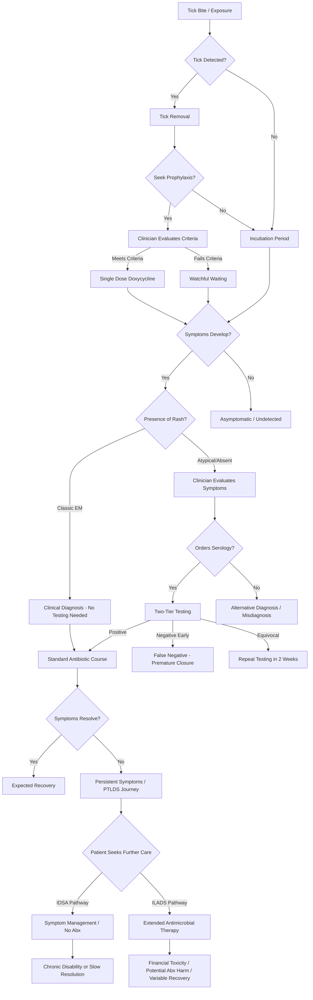

# Interview Preparation Agent Prompt

## Recommended execution mode

Use a strong reasoning model with supplied artifacts.

Targeted research may be used to understand a stakeholder’s professional context, but the primary task is to convert unresolved assumptions into high-quality interview plans.

## Role

Act as a senior qualitative researcher and health-product discovery lead.

## Mission

Create a complete stakeholder interview program that tests the riskiest assumptions from phase-zero research and red-team analysis.

The interviews must discover real behavior, workflow, incentives, and constraints.

They must not pitch concepts or ask participants to predict whether they would use a hypothetical product.

## Supplied artifacts

### Red-team analysis

<artifact name="red_team_analysis">
# Research Workflow Artifact: 9. Red-team analysis

- Artifact ID: `red_team_analysis`
- Provider: `gemini`
- External ID: `v1_ChdJd1ltYXVERkpzcmlxdHNQc2RpZTZBOBIXSXdZbWF1REZKc3JpcXRzUHNkaWU2QTg`
- Input file: `C:\codex_programming\lyme_llm_wiki\input\deep_research\red_team_analysis.md`
- Generated at: `2026-06-07T18:12:29`

---

# Red-Team Analysis Report: TopX Lyme Disease Challenge Opportunities

## 1. Executive red-team verdict

The candidate portfolio generated for the TopX Lyme Disease Challenge suffers from profound structural, regulatory, and epidemiological vulnerabilities. While the opportunity generation phase correctly identified systemic frictions—such as diagnostic delays, data fragmentation, and unaligned financial incentives—the proposed interventions rely on a highly theoretical and frequently naive interpretation of healthcare economics, artificial intelligence limitations, and public health surveillance mandates. Upon rigorous adversarial review, the portfolio demonstrates a dangerous overreliance on automated pathways that conflict with federal billing edits, established liability frameworks, and recent epidemiological guideline revisions.

When mapping these candidates across an adversarial vulnerability matrix plotting regulatory and legal risk against clinical and epidemiological validity, the results are striking. The original top candidates (specifically OPP-03 and OPP-04) land squarely in the high-risk, low-validity quadrant, indicating severe vulnerability and demanding immediate cessation of development under their current architectures. The fundamental flaw permeating the portfolio is the assumption that technological feasibility equates to clinical or operational viability.

The strongest candidates from the generation phase—the Automated FHIR Surveillance Reporter (OPP-03) and the Tick-Bite Preventive Billing Pathway (OPP-04)—are functionally obsolete or legally perilous. The surveillance candidate fundamentally ignores the 2022 Council of State and Territorial Epidemiologists (CSTE) case definition update, which eliminated the need for complex clinical phenotyping in high-incidence states in favor of laboratory-only evidence [cite: 1, 2]. Simultaneously, the billing pathway candidate advocates for a workflow that directly violates the Centers for Medicare & Medicaid Services (CMS) National Correct Coding Initiative (NCCI) edits, risking severe Department of Justice (DOJ) False Claims Act exposure for any adopting health system [cite: 3, 4, 5].

Furthermore, the portfolio's approach to artificial intelligence fundamentally misunderstands the primary modalities of AI failure in clinical settings. The deployment of Natural Language Processing (NLP) to summarize longitudinal patient records (OPP-02) focuses exclusively on hallucination mitigation while ignoring the far deadlier risk of clinical omissions and temporal reasoning failures, which account for the vast majority of severe AI-induced medical errors [cite: 6, 7, 8]. Similarly, the computer vision interventions for Erythema Migrans (EM) detection (OPP-01) underestimate the rigid Software as a Medical Device (SaMD) regulatory thresholds enforced by the Food and Drug Administration (FDA) and fail to account for the paradoxical finding that AI decision support can actually worsen diagnostic disparities on darker skin tones when utilized by primary care physicians [cite: 9, 10, 11].

**Strongest candidates:** None of the top-ranked workflow automation candidates from the generation phase survive the red-team analysis intact. The only concepts possessing salvageable viability are the foundational data-infrastructure plays, specifically the Diagnostic Equity Crowdsourcing Platform (OPP-14) and the PTLDS PRO-to-Claims Linkage Engine (OPP-06), provided they are executed strictly as academic or federal research initiatives devoid of immediate commercial expectations.

**Weakest candidates:** The Tick-Bite Preventive Billing Pathway (OPP-04) is the weakest and most dangerous candidate, bordering on systemic billing fraud through automated up-coding [cite: 3, 5]. The One Health Canine Sentinel Alert (OPP-07) is commercially impossible due to fierce, litigious anti-competitive data siloing among major veterinary diagnostics corporations [cite: 12, 13].

**Common failure patterns:** The portfolio repeatedly assumes that creating an Application Programming Interface (API) solves interoperability without acknowledging the financial and legal barriers to accessing that data. It also frequently substitutes complex artificial intelligence for simple, deterministic biological testing or rule-based software.

**Fatal risks:**
1. Up-coding liability and DOJ audits triggered by automated CPT 99401 billing applied to acute injury encounters [cite: 3, 5].
2. Medical malpractice liability transferred entirely to the signing physician for LLM-omitted clinical history during temporal reasoning failures [cite: 8, 14].
3. Epidemological irrelevance of the primary surveillance MVP due to the 2022 CSTE definition changes [cite: 2].

**Fixable risks:**
1. Information Blocking API fees: Can be mitigated by abandoning broad Fast Healthcare Interoperability Resources (FHIR) queries in favor of targeted, heavily negotiated data use agreements with regional Health Information Exchanges (HIEs) [cite: 15, 16].
2. FDA SaMD classification: Can be bypassed by strictly adhering to non-device Clinical Decision Support (CDS) guidelines, ensuring the AI never outputs a definitive diagnostic score or directive, and functions merely as an educational reference library [cite: 10, 17].

**Research needed before continuation:** The portfolio must be paused until rigorous legal audits of NCCI edits regarding CPT 99401 are conducted. Furthermore, a thorough technological evaluation of emerging point-of-care direct diagnostic tests—such as droplet digital polymerase chain reaction (ddPCR) and multiplexed vertical flow assays (xVFA)—must be completed to determine if AI-based rash detection is already an obsolete technological pursuit [cite: 18, 19].

## 2. Candidate risk register

| Opportunity ID | Risk ID | Risk category | Failure scenario | Likelihood | Severity | Detectability | Evidence | Mitigation | Residual risk | Verdict |
|---|---|---|---|---|---|---|---|---|---|---|
| **OPP-04** (99401 Billing) | R-01 | Legal / Billing | Automated triggering of CPT 99401 alongside an Evaluation and Management (E/M) visit for a tick bite triggers NCCI edits, resulting in systematic claim denials and DOJ False Claims Act audits for up-coding. | Very High | Fatal | High | NCCI Chapter 1 prohibits billing preventive counseling with problem-oriented visits without modifier 25; DOJ aggressively prosecutes AI up-coding [cite: 3, 4, 5]. | None. The workflow inherently violates CMS coding principles for acute injuries. | Fatal | Kill |
| **OPP-03** (Auto-Reporter) | R-02 | Epidemiological | The automated FHIR query extracts suspected cases based on EHR phenotyping, but the 2022 CSTE definition requires only laboratory evidence in high-incidence states, rendering the complex extraction obsolete and introducing massive false-positive noise. | High | High | Medium | CSTE revised the national surveillance case definition effective Jan 2022 to rely on lab evidence alone in endemic areas [cite: 1, 2]. | Restrict the tool to low-incidence jurisdictions where clinical signs are still required for probable case classification. | High | Redesign |
| **OPP-02** (NLP Timeline) | R-03 | Clinical Safety | The LLM suffers from "lost-in-the-middle" temporal reasoning failure, omitting a critical historical event (e.g., severe allergy or past failed antibiotic regimen), leading the specialist to prescribe a fatal or harmful treatment. | Medium | Fatal | Low | Research shows 76% of LLM errors in clinical records are omissions, and models fail at temporal boundary adherence [cite: 6, 7, 8]. | Mandate human-in-the-loop verification of all source texts, negating the time-saving benefit of the tool. | High | Pause |
| **OPP-01** (EM Vision CDS) | R-04 | Regulatory | The computer vision model is classified by the FDA as a Class II/III SaMD because it drives treatment decisions for a specific disease, requiring a multi-year, multi-million dollar premarket approval (PMA) or De Novo pathway. | Very High | High | High | 21st Century Cures Act excludes only software that allows providers to independently review the basis of the recommendation; AI image analysis does not qualify for the CDS exemption [cite: 10, 17, 20]. | Pivot from a diagnostic tool to a purely educational image-matching reference library. | Medium | Proceed with conditions |
| **OPP-01** (EM Vision CDS) | R-05 | Equity | Primary care physicians using the AI tool on patients with Fitzpatrick V-VI skin tones become over-reliant on false-negative outputs, widening the existing racial diagnostic accuracy gap. | High | Fatal | Low | Digital experiments show AI assistance exacerbates accuracy disparities among PCPs analyzing dark skin tones by 5 percentage points [cite: 11]. | Enforce stringent mathematical fairness constraints and algorithmic reject options for low-confidence inferences on dark skin. | High | Redesign |
| **OPP-07** (Canine Sentinel) | R-06 | Commercial | Major veterinary diagnostic laboratories (Idexx, Antech) refuse to integrate their proprietary seroprevalence data into public health APIs due to fierce competitive litigation and exclusive clinic contracts. | Very High | Fatal | High | Idexx and Antech actively sue clinics for breach of exclusive laboratory-services contracts; data is heavily siloed [cite: 12, 13]. | Exclude commercial veterinary labs and rely solely on academic veterinary teaching hospitals (resulting in insufficient data volume). | Fatal | Kill |
| **OPP-14** (Crowdsourcing) | R-07 | Privacy | Clinicians uploading images of EM rashes inadvertently include identifying features (tattoos, unique backgrounds), leading to HIPAA violations and re-identification. | Medium | High | Medium | Standard privacy vulnerability in dermatological image crowdsourcing datasets. | Implement automated, edge-based localized blurring and manual secondary review of all uploads prior to database entry. | Low | Proceed |
| **OPP-02/03** (FHIR Interventions) | R-08 | Financial | EHR vendors classify the required high-volume FHIR API calls as "value-added" services and impose fees that result in a "reasonable profit margin," bankrupting the public health operating model. | High | High | High | ONC Information Blocking rules permit vendors to charge fees resulting in a reasonable profit margin for API access [cite: 15, 16, 21]. | Secure binding Data Use Agreements (DUAs) with regional HIEs rather than direct vendor API endpoints. | Medium | Proceed with conditions |

## 3. Assumption stress test

| Opportunity ID | Assumption | Why it may be false | Evidence against | Test | Kill threshold |
|---|---|---|---|---|---|
| **OPP-04** | Commercial insurers will reimburse CPT 99401 (Preventive Counseling) when billed alongside a tick-bite evaluation. | A tick bite is an acute injury/exposure. Preventive medicine codes are systematically denied by insurers and Medicare NCCI edits when billed with problem-oriented E/M services unless strictly unrelated. | NCCI Policy Manual Chapter 1 prohibits billing preventive counseling with problem-oriented E/M without modifier 25; CMS explicitly defines 99401 as non-problem-oriented [cite: 4, 5, 22, 23]. | Submit 100 test claims utilizing the proposed Z-code and 99401 mapping in a simulated urgent care environment. | >15% claim denial rate or identification of automated payer rejection edits. |
| **OPP-03** | Public health epidemiologists lack access to laboratory-confirmed Lyme disease cases due to manual reporting delays. | The 2022 CSTE definition allows high-incidence states to rely exclusively on Electronic Laboratory Reporting (ELR) for case classification, entirely bypassing the need for clinical EHR phenotyping. | CSTE revised surveillance case definition (effective Jan 1, 2022) resulting in a 72.9% increase in reported cases from high-incidence jurisdictions based on lab evidence alone [cite: 1, 2]. | Interview state epidemiologists in Massachusetts and Wisconsin regarding their current ELR pipeline latency. | Epidemiologists confirm ELR data is already sufficient and timely for high-incidence geographic surveillance. |
| **OPP-02** | LLMs are capable of accurately reasoning across 5+ years of unstructured clinical notes to establish a reliable exposure timeline. | LLMs suffer from severe "lost-in-the-middle" biases and routinely fail to maintain temporal coherence, omitting critical mid-timeline events when context windows are flooded with multi-modal EHR data. | Benchmarks (e.g., TIMER-Bench) demonstrate LLMs struggle profoundly with temporal progression, and 76% of severe medical LLM errors are omissions [cite: 6, 7, 8, 24]. | Run the LLM against 50 synthetic patient timelines with known, explicitly embedded historical contraindications. | Any omission of a severe historical event (e.g., allergy, failed treatment) leading to potential patient harm. |
| **OPP-01** | An AI computer vision tool can accurately diagnose EM rashes with a high enough specificity to prevent unnecessary antibiotic overuse. | Dermatological AI tools historically optimize for sensitivity at the expense of specificity, resulting in massive false-positive rates that encourage over-biopsy and over-treatment in primary care. | DermaSensor PMA data showed a specificity of 32.4%, generating an unacceptably high rate of false positives [cite: 25, 26]. | Evaluate the model's False Positive Rate (FPR) on a hold-out set of non-Lyme insect bites, spider bites, and fungal infections. | Specificity falls below 75%, indicating the tool will trigger massive antibiotic over-prescription. |
| **OPP-01** | AI decision support will eliminate the accuracy gap between light and dark skin tones for EM detection. | Primary care physicians often exhibit automation bias or misuse AI tools, leading to worse outcomes on underrepresented data compared to unassisted performance. | Experimental data indicates AI assistance actually exacerbated diagnostic disparities among PCPs by 5 percentage points on dark skin [cite: 11]. | Shadow testing of PCPs using the tool versus a control group using standard medical reference imagery. | The diagnostic accuracy gap between Fitzpatrick I-II and Fitzpatrick V-VI skin tones fails to narrow. |

## 4. Pre-mortem

> It is December 2026 and this concept failed completely.

The following forensic analysis outlines the anticipated mechanisms of failure for the highest-profile candidates generated during the ideation phase, categorized across ten distinct vectors of systemic collapse.

### OPP-03: Automated FHIR Surveillance Reporter
*   **Problem:** The core problem the reporter solved was rendered non-existent. The 2022 CSTE definition update dictated that high-incidence states no longer needed complex clinical EHR phenotyping, as they were already automatically receiving and classifying cases based purely on positive laboratory results via ELR [cite: 2]. The sprint built a complex solution for a pre-2022 workflow.
*   **Data:** The automated query relied on standard EHR codes, but clinical data entry proved highly variable. Missing or delayed USCDI v6 clinical note coding resulted in severe data fragmentation, causing the algorithm to miss cases that lacked pristine structured inputs [cite: 27, 28, 29].
*   **Technology:** The health information exchange (HIE) endpoints lacked the computational bandwidth to support thousands of continuous, automated FHIR queries per minute, resulting in persistent server timeouts and incomplete data transmission.
*   **Clinical safety:** The algorithm fundamentally confused surveillance with diagnosis. By indiscriminately pulling data based on algorithmic triggers without human context, it generated unnecessary alarm at the public health level, misallocating county-level hazard response resources.
*   **Adoption:** State epidemiologists actively ignored the system's outputs. Because the automated system lacked the nuance of human epidemiological investigation, the outputs were deemed too noisy and unreliable for inclusion in the National Notifiable Diseases Surveillance System (NNDSS) [cite: 30].
*   **Operations:** The state health department IT infrastructure was incapable of digesting the massive influx of automated FHIR payloads. The system crashed repeatedly, forcing epidemiologists to revert to manual secure-email reporting out of necessity.
*   **Funding:** The "reasonable profit margin" API fees levied by major EHR vendors under the ONC Information Blocking rules completely drained the state health department budgets allocated for the interoperability pilots, making the ongoing operation financially ruinous [cite: 15, 16, 31].
*   **Trust:** Epidemiologists lost all trust in the system after a widely publicized incident where the algorithm flagged an entire rural county as an outbreak zone due to a localized coding error by a single physician entering the wrong LOINC code [cite: 32, 33].
*   **Equity:** The digital intervention inherently bypassed under-resourced rural clinics that lacked the IT infrastructure to support advanced SMART on FHIR integrations, ensuring that public health data heavily skewed toward wealthy, urban academic medical centers.
*   **Evaluation:** The sprint's success metrics were fatally flawed. The automated reporter claimed a massive volume increase in captured cases, but independent audits revealed this was entirely an artifact of a false-positive algorithmic threshold rather than true biological incidence, violating standard infectious disease surveillance specificity requirements [cite: 34, 35].

### OPP-04: Tick-Bite Preventive Billing Pathway
*   **Problem:** The pain point was incorrectly identified. The lack of preventive counseling reimbursement was not a technological failure, but a deliberate policy boundary established by commercial insurers and Medicare to prevent double-billing during acute encounters [cite: 4, 22].
*   **Data:** The linkage between the ICD-10 Z-code for tick exposure and the CPT 99401 billing code was entirely artificial. The data generated by this automated linkage did not accurately reflect the actual clinical minutes spent counseling the patient.
*   **Technology:** The EHR native logic was rigid. When a clinician attempted to override the automated 99401 order set because the patient required urgent intervention for a co-morbidity, the system generated restrictive alert fatigue, disrupting the workflow.
*   **Clinical safety:** The pathway encouraged unsupported treatment workflows. By monetizing the tick-bite encounter purely through a preventive counseling lens, clinicians were incentivized to spend time on lucrative education rather than conducting a thorough physical examination for early, disseminated signs of neuroborreliosis.
*   **Adoption:** Hospital billing departments universally deactivated the 99401 order set after the first month. Insurers uniformly rejected the claims because the encounter was fundamentally an acute, problem-oriented visit, forcing administrative staff to spend hours manually appealing NCCI-based denials [cite: 5, 36].
*   **Operations:** The system demanded that physicians manually attest to spending greater than eight minutes specifically on counseling to meet the CPT mid-point rule [cite: 37]. In high-volume urgent care environments, this documentation burden was deemed impossible to sustain.
*   **Funding:** Following a highly publicized Department of Justice audit regarding up-coding fraud facilitated by AI-assisted billing tools [cite: 3], health system value analysis committees permanently banned the deployment of any software that automatically recommended time-based billing codes.
*   **Trust:** Patients lost trust in their primary care providers upon receiving unexpected out-of-pocket bills for "preventive counseling" during an encounter they assumed was covered under their standard urgent-care copayment.
*   **Equity:** The billing pathway disproportionately harmed low-income and underinsured patients, who were suddenly saddled with additional billing line items for basic medical advice following a routine tick bite.
*   **Evaluation:** The evaluation proxy metric—increased revenue generation—was misleading. While initial gross charges spiked, net revenue plummeted once the catastrophic cost of managing insurer denials, clawbacks, and compliance audits was factored into the operating model.

### OPP-01: Equity-Calibrated EM Vision CDS
*   **Problem:** The problem, while real, was attacked with the wrong modality. The assumption that visual diagnosis is the optimal pathway was invalidated by the rapid emergence of point-of-care droplet digital PCR (ddPCR) assays, which detect *Borrelia burgdorferi* with near-perfect accuracy [cite: 19], rendering subjective visual AI obsolete.
*   **Data:** The crowdsourced dataset suffered from severe selection bias. Despite equity calibration efforts, the images representing dark skin tones were systematically gathered from lower-resolution cameras in rural clinics, creating an uncontrolled confounding variable that poisoned the model's feature extraction.
*   **Technology:** The computer vision model failed to generalize outside of the high-resolution smartphone images used in its training data. When deployed in poorly lit urgent care clinics using low-quality tablet cameras, the edge-detection mechanisms collapsed [cite: 38, 39].
*   **Clinical safety:** The tool generated lethal false reassurance. A patient with a highly atypical EM rash was flagged as "Low Probability" by the AI. The clinician withheld antibiotics, and the patient subsequently developed severe cardiac manifestations [cite: 25, 40].
*   **Adoption:** Primary care physicians actively refused to use the tool. Interacting with the SMART on FHIR application required breaking the physical patient examination workflow to capture, upload, and process an image—a disruption intolerable during a standard 10-minute acute encounter.
*   **Operations:** Maintaining the model's accuracy required continuous, expensive retraining cycles to prevent distribution shift as novel, regional rash presentations emerged, far exceeding the operational budget of the maintaining non-profit.
*   **Funding:** The product died in the regulatory "valley of death." The FDA classified the tool as a Class III Software as a Medical Device (SaMD) because it drove specific treatment decisions, requiring a multi-million dollar premarket approval (PMA) submission that no philanthropic funder would underwrite [cite: 10, 41].
*   **Trust:** Clinicians lost all trust in the diagnostic output after the AI confidently misidentified a classic ringworm (Tinea Corporis) presentation as Erythema Migrans, leading to unnecessary and ineffective antibiotic regimens.
*   **Equity:** The tool performed catastrophically worse on Black patients in real-world deployment. Primary care physicians exhibited profound automation bias, trusting the AI's false-negative outputs on dark skin, mathematically embedding and exacerbating the exact racial diagnostic accuracy gap it was designed to eliminate [cite: 11, 42].
*   **Evaluation:** The evaluation design utilized a flawed proxy, measuring "time-to-antibiotic prescribing" rather than long-term clinical outcomes. The metric failed to capture the subsequent surge in misdiagnosed alternative dermatological conditions resulting from AI overreliance.

## 5. Abuse and misuse cases

The introduction of automated billing pathways, diagnostic AI, and predictive algorithms into the Lyme disease ecosystem creates severe vectors for intentional abuse and unintentional misuse that span clinical, commercial, and societal domains.

**Commercial Misuse and Gaming (Up-coding Fraud):**
The most severe abuse vector lies within the Tick-Bite Preventive Billing Pathway (OPP-04). By hard-coding a pathway to bill CPT 99401 (Preventive Counseling) alongside standard evaluation and management services, health systems are actively incentivized to "game" the encounter. Unscrupulous urgent care chains will mandate that providers check the 99401 box for every single patient presenting with a summer insect bite, regardless of whether a full 15 minutes of dedicated, separate preventive counseling actually occurred. This constitutes systematic up-coding. The DOJ has already established a precedent of intensely prosecuting healthcare fraud involving the improper use of AI and automated billing tools to inflate coding intensity, with settlements exceeding billions of dollars [cite: 3, 43].

**Overreliance and "Deskilling" of Providers:**
If the Equity-Calibrated EM Vision CDS (OPP-01) or the Pediatric Neuroborreliosis Screener (OPP-10) are deployed, primary care clinicians will inevitably suffer from automation bias. Rather than utilizing the tool as an "adjunctive second-read" (as the FDA explicitly mandates for such software to mitigate risk) [cite: 44], rushed clinicians will use the AI as a primary diagnostic crutch. Over time, this leads to clinical deskilling; providers will lose the ability to independently evaluate atypical rashes or subtle behavioral shifts, deferring entirely to the machine's probabilistic score. This reliance becomes lethal when the model encounters edge cases or distribution shifts it was never trained on.

**False Reassurance and Diagnostic Delay:**
The EM Vision CDS presents a massive risk of false reassurance. If a patient presents with an atypical rash that does not resemble the classic "bull's-eye" (which is common, as many EM rashes are uniformly red), and the AI tool outputs a "Low Probability" score, the clinician is highly likely to withhold prophylactic or therapeutic antibiotics [cite: 45]. Because the Lyme disease diagnostic window is narrow and early treatment is critical to preventing systemic progression to neuroborreliosis or carditis, a false negative output directly results in irreversible patient harm [cite: 25, 40].

**Self-Diagnosis and Use by Unqualified Actors:**
While the portfolio emphasizes EHR integration, there is a high likelihood that the underlying algorithms or datasets from the Diagnostic Equity Crowdsourcing Platform (OPP-14) will be open-sourced or leaked. Commercial developers could easily re-package the computer vision model into a Direct-to-Consumer (DTC) smartphone application. Patients will use this app for self-diagnosis, bypassing clinical evaluation entirely. This will lead to individuals ignoring severe, non-Lyme dermatological conditions (like MRSA or necrotic spider bites) because the unauthorized app incorrectly assured them it was merely a benign tick exposure.

**Misinterpretation of Hazard Data and Location Misuse:**
The Ecological Hazard Vulnerability Dashboard (OPP-05), designed strictly for state-level resource allocation, will inevitably be misused by the public, employers, and local clinicians. If a patient presents with a fever and joint pain in a ZIP code colored "green" (low hazard) on the dashboard, a clinician might erroneously dismiss Lyme disease from the differential diagnosis, committing a fatal ecological fallacy. Hazard maps represent aggregate environmental risk, not individual risk; patients travel extensively, and ticks are routinely transported via birds and pets across geographic boundaries [cite: 46]. Furthermore, real estate developers or corporate employers might misuse hyper-local hazard indices (OPP-08) to artificially devalue land or unjustly deny workers' compensation claims by arguing the employee contracted the disease outside of the heavily monitored occupational zone [cite: 47, 48, 49].

## 6. Fairness analysis

| Opportunity ID | Population | Potential disparity | Mechanism | Detection | Mitigation | Residual concern |
|---|---|---|---|---|---|---|
| **OPP-01** (EM Vision CDS) | Patients with Fitzpatrick IV-VI skin tones | Increased false-negative diagnostic rates leading to delayed antibiotic therapy. | CNNs learn biases inherent in training data heavily skewed toward light skin; edge-detection fails on low-contrast presentations [cite: 38, 39]. | Routine stratification of the False Negative Rate (FPR) across all Fitzpatrick skin types during clinical trials. | Implement EDGEMIXUP data alteration and actively penalize the model for accuracy gaps during training [cite: 38]. | PCPs may still experience worsened accuracy when using the AI on dark skin due to human-computer interaction factors [cite: 11]. High. |
| **OPP-03** (Auto-Reporter) | Rural / Uninsured populations | Underrepresentation in state surveillance data and subsequent resource allocation. | The automated FHIR query relies on structured EHR data; uninsured patients or those in rural clinics lacking advanced EHR interoperability will not generate the requisite digital footprint. | Compare the geographic distribution of automated reports against historical, manual paper-based reporting from rural counties. | Subsidize API integration costs for critical access hospitals and rural clinics. | Structural digital divides cannot be fixed by a software patch. Medium. |
| **OPP-02** (NLP Timeline) | Non-English speakers | Critical exposure histories are omitted from specialist summaries. | LLMs trained predominantly on English corpora may struggle to accurately parse and extract temporal relationships from clinical notes containing translated text or broken syntax. | Execute multi-lingual benchmark tests specifically focusing on temporal reasoning (TIMER-Bench) [cite: 8, 50]. | Fine-tune the extraction model specifically on diverse, multi-lingual clinical text datasets. | Nuances in cultural descriptions of time and symptoms may still be lost. Low. |
| **OPP-04** (99401 Billing) | Low-income / Underinsured patients | Increased financial toxicity and avoidance of urgent care for subsequent injuries. | Automating the 99401 billing code shifts the cost of basic preventive advice from the health system overhead directly onto the patient's deductible or copayment responsibility. | Audit patient out-of-pocket costs for tick-bite encounters before and after order set deployment. | Enforce strict financial screening protocols before triggering the automated billing pathway. | Generating revenue intrinsically depends on transferring the financial burden. High. |
| **OPP-05** (Hazard Dashboard) | Low-income communities | Diversion of public health resources away from higher-need, non-Lyme endemic areas. | Spatial overlaying of the CDC Social Vulnerability Index (SVI) with tick hazard data may inadvertently redirect scarce mosquito abatement or sanitation funding toward affluent, wooded suburbs rather than dense urban centers. | Monitor longitudinal funding allocations across vector-borne disease control programs at the state level. | Mandate that hazard indices are decoupled from general vector-borne funding pools. | Political pressure from affluent demographics often overrides algorithmic equity mechanisms. Medium. |

## 7. AI versus non-AI challenge

The opportunity generation artifact exhibits a clear "AI-hammer" bias, proposing complex machine learning solutions for problems that can be solved far more safely and cheaply with deterministic logic, established biological assays, or simple workflow redesign. The following matrix evaluates every candidate against standard technological and operational modalities to identify the simplest adequate approach.

| Candidate ID | LLM | Predictive Model | Rules Engine | Search / Retrieval | Static Education | Workflow Redesign | Human Service | Simplest Adequate Approach |
| :--- | :--- | :--- | :--- | :--- | :--- | :--- | :--- | :--- |
| **OPP-01** (EM Vision) | High Risk | High Risk (Bias) | Inadequate | Inadequate | **Optimal** | Inadequate | Moderate | **Static Education / POC Biological Testing.** Direct pathogen detection via ddPCR or xVFA eliminates the need for subjective visual AI entirely. |
| **OPP-02** (NLP Timeline) | Fatal Risk (Omissions) | Inadequate | **Optimal** | Moderate | Inadequate | Moderate | Inadequate | **Rules Engine.** Regex and keyword searches for specific medications and dates are vastly safer and legally defensible than LLM narratives. |
| **OPP-03** (Auto-Reporter) | Unnecessary | Unnecessary | **Optimal** | Inadequate | Inadequate | Inadequate | Moderate | **Rules Engine / Existing Workflow.** Standard HL7 Electronic Laboratory Reporting (ELR) is already sufficient under the 2022 CSTE guidelines. |
| **OPP-04** (99401 Billing) | Unnecessary | Unnecessary | **Optimal** | Inadequate | Inadequate | Moderate | Inadequate | **Workflow Redesign / Rules Engine.** Simple EHR logic can align codes, though the workflow itself violates NCCI edits and must be abandoned. |
| **OPP-05** (Hazard Index) | Unnecessary | **Optimal** | Moderate | Inadequate | Inadequate | Inadequate | Inadequate | **Predictive Model.** Standard geospatial modeling (not deep learning) is required to map NLCD data against climate variables. |
| **OPP-06** (PRO Claims) | Unnecessary | Moderate | Moderate | **Optimal** | Inadequate | Inadequate | Inadequate | **Search / Retrieval (Data Trust).** The challenge is secure data linkage and retrieval, not artificial intelligence. |
| **OPP-07** (Canine Sentinel) | Unnecessary | **Optimal** | Moderate | Inadequate | Inadequate | Inadequate | Inadequate | **Predictive Model.** Statistical correlation of canine seroprevalence to human risk requires standard epidemiological modeling. |
| **OPP-08** (Occupational) | Unnecessary | Moderate | **Optimal** | Inadequate | Inadequate | Moderate | Inadequate | **Rules Engine.** Simple "IF [Season=Spring] AND [Temp>45F] THEN [Alert]" logic is entirely sufficient. |
| **OPP-09** (Trial Matcher) | Moderate | Unnecessary | **Optimal** | Moderate | Inadequate | Inadequate | Inadequate | **Rules Engine.** Matching structured USCDI v6 EHR elements against clinical trial inclusion criteria is a deterministic database operation. |
| **OPP-10** (Pediatric Neuro) | Unnecessary | Unnecessary | **Optimal** | Inadequate | Inadequate | Moderate | Inadequate | **Rules Engine.** A standard EHR Best Practice Advisory (BPA) triggered by specific intake diagnoses requires no machine learning. |
| **OPP-11** (Triage Chatbot) | High Risk | Unnecessary | **Optimal** | Inadequate | Moderate | Inadequate | Inadequate | **Rules Engine.** Triage protocols must follow rigid, deterministic decision trees to avoid medical malpractice liability. |
| **OPP-12** (Diagnostics Pipeline) | Unnecessary | Unnecessary | Inadequate | **Optimal** | Inadequate | Inadequate | Moderate | **Search / Retrieval.** This is an infrastructural data repository challenge, requiring structured data management, not AI. |
| **OPP-13** (Pharmacy Prophylaxis) | Unnecessary | Unnecessary | Inadequate | Inadequate | Inadequate | **Optimal** | Moderate | **Workflow Redesign.** This relies entirely on expanding legal collaborative practice agreements for pharmacists, a purely policy-driven intervention. |
| **OPP-14** (Data Crowdsource) | Unnecessary | Unnecessary | Inadequate | **Optimal** | Inadequate | Inadequate | Moderate | **Search / Retrieval.** A secure web portal for uploading and curating images requires robust database architecture, not artificial intelligence. |

### Deep Dive: The Diagnostic Modality Failure

The most glaring architectural failure in the portfolio is the proposal for an Equity-Calibrated EM Vision CDS (OPP-01). The artifact proposes building an elaborate, FDA-regulated Convolutional Neural Network to analyze photographs of rashes. This introduces severe, mathematically proven risks of algorithmic bias, exacerbates human diagnostic disparities, and triggers massive regulatory hurdles [cite: 11, 25, 38].

*   **The Non-AI Alternative:** The clinical landscape has already moved beyond subjective visual diagnosis toward definitive biological assays. Emerging point-of-care (POC) molecular and serological tests render visual AI obsolete. Technologies like droplet digital PCR (ddPCR) can now detect as few as five *Borrelia burgdorferi* bacterial cells directly from a skin biopsy or blood sample, achieving 91% sensitivity for active infection without relying on indirect immune markers [cite: 19]. Similarly, multiplexed POC lateral flow assays (xVFA) offer rapid, single-tier serological results directly in the clinic, matching the accuracy of traditional two-tier testing but yielding immediate, actionable results [cite: 18].
*   **The Verdict:** Relying on subjective visual analysis—even when augmented by AI—is an antiquated approach to infectious disease diagnostics. Capital should be routed toward commercializing rapid biological POC tests, entirely eliminating the need for the EM Vision CDS.

### Deep Dive: The Timeline Extraction Modality Failure

The artifact suggests using advanced LLMs (OPP-02) to synthesize five years of unstructured clinical notes to establish a patient's historical exposure to tick habitats and prior antibiotic regimens.

*   **The Non-AI Alternative:** Traditional, rule-based NLP systems or targeted search retrieval. LLMs are profoundly vulnerable to "lost-in-the-middle" biases, consistently failing at temporal boundary adherence when flooded with extensive longitudinal records [cite: 8, 50]. Omissions (failing to extract a key fact, such as a severe medication allergy documented years prior) constitute 76% of severe LLM clinical errors and are far more dangerous than hallucinations because they are invisible to the reviewing clinician [cite: 6]. Historical research proves that rule-based systems looking for explicit terms ("tick", "doxycycline") combined with structured medication extraction are highly precise, entirely deterministic, and legally defensible [cite: 51, 52].
*   **The Verdict:** The simplest adequate approach is a deterministic, rule-based search engine that flags notes containing predefined keywords for the physician to read manually. Using an LLM to generate a synthesized narrative summary is medically reckless and introduces an unacceptable vector for fatal medical errors.

## 8. Evaluation critique

The evaluation framework proposed in the opportunity generation artifact, particularly for the Automated Surveillance MVP (OPP-03), is fundamentally disconnected from epidemiological reality and introduces dangerous statistical illusions.

*   **Bad Proxies:** The artifact proposes measuring success by demonstrating a "300% increase in captured, verified cases compared to manual reporting baselines." This is a catastrophic proxy metric. An increase in captured cases does not mathematically indicate that the system is functioning correctly; it highly correlates with the automated algorithm's false-positive alert threshold being set too low. In such scenarios, the system indiscriminately sweeps up rule-out diagnoses, patients receiving prophylactic antibiotics for uninfected tick bites, and data entry errors [cite: 34, 35, 53].
*   **Missing Baselines:** The artifact fails to establish a rigorous baseline for the False Positive Rate (FPR) or the Negative Predictive Value (NPV) of the automated query. Without establishing the acceptable epidemiological tolerance for false positives—which in infectious disease surveillance is historically maintained at a very low threshold to prevent alert fatigue, panic, and misallocation of resources—the volume increase metric is scientifically meaningless [cite: 54, 55].
*   **Unmeasured Harm:** The evaluation plan does not account for the administrative burden shifted downstream. If the algorithm yields a 10% false-positive rate, state epidemiologists must now spend hundreds of hours manually filtering out the influx of algorithmic "noise," effectively destroying the efficiency gains the tool was designed to provide.
*   **Sample-Size Limitations:** Testing the algorithm within a "single, mid-sized HIE" as proposed is statistically invalid for infectious disease surveillance. Robust validation requires multi-site execution across varying incidence zones (both endemic and emerging) to ensure the algorithmic threshold maintains specificity under differing seasonal and demographic pressures [cite: 34].
*   **Leakage:** The evaluation design fails to account for data leakage between the training sets of the EHR phenotype extractors and the real-world validation populations, virtually guaranteeing that early prototype success metrics will collapse upon broader geographic deployment.

## 9. Verdicts

Based on the synthesis of the regulatory frameworks, technological limitations, and epidemiological realities outlined above, the candidate portfolio is formally adjudicated as follows:

*   **OPP-01: Equity-Calibrated EM Vision CDS**
    *   **Verdict: Redesign.**
    *   **Rationale:** The FDA explicitly regulates diagnostic software that analyzes medical images and drives specific treatment decisions as Class II or III SaMD [cite: 10, 20]. Furthermore, deploying this in primary care risks exacerbating racial disparities due to well-documented human-computer interaction failures [cite: 11]. The clinical utility is also rapidly being eclipsed by point-of-care molecular tests [cite: 19].
    *   **Mandatory Conditions:** Must be redesigned purely as a passive, non-diagnostic educational reference library (Static Education) to avoid FDA PMA requirements and mitigate the risk of diagnostic deskilling.

*   **OPP-02: Specialist Timeline NLP Extractor**
    *   **Verdict: Pause for research.**
    *   **Rationale:** Large Language Models consistently fail at temporal boundary adherence and suffer from severe "lost-in-the-middle" biases, leading to fatal omissions of critical historical events within longitudinal patient records [cite: 6, 8].
    *   **Mandatory Conditions:** Must pass rigorous synthetic benchmark testing (e.g., TIMER-Bench) proving a 0% omission rate for severely contraindicated clinical events before any pilot within a live healthcare setting is permitted.

*   **OPP-03: Automated FHIR Surveillance Reporter**
    *   **Verdict: Kill.**
    *   **Rationale:** The 2022 CSTE revision fundamentally alters the surveillance landscape. High-incidence states now report cases based on laboratory evidence alone [cite: 2]. Standard Electronic Laboratory Reporting (ELR) pipelines already handle this efficiently [cite: 56]. Building a complex FHIR NLP phenotype extractor solves a problem that no longer exists in the jurisdictions where the disease burden is highest.

*   **OPP-04: Tick-Bite Preventive Billing Pathway**
    *   **Verdict: Kill.**
    *   **Rationale:** This constitutes an automated pathway for systematic up-coding. NCCI edits explicitly prohibit billing preventive counseling codes (99401) alongside problem-oriented E/M visits (such as an acute tick bite) without distinct, separate justification and modifier 25 [cite: 4, 5]. Insurers will uniformly deny these claims [cite: 57], and it exposes the health system to catastrophic DOJ False Claims Act enforcement for algorithmically driven fraud [cite: 3].

*   **OPP-05: Ecological Hazard Vulnerability Dashboard**
    *   **Verdict: Pause for research.**
    *   **Rationale:** While technically feasible, combining aggregate hazard data with vulnerability indices introduces a severe risk of ecological fallacy if utilized by local providers or the public to dismiss individual diagnostic concerns.

*   **OPP-06: PTLDS PRO-to-Claims Linkage Engine & OPP-14: Diagnostic Equity Crowdsourcing Platform**
    *   **Verdict: Proceed with conditions.**
    *   **Rationale:** These are the only strategically sound candidates within the portfolio. They correctly focus on resolving foundational data deficits rather than attempting to recklessly insert unvalidated AI into frontline clinical workflows.
    *   **Mandatory Conditions:** Must be structured strictly as non-profit or federally managed data trusts to navigate the immense privacy regulations, HIPAA compliance constraints, and data-brokerage legalities inherent in health data aggregation.

*   **OPP-07: One Health Canine Sentinel Alert**
    *   **Verdict: Kill.**
    *   **Rationale:** The essential data required is fiercely guarded by major veterinary diagnostic laboratories (Idexx, Antech), who frequently engage in litigation to protect their exclusive clinic contracts and data silos [cite: 12, 13]. Accessing this data at a scale required for public health alerts is commercially and legally impossible for a third-party application.

*   **OPP-08 (Occupational Hazard), OPP-09 (Trial Matcher), OPP-10 (Pediatric Screener), OPP-11 (Triage Chatbot), OPP-12 (Pipeline Manager), OPP-13 (Pharmacy Prophylaxis)**
    *   **Verdict: Redesign.**
    *   **Rationale:** These secondary concepts are heavily over-engineered. They propose machine learning or complex integrations for problems that require simple, deterministic rule-based engines or direct policy interventions (such as expanding pharmacist scope of practice).
    *   **Mandatory Conditions:** Strip all predictive AI or LLM architectures from the proposals and rely exclusively on structured data queries, deterministic decision trees, or static API retrieval.

## 10. Interview targets

To validate the findings of this red-team analysis and prepare the next phase of development, the interview-preparation agent must focus on the following targets and construct specific, adversarial lines of questioning to force stakeholders to confront these systemic barriers.

1.  **Target:** State Epidemiologist (Focus Geographies: Massachusetts or Wisconsin).
    *   *Question:* "Given the 2022 CSTE case definition update that allows case classification based solely on laboratory evidence in high-incidence states, does your department still require or desire complex EHR clinical phenotyping (e.g., tracking erythema migrans notes or antibiotic prescriptions) for routine surveillance, or is your existing HL7 ELR pipeline sufficient to track the true biological burden of the disease?"
2.  **Target:** Healthcare Compliance Officer / Medical Billing Auditor.
    *   *Question:* "If an urgent care clinic deploys an EHR order set that automatically appends a CPT 99401 (Preventive Counseling) code to an acute, problem-oriented patient encounter for a tick bite, what is the specific operational risk of systematic claim denials under CMS NCCI edits, and does this pattern invite DOJ False Claims Act scrutiny for automated up-coding?"
3.  **Target:** FDA Regulatory Counsel (Digital Health Center of Excellence).
    *   *Question:* "If a computer vision model analyzes an Erythema Migrans rash and provides a probabilistic assessment score to a primary care physician to guide antibiotic prescribing, does the FDA consider this exempt Clinical Decision Support (CDS) software under the 21st Century Cures Act, or is it firmly regulated as Software as a Medical Device (SaMD) requiring a 510(k) or De Novo submission, given that it analyzes medical image data?"
4.  **Target:** Clinical Informatics Director / CMIO (Academic Medical Center).
    *   *Question:* "When evaluating LLM-generated summaries of longitudinal patient records for complex chronic care, how do you mathematically quantify and legally manage the medical malpractice risk of the model *omitting* a critical historical event (such as a severe macrolide allergy or failed prior therapy) due to established context-window limitations and temporal reasoning failures?"

## Risks shared across all candidates

Every proposed technological intervention in this portfolio shares three systemic, foundational risks that threaten immediate operational collapse.

First, the assumption of seamless, cost-effective interoperability ignores the harsh financial realities of the 21st Century Cures Act Information Blocking rules. While the legislation mandates data exchange, it explicitly permits EHR vendors to charge fees that yield a "reasonable profit margin" for the licensing and use of their API infrastructure, particularly when complex FHIR queries are executed at scale [cite: 15, 16, 21]. These fees act as a hidden, recurring tax that frequently destroys the financial viability of independently developed third-party applications, especially those operating on constrained public health or philanthropic budgets.

Second, all machine learning models proposed—whether for computer vision or natural language processing—are highly vulnerable to failures in temporal reasoning and distribution shifts. Models trained on curated, static datasets inevitably degrade when exposed to the messy, fragmented, and evolving reality of live clinical data environments, leading to the "lost-in-the-middle" phenomenon where critical historical context is systematically overlooked [cite: 7, 8, 24].

Finally, every clinical decision support tool risks transferring the entirety of medical malpractice liability onto the frontline physician. Regardless of the underlying algorithmic accuracy, physicians remain contractually and legally forced to take responsibility for the final diagnostic or prescribing decision. Deploying tools that operate as "black boxes" forces clinicians to accept immense legal exposure for algorithmic outputs they cannot independently verify or fully audit during a brief patient encounter [cite: 14].

## Candidate-by-candidate verdicts

*   **OPP-01 (EM Vision CDS):** Redesign. The regulatory hurdle is too high (Class II/III SaMD), and the equity risk is unacceptable without further mathematical constraint. Must pivot to static education.
*   **OPP-02 (NLP Timeline):** Pause for research. The risk of clinical omission (missing historical contraindications) is a fatal liability that current LLMs cannot reliably navigate.
*   **OPP-03 (Auto-Reporter):** Kill. Rendered operationally redundant in high-incidence states by the 2022 CSTE laboratory-only surveillance update.
*   **OPP-04 (99401 Billing):** Kill. Operates in direct violation of CMS NCCI coding guidelines for acute encounters, inviting severe DOJ audit risk.
*   **OPP-05 (Hazard Index):** Pause for research. Susceptible to ecological fallacy if misused by clinicians for individual diagnostic exclusion.
*   **OPP-06 (PRO Claims Linkage):** Proceed with conditions. Viable only if executed strictly as a heavily protected, non-commercial data trust.
*   **OPP-07 (Canine Sentinel):** Kill. Blocked by insurmountable, litigious corporate data-siloing within the veterinary diagnostic industry.
*   **OPP-08 (Occupational Hazard):** Redesign. Requires simple rules-engine logic, not complex predictive modeling.
*   **OPP-09 (Trial Matcher):** Redesign. A purely deterministic database matching operation; AI is unnecessary.
*   **OPP-10 (Pediatric Screener):** Redesign. Deploy as standard EHR Best Practice Advisory.
*   **OPP-11 (Triage Chatbot):** Redesign. Must follow rigid, deterministic triage protocols to avoid liability.
*   **OPP-12 (Pipeline Manager):** Redesign. Standard data repository architecture is required.
*   **OPP-13 (Pharmacy Prophylaxis):** Redesign. Requires policy intervention (collaborative practice agreements), not a technological sprint.
*   **OPP-14 (Data Crowdsource):** Proceed with conditions. A necessary infrastructural play, provided stringent HIPAA de-identification mechanisms are enforced.

## Fatal assumptions

1.  **The Surveillance Necessity Assumption:** The artifact assumes that complex clinical data extraction via FHIR is required to solve state reporting lags. This is definitively false. The CSTE updated the national standard in 2022; high-incidence states now rely exclusively on automated laboratory data, entirely bypassing the need for clinical phenotype aggregation [cite: 2].
2.  **The Billing Legality Assumption:** The artifact assumes preventive counseling codes (99401) can be stacked onto acute injury encounters (such as tick bites). This is false and constitutes systematic up-coding under NCCI edits [cite: 4, 5].
3.  **The Diagnostic AI Safety Assumption:** The artifact assumes AI assistance improves physician performance uniformly across all demographics. This is mathematically false. Rigorous digital experiments demonstrate that AI assistance can actually worsen primary care diagnostic accuracy on dark skin tones due to automation bias [cite: 11].
4.  **The NLP Hallucination Assumption:** The artifact assumes hallucinations are the primary risk of using LLMs in medical records. This is false. Omissions (failing to extract a key fact) constitute 76% of severe LLM clinical errors and are profoundly more dangerous because they are entirely invisible to the reviewing clinician, leaving them unaware of missing critical contraindications [cite: 6].

## Fixable weaknesses

1.  **API Cost Prohibitions:** The fatal threat of EHR vendor API fees can be mitigated by bypassing direct vendor integrations entirely. Developers must instead establish secure, bulk data transfers via regional Health Information Exchanges (HIEs) or leverage existing, state-mandated reporting pathways that have pre-negotiated cost structures.
2.  **FDA SaMD Triggers:** The immense regulatory risk of the EM Vision tool (OPP-01) can be entirely neutralized by stripping away its probabilistic scoring capabilities. If the tool is redesigned as a pure, searchable reference library of diverse EM images that relies entirely on the physician's independent visual comparison to guide their judgment, it falls safely under the CDS exemption [cite: 10, 17].
3.  **Privacy in Crowdsourcing:** The risk of patient re-identification in the EM image crowdsourcing platform (OPP-14) can be mitigated by implementing mandatory, automated edge-blurring algorithms that obscure background environments, clothing, and non-clinical anatomical features before the images ever reach human reviewers or are committed to the training database.

## Required validation before prototyping

Absolutely no software development should commence on the clinical or administrative interventions until the following rigorous validations are executed by legal and technical authorities:

1.  **DOJ / OIG Compliance Audit:** A formal, binding legal opinion must be secured from a specialized healthcare compliance attorney verifying whether hard-coding CPT 99401 into an urgent care tick-bite order set violates the False Claims Act and NCCI procedure-to-procedure edits [cite: 4, 5].
2.  **TIMER-Bench LLM Evaluation:** Any NLP tool intended to parse longitudinal patient records must be subjected to the TIMER-Bench (or equivalent) temporal reasoning benchmark to mathematically prove its resistance to "lost-in-the-middle" omission errors [cite: 8, 50].
3.  **Point-of-Care Technology Assessment:** The funding accelerator must conduct a formal technology assessment of emerging direct-pathogen tests (e.g., ddPCR and xVFA) to determine if investing millions of dollars into subjective, AI-based rash detection is scientifically and commercially obsolete [cite: 18, 19].

## Handoff to interview preparation

The adversarial analysis is complete. The generated portfolio consists largely of technologically elegant solutions searching for problems, relying heavily on outdated epidemiological paradigms, unproven algorithmic capabilities, and legally perilous billing workflows. The interview preparation agent must now construct highly specific, adversarial interview guides utilizing the targets identified to force stakeholders to confront the stark realities of NCCI coding edits, the 2022 CSTE definition update, and the unforgiving transfer of medical liability in LLM-assisted care.

**Sources:**
1. [lymedisease.org](https://vertexaisearch.cloud.google.com/grounding-api-redirect/AUZIYQEnSWvSN2rGokHzWd3V6yDLEgyJCHdDJ_gd4nNNUzXLfxNpA_Cy-79pc2VoVCE43ldBH_dzfRtOObPdYyaCYwLmwWhFEzJohIJ3Nf_UNr9Oz116E8h0UqqGFTMjql-I7bTNvKpiDDQJUy97uA2N)
2. [cdc.gov](https://vertexaisearch.cloud.google.com/grounding-api-redirect/AUZIYQH0cYTvfoPBuLizAc97zO92DLtagVYGFx94yLpOioNYc6FoLU7PMqS2juoFJ4ZEFpW1gkAP0RRvFL4_19sdEvLDjD8QaG6hWIu7i1QgkWxbl3-JPja9TL1jAxyGzplVLhztDvmj_fI77_c=)
3. [medium.com](https://vertexaisearch.cloud.google.com/grounding-api-redirect/AUZIYQG7XKbduiTPGCPmrMnsaYM2CNwRTbcaXwRwKlxD556NeLYcyP_98x9TSzs1vv04I2CsgEw0mRW8YCTz-GsyRTahccML2xW2-pZioVVB1AE_CAVVTnW74HX6dgfRFsiY2wJXxF3t0bKid8NsoepxMUCqB0ugFldbpo8fPmNyFBEFmywRpzXszCCN6MyjO4EWyzaxZv4_BALt79DtBSjs-pBJInaRi5l3p6QyQMmhWLb723z0U94GgJ-JocXgXkM5EzDEKzyr5EI=)
4. [cms.gov](https://vertexaisearch.cloud.google.com/grounding-api-redirect/AUZIYQGi5IwiYaMtpkBj339qHNR-NIyxeM768t1yiuzMLvalsarAtnVF1NusOvon3AnhKL7CQZKXbxwpKMDED7Ti4rE6XLlCOAlt2kwjB32aElftDbgaeuuNk24Iv6cvK3KREMEyQ1sNSD6iDjYKKucRFrhChuCgsbzQulTtwtSA_G2le52Z659vvx_-KnjvEQoYIA==)
5. [cms.gov](https://vertexaisearch.cloud.google.com/grounding-api-redirect/AUZIYQFOwuFUbAgQLXrkOzozldjMEPIhQGNzm-bdFEQ-8B7UXjCdlsqBtPXUlsWG97ljwopqwxG49PUmf9oK5_CQub0UYNi48E5Szfa89k6uvma6JicnhQH-AqIIcvPNeJMMCCamzL50D9sj-zMZRPee-wdKen4CvoUtJYcsx468FlWDtJJMJx6O88bRyLU4yjZn5A==)
6. [ehudreiter.com](https://vertexaisearch.cloud.google.com/grounding-api-redirect/AUZIYQFbJ2saGjMVGaBCyR5wRI0fZUNOqzDO-c4L0uvnryZLKUx5_x8rimrpy1g7VtFCJPctYKTu5iTlS8y63zcFrkhxEXQbloR53Y876EikY2jwKSgL7hM3F0BDu6mVP0NC_S5Tqxng8Dj9DtmbKwP1Uw==)
7. [aclanthology.org](https://vertexaisearch.cloud.google.com/grounding-api-redirect/AUZIYQFoc-l2NNgvwKvTCdztNJkvZ49tE3Zo5Sx3daaLoAoZXNL7HsIJBCzRpJUZRAhHlElggJOC0efJpTNB7JE7K-3PE3TGedW8c4TLgFoU7IjmMbUUREN5-RhDFL9sv5N4y3vp-zEYuCLwcg==)
8. [openreview.net](https://vertexaisearch.cloud.google.com/grounding-api-redirect/AUZIYQFi5nIHTFI0MpzuaAtkArbcdNIUz56xyndQG8Jc95lMozXQjG3ENPHw7T8Acg-MvRrLBM2kCqBnIhc8PhCqsHPMqpjkS6zTLi2Bg83hrLq7Yr4-s4wH9C-fjvbzV97m)
9. [intuitionlabs.ai](https://vertexaisearch.cloud.google.com/grounding-api-redirect/AUZIYQEdfwXmwccK1HNO_LWErTsFwZdRiCYmgrXYtV65xzuitEuqL9dOASfeqYlLZxhEIg17wptnkFcBNDVD-mgsOMsNi7mS9ro0d0mWloVa-xP9qAlHxxw7HQpMgg8CrkXwzN94yZXzPYoHrpbL_K_PLYVBKhbwaBWEF-idMc8fjH4lFBVWNQ==)
10. [berkleyls.com](https://vertexaisearch.cloud.google.com/grounding-api-redirect/AUZIYQEIPzx3FEi8cXZpEbYxvjY1b7I11_C9N01eFItjJ8FizIdcBIYLWWfAxdQiKKB1lpYbKHIg2DsiUGg_6rU6CJM7-Ox1Wm-CE4uEEYrG7xdQ744s0edQAmGBpjPWyeerHjBs9wZtI-oHC0GqCs6-LvO6xzD9OhFrtYnNUzRtLWNhV5wasUT1JSfJZw==)
11. [northwestern.edu](https://vertexaisearch.cloud.google.com/grounding-api-redirect/AUZIYQGkXGeyBM9pIri1XGfgXmxsWjoGTtSyhn3b1RRmQgbdzV467R2iKMDwG3YOYLrzEcz0pdJcsdmr3A4S5R6H5EK4O32TyByckwthOzEg0dl7iHiMvoGrtNjW-f23yjbR4OnT0vBWUVQFkh45hDVt-eC7xhj7-A_q45HwMUwvu6b-cFXaHjQhRE6ROvD1H9m--PcOY3fe9ug6x5siNdIa8D1cE51-qz1_2oo2biKjrBWzly3Ue51L2CCB8rEfOo6r5w4LU5M=)
12. [vin.com](https://vertexaisearch.cloud.google.com/grounding-api-redirect/AUZIYQFaHcBxPTc0eXWLSr5wWnmG20kosjxX8m7AXOQmsGVxIkZfXmDSKF8qjfIMgkiUvlLT3E04o-3KrC5H0PZ6xogJJbQ89P6GWo49i9VOgUqh7EXwoLR6yMj74wU=)
13. [veterinarypracticenews.com](https://vertexaisearch.cloud.google.com/grounding-api-redirect/AUZIYQG59YSFSSTGq9fPVKHnYdRtVyW6VLQntp2MFEXwtQVS9I0vgY7ycsEVl-2qkTcdqnUmm2IaUvnNTghnOjjPCnIBsBeDDB36-jKM9U1azxkSzEwViOm-EGiFGXXwUmh5resjg9WyeEXxJ7B1fy4pBt_ufd1zWBg7PFGrnbGHmenl-hP_3I5haow3AzGW2y_qIw==)
14. [kevinmd.com](https://vertexaisearch.cloud.google.com/grounding-api-redirect/AUZIYQFOviTOHUoX8i1dSmBFggEtv7VSnh0AsvdK2fvEq3tXgDW1x3ASHVl_1sMi5vHYx2Eevs8k7mrFPF94kOPl9CnmQWhoFtbfDwQsaHcxNsULZPfihjOdTvNnDxf1xdxvpnlH3IM6MmnJQzMx3_5CjUVvTY46Xb9QeILlyRLoXbvGNnhn2lqoY1sSe3LO-_907bEAwv66)
15. [facs.org](https://vertexaisearch.cloud.google.com/grounding-api-redirect/AUZIYQEQEFkXtgUi7unedP-OaRMel4x9BQxa9gT2kQY9KnKIydlGOzeYAAEaeh42FBGteGDbu_o6qiOShJavMIkBIuDEAz2I8u2KzZwVBKR9UoIGurfMg6-IsGfjmA5mncjDu9ZVKYfLU2eRNX0wCMADe8oWwsKUv4iTjtzYV4JnMDxAFFAqt-4cOfa2WlIHox8_X3gnU-Pe)
16. [healthit.gov](https://vertexaisearch.cloud.google.com/grounding-api-redirect/AUZIYQEe1xJahADP4qgconb0LyUxAkXtvl79-xqddfB6rGiC21yzdAnvRUBYZasyW61_wcYuIwS40wjpbwe55IGwaKjsnS_yk5ChLobSuhIBWvfb8Q3tizedLLUbxsCtfa15q4-ARja2mpLpmzH31tPD07D7pakeQCjsIpP5fbqk_ntxDFXVCzqW9A==)
17. [nih.gov](https://vertexaisearch.cloud.google.com/grounding-api-redirect/AUZIYQEl11UwlzSigA1OZLMhE6IpJNJplSjXyAYEX4gp7R05YajefhcsSA-2fLIWpALX33sqctXerhqYi9fAH9xn3jBmM1n88-ROcsx4mvxzhYlbLxeOYLEhFpfYhzXd70L4MqjCmdkxliQd6g==)
18. [nih.gov](https://vertexaisearch.cloud.google.com/grounding-api-redirect/AUZIYQH-GwlCmVjubXDWrLLGAe6vgXY1wiyoQCW3cHMqdHieuKweHnDfNO5Vhqu_hV40RMVf_4hIBl-6qPVsdtRt_L877Cbsmkki7rFdO_VwKkpu_uUNGsqlq7lHDCiFU8BGaQ-vMflor1As9w==)
19. [umn.edu](https://vertexaisearch.cloud.google.com/grounding-api-redirect/AUZIYQFmlni-EsMn9HCCkKzfz1Tkn3R6bfVBowViB7kr__QpFHlfalpPeMkuyHUdKoLLIcyqNtVVRmIX-fSzUTo1wWJo5F9p46vTduP0BPqWTPG3cn8lyM9X8f4W4I81aml4VaEQn9rYp5GG_lnDsUrBW0K0z8alzIxuswD4mg1tX4fmv5oqH_kGh8UjwfQacvwdKjJWHdUa4f7Y7PM4R5uyxo0u8qQ-9flq08RGrw==)
20. [assyro.com](https://vertexaisearch.cloud.google.com/grounding-api-redirect/AUZIYQG8LGjgib1HzVXLtBCpzBzmO3KEiMHZXWrGH-qGnkkr4bilEZQ2w8PvatJJVW4okr8CWu_ckXKMMrqhJ0kxTaMOVs7lPoV0jlT007BYedV6kpfmc8zNF593Eq2X_JwJNd83m_HSOvlyfW_lAToylbD1E8Ymy95phUc=)
21. [hklaw.com](https://vertexaisearch.cloud.google.com/grounding-api-redirect/AUZIYQFHoFXWkmFJWC_eaqV5YvbIDt_n67dnof6_j53wQ0OIYvwqX4dANwRB2lCDji4D9R0b6aUEAIVTZPhlsv97yCkGeYYHC-vQdpSmt-Zu-EMpvSekOi4SMdqMxuBqoCxI9vRNUhsb7-K4LbMH66bOUQaOmI3WoepejhGNbXAvgtSuqGL8lCMWeJcfgfdxz3VUs7daYQOdus4OJPsuXfBQOum1YK4L8KLsuRA=)
22. [healthsurehub.com](https://vertexaisearch.cloud.google.com/grounding-api-redirect/AUZIYQHxzi3r5FMX7XOHHTy410kFjiRoPNwa4_rzvgMyAJRQ-kBkA_h3goYk6oo6nxS9VbAelfPvtnG_TnwvmQNHGPxvijgidgmUyd2Y5TYc_he3WxexkbkYy4RLRGPA2Ia1Cg==)
23. [aapc.com](https://vertexaisearch.cloud.google.com/grounding-api-redirect/AUZIYQEEzciMLF96DFxhmzG6T1Jx9L4ZfD7o6MBbiCfnH-is06n3C9s2sSOxP75Ir6oext3tTKHUCLOtcOZzI7Z-01elN2QAmlUGj2rzGGUwVYZ47uLD6VW9GrY9njj3NmJkYDI=)
24. [arxiv.org](https://vertexaisearch.cloud.google.com/grounding-api-redirect/AUZIYQFpJmqc4m6QIWXrw9YDCxAm3_WImHYicebytCC9PBdConxrj0Qxu04fP56fNEDzfscDyh2okG8sC_psdmyqxV_A1_ET_T6s5YTin_hHe6ByF1wTf_o6CA==)
25. [nih.gov](https://vertexaisearch.cloud.google.com/grounding-api-redirect/AUZIYQE2TLHbDldWTa878sSrLSIVNpERiD_B7Sz1UWY6CdxQ4imYoommnmeCSkMU1Pab0Sm4gdWAwKprmibUpM-eJI_4GalTcseucbDlQzL85stzejLk29ZpTN929IeDdNysPQiqbwVz8HvxzA==)
26. [dermatologytimes.com](https://vertexaisearch.cloud.google.com/grounding-api-redirect/AUZIYQGJGJJOGZ2V_k_HVfpzJ3zZJzUl64zgBicimH633Qf1e67qkoq3U9akFLuq-PhDP4Hlm3b29DN73Xf7wPTRGveu08KBHg2YP-r8fEO1aW4ufMFcSHWSd5pq83s2E-osZB9A5Or96uDZ_FQ5dTfuW_t3hL6dZRXcS313-a4KLb9l0VA65HDAFniMHmB6QxPSrjv8MP-ndeVaPNgyOfkMQRM=)
27. [healthit.gov](https://vertexaisearch.cloud.google.com/grounding-api-redirect/AUZIYQE5WKJnTjLVdpivU9Nbqz_za-I7nLPjNYGURRuSib8Kln5O-i-1IVXUpCTx9QnrUXcPg-wlf5xdxsqn4PlPW0mYSGWd6RBU6GG9AtwWKhzviwKmUkgbK9EhDDjOa6h3SokrLe3fuyqKk50PPW4CXKN7chOcfgGsp_4_Kdh6s6NxIajX_xxiDRQO)
28. [themomentum.ai](https://vertexaisearch.cloud.google.com/grounding-api-redirect/AUZIYQH8cGSPidVYt0OvfE_XAukLS8rySEs6NOKwQV1kzpAYnEYqozoNkSs6o-syZ9B9-zfbChwvsqFnhoEfmNOl1neNaBefH2_1Lb--UbgO9xuByyng6DvF2qdbj5TMp0oRNKhLZrt21HVcrXMskh06EeI14bSjZR7XIvGQvXqlMQcQTbdqIqtqseOHMmOgriHhPSLDjvc1AJE=)
29. [healthit.gov](https://vertexaisearch.cloud.google.com/grounding-api-redirect/AUZIYQGRMz04y55B1WeUGbniAXm1tEMaBnB5Gc5mhvrNhg46znwHASbLVznpzuG0MopB76SSsjIXn4kjpdVv2RfmdvnB3AMSmGaVyOVnkeGOXKSPGsiWPoS7JjVwNE1rGyAFN5A2dtIRdodzPLo=)
30. [epa.gov](https://vertexaisearch.cloud.google.com/grounding-api-redirect/AUZIYQHR0Q9uNssg9e2fwFWidIfBy6fBJE0hHxu89-1V0qIHFRQNQ-lWVLLMiuC95hIHkFIBBGng38gJvYohcOI5KYXObwutHOOPFvPRxswLYbtAjFVw9nReeoOyvaXaXshyBzWbLG6VGlbFlIFDZFu2-Jko4Pgj1-jKtJDzvpU=)
31. [npeyes.com](https://vertexaisearch.cloud.google.com/grounding-api-redirect/AUZIYQHRFGN045AqD-by8NjhlteF-Ve4ye3fmDqCmAA3lKcMl4L0wpkblfncshO0yamBvMdhHsI1jOr-18HbCkGBt2GfJnuEZahAbgsX5KO19rb2q_6loDZC__iFA6I0QVbojeUhSgbWo46soEMs7rYXUKaJrFfmuu3GtpH8n5Fz)
32. [nih.gov](https://vertexaisearch.cloud.google.com/grounding-api-redirect/AUZIYQGqQpv5oUjDA40SsLjTN71w2sy4MHOFXf-hTaF-rdpidT8VGXWh-NK1TyOFH50b8whhubftX35s7NXyKjzvfMrbPjvt2WQQNizlP83nkJeFxPLST8pvEr1CNvz8z-KVjA==)
33. [researchgate.net](https://vertexaisearch.cloud.google.com/grounding-api-redirect/AUZIYQGMBE5Nt7XJLDtKKlMp0jGqf51p8tU16pBVAiKY48KVWNUe5YclStqvBxlhc9VnRn3veku7S7ao8rsIt9aMjBhOlRaiJlGblp23S694kLk9xehZXetOC5My5lhAo6IT3Hzls5zpxc22sQdt8YQsZGEwtEzAVmxtkHUw_52L6chcQ_Egg-v8bXqrhF8x6V1n9DBIsTrS-1-VnxkwGHvbqNwcB9eCBZlwr0kgjUf8xyNqOx90eYcva4DJC-LNFdnUw39rWVPsF9nOC2HEB9Ylbr43c44OREoJEp0ynkifNnCFqnB62Wk=)
34. [researchgate.net](https://vertexaisearch.cloud.google.com/grounding-api-redirect/AUZIYQET0ntRJ6aXAnKj3WQq42dRfmosL4C2H9NxBwde71ZnGAqIOF9vJbPn-4DBhC-IkpMVhVMYcz8X6b-xmrqeEV_n2m5K9W6MIUI-lAaO2zPYfo2IPOTsOtlmxIfsOUkZ8VCMy84PPfRo__zXoGAlaKy1ppd0FgfagqxldJTthqX0XbCkDoVmlHITsvm7zbV_er_hVH912Jv35Wmy0Q8-bCv2KvuJX5NxMw4Tb50_0TSQ0mFuYrZWxNBMZJhT)
35. [nih.gov](https://vertexaisearch.cloud.google.com/grounding-api-redirect/AUZIYQEZOhRo69gmcQL39fr5j6luSFBr5MkVmDp_iG2NNVRuWuMbE6_rk2PTRCq2WWhQbuaJnjlOqyzVJqKiAaJXm3MfK9IOhz6HC0HI8OU625IaFfZMZrTKuUzsIkEKdick5luDuFrZPExXjA==)
36. [cms.gov](https://vertexaisearch.cloud.google.com/grounding-api-redirect/AUZIYQEEQKQfljltQWsQJr8_T6QpmUnc1ncZ2NpFQOiUfAGdUtuImDvIQlNUYHyovNKvQBwVkbi2tBTWyr7_9YbdAdDA5JjiSKa_fGnbdOO0CpyUnmp5dgws7JXKauiF9YTALnaxqVjWpDMu0T7Esa9cxqjGZUSP2lORiOE2eVcq3fgORafI2dqpBoD0WqqX-n7zk4Q=)
37. [medrxiv.org](https://vertexaisearch.cloud.google.com/grounding-api-redirect/AUZIYQHbcMRqRvTkPlAWO7k9D660P8qof-aNUCRG-CnzkHAR5bIA-B7xBGbjJUGlpofMhH6oO3Ob6NfK3uDxFfMBELt2J8cjdp4pv6_GSZY0CmXx4TQgOyhgjNR8eMVuzrAz4bvVIIF8fbtqzl1j3RrpYTE6_SBC1j8H)
38. [arxiv.org](https://vertexaisearch.cloud.google.com/grounding-api-redirect/AUZIYQFVLfiWc_euzbIjamN3m5wD4A3dSNEcLRve1w0x1FC3yon7aoRzzb084cIgVOy-xI1vobp1pRwSszrlFLvdc6B_TVr6m7C1evBCf8mAgZF1cjQ2fIj9TA==)
39. [milvus.io](https://vertexaisearch.cloud.google.com/grounding-api-redirect/AUZIYQFT1CpPrrzyflby5Ep9osJcMyWaP0IwAAlgLs7zeRgsyDTzJAndUgNsNI6Y1x7WPrwlTYE8yICVoJn70NrR7vitHbPOLaA58oKk8NyUqPxT_3F2p8xce--tPsuYZRTnw3jZmlQ_YOdkNlX8MZyIglGmZCv5fiDM_SFoYqeU3IQBnJnkQfBTN4zw2pH6XLnXaw1h4OS9)
40. [fda.gov](https://vertexaisearch.cloud.google.com/grounding-api-redirect/AUZIYQFj01FyVMyyy6hGawyewARhLq5ac9rK8GST3m37r5QoTpl5FyJ3oh1TbVa42FkMvabgVF8O5KWW6P763QnMZ9hGS33cFYcNZvNiRHoEHXzg8ZSiFZP6hIe-2Q5JqduEHw==)
41. [iconplc.com](https://vertexaisearch.cloud.google.com/grounding-api-redirect/AUZIYQEt46J11ZL8PfNfp-VFUK04JY6h1W1dCh5cVkqHN7wN5YSxzryPI7AwhLfw4dQvlmViFMdRM_U8qtTpbv0BnUN6ZoEoe5TLCTte1yJ82zT77MmQfAm04kKGRtcSPA-ioSqlawohoiFEJRxUA5mNZeHxbH5IabUekmzsThAUxk22sUGG57OmCMQy6Q==)
42. [mit.edu](https://vertexaisearch.cloud.google.com/grounding-api-redirect/AUZIYQFtlLuV7g22ARjIXl2iE4sODeS1AwMzZxYZj-bwUvNzZWW9TIINakNORSdhIgCZaXniYd7AB9FhCkJUszOoUCwgDMQVWXDSbgtGj9OJhQ6m9eZ2WkRCUwMxigxOPlHhLmLlqYdbLomAkda07kVNPwDiU8SVQLw7zEAm4_fghSrP0K_L6PabmhPfAl6BFA8ez3dZKl13BLZC9IP5Km4rbiPBzJ9oo4BahSTP_sIZ2Q==)
43. [estenda.com](https://vertexaisearch.cloud.google.com/grounding-api-redirect/AUZIYQHl7u81asSEnq-gT6G4Y5HgOeXTllZlyT8BJxOA5spkRjOuGXt_7V3Byo472EHEZH0-TBRCuXR5Rw65LpPglvEULYjsvZPmckPKE3a20HQZtkdHKcFHG-0eVfykj_hbHUQBcrY1EEGdsGQTsvQurrarSKy8w3Q97jvGfy5suyUNnnWogb3xcF_3uNOQE6izo_SewCGtOQvpKB5WjSvTsYZAkJzCcA==)
44. [fda.gov](https://vertexaisearch.cloud.google.com/grounding-api-redirect/AUZIYQEcRWm7RfuiRDOuu6VFwigZZGmWVZkJGSm0Fb2aIG993t5XOEwlXJmn3353x9_52gq-lQ7Y6vgJEcVcQ5agq8w4StcJrieHWBRQwFgLY4B94ya4lBeVxiaufzzgI3FZ4ZRdpW1nizo8GtgmJHOqd5h6VUVvJw==)
45. [hopkinslyme.org](https://vertexaisearch.cloud.google.com/grounding-api-redirect/AUZIYQFQciXauuA796ch3rRgXgzw93sj5zBIWc81MmkX6cCjHNfwBzlU03NHggunA3sD-h6xKhZ99dAnhDhgXAp24xwGvGQtr0gnXmsViqqu9v8NPayEOUouVh8YmcawsnCHqerY7HObclmCgAK7cibX28HQUpPl496VioVe)
46. [enter.health](https://vertexaisearch.cloud.google.com/grounding-api-redirect/AUZIYQHmlCYl7tvsc7JdwaXSuQ4UXnbYyQdUIRv-fMIWqtVK6MBoOhMlaaIHpIndMzjXn2By9ZqQ_TPPpUzLbkk6nLZ9oN2thJMcy-EsD2bOEvMOXFbCtPCNuJz7DkCGhPkP--Hla1Y2D1XPf5CxMdg-VgcoYdiKtHEbe6dXt4xMvDktPZx__PZ6UK7SYg==)
47. [researchgate.net](https://vertexaisearch.cloud.google.com/grounding-api-redirect/AUZIYQG1C6Ttoiyz_I4CyANjDpZK1WMMmeyneTUoeSLkwsoarFO2Rut3sOGw6vyuAwGTqDOnwWjYYr3xL15EPkYyyEWhagKfKjJXqv_2r8h7FaB0a1t3-b9CTtKYcEkQnUhwMF_z3RMXXGBU6aeKhbHRYc7Si4Ep9oqCfypCynegXKzYP_2GccyF_0imi80l2ybCY1RaZIQxA_bXMzb6l_zOFJM=)
48. [mdpi.com](https://vertexaisearch.cloud.google.com/grounding-api-redirect/AUZIYQGg1i98yLhG5oDU-XqGJ2hgcn6Q_zGVr2pelZzFfPkUTPGjmUIP7UWLsWYx_PcjVZl4qkc3o3mIkSENPEITpOVsTRpgrxC-t2W_HTEBgq5a1K8sroDH82cWpixYPhPpiA==)
49. [tandfonline.com](https://vertexaisearch.cloud.google.com/grounding-api-redirect/AUZIYQFGs05qmJItfa2FJBoI4ITteCE-zQc0GLuzecKfyaZV8JVo7RlcZ34golEvVXSut_pEfl76juLhSGjfMUBiqwNNnMIIaV2-RW-rRQO1WT_A3bgXVT0fBA6spg7rxfNGy9YQzLTvdKyNHhd4JP2DRN95jXroilG_Fr0=)
50. [arxiv.org](https://vertexaisearch.cloud.google.com/grounding-api-redirect/AUZIYQFc7FHNfXXxWVZ2Ngt6FJEk8zRnjWyMLjEE_HzYIRH77hy-6ljqYIOknikTlG1n6pZrLVw-bj70SBeiSFHEHuVgPtZBAGlTKAkqDwJQxTKU8T05_udhuQp8Lg==)
51. [nih.gov](https://vertexaisearch.cloud.google.com/grounding-api-redirect/AUZIYQFiYYzbcSLLPmEP6zIpgmPkqENB_JXv0YygnZfJeouirRWUgg6Se0dbonMNGe2Bed_Z3ApoTqUIUVqo6PRMrshvF7YmW2p3l7qNW4ZzBhKvw-wSE3wyr4Cmh7XG8-wkmOo9TxjL7tGx)
52. [researchgate.net](https://vertexaisearch.cloud.google.com/grounding-api-redirect/AUZIYQHr-sfhYhAHFnBdO6AT318vPFxKq-CkgYx9QXlvAB0zrcpsiAzSLuN0s9luApvNNHX3283ZlPgJdeEId8DRkuV4f9W_BlxJcqP88SKIYEP-90ctMqTGj9gR8D4Z7q4yo6SJi0rJGUyUq_u-75fOjkyv5G-k8dvdZ18jkcpcJJ_XCOlse_s3uCWtEyuszvziezf1KqTa3I_ooDa6n4XWmSIRvF3ZEKCMhjKGKjRCl_1yHektYqlNq1gMdvSwc0vF52qsicEKZSSQLkZX0sZGniIsG1BqEEjqNQoEh1amgKFhH5Gmwa-gloI_)
53. [medrxiv.org](https://vertexaisearch.cloud.google.com/grounding-api-redirect/AUZIYQGUi5VHr8QHaDk9Ma0wNNoWXSfSJiqTiKQgB4Iz9dxqBiyq9wPc2nS94G2G5UOvY69eEcZdJkoX6Qs3KK0JjbCbRc2cjJhkjxNy9OCH0x3c4scp8_4tTio0i0JZr7okiS8-diXq7g8h-eKlFQv8kSVVySajBpCo)
54. [springermedizin.de](https://vertexaisearch.cloud.google.com/grounding-api-redirect/AUZIYQFocUlFA8SXl8OKNVirXTiyaw514tV2g7U8jEKWiE5O_pzku2RH6rgZFk20ENqF_KF8tomUQ9tK-WWJMd_ujHo56T7rMbV0u_sOIA4PhFBMHELCXCf8jqR4Ew7W-UhK038ibNbrRGYYA3lOv0VoqCTbWb3WDt13J49XtD7Io9jS38UoIsc9-JRG9nl8W1HFsgQbzKowJmFlrSjQXsS7Ow==)
55. [tephinet.org](https://vertexaisearch.cloud.google.com/grounding-api-redirect/AUZIYQFtwN-9IcmcErkJU0bMB-TxUeWTYWsKA8bD5uDuLA3rKZlEOFS3IWWpXMANh32lsO8AcJjNSh9YSrPeinWtAF7fF4K3ZIMzmBRIQHMkXt1ax1VybE-ZHhCBRyR3EVs7dMnKqY0ktu4amnGuqHoMNoD-5kdyqguqZQ5BOwvERWx0-xDzqNflEeWYghKXQ-pnL21tLTvb0bJgZ8cP2W-ekpJZdWb_Aumuo0iUGuPAKICN)
56. [nih.gov](https://vertexaisearch.cloud.google.com/grounding-api-redirect/AUZIYQFyqJ3SaMhAp1aUkjjrKpup7Pd4Y2gs3xaQkGnT7Q2oPCQDfvy2UjSTCMH5hUTfhWzBwEtkF1E9YnDsJnSIShJGLynT9kr_C4xgrVyWSj0bpjl-ZrOlCCS92IPXSU_YqLQSJ1H8PKMv)
57. [cms.gov](https://vertexaisearch.cloud.google.com/grounding-api-redirect/AUZIYQFDfhp7wk02PFMJXaKX3IPjd2mLbfRxJgLFqYfp5xSJWuBq9SmpE3cuWBekeQzF3TfAl-Kw5OKpL5j3L2r91Og45CcyXuuAqgMm4kogx_kTPMlUZZUKjMPYr9uLGL1durIDo_v0_JjOwB8pcklHtz8APhkbPiPtT3kcdc1cN6CvCsdcdwAWXqodf921AR7laZo2PM8WMShvOQ==)

</artifact>

### Opportunity generation

<artifact name="opportunity_generation">
# Research Workflow Artifact: 8. Opportunity generation

- Artifact ID: `opportunity_generation`
- Provider: `gemini`
- External ID: `v1_ChdOUUltYW9HR05MLW1xdHNQdGFUMTRBbxIXTlFJbWFvR0dOTC1tcXRzUHRhVDE0QW8`
- Input file: `C:\codex_programming\lyme_llm_wiki\input\deep_research\opportunity_generation.md`
- Generated at: `2026-06-07T18:00:34`

---

# Opportunity Generation Agent Output: TopX Lyme Disease Challenge

## 1. Executive Opportunity Synthesis

The Lyme disease ecosystem is defined by a profound misalignment between clinical utility, financial reimbursement, and data interoperability. Exhaustive analysis of the supplied problem space, stakeholder incentives, and data feasibility artifacts reveals that the entities suffering the greatest harm—such as patients with atypical Erythema Migrans (EM) presentations and those with Post-Treatment Lyme Disease Syndrome (PTLDS)—possess the least systemic power. Conversely, the entities with the greatest capital, including electronic health record (EHR) vendors and commercial insurers, are frequently economically disincentivized from disrupting the status quo. The clinical and economic burden is staggering, with updated estimates from insurance records indicating that approximately 476,000 to 620,000 Americans are diagnosed and treated for Lyme disease each year [cite: 1, 2]. 

The opportunity generation process for the TopX Lyme Disease Challenge must navigate these structural frictions to produce viable, sustainable solutions. The Department of Health and Human Services (HHS) has heavily prioritized this space, launching initiatives such as the $2 million TOPx HHS Tech Sprint for AI and Invisible Illness and the $10 million LymeX Diagnostics Prize to harness artificial intelligence, open data, and public-private partnerships [cite: 3, 4, 5]. Past digital health interventions, however, offer critical cautionary tales. Standalone mobile health (mHealth) symptom trackers—even well-publicized ones like the Lyme Symptom Tracker developed by the Global Lyme Alliance and TrialX, or the crowdsourced TickTracker app—have frequently struggled to achieve sustained clinical integration. Research indicates that standalone mHealth apps suffer from high patient dropout rates, lack of motivation, poor user experience, and a fundamental failure to integrate seamlessly into physician workflows [cite: 6, 7, 8, 9]. Furthermore, attempting to use aggregate environmental data to predict individual-level disease incidence violates fundamental epidemiological principles and introduces severe ecological fallacy risks.

Therefore, the candidate portfolio generated herein adheres strictly to the following evidence-grounded design principles:

First, EHR integration is mandatory. Solutions targeting clinicians must be embedded directly into the workflow via SMART on FHIR or HL7 APIs. Standalone applications suffer immediate abandonment due to clinician alert fatigue and severe time constraints during patient encounters [cite: 10, 11]. The expanding United States Core Data for Interoperability (USCDI) standards, progressing from fundamental demographics in v1 to comprehensive clinical notes, orders, and observations in v6, provide the necessary regulatory and technical framework to ensure this interoperability [cite: 12, 13]. 

Second, workflow interventions must map to existing or emerging billing architectures to guarantee reimbursement alignment. Novel diagnostic or preventive counseling tools will not be adopted by health systems unless they generate revenue or prevent quantifiable losses. Utilizing Current Procedural Terminology (CPT) codes 99401 through 99404 for time-based preventive counseling, coupled with highly specific ICD-10 Z-codes for suspected tick exposure, provides a direct monetization pathway for preventive care [cite: 14, 15, 16].

Third, the deployment of artificial intelligence must prioritize systemic efficiency over autonomous diagnostic authority. AI is deployed exclusively for natural language processing (NLP) to extract unstructured patient timelines and for computer vision (CV) to address diagnostic equity gaps. Autonomous diagnostic AI is explicitly avoided, as it carries prohibitive medical malpractice and FDA Software as a Medical Device (SaMD) regulatory risks [cite: 17, 18]. 

Finally, data scale matching must be rigorously enforced. Environmental data and veterinary sentinel metrics (such as canine seroprevalence) are highly predictive at the macro level but must be utilized strictly for population-level resource allocation, targeted public health surveillance, and broad hazard alerts, never for individual patient diagnostics.

The resulting portfolio is heavily weighted toward business-to-business (B2B), public health, and health-system-operated solutions, deliberately bypassing the saturated and clinically fraught direct-to-consumer diagnostic market.

## 2. “How Might We” Register

The following register converts the highest-priority validated ecosystem failures into actionable opportunity vectors. The formulation of these questions bridges the gap between root-cause analysis and product ideation, focusing explicitly on the specific stakeholder responsible for executing the decision.

| HMW ID | Problem ID | Stakeholder | Decision | Root Cause | HMW Question | Evidence Strength |
| :--- | :--- | :--- | :--- | :--- | :--- | :--- |
| HMW-01 | LYME_PS-003 | Primary Care Clinician | Diagnose EM vs. alternative | Skin-tone bias in medical education and image datasets | How might we provide point-of-care, unbiased decision support to ensure EM rashes on Fitzpatrick IV-VI skin tones are accurately identified? | Strong (Multi-artifact, claims data) |
| HMW-02 | LYME_FM-03 | Specialist (ID, Rheum) | Complex care navigation | Unstructured data loss during system handoffs | How might we automate the extraction and structuring of longitudinal exposure and symptom timelines to prevent critical data loss during specialist handoffs? | Strong (Chart review, clinical notes) |
| HMW-03 | LYME_PS-009 | State Epidemiologist | Public health case reporting | Manual ELR processing and coding delays | How might we leverage automated EHR phenotyping and USCDI standards to bypass manual reporting delays and capture true disease incidence? | Strong (NNDSS gap analysis) |
| HMW-04 | LYME_PS-011 | Health System VAC / IT | Preventive risk assessment | Lack of reimbursement for environmental counseling | How might we align environmental tick-hazard data with CPT 99401 billing workflows to incentivize proactive clinician counseling? | Moderate (Billing policy review) |
| HMW-05 | LYME_GAP-02 | AI/Data Developers | Algorithm training | Lack of diverse dermatological training images | How might we safely crowdsource and validate diverse EM images to correct the algorithmic bias present in existing machine learning datasets? | High (Dataset audits) |
| HMW-06 | JRN-009 | PTLDS Patient / Payer | Actuarial risk vs. treatment cost | Insurer conflation of surveillance rules with clinical criteria | How might we map standardized patient-reported outcomes (PROs) to longitudinal claims data to demonstrate the long-term economic value of early, accurate intervention? | Deep Controversy / Economic models |
| HMW-07 | PS-001 | Outdoor Employers | Occupational safety | Lack of localized hazard data for field workers | How might we translate macro-ecological hazard indices into actionable, hyper-local occupational health protocols to prevent high-cost workers' compensation claims? | Moderate (Actuarial risk) |

## 3. Candidate Opportunity Catalog

During the opportunity generation process, twenty candidate concepts were synthesized across clinical, operational, and data infrastructure domains. These candidates were filtered according to strict feasibility, safety, and data-availability criteria. The following catalog details the 14 high-potential opportunities that survived the initial stress test. The remaining 6 concepts that were generated but subsequently excluded are documented in the final sections of this report to provide a transparent view of the strategic boundaries.

| Opportunity ID | Name | Problem Addressed | Primary User | Intervention | Required Data | Operator | Proposed Funder | MVP Definition | Feasibility |
| :--- | :--- | :--- | :--- | :--- | :--- | :--- | :--- | :--- | :--- |
| **OPP-01** | Equity-Calibrated EM Vision CDS | Missed EM on dark skin leading to 35-day diagnostic delays | Primary Care Clinician | SMART on FHIR CV tool analyzing patient-uploaded photos directly in the EHR | Diverse EM Image Dataset, EHR API | Health System IT | HHS Grants / Health System Operations | EHR plugin for clinician review of submitted portal images, calibrated for Fitzpatrick IV-VI | High (Pending dataset) |
| **OPP-02** | Specialist Timeline NLP Extractor | Severe data loss during complex chronic care handoffs | Specialist (Rheumatology, ID) | NLP tool summarizing past 5 years of unstructured clinical notes into chronological events | Raw EHR text via FHIR (USCDI Clinical Notes) | EHR Vendor / Health System | Health System IT Budget | Plugin extracting past tick bites, prior EM mentions, and antibiotic history | Medium |
| **OPP-03** | Automated FHIR Surveillance Reporter | Massive 10x underreporting in national NNDSS data | State Public Health Epidemiologist | Automated backend script querying local HIEs for Lyme computable phenotypes | SNOMED/LOINC EHR codes, RxNorm | State DOH / Regional HIE | Federal CDC / LymeX Grants | Script identifying dual positive EIA/WB plus Doxycycline prescription for ELR routing | High |
| **OPP-04** | Tick-Bite Preventive Billing Pathway | Lack of financial incentive for preventive tick counseling | Urgent Care / Primary Care | EHR order set linking ICD-10 Z20.828 to CPT 99401 billing | Clinical intake data, Standard Ontologies | Health System | Commercial Insurers | Pre-built Epic SmartSet for asymptomatic tick encounters | Very High |
| **OPP-05** | Ecological Hazard Vulnerability Dashboard | Geographic risk blindness in emerging endemic zones | Public Health Officials / Actuaries | FIPS-based spatial join of NLCD forest fragmentation and CDC SVI | NLCD, SVI, ArboNET Pathogen Data | State DOH | CDC Grants / ARPA-H | Interactive county-level dashboard overlaying hazard and vulnerability | High |
| **OPP-06** | PTLDS PRO-to-Claims Linkage Engine | Insurer denial of chronic care due to lack of actuarial evidence | Health Economists / Guideline Committees | Platform linking digital patient-reported symptom diaries to claims | Claims data, PRO registries | Independent Research Institute | Philanthropy / ARPA-H | De-identified linkage mapping out-of-pocket costs to prolonged symptom duration | Medium |
| **OPP-07** | One Health Canine Sentinel Alert | Lack of real-time leading indicators for emerging human risk | State DOH / Local Public Health | API linking private veterinary seroprevalence to human health dashboards | IDEXX/Antech data, Human EHR | Public-Private Partnership | CDC / LymeX | Data sharing agreement pipeline validating canine positivity preceding human cases | Medium |
| **OPP-08** | Occupational Hazard Dispatcher | High occupational exposure for outdoor utility and forestry workers | Self-Insured Employers / HR | SMS alerts based on hyper-seasonal tick questing behavior models | Weather APIs, NLCD fragmentation | Digital Health Developer | Corporate Employers | Automated SMS alert MVP mandating permethrin PPE for specific utility crews | High |
| **OPP-09** | Clinical Trial Cohort Matcher (USCDI v6) | Exceedingly slow enrollment for PTLDS clinical trials | Clinical Researchers / Principal Investigators | FHIR app parsing USCDI v6 elements to match patients to trial inclusion criteria | EHR structured data (Problems, Observations) | Academic Medical Centers | Pharma Sponsors / NIH | SMART on FHIR app checking daily schedules against ClinicalTrials.gov protocols | Medium |
| **OPP-10** | Pediatric Neuroborreliosis Screener | Misdiagnosed sudden-onset behavioral changes in pediatric patients | Pediatricians / Neurologists | EHR decision tree for acute onset behavioral shifts in highly endemic areas | Clinical intake | Health System | Health System | EHR Best Practice Advisory (BPA) prompting appropriate serology over psychiatric referrals | High |
| **OPP-11** | Z-Code Exposure Triage Chatbot | Patient panic post-bite causing unnecessary ED utilization | Patients / Health System Triage | Asynchronous SMS triage utilizing standardized CDC tick-removal rules | Patient input | Health System | Health System | SMS bot scheduling telehealth visits based on attachment duration logic | High |
| **OPP-12** | LymeX Diagnostics Pipeline Manager | Commercialization "valley of death" for diagnostic startups | Diagnostics Startups | Platform managing and harmonizing clinical validation data for FDA submissions | Clinical trial data | LymeX Accelerator | HHS / FDA | Standardized secure data repository mapped to specific FDA diagnostic endpoints | High |
| **OPP-13** | Pharmacy-Based Prophylaxis Initiator | Delayed access to prophylactic Doxycycline post-exposure | Retail Pharmacists | Collaborative practice agreement protocol for pharmacists to dispense single-dose Doxycycline | Pharmacy records | Retail Pharmacy Chains | Out-of-pocket / Insurers | Pilot protocol in highly endemic states with expanded pharmacist scope | Medium |
| **OPP-14** | Diagnostic Equity Crowdsourcing Platform | Algorithmic bias due to lack of diverse dermatological data | AI Researchers | Secure, incentivized portal for clinicians to upload consented EM images of diverse skin tones | Clinical images (annotated) | Non-profit / LymeX | Federal Grants | Web portal with rigorous IRB/consent flow compensating providers for verified images | High |

## 4. Assumption Map

Deploying healthcare interventions requires rigorous validation of underlying behavioral, technical, and economic assumptions. For the highest-ranked candidates, the following critical assumptions must be explicitly tested during the initial development phases.

| Opportunity ID | Desirability Assumption | Feasibility Assumption | Viability Assumption | Safety Assumption | Evidence / Confidence | Validation Test |
| :--- | :--- | :--- | :--- | :--- | :--- | :--- |
| **OPP-01** (EM Vision CDS) | Clinicians actively desire secondary confirmation of atypical rashes on non-white skin. | An unbiased, skin-tone diverse dataset can be successfully assembled and annotated. | Health systems are willing to pay for tools that demonstrably reduce diagnostic delay costs and subsequent complications. | The AI will not provide false reassurance (false negatives) when a highly atypical rash is presented. | Claims data confirms an average 35-day diagnostic delay in Black patients. (Medium Confidence) | Dataset diversity audit; clinician shadowing in urgent care settings. |
| **OPP-02** (NLP Timeline) | Specialists will trust LLM-generated summaries over their own manual chart reviews. | Legacy, unstructured clinical notes contain sufficiently reliable historical exposure data. | Integration via FHIR APIs reduces middleware costs enough to justify the financial return on investment. | The NLP model will not hallucinate medical events or omit critical past medical history (e.g., severe drug allergies). | Extensive literature documents the severity of EHR information loss [cite: 19, 20]. (Medium Confidence) | Retrospective NLP execution measured against expert manual chart abstractions. |
| **OPP-03** (Auto-Reporter) | State Departments of Health desire high-volume, automated case data over curated manual entry. | Standardized LOINC/SNOMED codes accurately reflect true biological incidence. | Federal grants or state budgets will fund the necessary HIE endpoint integration. | The automated data transmission complies strictly with the HIPAA Minimum Necessary Standard. | Acknowledged 10x underreporting in current NNDSS mechanisms [cite: 21]. (High Confidence) | Pilot mapping computable phenotypes against verified Electronic Laboratory Reports. |
| **OPP-04** (99401 Billing) | Clinicians will spend the requisite 15+ minutes on prevention education if financially reimbursed. | Native EHR logic can successfully link Z-codes to 99401 without requiring expensive custom code builds. | Commercial payers will consistently reimburse CPT 99401 for tick exposure counseling [cite: 15]. | Implementing this pathway will not incentivize over-counseling that delays acute care for other critical conditions. | Supported by CMS fee schedules and established CPT definitions [cite: 16, 22]. (High Confidence) | Claims denial analysis on a 60-day pilot urgent care cohort. |
| **OPP-05** (Hazard Index) | Public health officials will actively utilize multi-variable spatial indices for resource allocation. | C++ geospatial libraries (`exactextract`) can efficiently join 30m NLCD rasters to FIPS polygons at scale. | Sustained federal or state funding will support ongoing platform maintenance and data refresh cycles. | The index will not be fundamentally misused by clinicians for individual-level diagnostic exclusion. | SVI and NLCD API capabilities are well documented and proven. (High Confidence) | Prototype processing pipeline spanning three endemic states using Python. |
| **OPP-06** (PRO Claims Linkage) | Payers will revise coverage guidelines based on combined PRO-claims actuarial data. | Patients are willing to consent to linking their digital symptom diaries to their private claims history. | Philanthropic or federal funding will cover the exceptionally high costs of healthcare data brokerage. | De-identification algorithms are robust enough to prevent any patient re-identification. | Insurers currently deny PTLDS care, generating immense financial toxicity [cite: 23, 24]. (Low Confidence) | Rigorous legal review of Data Use Agreement (DUA) requirements for multi-party joins. |

## 5. Scoring Model

To systematically rank the portfolio and construct an actionable roadmap for the TopX Lyme Disease Challenge, a weighted scoring model (1-5 scale) is applied to the surviving candidates. A strategic evaluation plotting these candidates across feasibility and impact reveals a clear "Strike Zone" of optimal candidates that balance high clinical and equity outcomes with realistic data and technical constraints.

**Evaluation Criteria & Weights:**
1.  **Problem Severity (Weight x2):** The degree of clinical or economic harm sustained if the problem remains unsolved.
2.  **Equity Impact (Weight x2):** The extent to which the solution directly targets marginalized populations or rectifies structurally biased outcomes.
3.  **Data & Tech Feasibility (Weight x2):** The availability of robust APIs, established data interoperability standards (like USCDI), and freedom from proprietary vendor lock-in.
4.  **Workflow Fit (Weight x1.5):** The seamlessness of clinical integration (e.g., native SMART on FHIR integration versus a disruptive standalone app).
5.  **Operating Model Plausibility (Weight x1.5):** The clear identification of a willing buyer and a sustainable long-term funding mechanism.
6.  **Time-to-Prototype (Weight x1):** The engineering ability to build a functional MVP within a 12-week TOPx or LymeX innovation sprint [cite: 25, 26].
7.  **Safety & Regulatory Risk (Weight x1):** The successful avoidance of FDA SaMD regulatory burdens or severe medical malpractice liability.

*Rationale for Weights:* Severity, Equity, and Feasibility are double-weighted. A project that solves a trivial problem, ignores health equity, or relies on inaccessible, siloed data is fundamentally unviable for the TopX mandate, regardless of its technical elegance or theoretical appeal.

### Top Candidate Scoring Matrix

| Opportunity | Severity (x2) | Equity (x2) | Feasibility (x2) | Workflow (x1.5) | Operability (x1.5) | Time-to-Proto (x1) | Safety (x1) | **Total Weighted Score** |
| :--- | :--- | :--- | :--- | :--- | :--- | :--- | :--- | :--- |
| **OPP-03 (Auto-Reporter)** | 4 (8) | 3 (6) | 5 (10) | 5 (7.5) | 5 (7.5) | 5 (5) | 4 (4) | **48.0** |
| **OPP-04 (99401 Billing)** | 3 (6) | 4 (8) | 5 (10) | 5 (7.5) | 4 (6.0) | 5 (5) | 5 (5) | **47.5** |
| **OPP-14 (Data Crowdsource)** | 5 (10) | 5 (10) | 4 (8) | 2 (3.0) | 3 (4.5) | 4 (4) | 4 (4) | **43.5** |
| **OPP-01 (EM Vision CDS)** | 5 (10) | 5 (10) | 3 (6) | 4 (6.0) | 3 (4.5) | 3 (3) | 3 (3) | **42.5** |
| **OPP-05 (Hazard Index)** | 4 (8) | 4 (8) | 4 (8) | 3 (4.5) | 4 (6.0) | 4 (4) | 4 (4) | **42.5** |
| **OPP-02 (NLP Timeline)** | 4 (8) | 4 (8) | 3 (6) | 4 (6.0) | 4 (6.0) | 3 (3) | 3 (3) | **40.0** |
| **OPP-07 (Canine Sentinel)** | 4 (8) | 2 (4) | 3 (6) | 3 (4.5) | 3 (4.5) | 2 (2) | 4 (4) | **33.0** |

## 6. Ranked Portfolio

Based on the quantitative scoring and rigorous qualitative assessment of regulatory and workflow barriers, the portfolio is stratified into four distinct tiers.

### Low-Risk, High-Confidence Concepts (Immediate Sprint Candidates)
These concepts represent the highest operational priority, characterized by high feasibility, robust existing data structures, and immediate impact.

1.  **OPP-03: Automated FHIR Surveillance Reporter:** This solution addresses the massive, acknowledged 10x underreporting in the National Notifiable Diseases Surveillance System (NNDSS) [cite: 21]. By utilizing existing structured EHR data—specifically LOINC codes for laboratory results and RxNorm codes for medications—it entirely bypasses clinical workflow friction. Data feasibility is exceptionally high due to widespread FHIR adoption.
2.  **OPP-04: Tick-Bite Preventive Billing Pathway:** This is a pure operational play designed to align provider financial incentives with patient education. Utilizing established CPT 99401 codes for preventive counseling alongside ICD-10 Z20.828 for suspected exposure [cite: 14, 15], it requires only native EHR rules-based logic. It transforms a rushed, non-revenue-generating encounter into a structured, reimbursable educational session.
3.  **OPP-14: Diagnostic Equity Crowdsourcing Platform:** A foundational data-infrastructure initiative aimed at solving the dermatological image bias that plagues current AI models. It is perfectly positioned for federal or LymeX grant funding, offering a secure pipeline to compensate clinicians for verified images of EM rashes on diverse skin tones [cite: 4, 5].

### Promising Concepts Requiring Validation
These concepts offer substantial clinical upside but hinge on overcoming specific technical or behavioral hurdles before scaling.

4.  **OPP-01: Equity-Calibrated EM Vision CDS:** This tool carries massive clinical potential to correct diagnostic delays. However, its feasibility relies entirely on the prior success of OPP-14; without an unbiased training dataset, deploying computer vision risks exacerbating existing health disparities.
5.  **OPP-02: Specialist Timeline NLP Extractor:** Highly valuable for parsing the complex histories of PTLDS patients. Its success depends heavily on the expanding adoption of USCDI v6 standards [cite: 12, 13] and requires rigorous validation to ensure the NLP engine does not hallucinate or omit critical medical context during extraction.
6.  **OPP-05: Ecological Hazard Vulnerability Dashboard:** Technically highly feasible using modern geospatial libraries to execute FIPS joins on public data. The primary risk is behavioral: validating that state public health officials and actuaries will actively operationalize these complex indices for targeted interventions.

### Ambitious Concepts (Strategic / Long-Term)
These concepts are transformative but face severe structural, legal, or commercialization barriers.

7.  **OPP-06: PTLDS PRO-to-Claims Linkage Engine:** This is arguably the ultimate key to forcing insurer policy changes and overcoming the denial of chronic care [cite: 23, 24]. However, linking subjective symptom diaries to formal claims data faces extreme legal complexities regarding data use agreements and privacy protections.
8.  **OPP-07: One Health Canine Sentinel Alert:** The One Health approach is conceptually brilliant for vector-borne disease [cite: 27, 28, 29]. Yet, operationalizing this requires successfully navigating the stringent corporate intellectual property protections held by private veterinary diagnostic networks to access real-time seroprevalence data [cite: 30, 31].

### Excluded Concepts
To maintain the strategic integrity of the portfolio, six commonly suggested concepts were explicitly excluded during the generation phase. The rationale for their rejection is detailed extensively in the "Concepts rejected and why" section below. These include DTC Symptom Tracker Apps, Autonomous AI Antibiotic Dosing Bots, Individual Residential Risk Predictors, Closed-Ecosystem Environmental Dashboards, Unvalidated Chronic Lyme Cure Apps, and Standalone Teledermatology Apps.

## 7. MVP Definition for Top Candidates

To ensure these concepts can be rapidly prototyped within an innovation sprint environment, precise Minimum Viable Product (MVP) parameters are established for the top candidates.

### MVP 1: Automated FHIR Surveillance Reporter (OPP-03)
*   **Target User:** State Department of Health (DOH) Epidemiologists.
*   **Single Decision:** Accurate, near real-time tracking of Lyme disease incidence to guide geographic resource allocation and public health alerts.
*   **Trigger:** A patient's EHR records a new, positive two-tier Lyme serology result concurrently with a prescription for Doxycycline.
*   **Input:** Structured EHR data fields, specifically LOINC codes for EIA/Western Blot, RxNorm codes for antibiotics, and the patient's residential ZIP code.
*   **Output:** An automated, securely formatted Electronic Laboratory Report (ELR) routed directly to the state DOH database.
*   **Action:** Epidemiologists immediately update public risk dashboards without suffering the 12-24 month lag associated with manual NNDSS aggregation.
*   **Workflow:** Operates entirely invisibly in the background as a server-side script, creating zero workflow disruption or alert fatigue for the frontline clinician.
*   **Data Structure:** Leverages standardized USCDI data classes, specifically Laboratory, Medications, and Patient Demographics [cite: 32].
*   **Model / Rules:** Deterministic, rules-based logic (e.g., IF [Test=Positive] AND [Rx=Doxycycline] WITHIN [14 days], THEN [Flag=Case]).
*   **Human Oversight:** State epidemiologists review the aggregate flagged cases for anomalies before committing them to national reporting structures.
*   **Explicitly Out of Scope:** Processing unstructured clinical notes for symptom identification (reserved for future phases); predictive epidemiological modeling.
*   **Success Metric:** A 300% increase in captured, verified cases compared to manual reporting baselines over a 3-month pilot period.
*   **Safety Metric:** Absolute compliance with HIPAA; zero instances of Protected Health Information (PHI) leakage or unauthorized access.
*   **Prototype Plan:** Develop a backend SMART on FHIR service and execute a pilot with a single, mid-sized Health Information Exchange (HIE) located in an endemic state.

### MVP 2: Equity-Calibrated EM Vision CDS (OPP-01)
*   **Target User:** Primary Care and Urgent Care Clinicians.
*   **Single Decision:** Determine if an ambiguous dermatological lesion warrants immediate empiric Lyme disease treatment.
*   **Trigger:** A patient presents with a rash, and the clinician is uncertain due to an atypical presentation or the difficulty of assessing erythema on the patient's dark skin tone.
*   **Input:** The clinician securely uploads a smartphone photograph of the lesion directly into the EHR's native media tab.
*   **Output:** A probabilistic assessment panel (e.g., "78% visual similarity to verified Erythema Migrans rashes on Fitzpatrick V skin types").
*   **Action:** The clinician gains the confidence to initiate empiric antibiotic therapy immediately, decisively bypassing the highly inaccurate acute-phase serology window.
*   **Workflow:** Accessible seamlessly via a SMART on FHIR tab embedded directly within the Epic or Cerner patient encounter view.
*   **Data Structure:** A newly crowdsourced, heavily curated, and rigorously bias-audited dataset of EM rashes representing all Fitzpatrick skin types.
*   **Model / Rules:** A Convolutional Neural Network (CNN) specifically calibrated and mathematically penalized for performance disparities across different skin tones.
*   **Human Oversight:** The AI acts strictly as an assistive tool. The user interface explicitly mandates the disclaimer: "For clinician decision support only. Do not rely solely on this metric."
*   **Explicitly Out of Scope:** Direct patient-facing diagnostic capabilities; automated integration with teledermatology referral routing.
*   **Success Metric:** A 40% measured reduction in time-to-antibiotic prescribing for Black and Hispanic patients presenting with EM lesions.
*   **Safety Metric:** Algorithmic Equity—the false-negative rate on dark skin must mathematically equal the false-negative rate on light skin.
*   **Prototype Plan:** Conduct an offline, retrospective 'shadow' pilot where the model analyzes historical EHR images and its accuracy is graded against a panel of specialist dermatological consensus.

### MVP 3: Tick-Bite Preventive Billing Pathway (OPP-04)
*   **Target User:** Medical Coding/Billing staff and Urgent Care Clinicians.
*   **Single Decision:** Properly code and secure reimbursement for the clinical time spent counseling a patient following a tick exposure.
*   **Trigger:** A patient encounters the clinician specifically for a tick bite, presenting with no symptoms of active systemic disease.
*   **Input:** The clinician selects a pre-configured "Tick Exposure Counseling" option within the EHR order set.
*   **Output:** The EHR automatically links the ICD-10 external cause code W57.XXXA (nonvenomous insect bite) and Z20.828 (suspected exposure) to CPT code 99401 (Preventive medicine counseling, approximately 15 minutes) [cite: 14, 15, 16, 33].
*   **Action:** The clinician spends 15 dedicated minutes detailing tick removal techniques, symptom monitoring, and permethrin use. The hospital subsequently successfully bills commercial insurance for the service.
*   **Workflow:** Built as a native "SmartSet" or "Order Set" within the existing EHR interface, requiring no external software.
*   **Data Structure:** Standardized medical coding ontologies (ICD-10, CPT).
*   **Model / Rules:** Standard deterministic clinical pathway mapping.
*   **Human Oversight:** The clinician must formally attest in the clinical note to spending the required time, adhering to the CPT mid-point rule (greater than 8 minutes for the 15-minute code) [cite: 34].
*   **Explicitly Out of Scope:** Algorithmic logic dictating whether antibiotic prophylaxis is clinically indicated.
*   **Success Metric:** A 50% increase in the utilization of CPT 99401 for tick-related encounters, generating measurable, net-new revenue for the participating clinic.
*   **Safety Metric:** A 0% increase in inappropriate, off-guideline antibiotic prescribing for asymptomatic tick bites.
*   **Prototype Plan:** Design, build, and launch the SmartSet within a single Urgent Care network, meticulously tracking utilization rates and subsequent claim denial percentages over a 60-day period.

## 8. Evaluation Plan

Rigorous evaluation is critical before scaling any digital health intervention. The following evaluation framework is designed specifically for the top MVP, the Automated FHIR Surveillance Reporter, to determine its viability during a rapid tech sprint.

*   **User-Value Metric:** The percentage reduction in administrative hours spent by state and local public health staff manually processing Electronic Laboratory Reports (ELRs). The target is greater than an 80% reduction in manual data entry time.
*   **Decision-Quality Metric:** The measured increase in the accuracy and timeliness of state epidemiological dashboards, evaluated by calculating the narrowed statistical gap between CDC historical burden estimates and newly reported real-time cases.
*   **Data-Quality Metric:** The precision (Positive Predictive Value) of the FHIR algorithmic query in correctly identifying true clinical cases versus false flags. The target is greater than 95% precision.
*   **Model Metric:** Not applicable, as the architecture relies on deterministic rules rather than probabilistic machine learning.
*   **Workflow Metric:** The number of additional, manual clicks required by the frontline clinician to report a case to the state. The absolute target is zero.
*   **Equity Metric:** The proportional capture rate of clinical cases originating from historically under-resourced rural clinics, which typically exhibit the lowest compliance with manual reporting mandates.
*   **Safety Metric:** Absolute compliance with the HIPAA Minimum Necessary Standard; verified zero instances of unauthorized access to non-essential patient data.
*   **Baseline Definition:** The current state reporting volumes and average manual processing times documented within the pilot jurisdiction prior to implementation.
*   **Test Design:** A 90-day A/B parallel test. The FHIR automated reporter will run silently in the background (the 'shadow' environment) alongside the existing manual reporting processes within a regional Health Information Exchange to compare data yield and accuracy.
*   **Kill Criterion:** If the automated system generates a False Positive Rate greater than 10% (e.g., systematically flagging rule-out differential diagnoses as active infections), the pilot must be killed immediately and the architecture re-engineered to incorporate advanced NLP context parsing.

## 9. Dependency and Risk Map

Deploying the recommended portfolio requires expertly navigating a complex, interconnected web of technical, legal, and institutional dependencies. Failure to secure alignment across these nodes will result in implementation failure.

### Technical and Data Dependencies
The success of the CV EM tool (OPP-01) is entirely dependent on the successful execution of the crowdsourcing platform (OPP-14). Currently available open-source data (such as generic Kaggle datasets) suffers from severe class imbalance and is too biased for safe clinical deployment. Without new, diverse data, the AI product cannot be built. Furthermore, the Surveillance and NLP tools (OPP-02, OPP-03) are deeply dependent on the cooperation of major EHR vendors (Epic, Cerner) to enable cost-effective FHIR API access. Health systems must aggressively leverage the Information Blocking provisions of the 21st Century Cures Act to compel vendors to open these data pathways without imposing exorbitant integration fees.

### Partnership and Institutional Dependencies
Interventions utilizing aggregated public health data require explicit authorization from State Departments of Health in the form of rigorous Data Use Agreements (DUAs) prior to any surveillance pilots. Concurrently, any tool designed to sit within the clinical workflow must secure approval from hospital Value Analysis Committees (VACs) and Chief Medical Information Officers (CMIOs), who demand overwhelming proof of both financial ROI and workflow non-disruption before permitting the installation of SMART on FHIR applications.

### Clinical, Legal, and Public-Health Review
All proposed tools must undergo strict scrutiny by Medical Malpractice Underwriters to clearly establish liability boundaries, particularly for Clinical Decision Support tools where physicians fear "deskilling" or facing legal action if they follow an erroneous algorithmic recommendation [cite: 35, 36, 37]. Legal Counsel must also vet all automated data extraction protocols to ensure unwavering HIPAA compliance. Finally, to ensure that the data generated remains nationally comparable and scientifically valid, the logic underpinning the Automated Surveillance MVP must be formally aligned with the established ground-truth definitions issued by the CDC and the Council of State and Territorial Epidemiologists (CSTE).

## 10. Recommended Shortlist

Pending red-team vulnerability analysis and direct validation interviews with key stakeholders—specifically Hospital Value Analysis Committee members and State Epidemiologists—the following three candidates represent the optimal, balanced portfolio for the TopX Lyme Disease Challenge.

1.  **The Safest Bet: Automated FHIR Surveillance Reporter (OPP-03).** Relies entirely on mature structured data and deterministic rules-based logic. By completely bypassing the overburdened clinician workflow, it eliminates the risk of alert fatigue while delivering a direct, highly measurable impact on public health resource allocation. It is perfectly aligned with the goals of federal LymeX and ARPA-H initiatives.
2.  **The Strongest Overall: Tick-Bite Preventive Billing Pathway (OPP-04).** Solves the primary structural failure in the US healthcare system: incentive misalignment. By utilizing existing, validated CPT 99401 codes to legally reimburse preventive education [cite: 15, 16], it transforms a rushed, loss-leader clinical encounter into a structured, revenue-generating workflow, virtually guaranteeing rapid and enthusiastic adoption by health system administrators.
3.  **The Ambitious Play: Equity-Calibrated EM Vision CDS (OPP-01).** Directly attacks the most glaring and damaging health equity failure in Lyme disease care—the documented 35-day diagnostic delay experienced by Black patients. While the requisite data collection is highly challenging, the resulting product offers the highest potential clinical impact by systematically eliminating subjective visual bias at the point of care.

---

## Opportunity principles derived from the research

Based on an exhaustive synthesis of the Lyme disease ecosystem, the following principles must govern all opportunity generation and subsequent product development.

First, workflow supremacy dictates adoption over technical elegance. A technically perfect, highly accurate AI model will inevitably fail if it requires a busy clinician to break their workflow to log into a separate portal or re-enter data. Interventions must exist seamlessly within the native EHR environment, leveraging established FHIR and HL7 integrations to be successful [cite: 10, 11].

Second, financial incentives dictate clinical behavior. Health systems and frontline providers will not adopt advanced environmental risk dashboards or extensive preventive protocols unless there is a clear, documented mechanism for financial reimbursement or a definitive, actuarially proven reduction in value-based care penalties.

Third, data fragmentation is the primary pathology underlying the disease's mismanagement. The fundamental inability of current systems to link localized geographical exposure history, acute clinical presentation data, and long-term claims outcomes is the root cause of both the deep PTLDS clinical controversy and systemic diagnostic delays.

Finally, health equity requires targeted, deliberate engineering. Algorithmic solutions, particularly computer vision for EM rash detection, will actively harm patients with darker skin tones unless the underlying training datasets are meticulously audited, curated, and explicitly corrected for diverse representation before deployment.

## Top candidate opportunities

The highest-priority opportunities generated for the challenge are:

1.  **Automated FHIR Surveillance Reporter:** A rules-based data extraction script designed to bypass manual clinical reporting entirely, utilizing structured EHR data to capture true epidemiological incidence.
2.  **Tick-Bite Preventive Billing Pathway:** An EHR order set engineered to align tick-exposure Z-codes with CPT 99401 preventive counseling reimbursement, incentivizing proactive patient education.
3.  **Equity-Calibrated EM Vision CDS:** A SMART on FHIR clinical decision support tool aimed at aiding the unbiased, point-of-care identification of Erythema Migrans rashes across all Fitzpatrick skin tones.
4.  **Specialist Timeline NLP Extractor:** An AI tool utilizing expanding USCDI v6 standards to structure deeply fragmented exposure histories for complex chronic care handoffs.
5.  **Diagnostic Equity Crowdsourcing Platform:** A secure data-infrastructure initiative designed to fund, collect, and validate the diverse dermatological datasets absolutely required to train safe computer vision models.

## Why AI is or is not needed

Artificial Intelligence is strictly required for two specific domains within this ecosystem. First, addressing visual bias necessitates Computer Vision (CV). CV models are essential to assist clinicians in recognizing atypical EM rashes on dark skin, an area where traditional medical education and human visual assessment have systematically and dangerously failed. Second, structuring the unstructured requires Natural Language Processing (NLP). NLP is essential to rapidly extract critical exposure histories and symptom timelines hidden within years of dense, unstructured clinical narratives—a task that is far too time-consuming for manual human review during a standard 15-minute specialist visit.

Conversely, AI is explicitly NOT needed, and should be actively avoided, in several other domains. For public health surveillance, extracting standard LOINC and SNOMED codes to report cases to the state DOH is a deterministic, rules-based database operation. Applying AI here introduces unnecessary hallucination risks, computational overhead, and privacy concerns. Similarly, for preventive counseling workflows, linking ICD-10 Z-codes to CPT 99401 billing codes requires simple if/then EHR logic; implementing machine learning for this process adds no value and overcomplicates a straightforward administrative task.

## Concepts rejected and why

To maintain focus on viable, high-impact solutions, six commonly suggested concepts were generated but subsequently explicitly rejected based on the research synthesis.

1.  **Direct-to-Consumer (DTC) Standalone Symptom Trackers (e.g., generic "Lyme Apps"):** Rejected because historical evidence unequivocally proves they suffer from massive user attrition, lack integration with clinical EHRs, and their self-reported data is generally dismissed by physicians as unreliable for diagnostic purposes [cite: 6, 7, 8].
2.  **Autonomous AI Antibiotic Dosing Bots:** Rejected due to extreme regulatory hurdles, specifically the FDA's strict oversight of Software as a Medical Device (SaMD) [cite: 4], and the insurmountable medical malpractice liability concerns that prevent clinicians from adopting autonomous diagnostic agents [cite: 10].
3.  **Zip-Code Level Individual Risk Predictors:** Rejected due to the ecological fallacy. Attempting to predict an individual patient's immediate tick-bite risk solely based on their residential ZIP code and local forest fragmentation metrics is scientifically invalid, as exposure frequently occurs during travel or recreation far from the home [cite: 38].
4.  **AI-Recommended Antibiotic Dosing Calculators:** Rejected because the IDSA clinical guidelines for early Lyme disease treatment are highly standardized and straightforward; an AI calculator offers no meaningful clinical utility and introduces unnecessary technical risk.
5.  **Proprietary Closed-Ecosystem Environmental Dashboards:** Rejected because highly siloed, commercial data platforms actively contradict the necessary "One Health" collaborative philosophy [cite: 29] and will not be adopted by state public health agencies, which mandate open-source interoperability and transparent data standards.
6.  **Standalone Teledermatology Apps (Not EHR Integrated):** Rejected because requiring a clinician to exit their primary EHR workspace to upload a photo to a third-party application introduces severe workflow friction, virtually guaranteeing the tool will be ignored in high-volume urgent care settings.

## Critical assumptions

The viability of this portfolio rests on three critical, overarching assumptions that must be continuously monitored.

1.  **EHR Vendor Cooperation:** It is assumed that health systems and developers can successfully leverage the 21st Century Cures Act Information Blocking rules to deploy SMART on FHIR applications without being blocked or financially crippled by prohibitive API integration fees levied by major EHR vendors like Epic and Cerner.
2.  **Dataset Diversity:** It is assumed that a sufficiently robust and highly diverse dataset of EM rashes on Fitzpatrick IV-VI skin types can actually be successfully crowdsourced or compiled. If this proves impossible, the CV diagnostic tool cannot be safely built without perpetuating algorithmic bias.
3.  **Payer Reimbursement:** It is assumed that commercial insurers will reliably honor the CPT 99401 code when billed in conjunction with tick-exposure Z-codes, rather than systematically denying these claims as out-of-scope for standard urgent care evaluation and management visits.

## Handoff to red-team analysis

The opportunity portfolio is now complete and ready for aggressive, adversarial vulnerability testing. The red team must prioritize investigating the following critical attack vectors before any development begins.

First, interrogate the API Cost Barrier. The team must verify the true, hard-dollar cost of initiating and maintaining a SMART on FHIR connection for the Surveillance Reporter MVP within a mid-sized Epic or Cerner health system. If the vendor integration fees exceed the available state DOH or LymeX grant subsidies, the operating model fundamentally collapses.

Second, analyze the Legal Liability of NLP Omissions. The team must investigate the specific medical malpractice implications if the Specialist Timeline NLP Extractor hallucinates data or, critically, omits a severe contraindication buried deep in a historical clinical note, resulting in a specialist prescribing a harmful antibiotic regimen.

Finally, execute a Claims Denial Strategy Audit. The team must rigorously audit the proposed CPT 99401 billing pathway against actual, current commercial payer policies. It is essential to identify if major insurers employ automated billing edits that systematically reject preventive counseling codes when they are billed alongside acute injury evaluation and management codes [cite: 39].

**Sources:**
1. [lymedisease.org](https://vertexaisearch.cloud.google.com/grounding-api-redirect/AUZIYQF8aePcVaJK_bX5BjhQMSzsG5ezXh-5u_zPNalhgab6_vA2mksI3KaYYH0d-XMf4p6I3Pnpybdlcn9yFj9OSKeoL4fMYfoitPtwGRkeAxjn1dyTRNPlDkyj4aqG9VjXi1bdndJh5P5Mvg==)
2. [lymelightnow.com](https://vertexaisearch.cloud.google.com/grounding-api-redirect/AUZIYQGAvWxlW9Lh0IsMOd6V8hdbCshfftoQHECBvJiGuWlNm3lAS7k-VL94ORWI-UZoPwiVXHTHnDgMPzuxBmmS2ABFQrNlfa51h9YdZ0dyQym_u2vzw-WCFph69UnCkizqq8cdI_jnSeS3uITF3dOmkZBsQBirnoxG)
3. [lyme-x.org](https://vertexaisearch.cloud.google.com/grounding-api-redirect/AUZIYQFegdurq9GZbbF9ch7wT_lrKuwKrqiHuyLj2XN-jKE0hfRHY5o1sMLwS034YmUoJ_lE-j91G88h7UJuXGDp07F8C3X349w5LZrumvp4yA==)
4. [lymexdiagnosticsprize.com](https://vertexaisearch.cloud.google.com/grounding-api-redirect/AUZIYQE9_6W0HV7nlM5iMqgxFPoKK5ixHb6cZ2_JsqUXga2ln-BLUKA_7EcQWftcr-vmDYYukPuryzUAGNBr6Res048s9DNsHW4c-EwiJvCt2CBY4527oXvVQEtMFjmTag==)
5. [lymedisease.org](https://vertexaisearch.cloud.google.com/grounding-api-redirect/AUZIYQEspaox67odw8cHBhePlrSPGoH-faS9CHdekNxLTY6gPa5xj6Jf-jCpY0-OD3XABHBaoB9nAzg88ZjoYqcOvMIpTab8E_wjeGtPm0X4iIEKtyem3YEw-6CxGEwcN9MemSv1t4LUkRNeX7KkUryrvhtvsw==)
6. [jmir.org](https://vertexaisearch.cloud.google.com/grounding-api-redirect/AUZIYQEgRiOtJfgwmlFKiXzIsBqzjJ7FqR-kO1KGeBqsWq7IIE_OErhnWih2-Tdb2KruecA6qqJorqzHQyjlJeYKY7cEKb8HRs6EU0oewRA1iB0AeZFMjiTB9SFd_A==)
7. [nih.gov](https://vertexaisearch.cloud.google.com/grounding-api-redirect/AUZIYQFZRISk4nfYLs4u1ZiV492cRLGX2BQjtCHNICHfjBfpjXEw6qrSIEn4vosNprKorwmR87vwtakh1CeejSp3cV3iIloNWOLC7VHo6wKOza471Iq3G5gBWSiGlhyj2ac_r_62M5qPhXbU5Q==)
8. [globallymealliance.org](https://vertexaisearch.cloud.google.com/grounding-api-redirect/AUZIYQGZ9ESbrIflGdbUDIO0iC49nskAy_oUgrQ57GC753-TN5yrYzkxCPg7qWu3hVy9Yqyt83e1zOppjj_FF7yPMn2-WhSBY47mUIJemPOOSflbNS5GvfD2tYNTfbOdhD6RMOkgjle9tAxTWac9-GdcoXK5zBCiIZ1Dwa17piT9VbhGgDNT7lt1dZcURiGGpLJAR0emVd8qoTxTeOAQ--LfbrCjKAp1xX7inZydWCB9TyKo2wHawPlad-qo9JCOl1l8fpma5Ljl0g==)
9. [nih.gov](https://vertexaisearch.cloud.google.com/grounding-api-redirect/AUZIYQHeo275MvvxPmt9EijjCcEtRVmqTynb_mxImZNAvIv84e8-zkSBg3Ytyt7O7dx6CdYy2_6nBnXqWY_OhhWJu5Wia_UWquk7fR7e0UmoFK_cLrlP4_9xGf97uus6w_S22BMoqXzjNImr)
10. [mindbowser.com](https://vertexaisearch.cloud.google.com/grounding-api-redirect/AUZIYQFXIeh4PJaYJRqzJDgxW7qAIkT-vZjE_W3E7ckej7LWcYfRgn7hJangxjgqh-598aMAXCG5B8m0GWM9KyYTgYZdnL1zfOcE5VECOaIhGt5pMJPRViuhjfEgYmHQbXlHz7GM7bDX95YGUuthIf6raXYyYDTH3Pp_zp-GRg4=)
11. [beckershospitalreview.com](https://vertexaisearch.cloud.google.com/grounding-api-redirect/AUZIYQHBA6ZMaTn--q0pMItpY5aEPeL3E4HkjNr8dpaKGRYd79zDhmM_Tw-Z7VqLjy7mBvBwDaMLh_-5lJiKmB7LNtxlMNeGADQ2Royb70VVFZ9Z7wPhuJLH4H-qh69DdHzp6iBOrHdRHQQswxrr0vIR6llzDX4ALH_HPXNNsaKIn-DlHfo0Gs5iTMtX_V8Cub18l0AkD7K5rzPav34QLAnjQonjpdb5sbpwdJkOIcpHHL07mJw=)
12. [fire.ly](https://vertexaisearch.cloud.google.com/grounding-api-redirect/AUZIYQGoTCQWhf1o0Z_j3_bbyBDcyXCvYc4-J1_pxcv9vSbUK9rSESr_vD0RcbbVgqG43KSQ4vNoGFcUu0kvnZ1zCpQVuVvQJXCK4YRi_OvWceFtDttKVCRgRK__3JqNFdmcJGJuYbypzfUf)
13. [themomentum.ai](https://vertexaisearch.cloud.google.com/grounding-api-redirect/AUZIYQFBcMLND2uirJGibW6D1OuRZnw_nxQQyVRQ8JSSmdveoXdpkbkCRsdt4Ddk49JLTmJoVPfkPcnpc6L49A2toIGVk941TV3mNyvgKCorE27FNOTZ9nbRoARkxRcJmdw0j11CTgzNDdUk2g0dnFTugm_WV3s_N7YcaS8b2aGMJzscew0ZXjfw1FkUnSVXgiFRygme59bkuhA=)
14. [everestar.com](https://vertexaisearch.cloud.google.com/grounding-api-redirect/AUZIYQHZ9Og7PK-VhDM1gRdzFFRk0oOYzD7Q5i-tJOr9xLDuNlf8PrY2P2koljtCqGi4oFRuakj96L5X9FegD-5n8BU_J2T89sftvntSfHVoTRL59eA1RDT5yTXZkeKUE2VUgtJLVONB4JMXAN5GBeNKYdaD0TVGnACma9g4T_f6DTvCNL3biNCb4hD9LWU=)
15. [payerprice.com](https://vertexaisearch.cloud.google.com/grounding-api-redirect/AUZIYQHfEEEHvfViNgmpoZJFRsjJ85t_WwyLGB9KIZILVZVUgkvaSFicyO5WTpNh9-MVrYWvKi6U5OoZvPFUZrI4WQ-E957wfr9I_ffeXHldPhlXohdKQ3IM2qxqU_skpbgZlUwATXRBWtHqVBY=)
16. [payerprice.com](https://vertexaisearch.cloud.google.com/grounding-api-redirect/AUZIYQHT8-NQbjMrIpHE3tLemo32IdpkxfFwAZwFM1DT8wsMDWaKaHGBTiUGZaU2QNeK_L1IqTleFdWxmEawZ9tQREt_TCK9bQG5XiS6H2W1nanVYea6bQ2V5ThctKPjIsZyyM64LkOkYK1WX-U=)
17. [health.gov](https://vertexaisearch.cloud.google.com/grounding-api-redirect/AUZIYQEfifL8zScnCryr2r5aapDinGyQOmOgYbAb25bM3edEOBaPTUjY5nDBToSEyGfILGmq6RQO4868qsOV2XRhfyryU4ZRrTjLvLW3oF83NIaq_LnOxOGbbE7zGeSPOC7IzcMUjBCoh5TA8yjwDSqB84vJRUkZI2bvOU5Y3XAwjZGfLNxFc1kCy0nP1jxvFoXZlIpeE565JVxuSal-MrtRi5yAdH0eN9iHphFS)
18. [globallymealliance.org](https://vertexaisearch.cloud.google.com/grounding-api-redirect/AUZIYQG4YURZllUJT9o_LmdhprvEUi6Qx2oAkaSoqypYPcdQ-63eccoWGApPhjh6hBUw7oZYsTEARKFGHEiAOes-VvUWQSkJcdECuokiT8t2FnBtjYDHmk0yyA4_xD75JRTTMaWc)
19. [diseasetreatmentadvancements.com](https://vertexaisearch.cloud.google.com/grounding-api-redirect/AUZIYQEwGHlQobn5sQPSPlap5fkyyPycOivJfElPeg5AmlYQbvzM44GJTn7_4VY1XHPgE3vB8Wh1SZBL19aNvbFuFAO0Bu_3LGJN7i-vPKTYnB6T45pq047-JfkMzjkuwW5NlNoR9LCkH43enlEovutgOxwxLbzZbxa9iY3tbtsKwMylkJ-0_NlLRWg0-OAJ7yqkQWgpnO0bh6jyDknSmqB7IibF8QRCumiVadDfxcgy0WsysVAHB7m7VJ8=)
20. [nih.gov](https://vertexaisearch.cloud.google.com/grounding-api-redirect/AUZIYQFYq5ScDuCC2U3zt3tFnf6_E1D__X_r6kmXJjahIiqj-hKEobLhi8WsJwacqebrrvcqFutiDYcwLULnXqbvojgvp3bT1ERBVCXB-gh2EBGuttVOfGNYt9EZMV9_mZw6uz87fFcs1BK4)
21. [projectlyme.org](https://vertexaisearch.cloud.google.com/grounding-api-redirect/AUZIYQHtdCHsdZWW0JJWGitu14VRyGM0SAgHLLKEU9nG0MNZxnxKn7k8rCVId1K-LSEOM3_ozVHGIAbNUTt4uoyFHCagkqUHTT1tUqGwQY6L4XzQurgZrT7gLB35a-dy3zz3P9uuN9Gej_RsRRlEwbtZ2TZ6xcz6TSLhfS5qaw5-L-L7Jg==)
22. [cms.gov](https://vertexaisearch.cloud.google.com/grounding-api-redirect/AUZIYQHvQfeQ8ppEeNw1c_HHLO_OL0hejSa1-I_Y8mejP_ce7nEpaobpkhF68RubXmO5vtShm0FxOFCcCOUJtSNvBIWqq9l-RNw-XFfacu20JaSvBPojmYUQCjboZBV0NscvFUMD5DfkG9QneEs0OgCeGjoc3M6vS8PuM-EQEpJDAesm45ku4Fvpew43bpCrXl4sKZif4p6QIRh_vqIjEGs8P1TYQ3ffxasHgCV4Mw==)
23. [idse.net](https://vertexaisearch.cloud.google.com/grounding-api-redirect/AUZIYQEKCGz_FeED1E1x5zcGskvXDjYTl5sn7h8w6aWHJ5eG_854vBx_Ra3Q0eM8kvJvVxsWvNuEFU8KUsn54873lsTWjwuh_BYVtKgZ0sRsGhfVml6iMLc39iPpCO2dqtfZeR7ct_bz4ROWx-8GsARYI2e54cmYLSgw9IN2JvBU_YvhMRiScZ-gdHI6ilUAZ38Cqvu87NhDOY1S3VCh9cc1tNg_4PaGOrxzb3ar)
24. [bcbsri.com](https://vertexaisearch.cloud.google.com/grounding-api-redirect/AUZIYQHR6AeA7DUQysxc4ferFPSKytYKJz5j0u1qpbG7strv3vALYAN8JOi4CH81qbwSAPoqLfS4x6e3R1uxhrEoTHe7UqOGinP3Fwb_xioLOYQ68YHOtoDsvL1CjjpkHbOeT8-8QGlPVXltcdBqjh8RZn-EqwXEO6aMKdYbYG0ZLdhmZGzS3D2d3M0TWRuUcy1ItjdexbA65WLOzjEcpBAVkTVsg5UKa0DqxHLk5PzjoxCEPewrMs_PueX8sSYGEh5P48E=)
25. [crowdicity.com](https://vertexaisearch.cloud.google.com/grounding-api-redirect/AUZIYQGGo9bou4PRKCHu6buKt9Rx6ss1M489W4VgXLcMDiPgZlhJuN_HQnDGRpmDx5bIbCWciSLHLyQev8Qc6sZO2eRKNIihFfFW_svteKNk3wGPRfRbQz4Vtw3tIIIf1GiE3ZAozKI3JOgk-7QKybkv62mxMucnoDfMau0=)
26. [crowdicity.com](https://vertexaisearch.cloud.google.com/grounding-api-redirect/AUZIYQGZkYO0LpisBV5dHDtceKy_S6rbpC0jJ49DzyW6KIVEjLbBkYJUw1JehsWmA-q7d0RRNLMNi1i7TuTZnlR6SkSjRNts8iaCgxkvgCRZAm7FCeDXLw==)
27. [wustl.edu](https://vertexaisearch.cloud.google.com/grounding-api-redirect/AUZIYQGecRY-1c74KndAHOKwk6CqntZlaXDzO4nA7AUxlBqpcM1TEvcxQ8FfFeSt-AgYBbzUUlMnHGsu84UAvjrtTWsEtBFNaSvXL9KCBxE_1uBny6XAO_BFV5joFtod1gzUXRqI_1SoXKE6nEUK99A1k5l-nKev-DU-HkfEr0XS6jPZVppWeP2S72v8lO9gbUp4ALj2w58zevi5yCAxvqxkD-azMjaBHe2Eqg_j-g==)
28. [nih.gov](https://vertexaisearch.cloud.google.com/grounding-api-redirect/AUZIYQFZrq33at4IxNwIkBltCdsqpa44V8X4FlLkLxG44OyJe20-yC_DhWOJVvn5lwrAD-308CBz9h2MGDuTiEIZhLcT23mYWzz8-KDoPA2fyuPwYNtk1wwzBPPtsR5-rbBDJXcQdewdOwCX)
29. [projectlyme.org](https://vertexaisearch.cloud.google.com/grounding-api-redirect/AUZIYQGWoihB7yltV6wn0p2pt8hTwM6oRr_j1ABDCP25vDO-j30GsORdK_rDmag3p2KanjlRkzYSWgbL9X5eAuYVvZKwbujHBOfdvkJ7vl6QQgJC0_IM4X8oTsCBdVh2BQaFzSZ3AGQ5zhqtSpiXhTXivzK-qaWvC_jKEg==)
30. [hhs.gov](https://vertexaisearch.cloud.google.com/grounding-api-redirect/AUZIYQEfDgTC2BsCIN4ZcsthamyYDd8coKCcMWNtqB21Q8J2s_rUb4qjiiHW1SbT9VxKoUElMMUhlRWREVIf4Zu5E0ww2p8bwVGzUfVaRpNLoPRGzxdSFY6Fcxv2sjEunWHEBgUa9zT_TAP02jW9)
31. [apple.com](https://vertexaisearch.cloud.google.com/grounding-api-redirect/AUZIYQGLojcz7wfPBrZPOwk1cPOZYny80M9Rmu-1rdhnJkzaWyohu1R_EXUqos5xw0qNcf2FenO8WqH0CQoO3fEtzYuVH9-LZ_GMIEHOo3NdxHDkeWFZhj0-Od-fkbyJKE4_UHD_tBr5raG9mTDoratDh1QBMgshVsoSGA==)
32. [healthit.gov](https://vertexaisearch.cloud.google.com/grounding-api-redirect/AUZIYQH6kAUhYNjaPXrb0YdQj_K2wnig_ov46xljDPJduqo3qi_wunDEt7fxwCjUd-9zz7bhermfDo-M5Biiy_pAPJZyzIMUisMOiBBP1e88qDjfaSeQqM1YbYzlwqdEOAJ8HCpVmJ23lYBXHqkqFd_w9Y99tkfBY1TGe-cIhFA2sQ==)
33. [hcmsus.com](https://vertexaisearch.cloud.google.com/grounding-api-redirect/AUZIYQF2BmfWPn6XS8OWxYCOe5_vFq_6kMbb13usuMAL5ePtadXgeH7FsBUKJt9AaxpgDo6DZ97ovwuy-K8DytBSb_R-0rbMMk5YBU0X_Kplk7sFE5XgIYWT_a0oOGpiaWOHSzWbZ6rU6BSU4hM=)
34. [aace.com](https://vertexaisearch.cloud.google.com/grounding-api-redirect/AUZIYQEL57I5dkdbky2uyuYDdEBqyzjKLeIJx_hJOhpFGbkePsT0P0LjKy_FLRlCAHsc8dpKb-gxRTNgpTYE01iV8QJ6Hyiw_-dbeVBpjd_7mFnRDGTcLSSI8FPw7pekHgKQTJufm7YOKjm-xidZDhEFzCr5tkigkmW85ybehMjc)
35. [psu.edu](https://vertexaisearch.cloud.google.com/grounding-api-redirect/AUZIYQFWnTrVz0TJwrm2cHpfmetjTj89sWs6yUfU0wH9iX4aZGK4M6LDlQPAS-StetmqzLILibJB6kYL9RjfGcptFyGp1SEnT1DI8AA5WE-nfWjwpcvXeWJm7T_KKmyJvj_35wmT5XtWnM9KhNQ9HG38uTJrK_qG-7zd9POAkOU4qJsTSuKv5g==)
36. [arcgis.com](https://vertexaisearch.cloud.google.com/grounding-api-redirect/AUZIYQGPh8DC1kEbTkXTtkZeZO7Y_I4Q4NisZmiW0SOaEkYn1ijHf0bIE1kgq4CWQEXH2gZzLK3GIQpfI_BT41icFuHcPZPNFpj3biJ4VKBCBCC25G3YtZ9X2zJlI0I3jXbQCROVUgs9ScSalwAsihIXAQD9m0dimxitVc7iVXzf)
37. [github.com](https://vertexaisearch.cloud.google.com/grounding-api-redirect/AUZIYQE_M6dHBjJpG0HY6XN5YWl7uMFq_8fNmjb3xtfPOD2MvoMTHZDjiaWaLFfFhz8j29QsoJUD-gpfhDZHU7ia4sS5_sg-hLuXQrA9_FY7Z_1qQDYXoftXh2o_thU_OpLobIjRm85dcHtw9XAxYdZ_Er9l7Y_Om7isr_2-JuDcXLeLYIKsHCpqDqsZGc2VZA==)
38. [trialx.com](https://vertexaisearch.cloud.google.com/grounding-api-redirect/AUZIYQHLFXkeP9s82wLD5EXW7uuYYZEASf2dCcJm6ELQQx9B1zJ-f-iNH2ZR1e5ucwbzlPwMm_e1FZbtRUuvFuSi_9BSzlAKPdZVz3mXKXq-dYhMzV1wrIEMgjLfq5kjzqXEm8H79s8hHGV_Zdu1X6H6a0KBRyII)
39. [uhcprovider.com](https://vertexaisearch.cloud.google.com/grounding-api-redirect/AUZIYQGNwKTb8nSgPkoXRhH5RC1nnJns4M_B28pne_dznVTonUzQ_HzUOtjKTjH-uVKZCIH4lwbDHxL8L45sI2APZWUMk6Rb0ck5iivtng1a3g1TNreQZpJcWoVjyMbi42jzppOgJnq4QP5iHV54Y9XWSL0JcKyt-3qx7wDfpXu5I_vpk9X7R974HdL_RJ6lWMkdCgOVFSZvJlx-2c2CMfa5y1DqqBEcwbBgrtqdAxoLdlBU2-fzkzy_qwOXUMVBIS_aIFrhYbmJPajZqh5kdFvvsA==)

</artifact>

### Stakeholder and incentive map

<artifact name="stakeholder_and_incentive_map">
# Research Workflow Artifact: 7. Stakeholder and incentive map

- Artifact ID: `stakeholder_and_incentive_map`
- Provider: `gemini`
- External ID: `v1_Chd1XzRsYXZHbklhaWVxdHNQcm8zbXNRdxIXdV80bGF2R25JYWllcXRzUHJvM21zUXc`
- Input file: `C:\codex_programming\lyme_llm_wiki\input\deep_research\stakeholder_and_incentive_map.md`
- Generated at: `2026-06-07T17:43:49`

---

# Deep Research Report: Stakeholder and Incentive Map for the Lyme Disease Ecosystem

The ecosystem surrounding Lyme disease and other tick-borne diseases (TBDs) is defined by intense biological complexity, fractured clinical consensus, and profound misalignment of operational and financial incentives across an expansive array of stakeholders. Patients navigate a labyrinth of delayed diagnoses, conflicting medical guidelines, and restrictive insurance coverage policies. Concurrently, frontline clinicians struggle with inadequate diagnostic tools, fragmented electronic health records (EHR), and mounting administrative burdens that limit their ability to deliver personalized care. At the macro level, public health agencies operate with lagging surveillance data, while commercial entities face substantial technical, regulatory, and financial barriers when attempting to deploy innovative digital health solutions. Disease incidence has expanded significantly, with recent estimates indicating approximately 476,000 individuals are diagnosed and treated annually in the United States, generating an economic burden that ranges between $591 million and $1.05 billion each year [synthesis_agent_integrate_findings, cite: 1, 2, 110]. 

This report delivers an exhaustive analysis of the stakeholders, power dynamics, incentive structures, and operational bottlenecks defining the Lyme disease landscape, synthesizing qualitative experiences, health informatics frameworks, and public health economics to inform downstream implementation strategies.

## 1. Executive Ecosystem Synthesis

The Lyme disease stakeholder ecosystem operates with a high degree of structural friction, where the individuals experiencing the greatest clinical and economic harm possess the least systemic power, and the entities possessing the greatest capital are economically disincentivized from disrupting the status quo. 

The central actors in this landscape are primary care clinicians, urgent care providers, and emergency department physicians, who serve as the critical gatekeepers for early diagnosis and treatment. However, they operate under severe time constraints, relying on two-tier serology tests with acute-phase sensitivity as low as 30% to 50%, while attempting to navigate complex patient presentations [synthesis_agent_integrate_findings, problem_space_map]. Patients and their caregivers form the core of the ecosystem, bearing the physical and financial brunt of diagnostic failures, particularly when early localized disease progresses to disseminated disease [cite: 1, 2]. 

The ecosystem is heavily governed by high-power actors who set standards, control data, and define reimbursement architectures. Federal agencies, including the Centers for Disease Control and Prevention (CDC) and the National Institutes of Health (NIH), alongside professional organizations like the Infectious Diseases Society of America (IDSA), define surveillance protocols and clinical guidelines, which subsequently determine commercial insurance coverage [synthesis_agent_integrate_findings]. EHR vendors hold immense power as primary data controllers; their integration fees and proprietary application programming interface (API) structures dictate whether novel environmental or diagnostic algorithms can reach the clinical workflow without imposing prohibitive costs on health systems [cite: 3, 4]. Furthermore, the Food and Drug Administration (FDA) serves as the ultimate arbiter of market entry for Software as a Medical Device (SaMD), dictating the regulatory burden for clinical decision support tools based on risk classification [cite: 5, 6].

Conversely, high-need but low-power actors represent the most marginalized groups within this ecosystem. Patients suffering from Post-Treatment Lyme Disease Syndrome (PTLDS) and those with atypical clinical presentations—disproportionately individuals with darker skin tones—face systemic dismissal, out-of-pocket financial devastation, and profound care fragmentation [synthesis_agent_integrate_findings]. Similarly, outdoor workers (e.g., agricultural, landscaping, and forestry personnel) face high occupational exposure to vector-borne diseases but lack the institutional influence to mandate sweeping, employer-funded prevention protocols, despite the potential $60,000 annualized cost of a chronic Lyme disease claim to an employer [problem_space_map, cite: 78]. 

A profound misalignment exists between clinical utility and financial reimbursement. Commercial health insurers are financially incentivized to limit prolonged antibiotic therapy, frequently citing IDSA guidelines or conflating CDC epidemiological surveillance criteria with clinical diagnostic rules to deny coverage, forcing states like Massachusetts, Rhode Island, and Connecticut to pass legislative mandates compelling coverage [problem_space_map, cite: 60, 61, 62]. Furthermore, there is virtually no financial incentive for commercial EHR vendors or health systems to integrate localized environmental risk data (e.g., tick density, climate variables), as there are currently no robust reimbursement codes for environmental exposure counseling, despite the introduction of broader Social Determinants of Health (SDoH) CPT codes (e.g., G0136, G9919) intended to identify unmet social needs [cite: 7, 8, 9, 10].

Data-control bottlenecks further paralyze the ecosystem. Highly predictive veterinary sentinel data, such as canine seroprevalence mapping, is privately owned by veterinary diagnostic networks like IDEXX and Antech, remaining largely disconnected from human public health dashboards despite aggressive "One Health" advocacy [cite: 11, 12]. Clinical data within hospital networks is trapped by interoperability fees that can cost up to $10,000 annually per integration, a practice heavily scrutinized under the information blocking penalty provisions of the 21st Century Cures Act [cite: 3, 13]. Adoption bottlenecks for new technologies are severe; hospital Value Analysis Committees (VACs) require exhaustive proof of return on investment (ROI) and workflow non-disruption before purchasing software [cite: 14, 15]. At the clinician level, "alert fatigue" and the fear of deskilling or facing medical malpractice liability for overriding—or blindly following—an artificial intelligence (AI) recommendation severely stifle the adoption of diagnostic algorithms [cite: 16, 17, 18, 19].

Given these clinical controversies and liability risks, the most plausible near-term operators and payers for systemic solutions involve Public-Private Partnerships (PPPs) funded by federal grants (e.g., ARPA-H, LymeX) or health-system-operated tools focused strictly on operational efficiency, such as automated EHR phenotyping for public health reporting, rather than autonomous clinical diagnosis [cite: 20, 21, 22]. Self-insured employers and commercial insurers may serve as payers for predictive prevention platforms if actuarial data firmly links these tools to the prevention of disseminated Lyme disease, which costs approximately $6,833 per episode [cite: 1, 2, 23]. Direct validation is urgently required from hospital VAC members, CMIOs, and malpractice underwriters to precisely define the thresholds for technology adoption and risk tolerance in this highly contested clinical space.

## 2. Stakeholder Master Matrix

To systematically understand the motivations, resources, and constraints of the diverse actors within the Lyme disease ecosystem, the following matrix delineates their goals, access to data, and operational incentives.

| Stakeholder ID | Stakeholder | Role | Goals | Decisions | Problems | Data owned | Data needed | Ability to act | Power | Interest | Budget authority | Risk exposure | Incentives | Disincentives | Trust level | Adoption conditions | Upstream IDs |
|---|---|---|---|---|---|---|---|---|---|---|---|---|---|---|---|---|---|
| **STK-01** | Patients (Early Stage) | End-user | Achieve rapid biological cure | Seek care; accept antibiotics | Diagnostic delays; false-negative serology | Personal symptom history | Meaning of lab results; tick prevalence | High (seeking care) | Low | High | Personal out-of-pocket | Disease progression | Health restoration | Medication side effects | High in PCPs | Clear communication of testing limits | `LYME_STKH_PATIENT` |
| **STK-02** | Patients (Persistent/PTLDS) | End-user | Symptom relief; clinical validation | Seek alternative care; pay out-of-pocket | Medical gaslighting; insurance denial | Lived experience (PROs) | Proof of active infection | Moderate | Low | High | Personal out-of-pocket | Financial toxicity; chronic disability | Restoring quality of life | High out-of-pocket costs | Very Low in establishment | Institutional validation of symptoms | `JRN-009` |
| **STK-03** | Parents / Guardians | Caregiver | Protect child's health and cognition | Authorize treatments; navigate school accommodations | Atypical pediatric symptoms misdiagnosed as ADHD | Child's longitudinal behavior | Pediatric-specific clinical guidelines | High for child | Low | High | Household budget | Child's long-term impairment | Child's recovery | Treatment and testing costs | Moderate | Clear pediatric symptom tracking tools | `JRN-012` |
| **STK-04** | Outdoor Workers | At-risk population | Occupational safety; maintain income | Use PPE; perform tick checks | Discomfort of PPE; employer inaction | Personal exposure risk | Hyper-local tick density | Low | Low | Moderate | None | Occupational infection; lost wages | Retain employment | Discomfort of permethrin/DEET | Low in employers | Employer-mandated and funded protocols | `PS-001` |
| **STK-05** | Primary Care Clinicians | Gatekeeper | Accurate, efficient diagnosis | Order serology vs. empiric treatment | Window-period false negatives; atypical EM rashes | Patient intake history | Point-of-care direct pathogen detection | High | High | High | Low | Misdiagnosis malpractice | CPT reimbursement; patient outcomes | Alert fatigue; workflow disruption | High | EHR-integrated, non-disruptive CDS | `LYME_STKH_CLINICIAN` |
| **STK-06** | Urgent Care / ED Clinicians | Triage | Rule out life-threatening mimics | Triage severity; order broad labs | Time constraints; fragmented patient history | Acute vitals; lab results | Longitudinal exposure history | High (acute) | High | Moderate | Low | Missing critical acute conditions | Fast patient throughput | Extensive documentation burden | Moderate | Seamless HIE data exchange | `JRN-004` |
| **STK-07** | ID Specialists | Expert | Treat complex/disseminated disease | IV antibiotic authorization | Distinguishing PTLDS from active coinfection | Advanced serology | Biomarkers for pathogen clearance | High | High | High | Low | Medical board scrutiny | Adherence to IDSA guidelines | Liability for off-label prolonged Rx | High | Rigorous RCT evidence | `JRN-010` |
| **STK-08** | Lyme Literate MDs (LLMDs) | Alternative Expert | Eradicate chronic infection | Prolonged antimicrobial therapy | Professional stigma; insurance battles | Specialty lab panels | Institutional legitimacy | High | Moderate | High | Low | License suspension | Patient retention (cash-pay model) | Peer ostracization | Polarized | Acceptance of ILADS guidelines | `PS-006` |
| **STK-09** | Health Systems (Hospitals) | Care Provider | Operational efficiency; cost control | VAC approval for new technology | High IT integration costs; staffing shortages | Institutional EHR data | Vendor pricing; proven ROI | High | High | Moderate | High | Cyber breaches; Cures Act fines | DRG optimization; VBC metrics | High SaaS licensing fees | Moderate | High ROI; interoperability guarantees | `source: 41, 82` |
| **STK-10** | EHR Vendors (Epic, Cerner) | Infrastructure | Market dominance; software revenue | API access provisioning | Data migration complexities | Massive patient data | Universal interoperability standards | High | Very High | Low | High | Information blocking penalties | Recurring SaaS/integration fees | Custom API development costs | Low | Standardized HL7/FHIR demands | `source: 82, 100` |
| **STK-11** | State Health Depts. | Public Health | Track epidemiology; resource allocation | Issue public health alerts | Underreporting; manual ELR processing | NNDSS surveillance data | Automated EHR phenotyping | Moderate | High | High | Moderate | Misallocated public funds | Accurate epidemiological mapping | Administrative burden | Moderate | Privacy-compliant automation | `JRN-014` |
| **STK-12** | Commercial Insurers / Actuaries | Payer | Manage medical loss ratio (MLR) | Approve/deny treatment coverage | High cost of prolonged IV therapies | Claims and actuarial data | Long-term actuarial outcomes | High | Very High | High | Very High | Uncapped medical expenses | Cost-containment; guideline adherence | State legislative mandates | Low | Demonstrable cost-savings | `source: 60, 110` |
| **STK-13** | Federal Agencies (CDC, NIH) | Regulator/Funder | Set national strategy; fund R&D | Issue surveillance definitions | Fragmented interagency coordination | National incidence data | Direct diagnostic methodologies | High | Very High | High | Very High | Public distrust | Statutory mandates; budget growth | Slow bureaucratic processes | Moderate | Peer-reviewed consensus | `source: 1, 85` |
| **STK-14** | FDA | Regulator | Ensure device/drug safety | SaMD classification and clearance | Pacing with rapid AI/ML iteration | Clinical trial submissions | Post-market real-world performance | High | Very High | Moderate | High | Approving unsafe AI | Patient safety; regulatory clarity | Over-regulation stifling innovation | High | Rigorous QMS and clinical validation | `source: 6, 8` |
| **STK-15** | Patient Advocacy Orgs | Advocate | Increase funding; validate PTLDS | Lobbying Congress | Marginalization by medical establishment | Patient registries (e.g., MyLymeData) | Institutional recognition | Moderate | Moderate | Very High | Moderate | Loss of credibility | Legislative wins (e.g., Tick Act) | Lack of federal funding | High with patients | Alignment with ILADS | `source: 1, 4` |
| **STK-16** | Veterinary Networks (IDEXX) | Sentinel | Animal health; One Health integration | Deploy canine seroprevalence mapping | Siloed animal vs. human health systems | Massive canine serology | Integration pathways to human EHRs | High | Moderate | Moderate | High | Data privacy | Cross-sector commercial expansion | Disconnect between vet/human software | High in vet | Standardized One Health frameworks | `source: 66, 69` |
| **STK-17** | Summer Camps / Schools | Community | Child safety and education | Implement tick-check protocols | Liability for tick bites on premises | Attendance/Injury logs | EPA-approved repellent guidelines | High | Moderate | High | Low | Legal liability for negligence | Parental satisfaction | Staff training burden; pesticide bans | Moderate | Turn-key, low-cost educational toolkits | `source: 53, 90` |
| **STK-18** | Digital Health Developers | Innovator | Commercialize software solutions | Product design and go-to-market | FDA SaMD gray areas; EHR integration costs | Proprietary algorithms | Open clinical training data | High | Low | High | Varies | Product failure; liability | Venture capital returns; SaaS ARR | Long hospital sales cycles | Low | Clear ROI and regulatory pathways | `source: 11, 43` |

## 3. User-Beneficiary-Buyer-Operator Map

To successfully deploy interventions within the healthcare ecosystem, product strategies must precisely map the distinct entities fulfilling the roles of user, beneficiary, buyer, and operator. Misalignment between the buyer (the entity supplying the capital) and the beneficiary (the entity gaining the clinical or operational value) is a primary reason digital health tools fail to achieve sustained adoption [cite: 24, 25].

| Problem ID | User | Beneficiary | Decision-maker | Buyer or funder | Operator | Data owner | Risk owner | Misalignment |
|---|---|---|---|---|---|---|---|---|
| **Diagnostic Equity (CV EM Rash AI)** | Primary Care Clinician | Patient (especially darker skin tones) | Hospital VAC / Chief Medical Information Officer | Health System / Hospital Network | Health System IT Dept | Health System | Clinician / Health System | The patient benefits profoundly from accurate diagnosis, but the health system bears the software procurement cost and the medical malpractice risk if the AI hallucinations or fails [cite: 26]. |
| **Automated Public Health Surveillance (NLP)** | State Epidemiologist | General Public / Researchers | State Dept of Health | Federal Grants (CDC/LymeX) or State Gov | State Health Dept / HIE | EHR Vendors / Health Systems | Health System (Privacy) | Health systems own the data but must pay integration fees to extract it for the state, generating zero direct revenue for the hospital, disincentivizing participation without grant funding [cite: 7]. |
| **Environmental Risk EHR Integration** | Primary Care Clinician | Patient | EHR Vendor / Health System Leadership | Health System | EHR Vendor | Federal Agencies (NOAA) / Vet Networks | Clinician (Alert Fatigue) | No current CPT codes exist to reimburse clinicians or health systems for assessing purely environmental risks, destroying the financial ROI required for VAC approval [cite: 7]. |
| **Complex Case Timeline Extraction (NLP)** | Specialist (ID, Rheum, Neuro) | Patient (Delayed Diagnosis) | Department Head / VAC | Health System | Specialist / IT Dept | Fragmented HIEs | Clinician (Missing data) | Specialists save charting time, but hospital IT bears severe integration and data migration costs (upwards of $50k) across disparate legacy systems [cite: 3]. |
| **Camp/School Prevention Programs** | Camp Counselor / School Nurse | Pediatric Patient | Camp Director / School Board | Camp Administration / School District | Camp Staff | N/A | Camp / School Board | Camps face high liability for tick bites but possess highly constrained budgets for the procurement of prevention software, treated gear, or staff training [cite: 27, 28]. |
| **Occupational Exposure Tracking** | Outdoor Worker | Outdoor Worker | Occupational Health/Safety Officer | Corporate Employer | Employer HR | Employer | Employer (Workers Comp) | Workers benefit from safety, but employers must balance the cost of implementation against the actuarial risk of a chronic Lyme disease claim [cite: 29, 30]. |

## 4. Incentive Alignment Map

Financial and professional incentives dictate clinical behavior and technology adoption. The Lyme disease ecosystem suffers from deep, structural misalignments that actively prevent the deployment of best-practice care and innovative surveillance techniques.

| Relationship | Shared incentive | Conflicting incentive | Current behavior | Consequence | Evidence | Validation need |
|---|---|---|---|---|---|---|
| **EHR Vendors vs. Health Systems** | Data security; overall system stability and compliance. | EHR vendors seek to maximize API integration and maintenance fees; health systems seek interoperability at zero cost to improve margins. | Vendors charge $1,000–$10,000 annually per interface and block third-party innovations that threaten their closed ecosystem. | Highly predictive environmental or public health applications cannot afford to scale into clinical workflows. | [cite: 3, 31] | True threshold of API integration costs tolerated by mid-sized health networks. |
| **Health Insurers vs. PTLDS Patients** | Both nominally desire the patient to return to full health and productivity. | Patients seek prolonged, expensive out-of-network therapies to alleviate suffering; insurers seek to minimize medical loss ratios (MLR). | Insurers conflate CDC surveillance criteria with clinical necessity to deny coverage for long-term antibiotics, adhering strictly to IDSA guidelines. | Patients face massive out-of-pocket costs and financial toxicity, prompting state legislatures to mandate coverage. | [cite: 32, 33, 34] | Long-term actuarial data comparing chronic disability costs versus extended treatment costs. |
| **Primary Care Clinician vs. Public Health** | Both desire lower community disease incidence and optimal public health outcomes. | Public health requires exhaustive, structured data reporting; clinicians require fast patient throughput and minimal administrative charting. | Clinicians rely on passive, delayed reporting, skip manual ELR entry, or utilize non-specific ICD-10 codes. | Surveillance captures only an estimated 10% of true clinical incidence, distorting geographic risk maps. | [JRN-014, cite: 60, 73] | Efficacy and clinical acceptance of zero-click ambient data extraction for mandatory reporting. |
| **Diagnostic Labs vs. Payers/FDA** | Both seek accurate, early disease identification. | Labs seek high-margin novel diagnostics (e.g., omics, NGS); Payers demand extensive RCTs proving clinical utility before reimbursing. | Innovative diagnostics languish in the commercial "Valley of Death" without established reimbursement codes. | Standard two-tier serology, despite its <50% acute sensitivity, remains the flawed standard of care due to low cost. | [cite: 52, PS-005] | FDA pathways and CMS coverage determinations for rapid clearance of direct-pathogen detection tools. |
| **Veterinary Networks (IDEXX/Antech) vs. Human Public Health** | Both embrace the "One Health" philosophy of ecosystem hazard monitoring. | Private veterinary networks must monetize their proprietary sentinel data; public health requires open-access data for broad epidemiological modeling. | Canine seroprevalence data remains largely disconnected from human epidemiological dashboards despite high predictive value. | Early warning indicators of emerging geographic risk are ignored, leaving human populations vulnerable. | [cite: 11, 12] | Mechanisms and licensing models for mutually beneficial Public-Private data sharing partnerships. |

## 5. Power-Interest Matrix

To effectively introduce systemic improvements or digital products, stakeholders must be engaged according to their position within the power-interest topology.

### High Power / High Interest (Manage Closely)
These actors possess the authority to mandate change and have an active mandate to do so. 
*   **Federal Agencies (CDC, NIH, HHS, ARPA-H):** They control immense grant funding (e.g., an approved minimum of $125 million for NIH NIAID Lyme research in FY25, and broad vector-borne disease funding under the Kay Hagan Tick Act) and define the national strategy [cite: 35, 36, 37, 38].
*   **State Legislative Bodies:** States highly endemic to Lyme disease (e.g., Massachusetts, Connecticut, Rhode Island) hold the power to mandate insurance coverage for long-term treatments, effectively overriding commercial payer policies, though ERISA preempts self-funded corporate plans from these mandates [cite: 32, 33, 39].
*   *Engagement Strategy:* Direct lobbying, participation in federal open innovation challenges (such as the LymeX Innovation Accelerator), and alignment with the CDC's National Public Health Strategy for Vector-Borne Diseases [cite: 38, 40].

### High Power / Low Interest (Keep Satisfied)
These entities act as absolute bottlenecks. They can veto or block innovations but lack intrinsic motivation to prioritize Lyme disease over other enterprise priorities.
*   **EHR Vendors (Epic, Cerner):** They control the point of care. Without their APIs, clinical decision support tools cannot reach the physician. Their primary interest is maintaining their platform architecture, not solving specific disease states [cite: 3, 41].
*   **Commercial Insurers / Actuaries:** They control reimbursement. Unless an intervention clearly reduces the $6,833 episode cost of disseminated disease, they will not reimburse for it [cite: 2, 23].
*   **Hospital Value Analysis Committees (VACs):** They block the procurement of any software or device that does not demonstrate clear ROI, clinical evidence, and workflow integration [cite: 14, 15].
*   *Engagement Strategy:* Interventions must be packaged in the language of cost-containment, regulatory compliance (e.g., avoiding Information Blocking fines under the Cures Act), and seamless IT integration.

### Low Power / High Interest (Keep Informed & Empower)
These stakeholders feel the pain of the ecosystem failures intimately but lack the capital or authority to alter the system independently.
*   **Patients and Patient Advocacy Groups:** They drive grassroots legislative victories but are largely shut out of clinical guideline development [cite: 35, 40].
*   **Primary Care and Urgent Care Clinicians:** They want better diagnostic tools but are subject to the software, testing constraints, and 15-minute appointment windows mandated by their hospital systems [cite: 42].
*   **Outdoor Workers / Camp Directors:** Highly motivated to prevent bites but lack budgets for sweeping infrastructure changes [cite: 43, 44].
*   *Engagement Strategy:* Provide them with open-source data, grassroots educational toolkits, and leverage their localized data (Patient Reported Outcomes) to build evidence bases outside of traditional academic structures.

### Low Power / Low Interest (Monitor)
*   **General Public in Non-Endemic Zones:** Apathetic until the vector territory expands into their region due to climate change or travel [cite: 45].
*   *Engagement Strategy:* Passive awareness campaigns via broad public health messaging.

## 6. Data-Governance Map

Data silos represent the greatest technical barrier to solving Lyme disease tracking, prevention, and early diagnosis. The legal and financial mechanisms governing data exchange dictate what is possible regarding integration. The emergence of the "One Health" paradigm—which recognizes the interconnection between people, animals, and their shared environment—highlights the necessity of bridging these silos, particularly between veterinary and human health systems [cite: 11, 12].

| Data | Owner | Controller | User | Legal basis | Sharing incentive | Sharing barrier | Access path | Sustainability |
|---|---|---|---|---|---|---|---|---|
| **Electronic Health Records (EHR)** | Patient (Legally) | Health System / Vendor | Clinician | HIPAA, 21st Century Cures Act | Avoid Information Blocking fines ($1M/violation) | Integration fees ($1k-$10k per API); vendor lock-in | HL7 / FHIR APIs | Commercial SaaS |
| **Public Health Surveillance (NNDSS)** | State / CDC | CDC | Epidemiologists | State Public Health Laws | Federal mandates; grant requirements | Manual reporting delays; lack of clinical nuance | Public CDC Dashboards | Federal Budget |
| **Veterinary Sentinel Data (CAPC)** | Veterinary Networks (IDEXX/Antech) | Vet Networks | Veterinarians | Corporate IP / Proprietary | PR, One Health initiatives, cross-sector sales | Loss of proprietary competitive advantage | B2B Data Licensing | Private Enterprise |
| **Environmental Hazard Data (Weather/Land)** | Federal Gov (NOAA/USGS) | Federal Gov | Researchers / Public | Open Data Directives | Public good | Data is highly fragmented; requires complex spatial joining | Public APIs | Federal Budget |
| **Claims & Actuarial Data** | Commercial Payers (e.g., Optum) | Payers | Health Economists | HIPAA (De-identified) | Identifying cost-savings | Proprietary business intelligence | Paid Data Warehouses | Private Enterprise |
| **Patient Reported Outcomes (PROs)** | Patients | Advocacy Registries (MyLymeData) | Researchers | Informed Consent | Advancing PTLDS research | Academic skepticism of self-reported data | Academic Partnerships | Philanthropy |

Federal data-sharing mandates, specifically the Information Blocking provisions of the 21st Century Cures Act, theoretically penalize entities up to $1 million per violation for practices that "restrict authorized access, exchange, or use" of electronic health information [cite: 13, 46]. However, the reality of EHR integration remains technically fraught and financially burdensome, requiring health systems to navigate complex middleware and data migration errors [cite: 4, 41]. Concurrently, veterinary diagnostic companies like Antech and IDEXX possess immense datasets of canine seroprevalence, generated from millions of tests, which act as highly sensitive sentinels for emerging human risk [cite: 11, 47]. Unlocking this data requires sustainable Public-Private Partnerships (PPPs) capable of balancing corporate intellectual property with the public good.

## 7. Adoption Workflow Analysis

The deployment of new technologies in healthcare is rarely a direct Business-to-Consumer (B2C) transaction. Understanding the specific procurement gauntlets across various care settings is critical for implementation scientists.

### Primary Care / Health System Setting (e.g., CDS for EM Rash Detection)
*   **Decision to Adopt:** Driven by a clinical champion (e.g., a Chief Medical Information Officer or Department Head) seeking to reduce diagnostic errors or improve workflow.
*   **Required Approvers:** Hospital Value Analysis Committee (VAC), IT Security, Legal/Compliance. The VAC process is notoriously rigorous, evaluating clinical outcomes, product quality, financial analysis, and education requirements [cite: 14]. 
*   **Procurement:** Navigating the VAC requires a comprehensive "VAC packet" demonstrating clinical evidence, total cost of ownership models, and FDA clearance [cite: 15, 48]. 
*   **Integration:** Must integrate via FHIR/HL7 into the existing EHR (Epic/Cerner) seamlessly. Standalone applications requiring separate logins suffer immediate abandonment due to time constraints [cite: 41].
*   **Training:** Must minimize workflow disruption. Training is often resisted by overburdened clinicians facing alert fatigue [cite: 18, 42].
*   **Liability:** The health system's malpractice insurance must cover the use of the tool. Providers harbor deep fears of "deskilling" (74% of clinicians report losing critical thinking as a major AI risk) and worry about liability if they rely on a flawed algorithmic recommendation [cite: 16, 17, 19].
*   **Measurement:** Reduction in secondary specialist referrals; decreased time-to-antibiotic; CPT coding compliance.
*   **Renewal:** Requires continuous demonstration of ROI and seamless updates aligned with evolving clinical guidelines.

### Public Health Setting (e.g., Automated EHR Surveillance)
*   **Decision to Adopt:** State Epidemiologist or Chief Information Officer at the State Health Department.
*   **Required Approvers:** State budget committees, legal counsel regarding HIPAA and data use agreements (DUAs).
*   **Procurement:** Lengthy government contracting processes (RFPs), often requiring federal grant backing (e.g., CDC Epidemiology and Laboratory Capacity grants) [cite: 24].
*   **Integration:** Integration with the state's existing Disease Surveillance System (DSS) and regional Health Information Exchanges (HIEs) [JRN-014].
*   **Training:** Training epidemiology staff to transition from manual chart extraction to validating algorithmic outputs.
*   **Liability:** Minimal clinical malpractice risk, but high political and legal risk regarding data privacy breaches.
*   **Measurement:** Speed of outbreak detection; reduction in administrative hours spent processing laboratory reports.
*   **Renewal:** Highly dependent on continuous, non-categorical federal funding streams [cite: 49].

### Employer / School / Camp Setting (e.g., Occupational Prevention Programs)
*   **Decision to Adopt:** HR Director, Camp Director, or Occupational Health/Safety Officer.
*   **Required Approvers:** Legal counsel, corporate finance.
*   **Procurement:** Direct B2B software or service purchase, evaluating low-cost preventive measures against potential liability.
*   **Integration:** Integration with HR systems or student information systems.
*   **Training:** Mandatory onboarding for employees or camp counselors regarding tick removal, OSHA standards, and state compliance laws (e.g., New York State's prohibition on applying pesticides to school playing fields) [cite: 27, 44, 50].
*   **Liability:** Driven by the desire to reduce workers' compensation claims (which can reach $60,000 annually for a chronic Lyme case) and premises liability negligence lawsuits [cite: 29, 30].
*   **Measurement:** Reduction in reported occupational tick exposures and absenteeism.
*   **Renewal:** Annual budget allocations based on previous season's incidence rates.

## 8. Business and Operating-Model Hypotheses

To ensure sustainability, solutions must align with the financial realities of the US healthcare system. Interventions that fail to secure a payer are inevitably abandoned, regardless of their clinical utility.

**1. Enterprise SaaS via EHR App Marketplaces (Health-System Operated)**
*   *Model:* Developers build Clinical Decision Support (CDS) tools (e.g., NLP timeline extractors) and sell them as subscriptions directly to health systems via the Epic Showroom or Cerner App Gallery.
*   *Incentive Fit:* Health systems only buy if the tool demonstrably increases efficiency, captures lost revenue, or prevents costly downstream complications. 
*   *Sustainability:* High; recurring revenue is strong, but the initial sales cycle through hospital VACs is 12-18 months, requiring high burn capital for startups [cite: 48].

**2. Public-Private Partnerships (Government/Philanthropy Funded)**
*   *Model:* Coalitions (like the BRIDGE Alliance or LymeX) pool federal grants, philanthropic capital, and private tech infrastructure to build surveillance networks or open-data platforms [cite: 20, 51]. Companies like Kinsa (acquired by Healthy Together) and BlueDot successfully monetize predictive illness forecasting by selling data to both public health departments and retail pharmacies attempting to optimize supply chains [cite: 52, 53].
*   *Incentive Fit:* Overcomes the "free rider" problem where no single entity wants to pay for population-level environmental data. Aligns seamlessly with the CDC's National Public Health Strategy for Vector-Borne Diseases [cite: 38, 54].
*   *Sustainability:* Moderate; highly susceptible to the volatility of federal appropriation cycles (e.g., DOD CDMRP funding cuts in 2025) [cite: 36, 49].

**3. Value-Based Care (VBC) / Payer-Funded Risk Models**
*   *Model:* Insurers or VBC networks pay for proactive environmental risk screening and early diagnostic AI to prevent the progression of the disease to the disseminated stage.
*   *Incentive Fit:* Strong actuarial alignment. A recent analysis of 70,531 patients revealed that while early localized disease costs an average of $695 to treat, disseminated disease costs $6,833 per episode. Preventing a single disseminated case covers the cost of widespread preventive software [cite: 1, 2]. Furthermore, the introduction of SDoH CPT code G0136 indicates CMS's willingness to reimburse for broader risk assessments, which could theoretically be expanded to include environmental hazard screening [cite: 8, 10].
*   *Sustainability:* High, but requires overwhelming longitudinal data proving that the upstream intervention directly lowers the medical loss ratio.

**4. B2B Occupational Health (Employer-Funded)**
*   *Model:* Platforms provide predictive occupational risk dashboards and prevention training directly to corporate employers in landscaping, utilities, and forestry.
*   *Incentive Fit:* Employers are highly motivated to avoid the staggering $60,000 per-patient long-term workers' compensation and disability costs associated with late-stage disease [cite: 30].
*   *Sustainability:* High, operating as a direct business-to-business transaction outside the complex FDA/EHR regulatory matrix.

## 9. Stakeholder Conflict Register

| Conflict ID | Stakeholders | Issue | Root cause | Power imbalance | Consequence | Evidence | Mitigation hypothesis |
|---|---|---|---|---|---|---|---|
| **CON-01** | IDSA vs. ILADS / PTLDS Patients | Treatment of persistent symptoms | Scientific uncertainty regarding post-treatment bacterial persistence vs. immune dysregulation. | IDSA holds institutional power; ILADS operates on the fringe. | Fragmented care, medical gaslighting, insurance denials. | [cite: 60, 64, LYME_PS-006] | Deployment of neutral, patient-powered PRO registries to build undeniable real-world evidence outside academic gatekeepers. |
| **CON-02** | EHR Vendors vs. Public Health / Clinicians | Interoperability and API integration | EHR vendors profit from walled gardens and custom interface fees. | EHR vendors hold near-monopoly power over hospital data flow. | Crucial environmental and surveillance tools cannot scale due to prohibitive costs. | [cite: 3, 13, 41] | Aggressive federal enforcement of Information Blocking penalties under the 21st Century Cures Act to force open APIs. |
| **CON-03** | Insurers vs. State Legislatures | Mandated coverage for long-term antibiotics | Insurers prioritize IDSA guidelines to contain costs; states prioritize constituent advocacy. | Insurers hold capital; states hold legal authority (though ERISA preempts self-funded plans). | Uneven coverage based on state residence and employer size. | [cite: 32, 33, 39] | Health economic modeling proving early advanced diagnostics are cheaper than managing chronic disability. |
| **CON-04** | AI Developers vs. FDA / Malpractice Insurers | Liability for AI diagnostic errors | SaMD regulations treat deterministic software and probabilistic AI differently; liability precedents are unestablished. | FDA controls market access; insurers control practice viability. | Physicians fear deskilling or liability, slowing adoption of beneficial AI. | [cite: 5, 16, 19, 55] | Clear FDA guidance on autonomous vs. assistive AI, coupled with explicit malpractice safe-harbors for following validated CDS guidelines. |

## 10. Interview Priority Matrix

To validate assumptions and de-risk product development, primary research must bypass general consensus and interrogate the individuals controlling the technical, financial, and regulatory gates of the system.

| Priority | Stakeholder Persona | Importance | Knowledge | Power | Uncertainty | Goal of Interview |
|---|---|---|---|---|---|---|
| **1** | **Hospital VAC Member / Supply Chain Director** | Critical | High | High | High | Understand the exact financial metrics and clinical evidence required to approve a new CDS or diagnostic tool [cite: 15]. |
| **2** | **CMIO / Health IT Integration Lead** | Critical | High | High | High | Identify technical barriers, true API costs, and workflow disruption thresholds for embedding environmental data [cite: 3]. |
| **3** | **State Epidemiologist (Surveillance)** | High | High | Moderate | Low | Map the manual data verification workflow to identify where NLP/automation can relieve administrative burden [JRN-014]. |
| **4** | **Primary Care Provider (Endemic Region)** | High | High | Low | Low | Assess alert fatigue tolerance and reliance on 2-tier testing despite clinical presentation of EM [cite: 18, 42]. |
| **5** | **PTLDS Patient / Advocate** | High | High | Low | Low | Understand the precise friction points in care navigation and out-of-pocket financial toxicity to design better PRO trackers [JRN-009]. |
| **6** | **Medical Malpractice Underwriter** | Moderate | High | High | High | Determine how the use of AI/CDS for Lyme diagnosis alters a provider's liability profile [cite: 16, 17]. |

## Stakeholders with the greatest unmet need

The stakeholders experiencing the most profound unmet needs are **patients suffering from Post-Treatment Lyme Disease Syndrome (PTLDS) and chronic tick-borne coinfections**, alongside **marginalized populations (particularly Black and Hispanic patients) who present with atypical Erythema Migrans rashes.** 

PTLDS patients are trapped in an epistemological void. Because mainstream medicine (represented by IDSA) largely rejects the premise of chronic bacterial infection, these patients face systemic dismissal, denial of insurance coverage for prolonged therapies, and are forced into the fragmented, out-of-pocket alternative care market [synthesis_agent_integrate_findings, cite: 60]. Their unmet need is institutional validation, diagnostic clarity, and access to affordable, coordinated care.

Similarly, patients with darker skin tones face a severe, life-altering unmet need generated by structural educational bias. Because medical training datasets overwhelmingly feature EM rashes on white skin, their rashes are routinely misidentified or missed entirely by frontline clinicians. This results in an average 35-day diagnostic delay, directly leading to a significantly higher incidence of severe, disseminated neurological and cardiac disease [problem_space_map]. 

## Stakeholders with the greatest ability to act

The stakeholders with the highest capacity to enact systemic change are **Federal Regulatory/Funding Agencies (CDC, NIH, HHS, FDA)**, **Commercial Health Insurers**, and **Major EHR Vendors (Epic, Cerner)**.

The federal agencies possess the budget authority (e.g., ARPA-H, LymeX) and standard-setting power to redefine clinical guidelines, mandate testing standards, and fund the necessary Public-Private Partnerships to bridge data silos [cite: 20, 21, 35, 38]. Commercial insurers wield the ultimate economic power; by altering reimbursement policies—specifically by decoupling clinical coverage decisions from rigid CDC epidemiological surveillance criteria—they could instantly alter the treatment landscape and incentivize the development of novel diagnostics [cite: 23, 32]. Finally, EHR vendors control the digital infrastructure. If compelled by interoperability regulations (like the 21st Century Cures Act) to lower API integration fees and allow third-party environmental and AI diagnostic plugins, they could immediately modernize the clinical workflow [cite: 3, 13]. 

## Major incentive misalignments

The ecosystem is paralyzed by three critical incentive misalignments:

1.  **Reimbursement vs. Environmental Prevention:** Health systems and clinicians recognize that integrating environmental exposure data (e.g., hyper-local tick density) into EHRs could improve early diagnosis. However, because there are no specific CPT reimbursement codes for environmental risk screening, EHR vendors have no financial incentive to build the integrations, and physicians have no financial incentive to spend clinical time reviewing them [cite: 7, 10].
2.  **Diagnostic Innovation vs. Payer Cost-Containment:** The unreliability of standard two-tier serology is universally acknowledged. However, developing novel direct-pathogen diagnostics (e.g., transcriptomics) requires immense R&D capital. Diagnostic companies hesitate to invest because insurers, relying on entrenched guidelines, routinely refuse to reimburse for new, expensive tests when cheap (albeit flawed) serology is the standard. This creates a commercial "Valley of Death" for diagnostic innovation [problem_space_map, cite: 21, 23].
3.  **Data Monopolization vs. Public Health Interoperability:** Highly predictive datasets, such as canine sentinel seroprevalence (owned by private veterinary networks) and structured clinical data (controlled by hospital EHRs), are kept siloed. EHR vendors and private networks are financially incentivized to monetize their proprietary data interfaces, directly conflicting with the public health mandate for open, frictionless data exchange required to track emerging vector-borne disease threats [cite: 3, 11, 56].

## Data and power bottlenecks

Power in the Lyme disease ecosystem is heavily concentrated at the infrastructural checkpoints of the healthcare system. 

**Hospital Value Analysis Committees (VACs)** act as massive operational bottlenecks. Even if a digital health developer creates a highly effective AI tool for EM rash detection, it cannot reach the patient unless it survives the VAC process, which demands exhaustive proof of economic ROI, DRG coding alignment, and zero workflow disruption [cite: 14, 15, 48]. 

**Information Blocking and EHR Monopolies** represent the primary data bottleneck. While the 21st Century Cures Act threatens penalties of up to $1 million for information blocking, the reality is that complex API integrations, data migration errors, and proprietary data models still trap vital clinical history—such as a patient's geographic exposure history—in unstructured notes that are lost during specialist handoffs [patient_and_clinician_journeys, cite: 81, 100, 102]. Furthermore, the lack of real-time, location-specific pathogen data in public health surveillance (NNDSS) creates an epidemiological bottleneck, where clinicians are operating on incidence maps that lag reality by years.

## Most plausible operators and funders

Because autonomous clinical AI carries immense medical malpractice risk and faces intense regulatory (FDA SaMD) hurdles [cite: 16, 55], the most plausible near-term solutions will operate in the B2B, public health, and operational efficiency spaces.

**Public-Private Partnerships (PPPs) funded by Federal Grants:** Platforms focusing on environmental hazard mapping, automated epidemiological surveillance, and open-source data registries are highly unlikely to be purely commercially funded. They fit perfectly into models funded by HHS, CDC, and initiatives like the LymeX Innovation Accelerator, operated collaboratively by state health departments, non-profit research institutes, and private data firms like Kinsa or BlueDot [cite: 20, 21, 22, 52].

**Self-Insured Employers and Workers' Compensation Carriers:** For prevention protocols and predictive localized risk tools, employers of outdoor workers (e.g., utilities, landscaping, forestry) are highly plausible funders. They have a direct, quantifiable incentive to avoid the $60,000 per-patient cost associated with chronic Lyme disability claims [cite: 29, 30, 44].

**Health Systems via Value-Based Care Contracts:** Health systems are the most plausible operators for tools that streamline operations without altering the standard of care—such as Natural Language Processing (NLP) tools that extract structured phenotypes from unstructured clinical notes to automate public health reporting or summarize complex specialist histories. They will fund these via operational IT budgets to reduce administrative overhead, mitigate diagnostic delays, and improve VBC metrics [cite: 57, 58].

## Highest-priority stakeholder interviews

To rapidly de-risk the development of digital and systemic interventions, primary research must bypass general consensus and interrogate the individuals controlling the technical and financial gates of the system.

1.  **Hospital Value Analysis Committee (VAC) Members / Chief Medical Information Officers (CMIOs):** Essential to uncover the absolute minimum financial ROI, interoperability standards (FHIR), and workflow requirements necessary to procure a Clinical Decision Support tool in a major health network.
2.  **EHR Vendor Integration Specialists:** Crucial to quantify the real-world financial costs, timeline delays, and technical barriers (APIs, middleware) required to inject external environmental or veterinary sentinel data into the physician's intake screen.
3.  **State Epidemiologists / Public Health Data Officers:** Necessary to map the exact manual workflows currently used to process Electronic Laboratory Reports (ELRs) and to validate their willingness to adopt automated, NLP-driven EHR phenotyping to correct the massive underreporting of cases.
4.  **Medical Malpractice Insurers / Legal Counsel:** Required to understand the liability exposure and standard-of-care implications for clinicians utilizing (or ignoring) AI-assisted diagnostic tools and predictive risk dashboards at the point of care.

**Sources:**
1. [nih.gov](https://vertexaisearch.cloud.google.com/grounding-api-redirect/AUZIYQHYi7kHHBEokeBiEsL5IVuJf_olp4cd3KmN6JGGQubEP7op-expVypwHcS_wMqc9RfMuQDtLfeqvxJppcQ1gKgX20KcfgUtINt9L89K6LZw-neruQMVhFbbEBMtk-up7rqP6bex9TZYyA==)
2. [umn.edu](https://vertexaisearch.cloud.google.com/grounding-api-redirect/AUZIYQE4J9wRcCMn6cRluBgbwTs7xCOEG8Fkxq_nwzlVIMG2kqLEBPo4nJs5Bj4JECqtQjj55ZDl4g4BYNRPoflnv9V0ai3A2y3HYokeE-O9bef19A5ZzR6UgUpNJmS0aqYObvsfwNWyYJ_t9t8N_t-NiB4scTg6l-XaZusBU52Nch7Pbp6uN5fOkjXfxbh6-9On1yLTpWqxxM0=)
3. [vozohealth.com](https://vertexaisearch.cloud.google.com/grounding-api-redirect/AUZIYQEDM4B1hUm4GluhhrKoTJ1uL-fyqJGNKmGAIiqNFGvqvkV9hCdQFdLTABFaGLzg5CFkwRIwQ5aAhTaApl6qs2bLnr_dE6uIgznnhsKvl1mL1s-9DzrOpz6IFE1CMCmimeXS7d4qEyz8Qbd1ClMqlbLPcwPFCvdgPu4oWioCkZ4ND1cO62o=)
4. [hhs.gov](https://vertexaisearch.cloud.google.com/grounding-api-redirect/AUZIYQGlUHnOqbhpoT2xXreRYNZT1Y5mjilyLWGWrpGV7OsunXHzFaaa6jM0ntwSScIdrc5eNfzQmGUuGEP9lH1CeF27sJ0Xwd_It1mpM2mbq7mqFWXveaDayMJ3JNGoBPc_S70jZZQYRL_5hamxQPlfQ_oHfBczOrHq5ej0KpMOvTVB96YuPx6Tec1hnvIBDA==)
5. [complizen.ai](https://vertexaisearch.cloud.google.com/grounding-api-redirect/AUZIYQGspz_r_flw0ZX34KuG2wT2PUMYyuAxX71VoEWqjpAk9uiUtzOZ7JwqHf5tkWL5TnP5NSCSMUSNx6Fkq87WPRQfFch2LximwDJmkJ_aDDahlWg6NDurXyCdzbC9VDhPEjRVT52bCz0c8uQRDA==)
6. [openregulatory.com](https://vertexaisearch.cloud.google.com/grounding-api-redirect/AUZIYQHBkuNKI9RMk7E0ErNHzB9-5AOAarLmXNj29TenU4VWbJJewPWl95peVZp7U818bNB_gNDZIid2pvmDDbsBhNNgXix9b6mc6_6XRvmr_66LT2ALDaH468X4Ljob2Q0ctI8UH2TVpiswwW-sL_jnPNSK-5dq9VgW8ujA8QRyxOoL63AHQisX0_6Zem0651v_PMUkSBEMH8Ys)
7. [nih.gov](https://vertexaisearch.cloud.google.com/grounding-api-redirect/AUZIYQGPkCHeQTtqjUhUoj6MdBzJeTJ8jxNxE4xbtEO4YDhf-d4-ZC1cjYCbhyiekzFr3EDwy6DLDc6LxEsaLSFuUgpyOMwpwZcN2ujsSCPZ5zcpd6IyhEWwmsgyEjPocVCdsfs3serzpfsekw==)
8. [thoroughcare.net](https://vertexaisearch.cloud.google.com/grounding-api-redirect/AUZIYQFCNfUn2t2gzd0cFU0OtroNXdYQJRuGPbCioLSGt9ofJcMdyXYRVaYYBMSuj3XcQWGrd9UX3XGqLrhp95cDevzkHu-hgjxdOLJKsV4oTHTAb0um1hnv_Qpgrh_--1favYUnGuWYRdapS_C6T58VqfqyC7_t3S_LQ37LvITGBN1h1d6IyQ==)
9. [cmics.org](https://vertexaisearch.cloud.google.com/grounding-api-redirect/AUZIYQFwigTgrgTKXXawwuCoDeHINQ5nJUSneuPrQZtB4r_snr8TnF0fod4pUSltYD7vL-VBkVoIzMYEXkXBphJ1LyJQpBWPTBZOe-SXrijJdHnGFgZnL5cDxtnR8CVANEPEjvR4x6fWR7KbOvAOhDo8CEHxaoQGkfQfBXEw6_Xxn-hkAubBp0rw9bWfzlxJTiagAl6suHkiwdqzFA8=)
10. [sociallydetermined.com](https://vertexaisearch.cloud.google.com/grounding-api-redirect/AUZIYQFztdPIFknCUYXZ6HmSTpXVvul3S-uA6Y4j5wS1EHfN0zfLD30ZR4XrDTKHAVshg3AzF-kFOtnviLke7ccp5YiuSlmRNg67F6Eqeoxm-H-ZkjpoGOvKfI1JtzVK1eJKRgadlY11pTrHqQCKMeJX8glTqTu764QUHLg7LQ_fd0VnjLnpSV4o09zHEnv1W8gK1nY7eTHI)
11. [antechdiagnostics.com](https://vertexaisearch.cloud.google.com/grounding-api-redirect/AUZIYQFDsdu_k7twgJpqp5-vnsOdDx6fNMnEckUH82oMvqY-33xgORYt6bBUcW0K_lV6vmTIIhZ3AL8O1y99h-3HBdqCtcCX2ouPxZesWsO3gAshB8bXgvxoDKN7C5YKifo41eDw1zIo47suOAU7W-_EiSJj5VgZaBMsRILPrT75CTUoYhLXZjwed2pyJCdjVEw5LSOjsQiAH4cS_E_1fEfDFJ0uiu3gQ1qYVOVBUkHYDQ9Br1j2_V_9P1PW_0Y=)
12. [mdpi.com](https://vertexaisearch.cloud.google.com/grounding-api-redirect/AUZIYQGqPuBbdTVcUJMOPS9vIXrj0-Q70azAQVx5v-3ds5fFTeFYcnmzFJFLBb9nCyB6fnAyH9vLXYRnCHpwAuQBrbkkrmmN8NCm4mmyZ-z8MUsiX7HRK1id73EkhLWOiHSF9A==)
13. [networkforphl.org](https://vertexaisearch.cloud.google.com/grounding-api-redirect/AUZIYQGuPm_u4M5b6-S9I5uK2zjDn3soAYkXwoQFSwhqAXVxMUnGV3N53wx3LBNftd8CT-0Co5ZTtMKE4CQD9e36Gy_R1fWQH0AbEbvsfWYGRTnrJZNFwBdpI7Zc0o20cmbp1XFvVPFj3ZoABXVilLAYiyk3uSKyjcoqecPnjOSWjJmgr6BJz8hs3FEVe4Fj61uYXjfK04Aen-gzM3Z55gY7dUjUYXpRgcA6UFYZpPgK11-z8frUFQ==)
14. [symplr.com](https://vertexaisearch.cloud.google.com/grounding-api-redirect/AUZIYQFLa3EAS8DTe26KOafLyejiTlPd82C-knH1ks3utyUFup4tvVEBN90_64k66k6yj7LuSovEUrABoFl1pH4blg3j-oHkoLYbITln8awN7vGWCE2V55jRRtbSZoHl7i20T8riZ7a1wIfKdl04oBmqMBSDE3yHHEleo0N0MD0SOxG1jlo=)
15. [deviceuniversity.com](https://vertexaisearch.cloud.google.com/grounding-api-redirect/AUZIYQECQJ2-6tcmcEhF8qjnfPgVKAacXmMOzE90OiuTZjybvEAPE68Heacb8-VnGtf1cxNUH8kbfZp5BYI-DHEipLuV0m09DgjJAgpfFWoCae_0ZYgPbWpd71_CpKIS2d4gJ2UgKcQB5rvha_KHuUGfcrOJkmbaczv-wN7Ip1jTm8UukA==)
16. [getindigo.com](https://vertexaisearch.cloud.google.com/grounding-api-redirect/AUZIYQFYIYC5yiCHfasY9fS-Kb3WvvrDofz7zjSWUtPGcxHS2o-PqAdIcwmh8YMDVlcVbZzAtaB8gsfaOW_jXwFqDMZrVoeUcXSGTBaJaCppZO0AaoHbiMM26snBPQApNL3XNkbl1si4Iau9vDjLMjDfxE3x04aBvV4E9bXABwie-Z5t4GyAIw==)
17. [medicaleconomics.com](https://vertexaisearch.cloud.google.com/grounding-api-redirect/AUZIYQHGKbAourZgTzw6iqPc9ZIFz7BH6qxxWMCG0H8xSveM19t_PCDgHqTmUGBRKHa695nv3ueTRRB2G1mdxYDVXmcrvb-3lVgrm3X9Gyqj6VY9B7zmTXUMY7AC7WTpfO3YxA8o6tnKzhSCCLjg5mpfjhWyNqsqwJq7jP3VTiK6MpI8y2JxOmPdtPcZM5jFzcA9D-6NAAeGCyayduvQqBs=)
18. [nih.gov](https://vertexaisearch.cloud.google.com/grounding-api-redirect/AUZIYQGxNcFrE6VPIwsmdvCa4odnqJ2SqOlAi_iBHlEW9CLbMJn52cfjuuoKFis4x2S4q5VciFes97OGPoF4uRnaVcdR6flPbF26N7zHXgAB6iGm9_JEGHV34zApoZpVKGTYH2eUHKXFK3bIng==)
19. [healthcaredive.com](https://vertexaisearch.cloud.google.com/grounding-api-redirect/AUZIYQFWRZ43LxU3tns3xVtZalk8tsTtUIla5gOMcIYTNJDUaIq-QR7NuiE5PuCascoNFKxGO7JRBLOPwBM7m_gpzWNmmDlmgVuYD0c_gVit7TvEPAh7ZLh8CDtNah-oR-9HkT6lrmaZ0Lqelkng81EIWLFbiNqzHHCZ2_6HOJR2cLlFuTnZMhCbVFfap9ZbeA0roVnZIaumU5tsLmKNPpMRbC0oQq8joy-2UcTMOCwTvHAP)
20. [senate.gov](https://vertexaisearch.cloud.google.com/grounding-api-redirect/AUZIYQHUp5MvzSJscOwQMBl3tSihYVPWl3ZRBUHXyM2ZxABhYHXGz1ZYU9Hel_1USjT9pbcOiR-o9u2UlaOzooFc3YTGS0C5goD4nAR0ov7KYo30iTFMl12zYErlULhcPJKPqsWV6xwpUnUN6BGbrBaNRjdK5WwwRGrk3cJAoWms1xsnFHGlI8lKFuVhvT54dsYoXU3IC_bBbUILF0YqpYUGzj9kqa3U3XseWCHB)
21. [opendataenterprise.org](https://vertexaisearch.cloud.google.com/grounding-api-redirect/AUZIYQHu4ExkbaB8KFa2BTMgjax0fp3i1t41i9agppFyPXLRsvPdEuQZS5iA33HQf8qMaebKrb7UvmD_cGKtu9I4DvZPhFPYrclE1SU1VqM4qHLmOinGUoeELDy7Hh0vz7UBXCSY1zZuISODczA01La6SeeJV1FlLa3ZnP3QR8LNkJ7QqqLZJxx23e0=)
22. [jmir.org](https://vertexaisearch.cloud.google.com/grounding-api-redirect/AUZIYQE677ngOqdmq_A3oO0E_nWDgi0OtsIopwyWvQSQYjUizt-8PzIF5MxenvZL6pIt0ZTLQPOUt-Qahwbpy5BV7qjMAnO9LXHWGp3AOx2eLGgsgKhu706d-yr5YuYo4d7hPwKZew==)
23. [nih.gov](https://vertexaisearch.cloud.google.com/grounding-api-redirect/AUZIYQGE80VGUiDCqG0O0k9AoykdXMCgBnnwvcoIl0kS-WD1qOZvY7DvEiek9BtnvcVevMPWcbdHAvRcMO91Ur8KzP0hNEju633MjKU-3Gj58umM8l6Kz5JX7KDWKjFaC8vsLQ==)
24. [worldbank.org](https://vertexaisearch.cloud.google.com/grounding-api-redirect/AUZIYQHSemTP_-j6rrjCdwVuA4eb-hl8U5Obc97tu3zcbkWbjUwH7-cxMNL4HWFQl1vBqGD4P8RJNt7amXL7yGMxGBvTOU_uoRoE3hrAsmCs3AxM4MEqjZHq_NJ_vgHYrZKzL7SqOzlUoDda2y3tiowSoNacVuTXevNs-QtHR4qb3hpxqj9yiI5nSinFMff5poY4uwzzMctHfU5NlzQpQ3abm6lc)
25. [nih.gov](https://vertexaisearch.cloud.google.com/grounding-api-redirect/AUZIYQHREI61v96VXhuaaMA_yJ3l03BgbjTp-kPuTMXF4AnG5bHBMxmcd_nAfwDeA2Y8PBrgjHZ4XtN8U_H7h8Q1XlW4A5MnCGb5PJ55qyP4ut51QCisNpWAoR1RBECbl7ZN4nMPR6ny_w01)
26. [duffyandyoung.com](https://vertexaisearch.cloud.google.com/grounding-api-redirect/AUZIYQFQT4xlXHoSZj860O8I9bwiVODFXZp_SCPH20QPeI7sHnh63H1W9Ef9c7Udj8t2TopMZ_GTd-NOJoqVR1ZJ8yoC2dSNFcgcAn0YgGKnVh_KmyU9Zt5_FaWlZQuMIwN07N4p7-7NKCAN)
27. [nysenate.gov](https://vertexaisearch.cloud.google.com/grounding-api-redirect/AUZIYQFXfEKJeD2DXfLCoTEmFcAZ_xdNPjYDXpSTo6S_Y8djXvXItCfy9a01fwFvJKV7dMmzpTAUbpjnJJW2zG9LHkqEMcTmL4IN-MwQ14JeH4IZ4YcwWFybrkgKEQUIEH82pMtURKHcqwfUnRrhgw==)
28. [pa.gov](https://vertexaisearch.cloud.google.com/grounding-api-redirect/AUZIYQG5e5ZW5H2d0AAI4AGrQ6V4rSSugva2uJhT4MS17Z-HjzDuvMCJ_rrcNaSMMFwYONCVfbQeLA9Mx_e7gvv36Kt4wMGlffSDNzGamCWbXtAecY4fpu49K12dI3AwfZrZCUwPG0seqNJNjsL1aTcBX5afNVnDLnXjTLYfrEjdInQLBfL7xvTrWYv0Vq8GSu8iiOsGCuVU0STF8qljWJl9o6KMWz_aor8neUDN2NeVqK-R6XVgCguBEWzomweiiC3M3rf6e-j5ozw8MBE0roKEXFnHGytXTky6iS_U)
29. [palbfc.gov](https://vertexaisearch.cloud.google.com/grounding-api-redirect/AUZIYQHkGyICK1lddwbPpztmi_w4tU7CnksJxlgbjBXs880c3M5h_mQD5l-jiZ29sm5LuJM_fc9DwTPXv66KGJ7aZ9FoWVTN9UwUD_w6f2DVpVyorFG6lTS17a7CfkP_hC736b4ANM_S7hE1brSVOPPVsw3H)
30. [lyme.org](https://vertexaisearch.cloud.google.com/grounding-api-redirect/AUZIYQGAfU0z2Dq9019L-lFAQ7P1JnYmjhYHR7Sq_e-RO6CnDFp6fli0f_3MFWywmWCz8mhjvXWogtF-PbZaoFFEf55IQw2RlSe5t-MbWo38EbZTwvjo31XkrzlthnPDP_1iCXgn8J8OaEgDW1fHConLLrpOxjpLpzMxGsre3-SY6TgysIInZQ==)
31. [thinkitive.com](https://vertexaisearch.cloud.google.com/grounding-api-redirect/AUZIYQGTb38_SYFgz_9n0LXNp9aZ4Oe5xA40__-At6TUIthhKVzopZzit1vxDzNT1mmx2tZ1arezyWXCb7iME7y8gEBBu9A1WCmxanRu7imyXPhy8uzuIvqk9v8PX_xorOwG1LERitebOPcoPNHFOh9-9aylQy8p_qig50OeYT8RGS0YkqS9KUzRPIVqfpFZvf5Ia10cl6m8_AcChw==)
32. [globallymealliance.org](https://vertexaisearch.cloud.google.com/grounding-api-redirect/AUZIYQGkp6J1YyKtYHDZvCeP9yMwow8NcOrCDmEnVUENdwjUZIomd8SwMIITAJNY0vWnEaV-60xWhy3MS56W9PYQ21Abif-g-ELRH7himktbs4Zst_4iolJjtpgNSltAO8iGjH2ZkEMRj9Y0CFWUsVpyrpbCinL0E-NmIOzh76wtEDsi_yOleNBIXXVFpWaOfrmxaB2MXGsS3A==)
33. [vineyardgazette.com](https://vertexaisearch.cloud.google.com/grounding-api-redirect/AUZIYQGekPhEaIsiTDYlWCvpmtxI22iwgI2KplDMvQSMSctnUl0WAAumNdGn4VgD0C1UaNTU-6XYArV0JK8pSprz1j8Eei5dbBTY5Pjt3o0qjBVeTAIi_Yv5XydyeRkBDU36diz66uNiPIq9hcgEtHHqoL4qfwggrBM_cUbq91R9LueoNjKaGQ5DmA1Fu7KvtGPxxA==)
34. [chiamass.gov](https://vertexaisearch.cloud.google.com/grounding-api-redirect/AUZIYQFia2niwt1KMDus40xcr9jQKgHYQJ23d_WZBY7Nr-cR9-gG-5kgn0Y0TCV3Yk-A8wi7GPVbhFzAuouUkF69zKZhkRsAGb_cpMPM-I7jB9mddm8mQLjDwcNbdlSo80gMKet9MzTPQPtPwO5zJihVWgNy6PxGWSJEEQm5wGkSEXE=)
35. [lymedisease.org](https://vertexaisearch.cloud.google.com/grounding-api-redirect/AUZIYQHjFIAgwcBwqKXQ_CBf8eApTq8hCIhmjwl3DAkgHl_7Co_2rHRN3VDM_CHqVUgtM8t-j8lbXQuGLVxURtHSxbupzbZVf0p4l-Wrnuxy-DKnmha3NZ5RE__YgCjWfOSs_54mHr6Luh_X7ittw09zAQ==)
36. [cbsnews.com](https://vertexaisearch.cloud.google.com/grounding-api-redirect/AUZIYQFdl2nImdkqKGqu3YLnaiCJi_dh3HG_Ee8WTKy7o9DjeLo7Y7vc5PYDdvjh2EbPVg1cz8F-TXy-Xn8tyifI9pxsjPzr7gfkuK1eNjyJUdNM8_hKoCjP-9wW_TUrUTTTw96lSKvsbhegPnMk5BVjjGT3UijvGHFBmEsbJO1FsfAL2SwNp9CJO6-UVg==)
37. [lymedisease.org](https://vertexaisearch.cloud.google.com/grounding-api-redirect/AUZIYQHcq2vbDgoQziEifoCTfNcEN7I3KZv71VWGvOCYR5sAz2obFnlHG7aqgtjZqmoBen1AWJIRnIg8ykRT83bo-SflRd_Nw116-CMAcviVILrSvBoBZLIM1-ime_JSSOiVm1orkuSJr-YlF1TB0Q==)
38. [cdc.gov](https://vertexaisearch.cloud.google.com/grounding-api-redirect/AUZIYQHleyLHVrMRl2ZVx01j2vk6aBoLlC72iprbtZlJlC9jVDPdqydjR-eMhT72bdCqC56sQt0CR3pXHElnDTSPABHsK6dLj_6qsnk9YR1eRsABHLnezi459w8MtuQHG_3_wjwHWHKbCXTKYLkErkkRxWWGjLrS2QsQ_pbzxN51yPSVquWgI9MywQD1SIMv2-aB)
39. [ct.gov](https://vertexaisearch.cloud.google.com/grounding-api-redirect/AUZIYQHHgrZMGlohlZ5MEVH3NiDNMGy8uScj80i7KnHs0x9DsGoreUCpQulavIxPNniCCeGLtgXpGgfqj3DqXdLSeZ1ChBNHqHddIXIDWtE6X8d6AZoHVH6F5aZLbL1tSjGTRJHVeU909WK7m4kZXQTqyyrU)
40. [projectlyme.org](https://vertexaisearch.cloud.google.com/grounding-api-redirect/AUZIYQF5lwIpZQLgddOe8o6ZRiqtirXLp4zhLJzOHJ7VSBM8N5is_RIzHsAGtTPqnTssRLJLLixi4iHufEgfy_P49kEdVpkgqrla4KQL6aUmtCX1nJhLviXjBnTMqO0KD6t9w1PG13i0eG45VvNJDYzId3_RtqLyLfkLt0rj8qx8rGYIv4kQQdw=)
41. [murphi.ai](https://vertexaisearch.cloud.google.com/grounding-api-redirect/AUZIYQFe2Hs_IryrYHsJmX9pkdN6vkup8BfAo25JNXBLkyH_S7mF8kV7qsctBZqnEjYuGf2JMsQ48RIonag1GtnBXcwFlXgG5SRilURFTIwIbiOaQwWE1XTHWnC4RSBm_jvyKELFzLY=)
42. [researchgate.net](https://vertexaisearch.cloud.google.com/grounding-api-redirect/AUZIYQHRdYiUSoTvI4fODWKNgGQlizeTLT9pt9EBRM0cy43FiaD2zes3DsP635tyGqzD3C4oF4G3M38U0TaDLFIEorOJ5Tkrikr9vMTB1205KI6_xuXg2DWsvfZmZ_WLZk3zIueJ9eisHXKCIwnWmZX9cWIDM_3QJdNyOaRknmUzF3QE7c5j9-4yx2sFg3jVvw5S5iuyZKdecqz_O7FqRQ1ZoXrUem_31OMBHBYwOf2HA2Wm20UXKU5E9T23iRmj4dSDDCIFh4dfrMRXgqClhA==)
43. [projectlyme.org](https://vertexaisearch.cloud.google.com/grounding-api-redirect/AUZIYQEMEaeimB4ouqE5uW25x7eDouionaHRZTiZNEpTgzTBfX_gn42Kd2SomhnEsKze-Bv6TYiW-eGSYK6FmCMQaT5InU8-TEauLiwKjNqMGcUDXfAGj2wifSW8ZV19lIS66LVVwTESHX3uHYsFPwbjm9t0uYJqIGBED3s2oZ-kOm2uAMw=)
44. [osha.gov](https://vertexaisearch.cloud.google.com/grounding-api-redirect/AUZIYQH1iYwxbGVysqQLMDa9D1kqPtZ9V_TJeug-WMiQ9l2ldjFJAfQNyyrk5yXOIFiXEkxjBu4bAcPpH6qPNO9GKQEN7rsuZPLeh9guapnoyxln201z3BGSnLb-6BRF9HzPLBfDI7IfoLTrhQzgXrfP7J8=)
45. [nih.gov](https://vertexaisearch.cloud.google.com/grounding-api-redirect/AUZIYQElnaPvXdCii9BG0HsyCieXKKShYIk3Feaa-4SktlwQz1PpaXolFMGYhYK5jJvwcxHFxnM-nm4ZKCKezPcYhEetV0kAsRIM47yS89BQ_DC3KE0BYYUtfBjr-3Rcle-99Jwph7jlJ6o-)
46. [enter.health](https://vertexaisearch.cloud.google.com/grounding-api-redirect/AUZIYQGCNol0TWMPRYfNcbcPcOJdeWbgJoJ2a-Gb2yPT1CJOTK9qYGhvaHxKj9ZaQLPGY7egeAU_NH2EwLionJxXNpXHtMJ4QY-oaGg_eH0f4uFiTKy5TwritwJpHV5jBdlx8XAX09BCVvuxBuWCxUJfYllsjtQZ9Ta7eh2o54LX4ektZqnmVMaC0tU8zA==)
47. [idexx.com](https://vertexaisearch.cloud.google.com/grounding-api-redirect/AUZIYQG2x3i3vCQf0oPgQydDrzfzOsQhVa4qgA4rjdlTqUhHeR4C_NG66czsQuiLsmEFnshxwXzJQpVi1_J5nGLrMM1npXLfA9xl8-LCSehv2ft3)
48. [accretiveedge.com](https://vertexaisearch.cloud.google.com/grounding-api-redirect/AUZIYQHDs27jFcOvQiuUSB1OFSiwt0U8-UBPnXzU8fhTFbn-nx7GSLfoabrntAGSynk4-owrbca1sJPA4Phi8XjoLrFLUAWwxn39iJ-Qogu3GikPJ4YNT_GQY_q4fdlZQkJKR4NatgpUFeLVoKh6xRqEhTjhZ8NFlh06ZZa-yS_LymTQnL4=)
49. [nih.gov](https://vertexaisearch.cloud.google.com/grounding-api-redirect/AUZIYQHa9qohrsT4Da2puZLZkb75x_R8j2XPrNPcVCQSByTEHxjic1-PmLNoAUmPMJ0NODFi2WtqbhGk69EYLdgVHqykORZLJt_YV30644WRouK_rJ5GU7ZNpJkOsz8KGfbS0alSoX1prnvU)
50. [schoolhealthny.com](https://vertexaisearch.cloud.google.com/grounding-api-redirect/AUZIYQGFV18idVgzB3rdNS2bBKPHbpHqFSnOVcWjzAMz3QJekrOI_zWESCliAWAuzqGceuqF_CW---1GqYT99ZTWAVGj-y0nkW6-bN8j4kPRKnNd64IqwdWzBbtQzYV_E4rNUEAbIv8UkBCzLvDgjd9gWTrJKyBjirFJ7Kz9vxZE3rBWnl0lan9aZw==)
51. [weforum.org](https://vertexaisearch.cloud.google.com/grounding-api-redirect/AUZIYQEzddNDYT0txawTNTmkrI0btemvmuNHRdlNS8PLH8Z8rW0d6qkw8S-jniKw1PLB8lyKfI-cXtCraUbUiQj4Iutkp6gj7JZ4mM5hMFH0E9XCukCOvHj0d_hbQP2KYKGyBtmCY0uQTj8Nfau6iMgicCOpdzlFNrC_6Ph0UHTU8dW5f1p3A_D3EkjMhHgAsQz9uePzMdsY1ijIWySU6fH5)
52. [bluedot.global](https://vertexaisearch.cloud.google.com/grounding-api-redirect/AUZIYQEU38vJ9PzbBAUiNgOh9ybxXuJi_EaFGs81EV3SVGYcTY0ZCIL9pe0yEoQyw95ZbmNuQqKL7b1et1nPNT1Q6oFO-MxerCfvmYaSnQXZAoVOSXknmcx_q9k16vqspZ4EhA==)
53. [prnewswire.com](https://vertexaisearch.cloud.google.com/grounding-api-redirect/AUZIYQHygaDvt2HkqsrTpOkv3AtKgChc2c81gbIHN0fDFxIYgEFhJkiqqE_MlF-dY3Ih0z9GAFCAuUbach3potBnsfz_TyCOAZjWjh8mcCjk7QSoFrvOO2BFW1ilnEltae4sSPIQPyfjZsYSLmXIvOCuTuzaTymXRzrwCcq6RFNuIIeTWV9gsIqECLWB1du_wc0bM0COEBELCxVJA6BkR1R2VHHWyZhqaKhisLgwzEqUkEShvS9l6OpHcUWJrXGJBlIED0q5WurivylgkuK3GuqCRQ==)
54. [contagionlive.com](https://vertexaisearch.cloud.google.com/grounding-api-redirect/AUZIYQG8SarUuAJaUJubgAnUphCkuFGnN6ipm62eoxwjpQF-deVLndQY_tTx2hsmU5icDp-jB9McBUz0W6UAOkTXDP-mi9-qmJQCL41OmUSzU2YdL8HF4FCHIF4EhZ43mohL40qI1IiVdGtyRIe0_2y6UPHGGmEXG43iNOrwC6MwgR11ioEY6dPzSYXinhoH55iYqr3VSI6oxOzFqITt)
55. [milbank.org](https://vertexaisearch.cloud.google.com/grounding-api-redirect/AUZIYQEBGJw_v41vCaFyjzQEbo9kZjoUJG0YJlZn0ZAnwkiw2C83iIzQzBKOtxmw9qWje03je6RO6-SfD9OSJHB1N3PeF9ALvbnsOHuKdZx_ldWdc6d0XVcnntnnqvIAFGVsyV-CpteJvMa3Vogar8QLNci5AK9aJ4WXudIqRw46tTOEx5FJb3_fgPvAMC8lHLDyG6CIECZEVpTA-vpWXcrc0GpgaFWMZfJPMPn60le8gEC8bou8qQ==)
56. [nih.gov](https://vertexaisearch.cloud.google.com/grounding-api-redirect/AUZIYQFhK93kHXqgStFYRlJTqRhMFweuBUiJGhkQ4ZRIh2bvG_NHHxaRE1I8_lx-ftY3llmKtefymFOrBvKae1hfEnPcNgM3iz1f0GGpuDoEzdDCwQDPBnmh31R_zVR-R7BLLL-FoGTfQngv)
57. [beckershospitalreview.com](https://vertexaisearch.cloud.google.com/grounding-api-redirect/AUZIYQG4fIEZL3EIQAYOkw7soxnROF0IQJFM0siUls1Gj5tuztNTUl_U_YfRIpEoRR5pLilaTwY2HXkjAZ2BuI5muBbvyXulK89HLfsOsbPcTWkF_guGTbalJZsFmfVMxp-4-ZNYbnc6MNW9iyFhUe1F9b96kfCavqYXHkPvghN7vAL9Mk-9or2DWXEnxG-dwZuW794lcC85T9D2JzdT1HLaW-BhKrtxAmNTY1eYRy2qiw==)
58. [ghx.com](https://vertexaisearch.cloud.google.com/grounding-api-redirect/AUZIYQGSDJ8ckKvHD8AQJFCOIuL_U-9UpOv4wTX5zdcJmo2zdCb0x41XvBdIceRh1Jnv-cXUK6o1pAdYSrhUNLt2Go0oGNVYThKq27b3VEJyU4xNu6zy-bShI1H007hoSiMhGXUf-57ZNwYzMWKQHe9zsnHZ7ubqlslpXdb30wSGveDwQxe9f9WbPC6fsB81oj23q1oftSivShY=)

</artifact>

### Patient and clinician journeys

<artifact name="patient_and_clinician_journeys">
# Research Workflow Artifact: 2. Patient and clinician journeys

- Artifact ID: `patient_and_clinician_journeys`
- Provider: `gemini`
- External ID: `v1_ChdMUFVsYXZya0ZLcUV6N0lQenUtaHlBZxIXTFBVbGF2cmtGS3FFejdJUHp1LWh5QWc`
- Input file: `C:\codex_programming\lyme_llm_wiki\input\deep_research\patient_and_clinician_journeys.md`
- Generated at: `2026-06-07T16:56:50`

---

# Comprehensive Analysis of Lyme Disease Patient and Clinician Journeys

## Deliverable 1: Executive Journey Synthesis

The trajectory of Lyme disease from potential exposure to resolution or chronicity represents a fragmented, highly variable continuum characterized by profound informational asymmetries, systemic friction, and deeply divergent clinical philosophies. An analysis of qualitative patient experiences, clinical workflows, and public health data reveals that the real-world delivery of care rarely mirrors the idealized pathways outlined in established clinical guidelines [cite: 1, 2, 3].

At the earliest stages of the journey, preventive behaviors are heavily undermined by behavioral friction, safety concerns regarding chemical repellents, and geographically static risk perceptions [cite: 4, 5, 6]. As ticks expand into historically low-incidence regions, such as the Blue Ridge Mountains of North Carolina and Virginia, clinicians are often caught off guard, leading to missed diagnoses and premature reassurance [cite: 7, 8, 9, 10]. 

The most consequential clinical decision points frequently occur in contexts of high diagnostic uncertainty. Early in the disease course, clinicians rely heavily on the presence of an erythema migrans (EM) rash. However, this manifestation is frequently absent, atypical, or missed entirely—a failure mode particularly prevalent and harmful among patients with darker skin tones, whose presentations are critically underrepresented in medical education [cite: 11, 12, 13]. When clinical presentation is ambiguous, reliance shifts to standard two-tiered serologic testing. Designed primarily for epidemiological specificity, this testing protocol frequently yields false-negative results during early localized infection, creating a diagnostic vacuum [cite: 14, 15, 16]. In these moments, patients seek validation and early intervention, while clinicians seek objective confirmation to prevent overdiagnosis, leading to significant trust breakdowns and anchoring bias [cite: 17, 18, 19, 20].

Information fragmentation accelerates as patients traverse emergency departments, primary care clinics, and specialized care. Critical contextual data—such as geographic exposure history, exact tick attachment duration, and early transient symptoms—are routinely lost in unstructured clinical notes or during handoffs between non-interoperable electronic health records (EHR) [cite: 21, 22, 23, 24]. Care navigation becomes a severe burden for the estimated 10% to 20% of patients who develop Post-Treatment Lyme Disease Syndrome (PTLDS) or chronic symptoms [cite: 18, 25]. These individuals are frequently trapped in iterative loops of repeated testing and conflicting specialist opinions, reflecting the profound schism between Infectious Diseases Society of America (IDSA) guidelines and International Lyme and Associated Diseases Society (ILADS) guidelines [cite: 26, 27, 28]. Patients in this phase endure immense financial toxicity, out-of-pocket expenses for complementary therapies, and systemic invalidation [cite: 18, 29, 30, 31].

At the macro level, manual public health disease reporting is plagued by administrative delays and massive under-reporting. Emerging health informatics research demonstrates that the true incidence of Lyme disease, when extracted via automated EHR phenotyping (combining diagnosis codes and antibiotic prescriptions), may be four to eight times higher than what is captured by traditional surveillance [cite: 32, 33]. While open data and artificial intelligence present compelling opportunities for automated surveillance, ambient clinical documentation, and enhanced diagnostic pattern recognition [cite: 34, 35, 36], many core journey breakdowns remain fundamentally rooted in biological uncertainty, structural inequities in healthcare access, and polarized clinical consensus [cite: 28, 37, 38, 39].

## Deliverable 2: Journey Archetype Catalog

The following catalog defines the 14 primary journey archetypes representing the diverse manifestations of the Lyme disease experience.

| Journey ID | Journey name | Trigger | Patient context | Clinical context | Primary patient goal | Primary clinician goal | Major stages | Primary decision points | Main information gaps | Common failure modes | Potential outcomes | Evidence strength | Important variations | Open-data relevance | AI relevance | Key research gaps | Sources |
| :--- | :--- | :--- | :--- | :--- | :--- | :--- | :--- | :--- | :--- | :--- | :--- | :--- | :--- | :--- | :--- | :--- | :--- |
| JRN-001 | Prevention before known exposure | Outdoor activity planning or property maintenance | Resident in or traveling to endemic area | Public health / Outpatient | Avoid tick bites | Educate on risk | Risk assessment, barrier adoption, property treatment | Choosing to use repellents or property pesticides | Granular local tick prevalence data | Forgetting preventive measures, safety concerns over chemicals | Prevention, undetected tick bite | Strong | Urban vs. rural recreation, socioeconomic limits | High | Low | Drivers of long-term behavioral adherence | [cite: 4, 6, 40, 41] |
| JRN-002 | Known tick encounter without symptoms | Finding attached tick | Anxious, seeking reassurance | Urgent care / Telehealth | Safe removal, prevent infection | Determine prophylaxis eligibility | Removal, identification, symptom monitoring | Prophylactic doxycycline vs. watchful waiting | Tick attachment duration, tick species | Retaining tick for unvalidated commercial testing, premature serology | Watchful waiting, prophylaxis, self-medication | Strong | Geographic location | Medium | Medium | Accuracy of patient-estimated attachment time | [cite: 3, 42, 43, 44, 45] |
| JRN-003 | Typical early presentation | Emergence of classic EM rash | Symptomatic, aware of exposure | Primary care | Receive diagnosis and symptom relief | Confirm clinical diagnosis | Evaluation, diagnosis, antibiotic initiation | Diagnosing clinically without serology | Recent travel history | Unnecessary testing despite classic EM | Full recovery, treatment failure | Established | Clinician experience | Low | Low | Adherence to clinical diagnosis without testing | [cite: 2, 46, 47] |
| JRN-004 | Early symptoms without remembered tick | Nonspecific viral-like symptoms | Confused about symptom origin | Primary care / Urgent Care | Determine cause of illness | Formulate differential diagnosis | History taking, ruling out mimics, serology | Ordering tests vs. waiting | Tick exposure history | Missed diagnosis, ordering serology too early | Delayed diagnosis, eventual recovery | Strong | Endemic vs non-endemic region | Medium | Medium | Frequency of missed exposures | [cite: 15, 47, 48] |
| JRN-005 | Atypical or absent rash | Onset of symptoms or atypical lesion | Seeking dermatologic/systemic clarity | ED / Primary Care | Obtain accurate diagnosis | Distinguish from cellulitis/spider bites | Examination, differential diagnosis | Initiation of empiric treatment | Recognizing atypical EM | Missing EM on dark skin, misdiagnosis | Delayed treatment, disseminated disease | Strong | Patient skin tone (Fitzpatrick IV-VI) | Low | High | Prevalence of truly absent vs. missed rashes | [cite: 11, 12, 13] |
| JRN-006 | Initial negative/equivocal testing | Lab results return negative/equivocal | Seeking explanation for symptoms | Outpatient / Lab | Prove illness etiology | Interpret 2-tier results accurately | Blood draw, EIA, Immunoblot, Result communication | Repeating test vs. ruling out Lyme | Timing of initial infection relative to test | Treating negative result as definitive exclusion early on | Frustration, repeat testing, misdiagnosis | Established | Lab variation (standard vs modified 2-tier) | Low | High | Patient interpretation of "equivocal" | [cite: 15, 16, 49, 50] |
| JRN-007 | Delayed diagnosis or multiple encounters | Escalating disseminated symptoms | Chronically ill, financially stressed | Multiple specialists | Find definitive answer | Solve complex diagnostic puzzle | Repeated ED/Specialist visits, exhaustive testing | Diagnosing late-stage disease | Fragmented EHR data from previous visits | Anchoring bias on alternate diagnoses (e.g., viral meningitis) | Late intervention, permanent damage | Strong | Rural access barriers | Low | High | Impact of EHR discontinuity on diagnosis | [cite: 19, 20, 22, 24, 51] |
| JRN-008 | Appropriate diagnosis & recovery | Post-treatment follow-up | Relieved, recovering | Primary care | Return to baseline | Confirm resolution | Treatment completion, follow-up | Discharging patient | None | Failure to report to public health | Complete resolution | Established | Access to follow-up care | Medium | Low | Long-term asymptomatic recurrence | [cite: 2, 3] |
| JRN-009 | Persistent symptoms after treatment (PTLDS) | Ongoing fatigue/cognitive issues | Frustrated, feeling invalidated | Specialists / Alternative care | Symptom relief, validation | Manage symptoms, avoid antibiotic harm | Re-evaluation, alternative diagnosis hunting, CAM therapy | Re-treating with antibiotics (IDSA vs ILADS) | Biomarker for active infection vs post-infectious | Dismissal of patient, fracture of trust | Chronic disability, financial ruin | Strong | Financial means for out-of-pocket CAM | Low | High | Biological root cause of PTLDS | [cite: 1, 18, 28, 30, 52] |
| JRN-010 | Complex case with possible coinfection | Severe, atypical, or refractory symptoms | Highly symptomatic | Infectious Disease | Identify all pathogens | Distinguish overlapping syndromes | Advanced serology, molecular testing | Empiric broad-spectrum treatment | Validity of coinfection commercial tests | Indiscriminate testing, missing Babesia/Anaplasma | Complex treatment regimens | Emerging | Local tick coinfection prevalence | High | Medium | True prevalence of coinfections in humans | [cite: 28, 39] |
| JRN-011 | Rural or underserved patient | Symptoms arise in resource-poor area | Financially strained | Rural ED / Clinic | Access affordable care | Triage and stabilize | Travel to care, delayed evaluation | Referring to distant specialist | Local epidemiological data | Patient foregoes care due to travel/cost | Advanced disease presentation | Strong | Broadband access for telehealth | High | Low | Outcome disparities by zip code | [cite: 37, 38, 53, 54] |
| JRN-012 | Pediatric patient and caregiver | Child develops symptoms or arthritis | Parent anxious, vigilant | Pediatric ED | Protect child, resolve symptoms | Distinguish Lyme from septic arthritis | Joint aspiration, serology, monitoring | Performing invasive joint procedure | Objective symptom articulation by child | Caregiver identity loss, misinterpreting behavior | Recovery, emotional trauma | Strong | Parental health literacy | Low | Medium | Long-term cognitive impacts on children | [cite: 13, 55, 56, 57, 58] |
| JRN-013 | Clinician in emerging-risk area | Patient presents in low-incidence state | Uncertain, defensive | Primary Care | Gain validation of illness | Prevent overdiagnosis | History taking, guideline consultation | Ordering Lyme serology | Current geographic spread data | Alert fatigue, lack of awareness of local spread | Missed diagnosis | Strong | Years in practice locally | High | High | Clinician continuing education effectiveness | [cite: 7, 10, 42, 59] |
| JRN-014 | Public-health reporting journey | Positive lab result triggers alert | Unaware of surveillance | State Health Dept | Protect privacy | Track epidemiology | Lab reporting, case investigation, CDC transmission | Classifying case (confirmed/probable) | Clinical symptoms (if lab-only reporting not used) | Delayed reporting, duplicate records | Surveillance aggregation | Established | High-incidence vs low-incidence state rules | High | High | True incidence multiple | [cite: 33, 60, 61, 62] |

## Deliverable 3: Detailed Journey Maps

The following matrices provide a granular reconstruction of the decisions, emotions, and systemic failures defining each distinct archetype.

### JRN-001: Prevention before known exposure

| Stage | Trigger | Patient goal | Patient actions | Patient questions | Patient emotions | Clinician goal | Clinician actions | Decisions | Information available | Information missing | Data created | Systems involved | Handoffs | Pain points | Failure modes | Outcomes | Evidence strength |
| :--- | :--- | :--- | :--- | :--- | :--- | :--- | :--- | :--- | :--- | :--- | :--- | :--- | :--- | :--- | :--- | :--- | :--- |
| **Risk Assessment** | Planning outdoor activity | Understand local risk | Search online, read health advisories | Are there ticks here? | Mild concern | Educate patient | Provide brochures (rarely) | Determining necessity of prevention | General CDC maps | Hyper-local neighborhood tick density | Web search logs | Public Health sites | None | Risk maps lack real-time granularity | Patient underestimates risk | No precautions taken | Strong [cite: 4, 41] |
| **Action** | Entering tick habitat | Prevent bites | Apply repellent, treat yard | Are these chemicals safe for kids/pets? | Anxiety regarding chemicals | Promote safe EPA-approved products | Advise on permethrin | To use chemical vs natural deterrents | Product labels | Efficacy of "natural" alternatives | Purchase data | Commercial | None | Behavioral friction, forgetting | Reliance on ineffective natural oils | Vulnerability to bites | Strong [cite: 5, 6] |
| **Post-Exposure** | Returning indoors | Detect ticks early | Shower, visual check | Did I miss any spots? | Vigilance | Emphasize <24hr removal | Advise routine checks | Showering within 2 hours | Visual inspection | Ticks in hard-to-see areas | None | None | None | Ticks are nymphal and tiny | Inadequate visual check | Tick attachment | Established [cite: 40, 63] |

### JRN-002: Known tick encounter without symptoms

| Stage | Trigger | Patient goal | Patient actions | Patient questions | Patient emotions | Clinician goal | Clinician actions | Decisions | Information available | Information missing | Data created | Systems involved | Handoffs | Pain points | Failure modes | Outcomes | Evidence strength |
| :--- | :--- | :--- | :--- | :--- | :--- | :--- | :--- | :--- | :--- | :--- | :--- | :--- | :--- | :--- | :--- | :--- | :--- |
| **Discovery** | Finding attached tick | Remove tick safely | Use tweezers, search removal methods | How long was it attached? | Fear, disgust | Provide clear removal instructions | Triage via phone/telehealth | Seek care vs self-monitor | Visual of tick | Exact duration of attachment | Patient portal message | Web, Telehealth | Patient to Triage | Mouthparts breaking off in skin | Using heat/chemicals to remove tick | Tick removed | Established [cite: 44] |
| **Testing Decision** | Tick is removed | Know if tick is infected | Bag tick, search testing services | Should I test this tick? | Anxious urgency | Discourage tick testing | Advise watchful waiting | To mail tick to commercial lab | Tick species | Pathogen transmission status | Lab order | Commercial tick lab | Patient to Lab | Waiting for mail-in tick results | Clinical decisions delayed for tick results | Financial cost, delayed care | Strong [cite: 43, 45, 64] |
| **Prophylaxis** | Contacting clinician | Prevent Lyme | Request antibiotics | Can I get Doxycycline just in case? | Seeking reassurance | Adhere to IDSA criteria | Prescribe 200mg Doxycycline or monitor | Determine if tick was attached >36 hours | Local endemicity | Exact attachment time | Rx record | EHR, Pharmacy | Triage to PCP | Patient frustration if denied antibiotics | Prescribing prophylactic Abx for low-risk bites | Reassurance or overtreatment | Established [cite: 3, 42] |

### JRN-003: Typical early presentation

| Stage | Trigger | Patient goal | Patient actions | Patient questions | Patient emotions | Clinician goal | Clinician actions | Decisions | Information available | Information missing | Data created | Systems involved | Handoffs | Pain points | Failure modes | Outcomes | Evidence strength |
| :--- | :--- | :--- | :--- | :--- | :--- | :--- | :--- | :--- | :--- | :--- | :--- | :--- | :--- | :--- | :--- | :--- | :--- |
| **Symptom Onset** | Expanding EM rash | Cure infection | Photograph rash, schedule visit | Is this a bull's-eye? | Alarm | Confirm clinical presentation | Measure rash (>5cm) | Diagnose clinically | Rash appearance | Prior tick bite memory | Rash photo | EHR, Smartphone | Patient to PCP | Getting timely appointment | Rash fades before appointment | Prompt care | Established [cite: 2, 65] |
| **Evaluation** | PCP Visit | Obtain antibiotics | Describe symptoms | Do I need a blood test? | Relief at being seen | Avoid unnecessary testing | Prescribe 10-21 days Doxycycline | Treat without serology | Clinical signs | None | Clinical note, Rx | EHR | PCP to Pharmacy | Explaining why testing is unnecessary | Ordering 2-tier testing despite clear EM | Treatment initiated | Strong [cite: 3, 46] |
| **Recovery** | Antibiotic completion | Return to normal | Monitor symptoms | Am I cured? | Reassured | Monitor for resolution | Follow-up visit | Discharge patient | Patient report | Test of cure | Follow-up note | EHR | None | Patient anxiety over lingering fatigue | Failure to educate on slow symptom resolution | Full recovery | Established [cite: 3, 66] |

### JRN-004: Early symptoms without a remembered tick bite

| Stage | Trigger | Patient goal | Patient actions | Patient questions | Patient emotions | Clinician goal | Clinician actions | Decisions | Information available | Information missing | Data created | Systems involved | Handoffs | Pain points | Failure modes | Outcomes | Evidence strength |
| :--- | :--- | :--- | :--- | :--- | :--- | :--- | :--- | :--- | :--- | :--- | :--- | :--- | :--- | :--- | :--- | :--- | :--- |
| **Presentation** | Fever, fatigue, myalgia | Identify illness | Seek urgent care | Do I have the flu or COVID? | Confusion | Formulate differential | Order viral panels, consider tick-borne | Include Lyme in differential | Vitals, symptoms | Exposure history | Lab orders | EHR, LIS | UC to Lab | Differentiating from summer viral illnesses | Failing to elicit outdoor exposure history | Diagnostic uncertainty | Strong [cite: 15, 47, 48] |
| **Testing** | Clinician suspicion | Rule out Lyme | Provide blood sample | Why are we testing for Lyme? | Apprehension | Confirm suspicion | Order EIA / Immunoblot | Empiric treatment vs wait | Initial clinical picture | Antibody presence | Lab result | LIS | Lab to Clinician | Antibody lag time (window period) | Testing too early leading to false negative | Delayed treatment | Established [cite: 50] |
| **Resolution** | Test returns negative | Find real cause | Return for worsening symptoms | Why am I still sick? | Frustration | Re-evaluate | Order repeat Lyme serology in 14 days | Revisit differential | False negative result | True etiology | Progress note | EHR | UC to PCP | Patient relies on false negative | Misdiagnosis | Disseminated disease | Strong [cite: 14, 50] |

### JRN-005: Atypical or absent rash

| Stage | Trigger | Patient goal | Patient actions | Patient questions | Patient emotions | Clinician goal | Clinician actions | Decisions | Information available | Information missing | Data created | Systems involved | Handoffs | Pain points | Failure modes | Outcomes | Evidence strength |
| :--- | :--- | :--- | :--- | :--- | :--- | :--- | :--- | :--- | :--- | :--- | :--- | :--- | :--- | :--- | :--- | :--- | :--- |
| **Symptom Onset** | Faint, bruise-like, or non-bull's-eye rash appears | Understand skin change | Self-examine, search internet | Is this a spider bite? | Confusion | N/A | N/A | Seek medical care | Patient's observation | Awareness that EM looks different on dark skin | None | Web search | Self to Clinician | Lack of visual reference for dark skin tones | Patient dismisses symptom | Delay | Strong [cite: 11, 67] |
| **Clinical Eval** | Appointment / ED visit | Get accurate diagnosis | Describe exposure | Will the doctor recognize this? | Anxiety | Diagnose skin lesion | Physical exam, history | Is this cellulitis, ringworm, or EM? | Visual appearance | Training on dark skin EM | Clinical note | EHR | Triage to Provider | Clinician unfamiliarity with atypical presentation | Misdiagnosis as cellulitis (Anchoring bias) | Wrong treatment | Strong [cite: 12, 13] |
| **Testing/Tx** | Diagnostic uncertainty | Start treatment | Comply with plan | Why am I taking this antibiotic? | Frustration | Rule out infections | Prescribe alternative Abx or order serology | Order EIA | Equivocal rash | Diagnostic certainty | Lab order, Rx | EHR, Lab | Provider to Pharmacy | Serology ordered too early yields false negative | False negative ends investigation prematurely | Disease disseminates | Established [cite: 15, 49] |

### JRN-006: Initial negative, equivocal, or conflicting testing

| Stage | Trigger | Patient goal | Patient actions | Patient questions | Patient emotions | Clinician goal | Clinician actions | Decisions | Information available | Information missing | Data created | Systems involved | Handoffs | Pain points | Failure modes | Outcomes | Evidence strength |
| :--- | :--- | :--- | :--- | :--- | :--- | :--- | :--- | :--- | :--- | :--- | :--- | :--- | :--- | :--- | :--- | :--- | :--- |
| **Result Generation** | Lab processes 2-tier | Fast result | Wait for notification | Is it positive? | Impatient | Ensure test quality | Process EIA, reflex to WB | Interpret bands | Serum sample | Patient clinical status | Lab report | LIS | Lab to EHR | Subjective interpretation of Western Blot bands | Lab interpretation error | Confusing report | Established [cite: 16, 50] |
| **Portal Release** | Auto-release to portal | Interpret data | Read lab report online | What does "equivocal" mean? | Highly anxious, confused | Review results prior to patient | Read lab report | Contact patient | Lab report | Patient's state of mind | Portal message | EHR | Portal to Patient | Dense medical jargon without context | Patient misinterprets IgG memory bands as active infection | Patient panic | Strong [cite: 49, 68] |
| **Communication** | Follow-up message | Gain clarity | Message doctor | Do I need treatment? | Distrustful if dismissed | Contextualize results | Explain 1-month rule | Repeat testing | Pretest probability | Definitive biomarker | Secure message | EHR | Clinician to Patient | Explaining complex serology kinetics | Clinician over-relies on negative test, ignoring symptoms | Repeat testing loop | Strong [cite: 15, 47] |

### JRN-007: Delayed diagnosis or multiple clinical encounters

| Stage | Trigger | Patient goal | Patient actions | Patient questions | Patient emotions | Clinician goal | Clinician actions | Decisions | Information available | Information missing | Data created | Systems involved | Handoffs | Pain points | Failure modes | Outcomes | Evidence strength |
| :--- | :--- | :--- | :--- | :--- | :--- | :--- | :--- | :--- | :--- | :--- | :--- | :--- | :--- | :--- | :--- | :--- | :--- |
| **Escalation** | Severe neurological or joint pain | Find the root cause | Visit ED or specialists | Why is nobody finding the answer? | Despair (Hypothesis) | Triage severe symptoms | Order MRI, LP, broad labs | Admission vs Discharge | Current vitals | Original tick exposure | Encounters, codes | Fragmented EHRs | ED to neuro/rheum | Repeating tests due to data silos | Anchoring on viral/autoimmune | Ongoing symptoms | Strong [cite: 19, 20, 23] |
| **Investigation** | Specialist consult | Obtain definitive diagnosis | Advocate, recount history | Do you believe me? | Exhaustion | Formulate complex differential | Review fragmented records | Re-order Lyme serology? | Late-stage IgG | Early clinical notes | Specialist note | HIE / EHR | PCP to Specialist | Time limits prevent full history reconstruction | Missed geographical exposure history | No diagnosis | Strong [cite: 24, 37, 51] |
| **Diagnosis** | Positive late-stage serology | Begin treatment | Receive results | Will this cure me? | Relief | Treat late-stage disease | Prescribe IV Ceftriaxone or Doxycycline | Duration of therapy | Positive 2-tier | Knowledge of permanent damage | Diagnosis code | EHR, Public Health | Spec to PCP | Insurer prior auth for IV antibiotics | Treatment delay due to insurance | Partial recovery | Established [cite: 30, 39] |

### JRN-008: Appropriate diagnosis and treatment with expected recovery

| Stage | Trigger | Patient goal | Patient actions | Patient questions | Patient emotions | Clinician goal | Clinician actions | Decisions | Information available | Information missing | Data created | Systems involved | Handoffs | Pain points | Failure modes | Outcomes | Evidence strength |
| :--- | :--- | :--- | :--- | :--- | :--- | :--- | :--- | :--- | :--- | :--- | :--- | :--- | :--- | :--- | :--- | :--- | :--- |
| **Treatment Adherence** | Rx dispensed | Complete treatment | Take antibiotics daily | Can I go in the sun with Doxycycline? | Hopeful | Ensure compliance | Educate on side effects | Duration of treatment | IDSA Guidelines | Individual microbiome response | Pharmacy claim | PBM | Pharmacy to Patient | Managing GI side effects or sun sensitivity | Patient stops antibiotics early due to side effects | Resolution | Established [cite: 2, 3, 28] |
| **Resolution Phase** | Antibiotics finished | Assess health | Monitor body | Am I fully cured? | Relieved | Confirm clinical cure | Check for residual symptoms | Need for further action | Patient report | Serological proof of cure | Progress note | EHR | None | Residual fatigue lingering for weeks | Misinterpreting normal post-viral-like fatigue as active infection | Full recovery | Strong [cite: 3, 66] |

### JRN-009: Persistent symptoms after treatment (PTLDS)

| Stage | Trigger | Patient goal | Patient actions | Patient questions | Patient emotions | Clinician goal | Clinician actions | Decisions | Information available | Information missing | Data created | Systems involved | Handoffs | Pain points | Failure modes | Outcomes | Evidence strength |
| :--- | :--- | :--- | :--- | :--- | :--- | :--- | :--- | :--- | :--- | :--- | :--- | :--- | :--- | :--- | :--- | :--- | :--- |
| **Persistence** | Symptoms remain post-antibiotics | Feel normal again | Return to PCP | Did the treatment fail? | Fear, Isolation | Reassure patient | Assess for alternate causes | Re-treat vs wait | Prior treatment history | Biomarker for active infection | Progress note | EHR | PCP to self | Differing expectations of recovery timeline | Dismissal of symptoms | Patient seeks alternative care | Strong [cite: 1, 18, 66] |
| **Alternative Care** | Loss of trust in mainstream | Validation and symptom relief | Seek LLMD or CAM | Is there a hidden coinfection? | Hopeful, Stressed | Eradicate presumed infection | Order unvalidated labs, prolonged Abx | Adopt ILADS vs IDSA guidelines | Subjective symptom reports | Gold-standard trial data for long-term Abx | Out-of-network claims | Specialty EHR | Mainstream to Alternative | Extreme out-of-pocket costs | Financial toxicity, potential Abx harm | Variable | Strong [cite: 25, 29, 30] |
| **Chronic Management** | Years of symptoms | Quality of life maintenance | Lifestyle changes, self-advocacy | Will I ever recover? | Resignation | Mitigate symptom impact | Prescribe symptom modulators | Focus on function | Patient reported outcomes | Cure | Disability paperwork | EHR, Gov systems | Clinical to Social Services | Exclusion from clinical trials | Complete breakdown of care continuity | Chronic disability | Strong [cite: 51, 57, 69] |

### JRN-010: Complex case with possible coinfection

| Stage | Trigger | Patient goal | Patient actions | Patient questions | Patient emotions | Clinician goal | Clinician actions | Decisions | Information available | Information missing | Data created | Systems involved | Handoffs | Pain points | Failure modes | Outcomes | Evidence strength |
| :--- | :--- | :--- | :--- | :--- | :--- | :--- | :--- | :--- | :--- | :--- | :--- | :--- | :--- | :--- | :--- | :--- | :--- |
| **Severe Presentation** | High fever, anemia, or profound fatigue | Stop the severity | Present to ED | Why is Lyme treatment not working? | Terrified | Broaden differential | Assess for Babesia or Anaplasma | Test for coinfections | Blood smear, CBC | Molecular definitive diagnosis | Lab orders | EHR | ED to Lab | Differentiating overlapping tick-borne syndromes | Anchoring purely on Lyme disease | Prolonged illness | Strong [cite: 28, 39, 64] |
| **Advanced Testing** | Suspicion of coinfection | Find all pathogens | Provide multiple samples | How many diseases do I have? | Overwhelmed | Accurately detect pathogens | Order PCR and serology panels | Interpretation of complex panels | Tick species regional data | Clinical performance of novel PCR | Lab report | LIS | Lab to ID Spec | False positives from unvalidated laboratories | Treating based on cross-reactive lab errors | Polypharmacy | Emerging [cite: 43, 64] |

### JRN-011: Rural or underserved patient

| Stage | Trigger | Patient goal | Patient actions | Patient questions | Patient emotions | Clinician goal | Clinician actions | Decisions | Information available | Information missing | Data created | Systems involved | Handoffs | Pain points | Failure modes | Outcomes | Evidence strength |
| :--- | :--- | :--- | :--- | :--- | :--- | :--- | :--- | :--- | :--- | :--- | :--- | :--- | :--- | :--- | :--- | :--- | :--- |
| **Access Barrier** | Symptom onset in rural area | Find local care | Drive long distance to urgent care | Can I afford this trip and time off work? | Stressed | Manage volume | Triage | Treat locally vs Refer | Limited local diagnostics | Specialist availability | Triage note | Rural EHR | Patient to Rural Clinic | 50+ mile travel distances, missing work | Patient foregoes care due to logistics | Delayed presentation | Strong [cite: 37, 53, 54] |
| **Referral Failure** | Complex symptoms require specialist | See an Infectious Disease doctor | Attempt scheduling | Why is the wait 4 months? | Abandoned | Transfer care | Issue referral | Determine necessity | PCP notes | Receiving specialist capacity | Referral order | EHR | PCP to Specialist | Specialist deserts in rural areas | Referral loops expire, patient drops out | Chronic illness | Strong [cite: 30, 37] |

### JRN-012: Pediatric patient and caregiver

| Stage | Trigger | Patient goal | Patient actions | Patient questions | Patient emotions | Clinician goal | Clinician actions | Decisions | Information available | Information missing | Data created | Systems involved | Handoffs | Pain points | Failure modes | Outcomes | Evidence strength |
| :--- | :--- | :--- | :--- | :--- | :--- | :--- | :--- | :--- | :--- | :--- | :--- | :--- | :--- | :--- | :--- | :--- | :--- |
| **Recognition** | Child exhibits swollen knee or fatigue | Protect child | Bring child to Pediatric ED | Is this a sports injury or infection? | High Anxiety | Rule out life threats | Differentiate septic arthritis from Lyme | Perform joint aspiration | Synovial fluid analysis | Definitive Lyme PCR at point of care | Lab order, vitals | EHR | Parent to ED | Watching child undergo painful invasive procedures | Misdiagnosing Lyme arthritis as septic | Unnecessary hospitalization | Strong [cite: 48, 55, 56] |
| **Caregiver Burden** | Persistent pediatric symptoms | Return child to school/normalcy | Advocate, manage meds, restructure life | Will my child fall behind? | Identity loss, burnout | Manage chronic pediatric case | Monitor development | Refer to neuro/psych | School reports | Long-term pediatric outcomes | Care plan | EHR, School | Clinic to Home/School | Financial strain from reduced working hours | Dismissing child's subjective cognitive complaints | Emotional trauma | Strong [cite: 57, 58, 70] |

### JRN-013: Clinician in a low-incidence or emerging-risk area

| Stage | Trigger | Patient goal | Patient actions | Patient questions | Patient emotions | Clinician goal | Clinician actions | Decisions | Information available | Information missing | Data created | Systems involved | Handoffs | Pain points | Failure modes | Outcomes | Evidence strength |
| :--- | :--- | :--- | :--- | :--- | :--- | :--- | :--- | :--- | :--- | :--- | :--- | :--- | :--- | :--- | :--- | :--- | :--- |
| **Evaluation** | Patient presents with summer flu/rash | Get accurate diagnosis | Explain symptoms | Does Lyme exist here? | Hopeful | Prevent overdiagnosis | Rule out common local pathogens | Consider Lyme in differential | Outdated medical school training | Real-time tick migration data | Clinical note | EHR | Triage to PCP | Alert fatigue regarding vector-borne diseases | "We don't have Lyme here" mentality leading to missed Dx | Disseminated disease | Strong [cite: 7, 10, 42, 59] |
| **Management** | Serology returns positive | Start treatment | Comply | Are you sure it's Lyme? | Relieved but confused | Navigate unfamiliar protocols | Consult IDSA guidelines | Determine antibiotic regimen | Positive serology | Experience with disease progression | Rx record | EHR | PCP to Pharmacy | Lack of confidence interpreting complex serology | Improper antibiotic dosing or duration | Treatment failure | Strong [cite: 10, 59] |

### JRN-014: Public-health reporting journey

| Stage | Trigger | Patient goal | Patient actions | Patient questions | Patient emotions | Clinician goal | Clinician actions | Decisions | Information available | Information missing | Data created | Systems involved | Handoffs | Pain points | Failure modes | Outcomes | Evidence strength |
| :--- | :--- | :--- | :--- | :--- | :--- | :--- | :--- | :--- | :--- | :--- | :--- | :--- | :--- | :--- | :--- | :--- | :--- |
| **Data Ingestion** | Positive lab result (EIA/WB) | Privacy protection | Unaware of reporting | Is my data safe? | Neutral | Fulfill legal mandate | Lab sends Electronic Lab Report (ELR) | Auto-ingest vs manual entry | Lab LOINC codes | Clinical presentation (e.g., EM rash) | HL7 message | LIS to DSS | Lab to State | High volume of data overwhelming state systems | Data silos prevent matching lab to clinical notes | Incomplete record | Established [cite: 62, 71, 72] |
| **Case Classification** | Record enters state DSS | N/A | N/A | N/A | N/A | Accurately track epidemiology | Apply CSTE surveillance criteria | Confirm vs Probable case | Surveillance guidelines | Exact geographic exposure site | Case Report | State DSS | State to CDC | Jurisdictions differ on reporting rules (e.g., lab-only vs clinical) | Massive under-reporting due to manual investigation bottlenecks | Skewed epidemiology | Strong [cite: 60, 61, 73] |

## Deliverable 4: Mermaid Journey Diagrams

The following diagram illustrates the most complex and contested pathway: the divergence between acute resolution and the development of Post-Treatment Lyme Disease Syndrome (PTLDS).

## Deliverable 5: Expected Versus Observed Pathway Analysis

The clinical management of Lyme disease is frequently hindered by the gap between controlled guideline expectations and chaotic real-world implementations.

| Stage | Expected pathway | Observed pathway | Gap | Likely cause | Consequence | Evidence strength |
| :--- | :--- | :--- | :--- | :--- | :--- | :--- |
| **Prevention** | Patient uses EPA-approved repellents and daily tick checks. | Patient forgets or fears chemical safety. | 60%+ fail to consistently adhere to prevention. | Behavioral friction, chemical anxiety. | High exposure risk. | Strong [cite: 5, 6] |
| **Diagnosis (EM)** | Clinician diagnoses early Lyme solely on classic EM rash without testing. | Clinicians order serology anyway. | Unnecessary testing despite guidelines. | Defensive medicine, diagnostic insecurity. | False negatives lead to confusion and treatment delays. | Established [cite: 2, 42] |
| **Diagnosis (Atypical)** | Clinician recognizes atypical EM across all skin tones. | EM frequently missed on dark skin. | Lack of representation in medical training. | Structural bias in dermatology resources. | Higher rates of disseminated disease in Black patients. | Strong [cite: 11, 12, 13] |
| **Testing** | 2-tier testing accurately confirms exposure. | Early testing is falsely negative (sensitivity <50%). | Mismatch between infection timeline and antibody production. | Biological lag in immune response. | Premature rule-out of Lyme disease. | Established [cite: 15, 16, 50] |
| **Follow-up** | Patient recovers fully after 10-21 days of Doxycycline. | 10-20% experience PTLDS; seek alternative care. | Mainstream medicine lacks treatments for PTLDS. | Scientific uncertainty regarding persistence. | Patient turns to unvalidated therapies and incurs financial toxicity. | Strong [cite: 18, 25, 30] |
| **Surveillance** | All positive cases reported manually to public health. | Massive under-reporting (EHRs show 4-8x higher incidence). | Incomplete data transfer, manual burden. | Administrative friction, interoperability failures. | Epidemiological blind spots. | Strong [cite: 33, 62] |

## Deliverable 6: Patient-Clinician Perspective Comparison

| Journey stage | Patient objective | Clinician objective | Patient concern | Clinician concern | Patient information | Clinician information | Misalignment | Trust risk | Potential resolution |
| :--- | :--- | :--- | :--- | :--- | :--- | :--- | :--- | :--- | :--- |
| **Early Evaluation** | Find a definitive cause for symptoms. | Formulate a differential diagnosis. | Doctor won't believe I was in the woods. | Symptoms are nonspecific (flu-like). | Lived experience of symptoms. | Epidemiological risk, clinical guidelines. | Patient wants immediate answers; clinician wants objective data. | High (Patient feels dismissed). | Empathetic communication of diagnostic uncertainty [cite: 1, 74]. |
| **Interpreting Neg. Test** | Exclude Lyme disease if negative. | Acknowledge window period for false negatives. | "The test is negative, so I don't have it." | "It might be too early to test." | Lab printout via portal. | Understanding of IgG/IgM kinetics. | Patient false reassurance or clinician over-reliance on negative results. | Medium | Portal messaging explaining "window periods" [cite: 15, 49]. |
| **Persistent Symptoms** | Get antibiotics to cure ongoing infection. | Prevent antibiotic harm (C. diff) when infection is resolved. | "I am still sick, therefore the bacteria is alive." | "Symptoms are post-infectious (PTLDS)." | Anecdotes from online support groups. | IDSA guidelines and RCTs. | Causation vs. Correlation of symptoms. | Very High (Systemic abandonment). | Shared decision-making, acknowledging suffering without endorsing unproven treatments [cite: 18, 26]. |

## Deliverable 7: Decision-Point Inventory

| Decision ID | Journey | Stage | Decision-maker | Decision | Time sensitivity | Information used | Missing information | Available alternatives | Consequence of delay | Consequence of error | Ability to reverse | Evidence strength |
| :--- | :--- | :--- | :--- | :--- | :--- | :--- | :--- | :--- | :--- | :--- | :--- | :--- |
| **DP-01** | JRN-002 | Tick Check | Patient | Remove tick immediately vs wait for doctor | High (<24h) | Visual confirmation | Proper removal technique | Chemical extraction | Pathogen transmission | Mouthparts left in skin | High | Established [cite: 44] |
| **DP-02** | JRN-005 | Early Eval | Clinician | Diagnose skin lesion as EM vs Cellulitis | High | Visual inspection | Knowledge of dark skin EM | Biopsy (rare) | Disseminated disease | Unnecessary antibiotics | Low | Strong [cite: 13, 20] |
| **DP-03** | JRN-004 | Testing | Clinician | Order 2-tier serology vs empiric treat | Medium | Guidelines, risk | Duration of infection | PCR (joint fluid only) | Financial cost, anxiety | False negative leading to closure | High | Established [cite: 50] |
| **DP-04** | JRN-009 | Treatment | Clinician | Retreat with extended antibiotics (ILADS) | Low | Patient advocacy, ILADS guidelines | RCT proof of efficacy | Symptom management | Chronic disability | Antibiotic toxicity, resistance | Low | Strong [cite: 27, 28] |
| **DP-05** | JRN-014 | Surveillance | State Epi | Classify case as confirmed/probable | Low | Lab data via ELR | Clinical symptoms | Manual chart review | Delayed public health response | Skewed epidemiology | Medium | Strong [cite: 60, 73] |

## Deliverable 8: Failure-Mode and Friction Register

| Failure ID | Journey | Stage | Failure mode | Affected actor | Immediate cause | Root cause | Frequency evidence | Severity | Detectability | Downstream consequence | Current workaround | Technology relevance | Validation needed |
| :--- | :--- | :--- | :--- | :--- | :--- | :--- | :--- | :--- | :--- | :--- | :--- | :--- | :--- |
| **FM-01** | JRN-005 | Diagnosis | EM missed on dark skin | Patient | Clinician visually misidentifies lesion | Lack of diverse training materials | Emerging (Black pts diagnosed later) | High | Low | Disseminated disease | Patient self-advocacy | High (AI computer vision) | Broad clinical validation |
| **FM-02** | JRN-006 | Testing | Premature serology ordered | Clinician | Ordering EIA <14 days of infection | Lack of guideline adherence | Common (up to 53% inappropriate orders) | Medium | Medium | False negative | Retesting | High (EHR clinical decision support) | Yes |
| **FM-03** | JRN-007 | Handoff | Loss of geographic exposure data | Specialist | Exposure history not transferred in EHR | Unstructured data silos | High | High | Low | Anchoring bias on alternate diagnosis | Verbal patient repeat | High (NLP extraction) | No |
| **FM-04** | JRN-009 | Chronic | Clinical trial exclusion | Researcher | PTLDS patients excluded from trials | Rigid protocol definitions | Very Common (90% excluded) | High | High | Lack of relevant science | Advocacy groups running registries | Medium (Data standardization) | Yes |

## Deliverable 9: Information-Flow and Data-Lineage Map

Data loss and fragmentation act as severe friction points in the patient journey. Valuable clinical data is often trapped in unstructured formats, rendering it inaccessible to downstream clinicians and public health systems.

| Data element | Created by | Created when | Stored where | Format | Available to whom | Transferred to next stage | Common quality issue | Linkage potential | Privacy or safety concern |
| :--- | :--- | :--- | :--- | :--- | :--- | :--- | :--- | :--- | :--- |
| **Exposure History** | Patient | Triage / Intake | EHR (Progress Note) | Unstructured Text | PCP | Rarely (Lost in handoff) | Often omitted if patient forgets | Low | Standard HIPAA |
| **Rash Image** | Patient | Pre-visit | Patient Phone | Image (JPG) | PCP (if shown) | No (Rarely uploaded to EHR) | Poor lighting, blurry | Medium (AI analysis) | PII in metadata |
| **Lab Order (EIA)** | Clinician | Visit | EHR / LIS | Structured (LOINC) | Lab | Yes | Ordered too early | High | Standard HIPAA |
| **Serology Result** | Lab | 2-5 days post-draw | LIS -> EHR -> Patient Portal | Structured & Text | Clinician, Patient | Yes | Misinterpretation of "Equivocal" | High | Anxiety from portal release |
| **Public Health Case** | ELR System | Real-time (if automated) | State DSS | Structured (HL7) | State Epi | Yes (to CDC) | Missing clinical staging data | High (with demographic data) | De-identification required |

## Deliverable 10: Care Handoff Map

| Handoff | Information that should transfer | How it transfers | Information commonly lost | Ownership ambiguity | Delay risk | Consequence | Improvement hypothesis |
| :--- | :--- | :--- | :--- | :--- | :--- | :--- | :--- |
| **Patient to PCP** | Symptom timeline, tick exposure, rash photos | Verbal, sometimes portal | Geographic context, exact attachment duration | None | High (Patient delays seeking care) | Missed early treatment window | Targeted patient education in high-risk zones |
| **Urgent Care to PCP** | Empiric antibiotics given, lab results | Fax or patient summary | Reasoning for empiric treatment | High (Who follows up on pending labs?) | Medium | Redundant testing, fragmented record | HIE interoperability (FHIR integration) |
| **PCP to Specialist (e.g., Rheum/Neuro)** | Clinical history, prior treatments, differential | EHR referral | Unstructured text regarding initial atypical rash | Medium | High (Wait times) | Diagnostic dead ends, anchoring bias | NLP extraction of Lyme risk phenotypes |
| **Lab to Public Health** | Positive test result, patient demographics | ELR (HL7) | Clinical staging (EM presence) | Low | Low (if automated) | Cases classified as "suspect" instead of "confirmed" | Automated EHR data extraction combining LOINC + SNOMED |

## Deliverable 11: Trust and Communication Analysis

| Journey moment | Actor relationship | Communication need | Common breakdown | Patient interpretation | Clinician interpretation | Trust consequence | Evidence | Safer communication principle |
| :--- | :--- | :--- | :--- | :--- | :--- | :--- | :--- | :--- |
| **Early testing** | PCP and Patient | Explain limits of early serology | Testing ordered early and returns negative | "I definitively don't have Lyme." | "Lyme ruled out." | Low (False reassurance) | [cite: 14, 15, 50] | "Tests are often negative this early; we rely on your symptoms." |
| **PTLDS Presentation** | Specialist and Patient | Explain persistent symptoms post-treatment | Clinician attributes symptoms to somatization | "The doctor thinks I'm crazy." | "There is no active infection to treat." | Very High (Patient seeks CAM) | [cite: 1, 18, 51] | Validate suffering and acknowledge scientific uncertainty without endorsing unproven cures. |
| **Portal Result Release** | System and Patient | Deliver lab results | "Equivocal" or "IgG only" results released without context | "I have active Lyme disease." | "This indicates past exposure, not current illness." | Medium | [cite: 47, 49, 68] | Embed plain-language interpretive guidance directly in the patient portal. |

## Deliverable 12: Equity and Variation Analysis

| Population or context | Journey difference | Evidence | Additional barrier | Consequence | Data gap | Product-research implication |
| :--- | :--- | :--- | :--- | :--- | :--- | :--- |
| **Darker Skin Tones (Fitzpatrick IV-VI)** | EM rash is faint, violaceous, or atypical, leading to missed visual diagnosis. | [cite: 11, 13] | Lack of representation in medical training materials (only 6.4%). | Higher rates of disseminated disease and arthritis. | Visual datasets lacking diverse skin tones. | AI computer vision models must be trained on diverse dermatological datasets to avoid algorithmic bias. |
| **Rural Residents** | 357% increase in claims over 15 years; travel 50+ miles for care. | [cite: 37, 53] | Specialist deserts, lower broadband access for telehealth. | Delayed diagnosis, higher financial burden. | Zip-code level outcome tracking. | Open-data routing tools for nearest experienced providers. |
| **Low-Income / Uninsured** | Unable to afford out-of-pocket ILADS specialists or CAM therapies. | [cite: 30, 37] | IDSA guidelines are covered; ILADS often requires cash pay. | Disparate symptom management for PTLDS. | Socioeconomic linkage to long-term outcomes. | Digital care navigation must prioritize insured/affordable pathways. |
| **Pediatric Patients** | Higher rates of arthritis presentation; caregivers face identity loss and burnout. | [cite: 13, 56, 58] | Child unable to articulate subjective symptoms (brain fog, pain). | Misinterpretation as behavioral issues; diagnostic delays. | PROMs tailored for pediatric caregivers. | Need for longitudinal symptom trackers designed for proxy (parental) reporting. |

## Deliverable 13: Journey-Level Open-Data Relevance

| Journey | Stage | Decision | Potential public data | Expected contribution | Granularity needed | Timeliness needed | Known limitation | Individual versus population use | Actionability |
| :--- | :--- | :--- | :--- | :--- | :--- | :--- | :--- | :--- | :--- |
| **Prevention** | Planning | Should I treat my yard? | Tick surveillance, land cover, climate | Localize risk assessment | County/Zip Code | Seasonal | Tick tracking is passive and spotty | Population awareness | Medium |
| **Clinician Eval** | Differential | Is Lyme possible here? | Public health incidence rates, Google Trends | Alert clinicians in emerging zones | County | Near real-time | Surveillance data lags by 1-2 years | Population risk contextualization | High |
| **Public Health** | Surveillance | Resource allocation | EHR claims aggregates (e.g., FAIR Health) | Reveal under-reporting multipliers | State/County | Annual | Claims data lacks clinical nuance | Population tracking | High |

*Warning: Population-level epidemiological data cannot safely determine an individual's diagnosis or supersede clinical presentation.*

## Deliverable 14: Journey-Level AI Relevance

| Journey stage | Problem | Potential AI role | User | Input data | Output | Action enabled | Why AI may help | Why AI may be unnecessary | Safer alternative | Main risk | Required validation |
| :--- | :--- | :--- | :--- | :--- | :--- | :--- | :--- | :--- | :--- | :--- | :--- |
| **Diagnosis (EM)** | Rashes missed on dark skin | Computer Vision (CV) classification | Clinician | Smartphone image | Confidence score of EM probability | Empiric treatment initiation | Standardizes recognition across skin tones | If classic EM, human eye is sufficient | Standard medical education | Algorithmic bias if training data lacks diversity | Extensive clinical trials across all skin types |
| **Diagnosis (H&P)** | Complex, fragmented history | NLP timeline reconstruction | Specialist | Unstructured EHR notes | Chronological symptom timeline | Faster, accurate differential diagnosis | Extracts buried geographic/exposure data | Simple intake forms could capture this | Structured discrete data fields in EHR | Missing critical context if NLP hallucinates | Retrospective validation against manual chart review |
| **Surveillance** | Manual reporting delays | Automated EHR phenotyping | State Epi | LOINC, SNOMED, RxNorm | Flagged probable cases | Automated case counting | Scales instantly, overcomes under-reporting | Rules engine (IF Dx AND Abx) is sufficient | Deterministic algorithms [cite: 32] | Over-counting mimics | Comparison to gold-standard case investigations |

*AI is expressly NOT recommended for autonomous diagnosis, autonomous treatment selection, or replacement of qualified clinical care.*

## Deliverable 15: Journey Prioritization

*Scoring Method: 1 (Lowest) to 5 (Highest) based on patient harm, frequency, and technical feasibility.*

### Tier 1: Strong candidates for deeper discovery
* **Automated EHR Surveillance (JRN-014):** Traditional public health surveillance drastically under-reports the burden of disease. Integrating LOINC, SNOMED, and RxNorm data from EHRs identifies 4 to 8 times the incidence compared to manual reporting [cite: 32, 33]. This is actionable, data-rich, and highly feasible.
* **Atypical/Dark Skin EM Recognition (JRN-005):** High patient harm occurs due to delayed diagnosis in minority populations [cite: 12, 13]. There is strong potential for computer vision models to support clinical decision-making, provided unbiased training data is rigorously curated to overcome historical textbook representation deficits [cite: 11].

### Tier 2: Important but insufficiently understood
* **Unstructured Data Extraction for Complex Cases (JRN-007):** PTLDS and delayed diagnoses suffer immensely from EHR fragmentation [cite: 22, 23, 24]. NLP could theoretically reconstruct timelines, but requires deep stakeholder interviews to understand specialist workflow constraints and trust in AI summaries.
* **Patient Portal Result Translation (JRN-006):** Friction arises from patients misinterpreting "equivocal" two-tier serology without context [cite: 49, 68]. Generative AI could translate complex lab results into plain language, but carries hallucination risks. Requires deep UI/UX discovery.

### Tier 3: Important but poor technology targets
* **PTLDS Treatment Efficacy (JRN-009):** The IDSA versus ILADS divide is rooted in scientific uncertainty and missing biological ground-truth for active versus past infection [cite: 28, 39]. AI cannot manufacture biological certainty where none currently exists.
* **Tick Testing (JRN-002):** Commercial tick testing lacks quality control and clinical utility, often delaying human treatment [cite: 44, 45]. Better solved via policy and patient education than software interventions.

## Deliverable 16: Interview Hypotheses and Discovery Backlog

| Hypothesis ID | Journey | Hypothesis | Current evidence | Confidence | Stakeholder to interview | Interview question | Evidence that would support it | Evidence that would challenge it | Product decision informed |
| :--- | :--- | :--- | :--- | :--- | :--- | :--- | :--- | :--- | :--- |
| **HYP-01** | JRN-005 | Primary care clinicians lack confidence identifying EM rashes on Fitzpatrick IV-VI skin. | [cite: 11, 13] | High | Primary Care Clinician | "Walk me through the last time you evaluated a rash on a dark-skinned patient for Lyme disease." | Clinician admits uncertainty, relies on serology. | Clinician cites adequate training and relies on clinical presentation. | Viability of a CV diagnostic assistant. |
| **HYP-02** | JRN-014 | State epidemiologists spend >50% of time manually verifying lab-only reports. | [cite: 62, 73] | Medium | State Epidemiologist | "Describe your workflow when an automated positive EIA result enters the system." | Description of manual chart diving to confirm clinical symptoms. | State accepts lab-only without clinical validation. | Focus of automated NLP phenotype extraction tool. |
| **HYP-03** | JRN-007 | Specialists discard prior PCP notes because they are too fragmented to parse. | [cite: 24, 51] | High | Infectious Disease Specialist | "Walk me through how you prepare for a new patient referred for chronic Lyme." | Specialist relies solely on new intake forms; ignores EHR. | Specialist effectively utilizes HIE data. | Design of an AI-driven timeline summarization tool. |

---

## Required Cross-Journey Synthesis

An analysis spanning the entirety of the 14 defined archetypes reveals persistent structural and communication patterns that transcend individual clinical encounters. 

*   **Exposure history is not captured or transferred consistently:** This pattern recurs prominently in JRN-004, JRN-007, and JRN-010. The root cause is the reliance on unstructured data entry and the pervasive lack of interoperability across health systems [cite: 22, 51]. The consequence is severe anchoring bias, wherein specialists pursue alternate diagnoses simply because environmental context was lost [cite: 19, 20]. This is addressable via NLP and optimized patient-intake workflows.
*   **Geographic risk information is difficult to interpret:** Found in JRN-001 and JRN-013. The evidence is strong that as ticks expand into previously non-endemic zones (e.g., North Carolina, Virginia), clinicians suffer from a "we don't have Lyme here" mentality due to surveillance data lags [cite: 7, 10, 59]. This results in missed early diagnoses. It is addressable via real-time dashboarding that integrates leading indicators like search trends or veterinary data.
*   **Negative results create different interpretations for patients and clinicians:** This tension anchors JRN-006 and JRN-009. Clinicians understand the biological lag in antibody production and apply the "1-month rule," while patients lacking health literacy interpret negative portals as definitive proof they are uninfected, or conversely, view residual IgG memory bands as active disease [cite: 15, 47, 68]. This is addressable via improved patient-facing digital health literacy tools integrated into portals.
*   **Persistent symptoms create repeated loops through the care system:** Dominant in JRN-007 and JRN-009. The root cause is scientific uncertainty regarding PTLDS etiology and highly polarized clinical guidelines [cite: 1, 18, 37, 39]. The consequence is profound financial toxicity and care fragmentation for patients. While technology can track longitudinal patient-reported outcomes (PROMs), it cannot resolve the biological unknown.
*   **Trust deteriorates when uncertainty is not acknowledged:** Appearing in JRN-007, JRN-009, and JRN-012, evidence strongly suggests that patients abandon mainstream medicine for unvalidated alternative care when clinicians dismiss subjective symptoms (e.g., fatigue, brain fog) that lack objective biomarkers [cite: 1, 18, 51]. This is primarily a human-centered care issue, though digital therapeutics could facilitate better validation and symptom tracking.

---

## Required Final Summary

### What the patient journeys reveal
Patients experience the Lyme disease ecosystem as highly fragmented, anxiety-inducing, and heavily reliant on aggressive self-advocacy. From confusion over preventative measures—where 60% fail to adhere due to forgetfulness and chemical safety concerns [cite: 5, 6]—to the trauma of unrecognized persistent symptoms (PTLDS), patients frequently feel invalidated by a medical system that prioritizes objective lab results over lived, subjective symptoms [cite: 1, 18, 51]. For marginalized groups, including rural residents who must travel upwards of 50 miles for care, and patients of color facing structural diagnostic bias, this journey is further hindered by extreme costs and lack of visual representation in clinical care [cite: 12, 13, 37].

### What the clinician journeys reveal
Clinicians are trapped between the demands of defensive medicine, rigid institutional guidelines, and deeply complex patient presentations. They suffer from high diagnostic uncertainty, particularly in early stages (due to the <50% sensitivity of early serology) and late stages (distinguishing PTLDS from active coinfections or autoimmune mimics) [cite: 15, 16, 20, 30, 39]. Furthermore, they operate in an environment plagued by fragmented EHR data and display friction, making it incredibly difficult to reconstruct longitudinal exposure and symptom histories under severe time constraints [cite: 23, 24, 51].

### Where patient and clinician journeys diverge
The deepest divergence occurs around the interpretation of test results and the reality of persistent symptoms. Patients often view an early negative test as definitive proof they *do not* have Lyme, or conversely, view persistent post-treatment symptoms as definitive proof of *active* infection. Clinicians, trained on IDSA guidelines, view early negative tests as biologically expected, and persistent symptoms as a post-infectious inflammatory response (PTLDS) rather than active bacteria requiring antibiotics [cite: 15, 28, 50, 68]. This misalignment fundamentally fractures the therapeutic alliance.

### Most consequential decision points
The decisions where delay, missing information, or misunderstanding create the greatest risk include:
1. **Clinical Diagnosis of EM:** Deciding to treat empirically based on a rash without waiting for serology, preventing dissemination [cite: 2, 3].
2. **Interpreting Early Serology:** Deciding whether a negative test requires re-testing in 14 days or definitively rules out the disease, risking premature closure [cite: 50].
3. **PTLDS Management:** Deciding whether to administer extended courses of IV antibiotics (ILADS) versus symptom management (IDSA), balancing potential cure against antibiotic toxicity [cite: 28, 29].
4. **Surveillance Classification:** Public health agencies deciding if a lab-only report meets criteria for a confirmed case, impacting resource allocation [cite: 60, 73].

### Most important journey breakdowns
The most consequential workflow, information, communication, and access failures are:
1. **Visual Diagnostic Failure:** Missing EM rashes on darker skin tones due to non-diverse medical training data [cite: 11, 13].
2. **Data Handoff Failure:** The loss of critical geographic and exposure history between primary care and specialists due to EHR fragmentation [cite: 22, 24].
3. **Testing Timing Failure:** Ordering 2-tier serology too early in the infection cycle, leading to false negatives and misdiagnosis [cite: 15, 50].
4. **Care Navigation Failure:** PTLDS patients bouncing between specialists and alternative medicine without coordinated, empathetic care [cite: 18, 51].

### What appears important but remains uncertain
The true biological etiology of Post-Treatment Lyme Disease Syndrome (PTLDS) remains deeply uncertain [cite: 28, 39]. While patients suffer immense disability, the clinical community is fiercely divided on whether this represents persistent bacterial infection, immune dysfunction, or undetected coinfections. Additionally, while the clinical utility of commercial tick-testing services remains highly disputed, patients continue to rely on them despite public health warnings [cite: 44, 45].

### Assumptions requiring stakeholder validation
1. We assume primary care providers in emerging areas (e.g., North Carolina, Virginia) are unaware of local risk, but alert fatigue or limited testing access may be the true barriers.
2. We assume EHR fragmentation is the primary reason specialists miss exposure history, but systemic time constraints during patient interviews may be the larger driving factor.
3. We assume patients misinterpret "equivocal" lab results, but the actual UX presentation of portals (e.g., Epic MyChart) requires observational validation.

### Most promising journey areas for deeper discovery
1. **Automated Public Health Surveillance:** Utilizing structured EHR data (LOINC + SNOMED + RxNorm) to automate case reporting, bypassing manual delays and capturing the true incidence [cite: 32, 33].
2. **Diagnostic Equity Tools:** Developing unbiased AI computer vision tools to assist clinicians in recognizing atypical EM rashes on all skin tones [cite: 11, 13].
3. **Unstructured Data Extraction:** Using NLP to pull geographic exposure, tick bites, and early symptom timelines from fragmented EHR notes for specialist review [cite: 22, 23].

### Journey problems poorly suited to an AI or open-data intervention
The conflict over PTLDS treatment (IDSA vs. ILADS) and the management of chronic subjective symptoms cannot be solved by AI [cite: 26, 28]. This is a fundamental scientific and clinical controversy requiring biological breakthroughs. Furthermore, the lack of access to specialists in rural areas is a systemic healthcare policy and reimbursement issue—not a technology deficit [cite: 37, 54]. 

### Recommended next research actions
Provide an ordered research agenda for:
1. **Patient interviews:** Conduct qualitative interviews with patients of color to map specific friction points in achieving an initial EM diagnosis.
2. **Clinician interviews:** Shadow primary care providers in emerging-risk areas to observe diagnostic reasoning when faced with atypical rashes or nonspecific summer viral symptoms.
3. **Laboratory interviews:** Discuss the integration of novel AI-driven single-test diagnostics (e.g., 10-antigen ADLM 2025 AI test) with standard LIS workflows.
4. **Public-health interviews:** Interview state epidemiologists regarding the manual burden of verifying lab-only reports and their willingness to adopt automated EHR algorithms.
5. **Dataset discovery:** Analyze existing EHR datasets to test the feasibility of extracting Lyme phenotypes (Dx codes + early Abx).
6. **Workflow observation:** Observe the data handoff process between Urgent Care and Primary Care for patients treated empirically for tick bites.
7. **Existing-solution research:** Evaluate the UX of current commercial patient portals to see exactly how 2-tier serology results are displayed to patients.
8. **Opportunity generation:** Convene a cross-functional ideation workshop focused strictly on the Tier 1 opportunities identified in Deliverable 15.

**Sources:**
1. [nih.gov](https://vertexaisearch.cloud.google.com/grounding-api-redirect/AUZIYQHYuHJt7B4Ff-b-4FVoBlBItK1yi432pqwd2rexvXblDbucTlsVrG4hpjCffI3qDvK5lnNb0HYn3gQMyakeXBy5aia5RDJS-a5BxqA6KPXaFXzUubMkypWoVT8uls6Yig==)
2. [cdc.gov](https://vertexaisearch.cloud.google.com/grounding-api-redirect/AUZIYQG4jq_YiKJScHtWvGas65YXOyWSnUQjm36pUCIbBD-uBmeiOhaTE4uI2PtngFI74OGHHZyrj83mDq0cWxc3c2qqDizWSivk5HT4v4ykmdYukvAc5EGHJzddJAePu9e8REGZ2N3sJj_LQnTM-g==)
3. [idsociety.org](https://vertexaisearch.cloud.google.com/grounding-api-redirect/AUZIYQEY2jb740BOJqv0u-xRXwXqgHPJ9n6vJ-hzbuGlRItF60nJ7Ju_aoAReX5f0v7PFhFabLVTDsRg1vwtQ8j_C5xroEOAT_dHUIkOwL9R9eeK6i5kz9h0YDtgXp3jdz2icskYjrr4DXFBq7MGIiqhqg89)
4. [cdc.gov](https://vertexaisearch.cloud.google.com/grounding-api-redirect/AUZIYQE0HQTL_gS8LVlu1HqYfYc0udS2CmjT1GHNHcXOakFUCbWQ7iyTVzBxgSkNozdq30ytzQZJ5iLYe4hTLDEPqaWqB5OksIQzkceQzF5-_Vm4hwJBxrUmUNElzLkWPg==)
5. [cdc.gov](https://vertexaisearch.cloud.google.com/grounding-api-redirect/AUZIYQHwKvw6TxZzhV6EL7aXVTx4RpJp6VEVlE18cYuTwzFAmx_XzQQM2vLGB6C3nbHfhOyEzOYz-AQAhwB7Naj2KCRraXrGLBSFg3eQFui6CBYaghxIN9Utydicoa5FEXJOuup4w-Y76hb8RJpLkUZkbN8=)
6. [nih.gov](https://vertexaisearch.cloud.google.com/grounding-api-redirect/AUZIYQFovDNFnJqhh7Nd3Cr-MKjZ0srvtROR3NvV5UMmpxb89aqqeqwtkVMCQaUGyRPZKW6lr_Jrv-a0jBWQbHnVw52mwookyTAUPrlLZ9Agaqwf6RHnGfhZGG0N2i_6cp-G)
7. [nih.gov](https://vertexaisearch.cloud.google.com/grounding-api-redirect/AUZIYQE8b-xMu60P11rEP04juIolopyXe2W_EfR13WYtRlPofL5D_Tu3cJ3kyS2DVJfzRZmIAhG0X5IcwcNcyEoGN8b9FZnkc8pNXrwiGw5liCL4KzUyQf7Vmr2LlDbspII-TFN5kaV1Y6Yjqw==)
8. [geospatialhealth.net](https://vertexaisearch.cloud.google.com/grounding-api-redirect/AUZIYQHQrDXmcsfInM_aK1o_sMCEFWEskt-aUJwGwCVlBhfm1J3ZUag5Jf0G5zqP5A_QEQIM3kj1NPw7dGW2au2b7EhtrCNhAEvHyz0aLHwCbwE6GZj3Z4TegyGaGcv0ufbT58nbOyUvSslEeQnhgDNaUg==)
9. [uncg.edu](https://vertexaisearch.cloud.google.com/grounding-api-redirect/AUZIYQFnLwyVox9KfwHRSJhafaDbBlJuM6MnINbVdQm2qNh_AzwpSb9V7LYXYHpLtyXmIGRW2f9xGbGyHWNqRn92TRtWGTGODlzQ_H7Q9B2VsBrdmDoQElynE-NDj2hNzoi-PfqHEH0h8jp2nyW8B2AajlhpBEEVTs-kUw6UGz9DYU6gTooE1FRfepbUkZ8SAIbJuzBAEx8KksY9NlpJ6JSbF8w=)
10. [unc.edu](https://vertexaisearch.cloud.google.com/grounding-api-redirect/AUZIYQG-5Zau0dWcp6IzWmSGl59uPkCRPnmJUPzoA6nR-IrvSU7IHYHdPyriJ6uDITV2UIAm435YYbVYoosEt3lutx8SkXUQ3GGKJqbzcsghLSiFjilz7bNq73jSRYCS0ddPZA6hc2M67UZ41zt1y9v4ZePyIScOUF0VjndJ2hhfRLsbJzXxMxVen7rrkby32zpEYxXX92O9cu5KC99ujkxFzlGhzIgTi80rtqH7uiJgti4t1gy6ToFFOWoQoYLb_lZuOkgdRz-hFznxJsw8tOno_dRhNGUoHlI2ue8GtFT5MdorWWi3lL_Jr_xdJ5aOmTue)
11. [nih.gov](https://vertexaisearch.cloud.google.com/grounding-api-redirect/AUZIYQHXlbSfuluNEWemA2c2VYDKamQhRxta4D5N3vt1L8qQHSq8rrDg-gtZhZhyD7E78vBBkHU87xbBzeIU3zoeP7wg2YJTE1bI5Ye98foroFP6WCElzRb8A9ui4CojlrOGxHJXX7Lbj6Mw0A==)
12. [nih.gov](https://vertexaisearch.cloud.google.com/grounding-api-redirect/AUZIYQExfTFP0naW3Eyu5m3rbtMGgk74_lFhUeRIrE40cyEt62657EX7cjhUJQ0Nk-8Vueeh6TKK_RA0Drmg7-KB-mzGZN3Ka7RG_OtsXhdH-2bXwc3fgvZxdlX9uZIPvn9YV95MjumLFaisWQ==)
13. [nih.gov](https://vertexaisearch.cloud.google.com/grounding-api-redirect/AUZIYQENkWZ-0yOtwjBoyMlNNiBz0NDYXksYTyXnbL38xbpJfS8jWWoXvi1cxi-e8Ntvr2K-sRFx880DVVyvQ-mZiJgFC_cwsVSQZDqxR0XaDL6O7Wc7f23Qyzd9IvQPH8eSYtkRQyZQUu5iew==)
14. [danielcameronmd.com](https://vertexaisearch.cloud.google.com/grounding-api-redirect/AUZIYQHmCNsNSbkxu6DSLHFswugZa5dZJMDKL3R17ywxONbKB2-TeNm45R5nJJ7OXotH3tHqN27iRWS-0TzlR_tFd6ulXP3pdNjJhDxVhLJFX_KGd06AOXK1afidHOb4sNuiWY7C7LeXEZ9tOswyGV9C)
15. [mayocliniclabs.com](https://vertexaisearch.cloud.google.com/grounding-api-redirect/AUZIYQGl3n2-Fu3CPJvrzvcKPwHu1LZNifrdItcNXriIZozHUuPlKTA1MQcxNlqS6M5BA35GxiYUvs9Mz2Rs2sZTBU6ZVSX3RXMfK24Nqkuc_ZLjNnuo45LoLDmp6yv6iIHNgpP0Ic7oGCvhJE17xh-S39Lek8Tie2oRgiwt6Um15sDHtFpb3noUXUCRIZExadwh)
16. [asm.org](https://vertexaisearch.cloud.google.com/grounding-api-redirect/AUZIYQGDsLdsYJoQPYMdRy8bkMDvPUdl5dPEu60SNK60idC-kPUjGQnxhOSuXqpP2MpZ4DHpBDZcraxEMvyGdmWRA7GU-M4BPKl-sbRxig8jlk1bUcOIuKmpSHesbp7GLFC9zh51D-siK07U)
17. [danielcameronmd.com](https://vertexaisearch.cloud.google.com/grounding-api-redirect/AUZIYQE1AqujOiwS7SZe35BsrZ_nVlGRRBEZeKxBjP4_GrTheM5Ji-3RKfvUAYpDZcoCI134g2neXy_CIXZi2TdDabuaN5pEZC81mhCdlow6s2N9CA-Chc3QTTU4ikBZiuTeqENq_kl2nfyuS3oH)
18. [esmed.org](https://vertexaisearch.cloud.google.com/grounding-api-redirect/AUZIYQFkXLJmPlGaqolhZzSWwtrRYuODj1kvTcBssR2PnZZ42O2y9_98UY4p__dQz4YLKpf8kBvnINgDddEe7jIUQMO5vQd81ve1Mi3MzedRkpZc_YWZ9CIt9w6iKuC-BYQfDiSL)
19. [aldf.com](https://vertexaisearch.cloud.google.com/grounding-api-redirect/AUZIYQEiAOLP6KyBUjUm5UXTKfMzQ1bvr3DIh2O5zN0MIjioTm-c-k5B-T0o9JDAa2EHf_EWqak8XXF1E7h6AJfa-VHwbkdy8QYN8qdt4im7dpeeM1zhtpkwOO_Sfzk-tZLMAwLuu0eJqpdSn_TUtu1dC9VY8xD28lCNhUkfyl21HCWj_ncMYgS1HrLiqSKHIInL)
20. [danielcameronmd.com](https://vertexaisearch.cloud.google.com/grounding-api-redirect/AUZIYQH52zuC0BtEUcsqQD0zCDdLgIPrzaU4NQuwuTQXuoZeCKvXWuiSC86_HeqdPlyAwphwxNFHjU8B7eOjanJ1kr41khmKdCLnx0QBaNyysJVkbqXv7X8FffDv0HUqyAyTvXXJm9D56EixFrMgl3lzmhlQWz1pNrKvv7AxhTpLYRWwiBw=)
21. [rethinkingclinicaltrials.org](https://vertexaisearch.cloud.google.com/grounding-api-redirect/AUZIYQGHZwMHZsciOyZsrOF9Kk3wFo3vLeJntf_tjbQNIS6678vbuL3hYtBaxCGzQc4qMDtWf1EgPzC1kfOVQnDz1P8Uo-KjWC6aso5KArKaYejPWtd-3sDXgEG6qt3DhlZeaIMaDcIXHypungGRN5glvPB55wte4PrxQcelgj8NXUFB5SVzd1DibzSEvf9_gkaVvikZg1aQxodIqAI4CvE5aStughDMBJRb4b3G_eF7ltfH7MXH6Bc_iKS-TC9KLFYfHQ==)
22. [nih.gov](https://vertexaisearch.cloud.google.com/grounding-api-redirect/AUZIYQFjEp65WfVh0LJE4_SNuNv7FYV4Uxl5HqKP0U1TN7lwAimQlKFpZ4qWC7fYHFAiKCdXG7s-juMR3OTy02ac5KlfDKSvOClyPt2F3IJcEV1iCQl7gqVt20hqzorUHObavOrIlFScGuZW_g==)
23. [medium.com](https://vertexaisearch.cloud.google.com/grounding-api-redirect/AUZIYQHSeUDdtvPCo4l3FAvERS9_DQd8cwvPwta-Aq3ksEchlQm3iG1ftby48jm7UUfHUW3oqe3qF3BDqLvvbhKgkwnMmdP0ZsXHy1rqSssSkzvMtbiaPPwXFSeTWuo5Hex7_TcgSTmL1925GQnFW65pHDpbR6tI9xtFz1Dmk4jQ4NavV0YB5MJ-s-zmX_3FdsvYbAOvewMe9J3ZyNjQPA==)
24. [mutuallyhuman.com](https://vertexaisearch.cloud.google.com/grounding-api-redirect/AUZIYQEzLIJR7F3ooqcX1ZqHj4JdAwdXDXjAfZWkUXvZ_GdzmB1lEoJkj7qi3PfngCnwftmQj90r2r72k-W1ri0PR_MK0hCCpYbXdTBKrwKFJpy_FLvSzvkIwTVKrzNk35jmzKX7QpMPdgICiw6D_Okjth4LhhpGZoIRXXcIqExyVTZt3EXEpvRSRq2c57LQ5kmWp0bdvX3NONFEHsxM7UNeHjRs2vjURymkLNI=)
25. [globallymealliance.org](https://vertexaisearch.cloud.google.com/grounding-api-redirect/AUZIYQG0BkJTGZO_gYuJJp5YgK57ubv1SOMXGxtdXfBT3VW6A8sgsODttICuMHiTa0I9nBiaAHeIj-IalGbO1vuZztZbCRtGq3-u6aDGB72K4kAY8ohOMyParypmVUrFq6wFHFGzxXHFB-lwSe8PJEriasmzOephKza4mqT1xsr8j-4688FtQA8Idg==)
26. [danielcameronmd.com](https://vertexaisearch.cloud.google.com/grounding-api-redirect/AUZIYQGUooMFBDIfa8P3qh9ArVfKc_SmdcmqytERWAiKSIQYsUdVXrwkS3q0gSacQ6eo5e7yYbcDX-yL8p8tgBCdJhARH-UIJobYR-82hlXA7kV-IGsUjK-c94H3_isv20k5SqVhDEHEYzRTcbhINw==)
27. [memoryquiltsbymarnie.ca](https://vertexaisearch.cloud.google.com/grounding-api-redirect/AUZIYQEFHjZrdocl-jKWp0r9Ag2cjOp5PRnPgqYjuxiJrDoMJTezDDj04_VQhLkskMlGbXitDLA0N4KFCo0_ol9BIINQgO3TuF0Mr0SnNOF_YWYyUZJPsGU5Q4_H0qjwahX49dkZ1-khVxv9mfqj8PqNgjR1cTNdBwyOpHmXj3mslLb3_mCSGxqEcW_0m64kvxl3YuOGk1KLVSk1o7nUMi07)
28. [squarespace.com](https://vertexaisearch.cloud.google.com/grounding-api-redirect/AUZIYQFeCgB1XXqAYWIRzbNhTKeUJ8o3sh9SgA47wPz02boi-ty57a0iUWiwtqh3KSVvMLrT_2e1fnDPNuP0tfPTgny45d0h88d0nUVP8KyyxBfOOmuol1wWDNJnPZvWAQi3GOVCTTtEnUabBoQauIyfvguqUNbDBcWsRv5EyB2sjt_R880mNIGXb2NsytHbeZxLNPa_nRo1ytsbwJWYomGFDIGmuRCDwozbplK8D9wsDffHqsWf6PPFlbpZlrMqIZAaOGd1)
29. [lymedisease.org](https://vertexaisearch.cloud.google.com/grounding-api-redirect/AUZIYQHosm3Ivh0XyhFKtf4Vu2f3mXdthbIsLBvg9FfYXxXfrSKkYAinMUaIXurM1V9iaUECj_Nb2D3NAH1b1FJgvFjnQV5uAOOIku46CwtgIpvAyZ4lRRfws33zklPKje2m3m0gmgWUML_khvzJWB0oBGSPS69NtBVwD186VHhXUfHrG7h3PB3woBGJbmClIRaD_OpTFArmsNeX7aNuVvlRcRKRZn0=)
30. [Link](https://vertexaisearch.cloud.google.com/grounding-api-redirect/AUZIYQF08W9SzmtGu2aynRuJHWrlW4oVtbxMAo62HID_JN1DO4W7kbOdAD8GXrFt1G1HrTuipAJ3jtbYGBdXz4jHY1kxn2BklwMvHjx15iut8QJ3pgauLjoYWyCaKE0YEEHI2A==)
31. [researchgate.net](https://vertexaisearch.cloud.google.com/grounding-api-redirect/AUZIYQFakNspRb-HkBWqrPONFZoowLwi8hlppEgLTEM0OTIOvTlpMmGIFeVKBKFg2TjpCyV73reTniDh3lgpfI-VAyeFNwcrmr1FA58Gv7WBEVIwsNL2DtRDrwsAC_v8vfSxIgt5ByJVWzRg2NpCHXIpW0IIHPol1pR5k_c6sH-dZAT67AxW7EweUwp-Y6VwSgEnmCqobQIRFSxyV7ZsCKV1wEkogCsSRUSuITMSjdFwkVYcpRWL)
32. [nih.gov](https://vertexaisearch.cloud.google.com/grounding-api-redirect/AUZIYQENtJehpsicDleegfRtF7Ntz3O9WeAHc8rZcB9OfbG5gK78ITMuw4xGeuKG8P_KpqTeh3eGRqNKnYLWxA-bsbcPwkjgzQX9EdokMFHS2JN9GuL7hKfhF1CqqO7WZu4yEw==)
33. [nih.gov](https://vertexaisearch.cloud.google.com/grounding-api-redirect/AUZIYQHaNoah-N4XaO7n4IDdTpxAQ0N76wIGxnPibQdR8FXb46ylw5By7QV6hb-wDQUM2lO84K8AVZ0iDtz5RY61pWBf57_9pABU11iFJaEhQ2KjgYRPMoTt37DOBkdgkLZ_6g==)
34. [umk.pl](https://vertexaisearch.cloud.google.com/grounding-api-redirect/AUZIYQHXlY_Xy-YdyVbt8O_WFWcKxqyd3Ic4BHi_TVGcq6vlBFlABTFqNdkIFMrnUXrcRUk0XUEuriwd2MeE6nUEAkDtdoY1zahAXadnNlrPfldu_HrdPjYo65j9HVxD-bTvevYn)
35. [the-microbiologist.com](https://vertexaisearch.cloud.google.com/grounding-api-redirect/AUZIYQFdxja129YbATCY7pB1Q6nOKTLX_CH0-5rPkQ_tQ7wuFsRDKM02gdON3V5isod__-SrkV8OfBVVyW8RS09a-bK6qjN99IN8r39Mb_zx_Nr3-2Igblyn3wcHBxIAwoqmUk6-09muZVs6MptdeGBEOKDTza_OIJ7n6dGPqCE7fYbOqh9ZmP32Ez-h9NqVx6ndq-bdgqb0mMGW6pg1vFhBSdUkEGhC6EOnzrw=)
36. [lymedisease.org](https://vertexaisearch.cloud.google.com/grounding-api-redirect/AUZIYQGMJ6GTk8veal4M8i6RE_PX-tBsHd4JlJL2zRPZMjnZtanvq99p6OcPBCcMxaN9xILH00KoVgnwpUA3PDG2gfX7NyYxV8_DCaUv38zaR-FMqo3UGhQ8ABv4Kj9xujj5okznnRunRSwXlzjraxp24HePMpU=)
37. [health.gov](https://vertexaisearch.cloud.google.com/grounding-api-redirect/AUZIYQE6z3nH1hoKAtxENMSkzX_lJYDJ8wOEoXJqTYOEc4pijVtaKI0ms5GhYsv6_TgaUWYUCQoNIAGW1mzjcBGoRxt6DpA0PMpmoyHrbosIo5z4iskodhpQVhLLOuysAJdfb2TIL3ACZEw8-g1J33vfMG6EvDUQtFauk_9lHKaFGGqvk9xqGg30bHS_vxgqssUSv19fEhV75iFd0gMKQdJampqZPl1yqKMLP2yw)
38. [lymedisease.org](https://vertexaisearch.cloud.google.com/grounding-api-redirect/AUZIYQEyeGLRD8D6TljyqRocuFxYOxqaHVUAEuzlslnTKwG7OCdsmMyve0KBElrb467HdFxA4TEVroQ13ITQ9ElDDxKi7kXoo0yU9v-EguOLmKJ1hNKed3LZJxXcTQbnK6iDNhp5rkY7TcoXB2IBfoldJ8S0YRI=)
39. [medlink.com](https://vertexaisearch.cloud.google.com/grounding-api-redirect/AUZIYQHeWWM9dmkVW3UO6-LMhahYrNIhdEStjyZcxssznNGhdNexUVF3xcX1drLz_ldbtI-3utVEWr4Zo_YwDyUo9GIxj4p0q0JRK3-4xLl3P2PTSA5kjGYfIHMMRTQj2cq2Ezmp5KG2lW1ADEdvE3-LwVfBsZBvKAaW0KM=)
40. [cdc.gov](https://vertexaisearch.cloud.google.com/grounding-api-redirect/AUZIYQEwP4maZhW-ZXLkWmX1zw0cM5tVNMbziNAiz2vs3nCTeSjwlsSD7NOwo2eQz-w2JkiavkQ0NAntw2xrpUZWAKlpNlX-TKlCp9dYlzygEqLmPKY_X1jLOzq6Hnwm_Q==)
41. [umn.edu](https://vertexaisearch.cloud.google.com/grounding-api-redirect/AUZIYQFWJCmgFEwcmFgLcILEqK5N0P3uyvL7d79_f41DZNJLNQ1DdZeFmRBfqKloU68TH-ocLGLXOBCBQaCbj8S0zWSk5TiPrd0z5GOO6zl0eKF4AJ92fiJ6gg2zdZj8ZUAkzN9JSuBS6_i53WGj9qCO_8Tpc-Dmd2xZwo_E2_4xOewqazNmQ16geckFiCVHklAeCHMb4X6y3q0LgZ-BbQ==)
42. [bioone.org](https://vertexaisearch.cloud.google.com/grounding-api-redirect/AUZIYQGc_3kggG1fvXGRYZGTfm_WoMGHJANTuUnswYJ4LlGcE8n3Zfvj20dlmulwC1gSP2xSGMUObi0_CIw26iS5icuHoiKN_fVjdgBmW-lu_Y_uOdpMqqDG-rTGxwVFzKMfACxHn0lVJVCn3fi4RtiT7pN-3OdwhHDsC8Z_WePN6iA=)
43. [health.gov](https://vertexaisearch.cloud.google.com/grounding-api-redirect/AUZIYQHshLczjHWIi5d_hCb2vtpUX_MJVBufm5BS9gXspJgZYJHOR2sJPeT9ISU6aLqwWJsH-n9QKI2ltja1-WS4UTm7mLOn5SPojfSyGaii3ixHeiv3HqQ2E3-kTAqUJsAEBVlLFQj5RmhlnyLj2CSOGpJB_bk3T0kYt6aCJTvtJXGyEmLEksuyliWcfXzcKR3pzc4IqlMyi3qeu4DHvVA=)
44. [wa.gov](https://vertexaisearch.cloud.google.com/grounding-api-redirect/AUZIYQEXKA83vcd2Xl65_RuJbOMrniyz7CeuzjwR55aj_YSpuMCYXAflsuNXHugNuu_dDFacXVgBpkBgnLpH14HrtP0xl06-KR6S3I0wsd_gcipt_D4XXSKfdW3xyaj7KJZU42pwb8JZDiDoD8Qnnqoy09jOFyA8UkaOxRBWBju46pdEBm3zicg63HLxPsQ-R0fGL1jkpHJLXkctFT5TiJ1Y77zv4g1R50IUKw==)
45. [researchgate.net](https://vertexaisearch.cloud.google.com/grounding-api-redirect/AUZIYQEi_5VTHJTvaOfYiHf9ciBZrRyFuTi1DkNm3VDfzHHVel9-ky5kWbxOooA9ZTTTM8oO75c9ZUuTrXziEsF7Zzda9EGLzzYSU65uGJbyQ2Amfa86BPbQjYpNstChAgqDhLId0GH4pm71YKkgU_V5FabcFNvwgPXhntweptg-Q6WBwuwv2ehVCgm3F-eW81VWSWfX_cKHZuyjiibCGua58zPp4mnfHMYX8fz_Hpu6-bln5aqAdIqvw9hUJYvRqL8Ds2rx4DxSMekdxAmnQ_JOBrqqDDNT0g==)
46. [nih.gov](https://vertexaisearch.cloud.google.com/grounding-api-redirect/AUZIYQEbCpJo-jXciaQ2Zt-zPW0kGIlSJeKHTW6l9jQpXtBWNzx_4RXJvoKOKKqmbeGXcHAsuje7cNuKlIr4JMcqaD1xUns_MCUnN2VogwStr6ySaEYnl5bkqe8jxz9kKmsSRa8PRbc=)
47. [ccjm.org](https://vertexaisearch.cloud.google.com/grounding-api-redirect/AUZIYQEbTxc1w0dNsSgafwKqJNKN4f9a3O2-nrGPacRInpZo4GaiUkBmp7TuzPDNUq-ScZj3Foj_w6LhVl6cJiKWUj4bRLOUFohZ_nt1L6OuN_181AHIiqi61TZ6C5SN2w==)
48. [nih.gov](https://vertexaisearch.cloud.google.com/grounding-api-redirect/AUZIYQEnW1I9nzW8VZExGdbAQeDNuxINbY-1__xtdH4EhDM9Dm4DVTlrND4xNAN4q8moXvNp0DlI-vdKCb_a5RVYovApNmw5LP2_KzvDxVk2Thh4U6nLighfPrqokgackggqYwxT4Ei12iFG)
49. [cdc.gov](https://vertexaisearch.cloud.google.com/grounding-api-redirect/AUZIYQF6TYmzMJFZCiWoUOKJRv3dziobjAQziOLT0akjkgw4-_KZQeQ4BOOVFVgVmFRYhigN3niiEKHOdzMJb2YgnL-p4dukFGIYtkvrNqSn37XKTCqzHFW6CK3y9rLNzScr2KOg6fxikqqrq92cj7v9nkghhaToybvyOXo80ZMUDiWQUDx6hKHqgd2qZ-I18OoN__VgHwuU0FVvjbrWK_arGXW75Ua5RMqaCGg_nris)
50. [nih.gov](https://vertexaisearch.cloud.google.com/grounding-api-redirect/AUZIYQF29WGEO-Wblnb5NSEF__edAWP7E2KqIRxCYX0oSbKjFkpAY4XLFsBEk1peg9pyj85APjYW_V1r9VrWyZwR4s599esXNJ_DFXYRZYJbjWwOT6hvN80AjVKtP-1RhOIQmqqypJYapt8E)
51. [danielcameronmd.com](https://vertexaisearch.cloud.google.com/grounding-api-redirect/AUZIYQFBRzY0DLbqSsi-O5tUbYAssd1uTKv_Nu-qTpLctrTk1KaSjGxmSdhCu-a8lX2eG_jqFirqSg2yxIdG2g9OADae-CTw6IXGjvFkTfj8KfynOTGurhRZECc7Ks6mr0BDmDC5OE8Bw5DDd0HjMc7JXVYZFBdPkJYVVhc=)
52. [mdpi.com](https://vertexaisearch.cloud.google.com/grounding-api-redirect/AUZIYQEh-thZL19av5fkG7fEcpdr2BdgiEXbleAxEhmTiFx0NKmbtWTepwnzdt_wDCSl2bpyT6_tJoQMw9m1TOhHUibU4WgSO-er3F8GLU0C3P2DxhPzxRNbs6JtNz49pw==)
53. [fairhealth.org](https://vertexaisearch.cloud.google.com/grounding-api-redirect/AUZIYQGr59ysLRWyFj23qt_A0jV4HSeaOrr4l3iNnizs5SrW88EddLcCMeU-IpeukXqEEfHVbtDWnYysX9SlF6PYkSbWNXN7RnJLGvNKvwC0lk6BRuOG1ff6m4IKI_gIQ8jOiORcSOlGeIAjo7da3qC4McPbVPV-WZHAgxFpXsjrJJH5dbvTyfq9zsESAaoHR-outes5jT3XTH6zv0rdUnLrFXh2OUpannCIiUqutyWdxJth7y8p6dXdwdoRN3_9-JNytDfHUL-BC2w23_Ydxk0BtMnD6zcIPQ==)
54. [umn.edu](https://vertexaisearch.cloud.google.com/grounding-api-redirect/AUZIYQHb0yOOzHsZAcanvb5Z596NGw9B9TEoBfMxNsNhAbOGdKAFT8IlbE_kaqp1uXbXuPkYZPcv81mwmXGSN8Nl0z62ydyk92bEr2IQsw3G2yuFO6TaIxZDmMV39lNuU2XLmvCdN1SsdyAqTaYdtub4Co1lMGp9hDAukxBc7X5OmGxPd8PIoPXVSwNwCxSy3g7QQXJaccws4fmSdqmJJupPtm2CNvtLKZiG)
55. [medrxiv.org](https://vertexaisearch.cloud.google.com/grounding-api-redirect/AUZIYQHce03iDA6_dlNB4SqMUCqWQCRcHw7LAQ9wk5UuNov3T3ZN2iTM24CL7n6qV-xupiv--Haa_m0EXeOSuIpR2iGLsMKGbrHeeKQbBnRAhupw4_iT-1ZviTvPCQe41ba0jCuBhhK2sEj5hdMWmh135CVtev_O6w==)
56. [nih.gov](https://vertexaisearch.cloud.google.com/grounding-api-redirect/AUZIYQE8g--Kty6mXXzZeeCulk6h5q3fyzYGE5sQmhOAvvC6Eu_bNnNbMySn6JR6GZBBua5srsMm20JK48XAzd-uCamfaBj2S6GTPk6htcDAfq4-OZijtSS56u9ifiI_PCLdy8SV1pdt-woK)
57. [antioch.edu](https://vertexaisearch.cloud.google.com/grounding-api-redirect/AUZIYQECU89AbyF1XCC7B1AmlABRkd8aSmwIHmiPGJ30b6fwhJa_wWsmx_CMHuIlj7fuqQPLH4YT1ktMRGZJ97bNoxXpjZn_t6cHVhrKBs_TAp9mwYTwyEdbcTg-Zx9STcpmMU9C321F62dVl2vxcf8edU9BSg_0ReWcrHCNYymP)
58. [nih.gov](https://vertexaisearch.cloud.google.com/grounding-api-redirect/AUZIYQFsAP5M4-aNN0EydSGD3o0GJ1PWklMz4_dqVxxOlqGBquVLG9lcR_TGPHmr39mxLdSGuVmND2mpwrq-3llz1i8tBBrkjwM8qq1KfNnpP41LrzM0h5IzAe35BUI9ybDIoBrYoApQv-tUyQ==)
59. [nih.gov](https://vertexaisearch.cloud.google.com/grounding-api-redirect/AUZIYQEUBQK2JpYjvSyAepp6CJqV7xxRL5hreNJZepPPcRtN8yVFqEWU6GhR_VCvVO64os67pkSsMkYdC8TsIBUA-rfZBvzFOR7C1M_mtZUMJ-BMwgNI-yyqHDAyav5vJj7i_w==)
60. [cdc.gov](https://vertexaisearch.cloud.google.com/grounding-api-redirect/AUZIYQEvRFDSJBqR_QfgCZ11oD4d3DBCGq8mY7TmxIrqUymoO1T2Ik8U8uUPNKN1yfwkD2dFrjxvVFAAnYrpTLh5hO7B8892SakiFNPUEjU-mdNuTSJAguWKGaINquwwUwYTOtbUC9A8uHO4lZRasqDJyV0ekobGm8-5)
61. [globallymealliance.org](https://vertexaisearch.cloud.google.com/grounding-api-redirect/AUZIYQHDpvqGq5wC4BwGnxkxKKtRzE2ZCpt2DCn7O9-C7tOJqP626wjZAljRWPcsMWCvlG1laPNXvo_eEjjmVjfWxy4TNmlPTklgrEZQtZmW2ETa2alk2YRv5BuE7rQj-xcWPTOMA59s97lHxyMnOoLb1XmpJLRZ56CLkzusTSiET8zPpc8ZPYmuJQsG2yOgMiZLPz6ciPMAo-dIeMoQaXeG4UacKF_BE5hnx4bYIqk=)
62. [ssg-llc.com](https://vertexaisearch.cloud.google.com/grounding-api-redirect/AUZIYQFRpv9Own_G7MLjsM5M0gEobHKyHNJXaiG3P5VL7bDnH-CmLt41VkFyBhZdAy7mI6YgQYh_yRUzCUCbjLsCF_HCDdtwfeOqdSCiNalXXDmCFSyh26K3RRSp9Xm84W9g6sd34FGbLNuy81Gz8VvfcBsxqwaDeAPwf7sqedrkWDBbvlAI7Ih1Z4eaj903cuAIYIeUBHWvhvqi1d_YZ7-WcBhn81X7EQx4Yw6pHeZkC7WVs24jNbOl8yL_dzxIlD7DGDz_TSIGQszNDw==)
63. [nih.gov](https://vertexaisearch.cloud.google.com/grounding-api-redirect/AUZIYQHFQlXhSSJh9Wt1xDy8zkLjMnqWYcYFMco6_VAloPr9FBoa20DAQkSFhXjrYNStMYMIowBjra86m_2WByu29-Nd4thFPLkeReu7hmfTk2HGmLa5l_YiPXzkI-D9wtedFUDuFKL2hlGA)
64. [mdpi.com](https://vertexaisearch.cloud.google.com/grounding-api-redirect/AUZIYQGo9gft-bkRP06m_gN0bi6FGYR_CMpFEg4QXeKCC1RLjvasLqrxl9zr9Ud0w4Q0tkMZ9YW1rCS9_Gh8Rz5BPiIBSrvfFnWf_c5v1BF2gwwD288LtWRdO8P62nLteh3S2A==)
65. [hopkinslyme.org](https://vertexaisearch.cloud.google.com/grounding-api-redirect/AUZIYQHiBI3dfW4UI7SOIyfzcFZdoZB6fh01QqbeHRyVtstIpkhMw0gwTyiP5XOCAPjYdNHC-i7OVr99YZtW5GeEMuIQ707o_iZvrBUf-Ml27iCRwPZPLzqhvErNI76s_TMVHYp_icP9ypyJsKTckDf7mplC6_7QF4DRxRc_)
66. [danielcameronmd.com](https://vertexaisearch.cloud.google.com/grounding-api-redirect/AUZIYQFbOHwFNBGBia2FtutACtIvyZ4SVpyBlkrHwrfja2-A7m5Mzac5wUb5zu1FX1Y4fKPHpZKysXteOq0V2Gw23LUTRQ_JMjAbuBcrwSiVkgpVLFpS5PzKuE1G97m_Az06-Q==)
67. [danielcameronmd.com](https://vertexaisearch.cloud.google.com/grounding-api-redirect/AUZIYQH44-eJ9yHlwioIOLm22YRvJIbDSYumqd6HbqXGHtjTzyqdvoG7D97861xHA79Qu8maiXzXLOeLAB1NTJ09bCfqEwArqbkacCPlVq2hdcB6Vwui84qyF2EYxqfj-sQGRMOwL6AN1A-gGYlT5-rDPjednr4=)
68. [nih.gov](https://vertexaisearch.cloud.google.com/grounding-api-redirect/AUZIYQHoXkaXShmKt24dkB8RoxmsQpukiYMOxlVNfu8uwifb_23wBpHbyU3472HsTErm1oma_mYWtAQ73e_Ycu5p1eHA2gP3cD1btmNUgrM4Mgg4Tdli6EMCJKf-wgXu5PDrg3XYXWCxjl-8HA==)
69. [lymedisease.org](https://vertexaisearch.cloud.google.com/grounding-api-redirect/AUZIYQHyNYNvb3WGfehq_HzDhFraWrkT5SZXH8O2Uhh1y-QeX7dn1Cccv2lJx_dq-0xpVsLd0hpO4Q8dP3BmqHwSrt_zDHbMTo4VCw5MiM_MWdPkwarVolCNNO0wo7DGd3Ma-jxPr_kLMkPtnhuyI5_l8Im5pfb9pVmYT1lj4SktPvRR3NKoZDJjtKoQ_w09VbKHznou5_TeodmxGQ==)
70. [antioch.edu](https://vertexaisearch.cloud.google.com/grounding-api-redirect/AUZIYQEzSlh_2lvlT55FYVmIKULmrt-d_1qPl39xex92uAUFBoyc2A7pe57ZOGGRg5v7w9vnrUAARtpsg3J1w4rYsYx5PFdpjLIGl653KSmdUjGB1hnG95Pw8Lem)
71. [cdc.gov](https://vertexaisearch.cloud.google.com/grounding-api-redirect/AUZIYQE1r69bBsghupXjeMq_gxydbQGR9yYoL9THjvP1en4IP_Pj_rAVTwj7b9lMCIQcLDZZDgp32f9qqqCMZBCnUWBb05fGumFXOXWzdvUd-_jrKXcosA_Z02aFzBK1R-iF7hiljHzbARp8d6oivOz8Dmz3o2Jf)
72. [nih.gov](https://vertexaisearch.cloud.google.com/grounding-api-redirect/AUZIYQEErDyiosXKjpl10LmSfPB6rAEUig8nZBjI-TGeX2iOrykVQlMS72aMNsV-qI__BTh-pxWPFQj0PXAsk9Y0tk4E0LB5jHbgawASVNpthUcU7MBXNbTwDKKnjCDcdZsRjT2TgaU9PoOW)
73. [wral.com](https://vertexaisearch.cloud.google.com/grounding-api-redirect/AUZIYQG4242z3E9-qk--V7cPnNfXzoxVtMOJnihZ3QWwRPosaOVu65z8EzV0nBbmotJzagfNsV5VNmzAJK0XhH1Tdx7ON5Pz079R4KqHszIiz1Wkqv_1-rJJ21j0UAnM0zQa2cn4eBHpH-D6t6oFp6jhh2GiOjs7iVtJX5GZucPm5vFztunmvDB5Cf_JGlwgT94rz9g7kyDWmwYdRdJ6HOORoCObTlapdBDceUZ8dKJz)
74. [scholars.direct](https://vertexaisearch.cloud.google.com/grounding-api-redirect/AUZIYQELjcBEFFpl2M4dADj7LEQkbtDGDgy_DRRCVrUvC_EcyBOfqvBRj-lHXUUwlY45Na2nrk7Jz7h74sSrYbaAYihAA51k5b7xFlvjn3bJD7VwAgI9pTuzMcbK5szt2O_KMCZU0RsTmCE64JTG8gduqLiCGtruzqky)

</artifact>

## Research goals

Identify:

- What happened in recent real cases
- How decisions were made
- What information was used
- What was missing
- What workarounds occurred
- Where handoffs failed
- What outcomes resulted
- What people trust
- What people can act on
- Who owns the workflow
- Who pays or operates
- Which assumptions are false

## Stakeholder groups

At minimum:

- People with recent tick encounters
- Patients with early Lyme disease experiences
- Patients with delayed or uncertain diagnosis
- Patients with persistent symptoms
- Caregivers
- Parents or guardians
- Primary-care clinicians
- Urgent-care clinicians
- Emergency clinicians
- Pediatric clinicians
- Infectious-disease specialists
- Laboratory professionals
- Public-health epidemiologists
- Rural clinicians
- Patient advocates
- Health-system informatics or operations leaders

Prioritize groups based on upstream risk and uncertainty.

## Interview principles

- Ask about the last real occurrence.
- Reconstruct timelines.
- Ask for artifacts and examples.
- Separate fact from interpretation.
- Probe exceptions.
- Avoid leading language.
- Avoid asking whether someone “likes” an idea.
- Avoid teaching participants the desired answer.
- Avoid medical advice.
- Use respectful language for disputed topics.
- Provide trauma-aware options where appropriate.
- Do not collect unnecessary sensitive data.

## Required deliverables

### 1. Executive research plan

Summarize:

- Objectives
- Stakeholder sequence
- Sample strategy
- Major hypotheses
- Interview format
- Analysis method
- Ethical and privacy considerations

### 2. Assumption-to-interview matrix

| Assumption ID | Opportunity ID | Assumption | Risk | Stakeholder | Evidence needed | Interview method | Decision informed |
|---|---|---|---|---|---|---|---|

### 3. Recruitment plan

For each stakeholder group:

- Inclusion criteria
- Exclusion criteria
- Target sample
- Recruitment channel
- Compensation consideration
- Access challenge
- Bias risk
- Privacy concern

Do not claim statistically representative findings from qualitative samples.

### 4. Screening questionnaires

Create concise screeners for each group.

Collect only information necessary for eligibility and segmentation.

### 5. Interview guides

Create separate guides for each major stakeholder group.

Each guide must include:

#### Opening

- Purpose
- Consent
- Confidentiality explanation
- Permission to record, if applicable
- Medical-advice disclaimer

#### Context questions

#### Recent-event reconstruction

#### Decision questions

#### Information and data questions

#### Workflow and handoff questions

#### Trust and communication questions

#### Workaround questions

#### Outcome questions

#### Concept-neutral validation questions

#### Closing

Each guide should contain approximately 12–18 core questions plus optional probes.

### 6. Timeline reconstruction template

Create a reusable structure:

| Time | Trigger | Actor | Action | Decision | Information | Tool | Handoff | Emotion | Outcome |
|---|---|---|---|---|---|---|---|---|---|

### 7. Artifact-elicitation plan

Identify artifacts to request or observe, such as:

- Public websites
- Notes
- Portal messages
- Lab-result formats
- Forms
- Referral documents
- Maps
- Dashboards
- Call scripts
- Reporting workflows
- Personal tracking methods

Do not request protected information unless a compliant research process exists.

### 8. Observation plan

Where feasible, define workflow observations for:

- Primary care
- Urgent care
- Laboratory
- Public health
- Patient self-navigation

### 9. Coding framework

Create initial qualitative codes covering:

- Trigger
- Goal
- Decision
- Information
- Missing information
- Workaround
- Delay
- Handoff
- Trust
- Cost
- Outcome
- Equity
- Adoption
- Safety
- Contradiction

Include room for emergent codes.

### 10. Evidence rubric

Classify findings as:

- Single anecdote
- Repeated theme
- Cross-stakeholder theme
- Contradictory theme
- Workflow observation
- Artifact-supported finding
- Hypothesis requiring more evidence

### 11. Interview synthesis template

Create:

| Finding ID | Stakeholder | Finding | Evidence count | Representative pattern | Contradiction | Related assumption | Confidence | Product implication | Next test |
|---|---|---|---|---|---|---|---|---|---|

Do not fabricate quotations.

### 12. Interview sequence

Recommend an order that maximizes learning and allows guides to evolve.

### 13. Stop and pivot rules

Define conditions for:

- Saturation
- Expanding sample
- Splitting a stakeholder segment
- Killing an assumption
- Pausing a concept
- Escalating a safety concern

## Required final sections

End with exactly:

## Highest-risk assumptions to test first

## Recommended interview sequence

## Stakeholder-specific interview guides

## Analysis and coding plan

## Privacy and ethical safeguards

## Decisions the interviews will enable

## Rules

- Do not ask participants for diagnosis or treatment advice.
- Do not pitch solutions.
- Do not use leading questions.
- Prefer behavior over opinion.
- Do not overgeneralize qualitative findings.
- Preserve opportunity and risk IDs.
- Clearly separate interview evidence from prior desk research.
