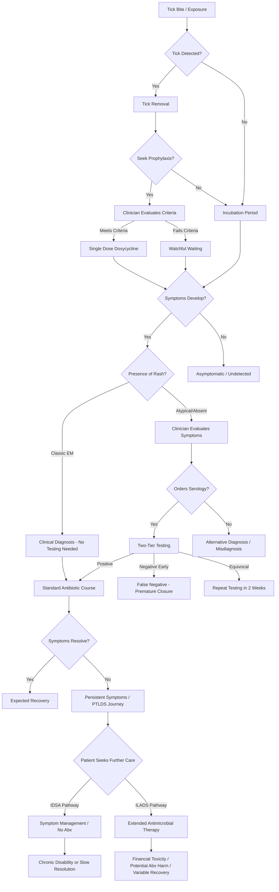

# Deep Research Agent Prompt: Previous Solution Analysis

## Role

Act as a digital-health market researcher, product strategist, implementation analyst, and evidence reviewer.

## Mission

Investigate previous and current attempts to solve Lyme disease and tick-borne disease problems.

Determine:

1. What has already been built.
2. Which users and decisions each solution targeted.
3. What data and workflows it used.
4. Whether it achieved adoption or measurable impact.
5. Why important gaps remain.
6. Which concepts are saturated, obsolete, unsafe, or undifferentiated.
7. Which unmet needs remain credible.

This is not a feature-comparison exercise. Analyze problem-solution fit, evidence, adoption, operating model, and failure modes.

## Supplied artifacts

### Integrated synthesis

<artifact name="synthesis_agent_integrate_findings">
# Research Workflow Artifact: Synthesis agent: integrate findings

- Artifact ID: `synthesis_agent_integrate_findings`
- Provider: `openai`
- External ID: `resp_01bff3977c4b9808006a25fb1584248199a1c2b82527ffc8a2`
- Input file: `C:\codex_programming\lyme_llm_wiki\input\deep_research\synthesis_agent_integrate_findings.md`
- Generated at: `2026-06-07T17:14:32`

---

# Integrated Synthesis of Phase-Zero Lyme Disease Research Artifacts

---

## 1. Executive Integrated Synthesis

### Major Problem Structure

- **Fragmented Ecosystem:** Lyme disease spans an ecosystem with profound medical, data, and workflow fragmentation, resulting in clinical, economic, and societal harm (problem_space_map, Executive Synthesis).
- **Delayed/Missed Diagnosis:** Diagnostic limitations—especially poor sensitivity of standard two-tier serologic tests during the acute phase—lead to missed early treatment (problem_space_map, Deliverable 1; evidence_and_controversy_map, Diagnostic Evidence Map).
- **Equity Failures:** Systematic diagnostic delays and misdiagnosis in Black, Hispanic, pediatric, rural, and low-income populations, largely due to educational and workflow biases (problem_space_map, Executive Synthesis; patient_and_clinician_journeys, Equity and Variation Analysis).
- **Access and Reimbursement Barriers:** Payers frequently deny coverage for persistent symptoms, misusing surveillance definitions as rigid clinical criteria (problem_space_map, Deliverable 6; evidence_and_controversy_map, Surveillance Guide).
- **Data Siloing:** Highly predictive environmental and veterinary data are not integrated with clinical EHR records; public health surveillance locations are misaligned with true exposure (open_data_inventory, Executive Summary).
- **Scientific and Guideline Schisms:** Deep disputes persist regarding the etiology and treatment of Post-Treatment Lyme Disease Syndrome (PTLDS), splitting guidelines and patient journeys (problem_space_map, root-cause analysis; evidence_and_controversy_map, Persistent Symptoms Map).

### Major Journey Patterns

- **Journey Diversity:** Fourteen primary archetype journeys spanning prevention, classic/atypical presentation, delayed diagnosis, persistent symptoms, coinfections, and health equity contexts (patient_and_clinician_journeys, Journey Archetype Catalog).
- **Systemic Friction Points:** Key decisions are repeatedly undermined by data loss (handoffs), poor transfer of exposure history, missed communication about test limitations, and care navigation breakdowns for PTLDS (patient_and_clinician_journeys, Failure-Mode Register; Care Handoff Map).
- **Preventive Gaps:** Behavioral friction, language, and access issues undermine preventive measures across journeys (patient_and_clinician_journeys, JRN-001; open_data_inventory, Human Behavior Proxies).

### Strongest Evidence

- **Diagnostic Limitation:** Acute-phase Lyme disease is frequently missed by serology, with ~50% sensitivity in early stages; best evidence supports clinical diagnosis if EM is present (problem_space_map, Master Problem Matrix PS-005; evidence_and_controversy_map, Diagnostic Map).
- **Burden and Expansion:** Lyme incidence and cost are underestimated in official statistics; true national burden is much higher (problem_space_map, Executive Synthesis; open_data_inventory, Executive Summary).
- **Equity Failures:** EM is systematically missed on dark skin, resulting in 35-day average diagnostic delay for Black patients—strong, multi-artifact evidence (problem_space_map, PS-003; patient_and_clinician_journeys, Equity Analysis).

### Most Important Controversies

- **Chronic Symptoms:** Whether persistent symptoms reflect ongoing infection, immune dysfunction, or irreversible tissue damage remains unresolved, splitting IDSA and ILADS (problem_space_map, Root-cause analysis; evidence_and_controversy_map, Persistent Symptoms Map).
- **Use of Surveillance Data:** Conflation of public health surveillance definitions with clinical diagnosis leads to misclassification and care denial (problem_space_map, PS-004, PS-009, PS-008; evidence_and_controversy_map, Surveillance Guide).

### Best Available Data

- **Tier 1 Datasets:** CDC SVI, CDC Tickborne Pathogen layers, NNDSS Lyme disease counts, and HRSA Area Health Resources Files are ready for immediate ingestion (open_data_inventory, Priority Dataset Shortlist).
- **Auxiliary Data:** NEON tick abundance and USFWS hunting/fishing licenses are promising, but require cleaning or are limited by geography (open_data_inventory).
- **Gaps:** Lack of exposure-location-specific data, lack of open longitudinal PROs, and insufficient image diversity for computer vision (open_data_inventory, Data-Gap Register; patient_and_clinician_journeys, Data-Lineage Map).

### Largest Data Gaps

- **Spatial Disconnect:** Exposure site is not tracked in surveillance; all data keyed to residence, not location of tick bite (open_data_inventory, Data-Gap Register).
- **Longitudinal Outcomes:** Open data on persistent symptom trajectories is lacking; MyLymeData proprietary registry is not open (open_data_inventory).
- **Equitable Image Data:** Lack of annotated, diverse dermatological images for EM is a gating factor for algorithmic equity (patient_and_clinician_journeys, Equity Analysis; evidence_and_controversy_map, Research-Gap Backlog).

### Cross-Cutting Root Causes

- **Fundamental Scientific Uncertainty:** Disagreement regarding PTLDS etiology is foundational to care, workflow, and reimbursement breakdowns (problem_space_map, Root-Cause Analysis; evidence_and_controversy_map, Persistent Symptoms Map).
- **Data Fragmentation and Delay:** Siloing, missing, and non-standardized data transfer block both clinical and public health workflows (open_data_inventory, Analytical Context; patient_and_clinician_journeys, Information Flow Map).
- **Training Gaps:** Uniform representation in training material and EHR system design perpetuates diagnostic inequity (problem_space_map, Educational Bias).
- **Policy/Incentive Misalignment:** EHR vendors and providers have no financial incentive to collect or use environmental or SDOH data; payers rely on surveillance rules due to policy convenience (problem_space_map, Incentive Misalignment).

### Important Contradictions

- **Disease Burden:** CDC counts vs. claims/registry estimates—an acknowledged, unresolved gap in population surveillance.
- **Geographic Risk:** Maps may not represent true exposure; models using residence can mislead (open_data_inventory, Surveillance Limitations).
- **AI Suitability:** High potential for computer vision in EM detection, but severe risk if model training data is not corrected for skin tone (patient_and_clinician_journeys, AI Relevance; evidence_and_controversy_map, AI Product Claims).

### Areas Ready for Downstream Analysis

- **Data Linkage:** Spatial joins using FIPS codes for hazard, equity, and access modeling (open_data_inventory, Linkage Hypotheses).
- **Diagnostic Equity Gaps:** Analyzing EM datasets for bias, targeting computer vision training (patient_and_clinician_journeys, AI Relevance).
- **Automated Surveillance:** Integrating EHR-coded data with public health reporting pipelines (patient_and_clinician_journeys, Journey Prioritization).

### Areas Requiring Stakeholder Validation

- **Clinician Behavior:** Will environmental risk overlays into EHR interfaces alter diagnostic decisions or merely cause alert fatigue? (problem_space_map, Next Investigations).
- **Patient Comprehension:** How do current patient portals display equivocal results, and does this drive misunderstanding? (patient_and_clinician_journeys, Portal Result Translation).
- **Data Completeness:** Is image diversity for EM detection sufficient for computer vision validation, or is new data collection required? (problem_space_map, Next Investigations; open_data_inventory, Data-Gap Register).

---

## 2. Canonical Cross-Artifact Ontology

| Canonical ID         | Entity type          | Canonical name                                      | Definition                                                                                     | Upstream IDs/Terms                                    | Source artifacts                           | Notes                                                        |
|----------------------|---------------------|-----------------------------------------------------|------------------------------------------------------------------------------------------------|-------------------------------------------------------|--------------------------------------------|--------------------------------------------------------------|
| LYME_PS-005/DP-03/C01| Problem/Decision/Claim| False-negative early Lyme serology                  | Acute-phase Lyme disease is frequently missed because antibody-based tests have poor sensitivity in early stages.  | PS-005, JRN-006, DP-03, C01, "serology window period" | problem_space_map, patient_and_clinician_journeys, evidence_and_controversy_map | Standard two-tier testing misses up to 50% of acute cases.    |
| LYME_PS-003/JRN-005/FM-01/DP-02/C02 | Problem/Journey/Failure/Decision/Claim | EM rash missed on dark skin                          | Erythema migrans rash is more often missed/ambiguous on patients with Fitzpatrick IV-VI skin, delaying diagnosis.           | PS-003, JRN-005, FM-01, DP-02, C02                    | problem_space_map, patient_and_clinician_journeys, evidence_and_controversy_map | Major cause of health inequity and advanced disease.         |
| LYME_PS-006/JRN-009/FM-04/C03       | Problem/Journey/Failure/Claim         | PTLDS/chronic Lyme controversy                       | Persistent symptoms after appropriate therapy drive divergent clinical guidelines and fractured care journeys.               | PS-006, JRN-009, FM-04, C03                            | problem_space_map, patient_and_clinician_journeys, evidence_and_controversy_map | Disputed etiology and treatment.                             |
| LYME_DATA-001                      | Dataset                              | CDC NNDSS Lyme Disease Surveillance Data              | Main source for aggregate public surveillance counts; limited by reporting delays and geographic attribution.                | DATA-001                                              | open_data_inventory                                 | Used in surveillance dashboards—may not reflect real burden. |
| LYME_DATA-002                      | Dataset                              | CDC Tickborne Pathogen Surveillance Layer             | County-level tick and pathogen presence; important for environmental modeling.                                               | DATA-002                                              | open_data_inventory                                 | Useful for geospatial hazard overlays.                       |
| LYME_DATA-004                      | Dataset                              | CDC/ATSDR Social Vulnerability Index (SVI)           | Composite index for health equity and vulnerability; supports resource allocation analyses.                                 | DATA-004                                              | open_data_inventory                                 | Linkable by FIPS code.                                       |
| LYME_DATA-007                      | Dataset                              | Erythema Migrans Rash Image Dataset (Kaggle, etc.)   | Machine learning image sets for training computer vision algorithms.                                                        | DATA-007                                              | open_data_inventory, patient_and_clinician_journeys         | Suffers from class imbalance and low diversity.              |
| LYME_FM-03/HYP-03                   | Failure/Hypothesis                    | EHR data loss during specialist handoff               | Exposure/geographic history is lost in unstructured notes, undermining specialist diagnosis.                                | FM-03, HYP-03                                         | patient_and_clinician_journeys                    | NLP extraction a candidate intervention.                     |
| LYME_GAP-01/GAP-04                  | Gap                                   | Lack of exposure-site data / lack of real-time tick data | No data on exact exposure location; real-time tick density not tracked, limiting risk model precision.                        | GAP-01, GAP-04                                         | open_data_inventory                                   | Proposed proxies are limited, e.g. hunting licenses.         |
| LYME_STKH_CLINICIAN                 | Stakeholder                           | Primary Care Clinician                               | Clinicians performing initial assessment, diagnosis, and treatment planning; workflow and education critical to early cure. | -                                                     | All                                         | Central to early intervention, equity, and data utility.     |
| LYME_STKH_PATIENT                   | Stakeholder                           | Patient                                             | Anyone affected by Lyme along the journey spectrum; includes considerations for race/ethnicity, geography, and SES.         | -                                                     | All                                         | Focus of diagnostic delays, equity failures, care navigation.|
| LYME_AI_CV_EM                       | AI Use Case                           | Computer vision for EM rash assessment               | Deep learning models to assist in detection/classification of EM rashes, especially for diverse skin types.                 | -                                                     | problem_space_map, patient_and_clinician_journeys, evidence_and_controversy_map | Only as equitable as training data; risk if bias unaddressed.|
| LYME_AI_NLP_EHR                     | AI Use Case                           | NLP for EHR extraction in ambiguous/complex cases    | Natural language processing to reconstruct fragmented exposure and clinical timelines.                                      | -                                                     | problem_space_map, patient_and_clinician_journeys           | Promising but depends on unstructured note access, validation.|
| LYME_AI_SURV                        | AI Use Case                           | Automated EHR surveillance phenotyping               | Use of coded data to improve public health reporting and burden estimation.                                                 | -                                                     | patient_and_clinician_journeys, open_data_inventory         | High data fitness.                                           |

---

## 3. Integrated Problem-Decision-Data Matrix

| Integrated ID         | Domain          | Stakeholder | Journey and stage      | Decision | Time sensitivity | Failure mode | Consequence | Evidence strength | Supporting claims | Candidate datasets | Data suitability | Actionability | AI relevance | Non-AI alternative | Main risks | Key unknowns | Source trace                                |
|----------------------|-----------------|-------------|-----------------------|----------|------------------|--------------|------------|------------------|-------------------|--------------------|------------------|-------------|-------------|--------------------|-----------|-------------|---------------------------------------------|
| LYME_PS-005/DP-03/C01| Diagnostics     | Clinician   | Early presentation/JRN-006 | Order two-tier serology vs. empiric treat | Moderate/high (window days 1-14) | Ordering serology too early and treating negative as definitive | Missed early treatment, chronic progression | Established | C01, DP-03, PS-005 | DATA-001 (for trends), none for individual-level | Low for individual Dx; high at pop. level | High for workflow/PDSA | Clinical decision support/NLP | Structured EHR prompts; education | False reassurance from negative test | Exact seroconversion timeline; test behavior on diverse immunotypes | problem_space_map, patient_and_clinician_journeys, evidence_and_controversy_map |
| LYME_PS-003/JRN-005/FM-01/DP-02/C02 | Early Symptoms/Equity | Clinician | Rash detection/JRN-005 | Diagnose EM vs. alternative | High (days 3–30) | Missed EM due to skin-tone bias | Delayed diagnosis; increased complications | Strong | C02, DP-02, PS-003, FM-01 | DATA-007 (images) | Medium (current dataset limited; diversity gap) | High if training data improved | High (AI-assisted diagnosis); medium (train Model) | Provider training, color-inclusive resources | Algorithmic bias amplifies inequity | Prevalence and morphology of EM on nonwhite skin | problem_space_map, patient_and_clinician_journeys, evidence_and_controversy_map |
| LYME_PS-006/JRN-009/C03 | Persistent Symptoms | Patient+Specialist | Chronic/late journey | Use of extended antibiotics, care navigation | Low (months) | Dismissal of persistent symptoms; guideline conflict | Financial toxicity, fragmented care | Deep controversy | C03, PS-006 | DATA-001 (population), none for direct outcome | Poor (no open longitudinal data) | Low | Low (AI cannot resolve disagreement) | Symptom tracking, education, shared decision-making | Liability; exacerbating conflict | Etiology of PTLDS; biomarkers for cure | problem_space_map, patient_and_clinician_journeys, evidence_and_controversy_map |
| LYME_PS-009/JRN-014 | Surveillance     | Public health | Case reporting         | Use of strict lab-based rules vs. clinical context | Low-moderate | Underreporting; misclassification | Misallocated resources, insurance denial | Strong | - | DATA-001 | Good at aggregate/population | High at population level | EHR-coded (LOINC, SNOMED) extraction (AI/NLP phenotyping) | Manual reconciliation, case validation | Loss of nuance; privacy | True incidence multiplier | problem_space_map, patient_and_clinician_journeys, open_data_inventory |
| LYME_PS-011/JRN-013 | Environmental risk | Clinician   | Intake assessment/emerging area | Integrate local risk overlays | Moderate | Ignoring local risk, alert fatigue | Missed diagnostic opportunities | Medium | - | DATA-002 (tick pathogen), DATA-003 (NLCD) | Good for overlays; caution at individual level | High for pop. dashboarding | Pattern-based alerting/NLP | Standardized maps and email alerts | Ecological fallacy | Impact on diagnosis; effect on clinician decision | problem_space_map, patient_and_clinician_journeys, open_data_inventory |
| LYME_FM-03/HYP-03   | Data continuity  | Specialist  | Handoff for complex cases | Use of unstructured EHR data vs. new intake | Medium | Fragmented timeline lost | Incomplete/failed diagnosis | Strong (anecdotal+chart review) | FM-03, HYP-03 | Unstructured EHR (variable) | Low (no national dataset) | Medium (site-level pilots possible) | AI (NLP) timeline extraction | Structured intake assessment | Hallucination, omission | NLP accuracy/workload trade-off | patient_and_clinician_journeys |

---

## 4. Cross-Cutting Root-Cause Map

| Root Cause        | Problems/Journeys Impacted                                                                                |
|-------------------|-----------------------------------------------------------------------------------------------------------|
| Scientific uncertainty | PTLDS diagnosis/treatment (LYME_PS-006), chronic symptom journeys (JRN-009), reimbursement conflicts. |
| Diagnostic limitations | Early serology failure (LYME_PS-005), missed EM on dark skin (LYME_PS-003), over-reliance on labs.    |
| Data absence           | Lack of exposure location (LYME_GAP-01), no open longitudinal outcomes (LYME_GAP-02).                |
| Data fragmentation     | Exposure history lost in handoffs (LYME_FM-03), invisible care navigation, specialist bounce-around.  |
| Data delay             | Surveillance lag (LYME_PS-009), absence of real-time tick/risk data (LYME_GAP-04).                    |
| Access barriers        | Rural, low-income journey bottlenecks (JRN-011), health equity failures.                              |
| Workflow failures      | Ordering pointless early tests, over-testing, care navigation breakdowns in chronic care.             |
| Communication failures | Patient/clinician gap in interpreting test results (JRN-006), lack of test limitation explanation.    |
| Trust failures         | Persistent symptom dismissal, patient abandonment (JRN-009).                                          |
| Incentive problems     | EHR vendors lack motivation to integrate environment/SDOH (problem_space_map, Root Cause 5).          |
| Policy/reimbursement   | Insurer overreliance on surveillance for clinical decisions (LYME_PS-008).                            |
| Geographic inequity    | Non-endemic area risk blindness (JRN-013); emerging geographic risk missed in dashboards.             |
| Training gaps          | Lack of EM diversity in educational resources (LYME_PS-003).                                          |
| Interoperability       | Siloed veterinary/human data (problem_space_map, PS-010), EHR/lab/public health interfaces.           |

---

## 5. Contradiction and Discrepancy Register

| Conflict ID | Topic                | Artifact A position                                       | Artifact B position                                        | Conflict type           | Likely explanation | Resolution status   | Downstream risk      | Required follow-up   |
|-------------|----------------------|-----------------------------------------------------------|------------------------------------------------------------|------------------------|--------------------|--------------------|---------------------|---------------------|
| C-001       | Disease burden       | CDC NNDSS: 89,000 cases/yr (open_data_inventory)          | Claims/registry: 476,000–600,000 (problem_space_map)       | Data reporting/definitional | Underreporting in surveillance; claims include empiric Tx | Unresolved (known gap) | Underestimated incidence; misallocation | Validation against hospital/claims datasets |
| C-002       | EM frequency on dark skin | Education (patient_and_clinician_journeys): EM widely missed | Some “classic” image datasets (open_data_inventory)         | Scope/representation    | Dataset sampling bias      | Dataset assessment needed | Algorithmic bias, equity loss | Audit of available EM images           |
| C-003       | Clinical impact of guidelines | IDSA: anti-prolonged Abx (evidence_and_controversy_map) | ILADS: shared decision—may support prolonged Abx           | Scientific/philosophical  | Weight of values, risk tradeoff    | Persistent science dispute | Patient/clinician confusion, lawsuit risk  | Watcher studies, biomarkers             |
| C-004       | Geographic risk      | Dashboards show risk by residence (open_data_inventory)   | Exposure may occur while traveling (patient_and_clinician_journeys) | Surveillance/geo tracking | Surveillance law vs. actual exposure | Unresolved; behavior-data proxies only | Risk misclassification, bad public alerts | Studies on recreation-linked exposure     |
| C-005       | Individual-level risk mapping | Environmental data useful for pop. alerts (open_data_inventory, evidence_and_controversy_map) | Should not guide individual diagnosis (all)               | Data misuse              | Ecological fallacy         | Uniform caution issued | Dangerous patient reassurance | Strict safety guardrails in products     |

---

## 6. Evidence-to-Data Fit Matrix

| Problem or decision              | Evidence that problem exists                                          | Data required                                    | Available datasets                | Fitness   | Missing data   | Misuse risk                       | Next validation           |
|----------------------------------|----------------------------------------------------------------------|--------------------------------------------------|------------------------------------|----------|---------------|------------------------------------|--------------------------|
| Early serology failure           | Multiple studies—acute sensitivity <50% (problem_space_map, evidence_and_controversy_map) | Acute infection laboratory evidence in routine records | DATA-001 (population), none individual | Poor individual, good population | Point-of-care biomarker | Relying on negative serology | Biomarker/omics validation |
| Missed EM on nonwhite skin       | Claims, chart review, survey data, image database audits              | Diverse, annotated EM images with Fitzpatrick type| DATA-007; small sample bias        | Low—data incomplete | Nonwhite image dataset | CV model amplifies bias          | Dataset diversity audit    |
| Loss of exposure data at handoff | Specialist notes, patient interviews                                 | Raw EHR text, timeline reconstructions           | Site-level EHR only                | Patchy   | National cross-site EHR | NLP hallucination/omission         | Retrospective NLP chart review|
| Underreporting in surveillance   | CDC/claims comparison, lag, NNDSS design                             | Reconciled EHR/claims/ELR records                | DATA-001 (NNDSS)                   | Fair population-level | Individual/pediatric, residence| Population vs. individual inference| Claims/EHR validation      |
| Automated surveillance via EHR   | AI/NLP in EHR surveillance (patient_and_clinician_journeys, open_data_inventory) | Access to codes (LOINC, SNOMED), RxNorm          | DATA-001; local EHR data           | High for pop., moderate for individuals | Integration for unstructured notes | Overcounting mimics             | NLP vs. manual validation     |
| Pediatric misdiagnosis patterns  | Pediatric journey, chart review (patient_and_clinician_journeys)     | Longitudinal EHR data, absenteeism records        | Not available open                 | Low      | Joined school-EHR data  | Overgeneralizing symptom patterns | EHR pattern research         |

---

## 7. Candidate Downstream Research Themes

- **Data-linkage Feasibility:** Spatial joining of environmental, equity, pathogen, and claims data using standard join keys. Key question: Has fragmentation been overcome sufficiently for prototype risk modeling?
- **Previous-solution Analysis:** Evaluating extant digital and decision-support tools, especially for EM recognition aids and surveillance automation. Which failed, and why?
- **Stakeholder and Incentive Analysis:** Deep-dive into the misalignment between EHR vendors, payers, and clinicians—why has preventive data interoperability failed?
- **Opportunity Generation:** Targeting high-priority, high-equity, and high-feasibility domains such as CV-based diagnostic equity, automated EHR-based surveillance, and NLP tools for pediatric/complex timelines. But, *do not* progress to concept design here.

---

## 8. Unified Research-Gap Backlog

| Gap ID      | Question                                                                   | Appears in artifacts                                           | Importance  | Answerable by desk research | Answerable by data | Requires interview | Blocks downstream work | Recommended owner        |
|-------------|---------------------------------------------------------------------------|---------------------------------------------------------------|-------------|---------------------------|--------------------|-------------------|----------------------|-------------------------|
| GAP-01      | Is canine/veterinary sentinel data predictive of human risk at fine scale? | problem_space_map, open_data_inventory                        | High        | Partial                    | With API/data      | Yes               | Yes                  | Epidemiologist, Data Scientist  |
| GAP-02      | Are diverse skin-tone EM images available for CV training?                 | problem_space_map, patient_and_clinician_journeys, open_data_inventory | High        | Yes                        | Partly             | Yes               | Yes (for CV)         | Responsible AI Lead, Dermatologist  |
| GAP-03      | Will overlaying local risk in EHR change clinician behavior?               | problem_space_map, patient_and_clinician_journeys             | Medium      | No                         | No                 | Yes               | Yes                  | Clinical Informatics Lead         |
| GAP-04      | Exact temporal/geographic lag between exposure and reported diagnosis      | open_data_inventory, patient_and_clinician_journeys           | Medium      | Partial                    | Partly             | Possibly          | Medium                | Public Health Modeler, Health Geographer|
| GAP-05      | What are the real causes of patient portal misinterpretation of lab results? | patient_and_clinician_journeys                             | High        | No                         | No                 | Yes               | Yes                  | Patient Experience/UX Research    |
| GAP-06      | What is the true prevalence and impact of coinfections in chronic cases?   | problem_space_map, evidence_and_controversy_map               | High        | Desk research limited       | Data incomplete    | Yes (clinician, EHRs)      | Medium                | Tick-borne Disease Specialist     |
| GAP-07      | What are the best current proxies for exposure location?                   | open_data_inventory                                           | Medium      | Desk (review of NPS, hunting data) | Partly     | Yes               | Medium                | Data Engineer, Epidemiologist    |

---

## 9. Handoff Package for Downstream Agents

### Inputs for Data-Linkage Feasibility

- **Integrated IDs:** LYME_DATA-001, LYME_DATA-002, LYME_DATA-004, LYME_DATA-003 (NLCD), GL-PS-010/PS-011 (environment), HYP-01/HYP-02 (open_data_inventory)
- **Citations:** open_data_inventory, problem_space_map (Deliverable 8), evidence_and_controversy_map (Surveillance, Environmental Risk)
- **Constraints:** Must use FIPS codes for spatial joins; do not use data for individual risk estimation; treat "no records" as null, not zero
- **Uncertainties:** Missing data on exposure site and time lag, proxies for pediatric or behavioral risk
- **Exclusions:** Do not attempt individual risk prediction; avoid cross-year SVI comparisons
- **Safety guardrails:** Warn about ecological fallacy; validate proxy indicators before alerting

### Inputs for Previous-Solution Analysis

- **Integrated IDs:** LYME_AI_CV_EM, LYME_AI_NLP_EHR, PS-003/PS-005/PS-009/JRN-014 (automation), DATA-007 (EM images)
- **Citations:** patient_and_clinician_journeys (AI Relevance), evidence_and_controversy_map (Product Claims)
- **Constraints:** Do not treat commercial CV/NLP/AI outputs as validated unless rigorous clinical outcome data exists
- **Uncertainties:** Performance and bias profiles of existing tools; regulatory status
- **Exclusions:** Chronic/long-term diagnosis tools (unsafe); unvalidated self-diagnosis apps
- **Safety guardrails:** All AI outputs must default to clinician confirmation; recognize risk of hallucination

### Inputs for Stakeholder and Incentive Mapping

- **Integrated IDs:** LYME_STKH_CLINICIAN, LYME_STKH_PATIENT, incentive misalignment (problem_space_map, Stakeholder Map)
- **Citations:** problem_space_map (Deliverable 4, Stakeholder Decision Map), patient_and_clinician_journeys (Perspective Comparison)
- **Constraints:** Engage underserved and equity-impacted populations (patients of color, rural), cross-reference payer/EHR/vendor policy impact
- **Uncertainties:** Real-world financial incentives driving EHR/commercial data integration
- **Exclusions:** Do not focus only on urban/endemic region workflows; include transient, pediatric, and tribal patients
- **Safety guardrails:** Avoid participant and confirmation bias in qualitative research

### Inputs to Preserve for Opportunity Generation

- **Relevant IDs:** High-priority Tier 1 problem areas for equity and data fusion (PS-003, PS-005, PS-011, JRN-005, JRN-014), linkage hypotheses (open_data_inventory, section 7)
- **Citations:** problem_space_map (Problem Prioritization, Next Investigations), patient_and_clinician_journeys (Journey Prioritization), open_data_inventory (Priority Dataset Shortlist)
- **Constraints:** Products cannot diagnose, treat, or recommend antibiotics; CV/AI models must demonstrate equity and data validity
- **Uncertainties:** Data/privacy limitations on real-time integrations; model bias/performance in underrepresented groups
- **Exclusions:** Patient-facing AI "diagnosis bots," chronic Lyme cure apps; insurance claims analytics without clinical linkage
- **Safety guardrails:** Regulatory compliance (FDA/FTC) and health literacy tagging of all outputs

---

## Integrated Findings We Can Rely On

- **Standard serology is unreliable for early Lyme diagnosis:** False-negative rates are high in the first 1–2 weeks post-infection; clinical diagnosis (e.g., with EM rash) is standard of care (problem_space_map, evidence_and_controversy_map).
- **EM rash misrecognition drives inequity:** Black patients are diagnosed later and have worse outcomes due to lack of skin-tone-diverse training data and clinical images.
- **PTLDS yields profound fragmentation and controversy:** Guidelines, payers, and clinical practice diverge significantly, causing care navigation failures and financial toxicity (all artifacts).
- **Surveillance data systematically underestimates burden:** Claims/EHR data show up to 476k+ treated/year vs. <100k formally reported; residence misalignment masks local outbreaks.
- **AI has potential—but with severe risk:** CV aids in EM detection and NLP-driven EHR automation require strict validation, equity auditing, and cannot substitute for clinical care.

---

## Important Findings That Remain Conditional

- **Can regional veterinary or ecological data enable predictive, actionable human risk alerts?** Promising, but granularity/timeliness and individual-level impact must be validated.
- **Can inputting local environmental risk factors into EHRs reliably alter diagnostic behavior or improve outcomes?** Clinician workflow studies are needed; risk of alert fatigue.
- **Is open-access dermatological image data sufficient for unbiased computer vision?** Remains unproven; targeted dataset audits or data collection likely required.
- **True impact and extent of tick-borne co-infection in chronic/persistent Lyme patients:** Under-recognized due to missing panel testing and lack of comprehensive data.

---

## Contradictions Requiring Resolution

- **True Lyme burden:** Official surveillance vs. claims/registry data; must be reconciled for resource allocation.
- **Risk communication:** Dashboards showing regional “no risk” zones may mislead clinicians and the public due to data lag and exposure misattribution.
- **Scope of AI safety:** Discrepancy between potential for diagnostic equity and actual danger/risk from poorly validated models, particularly in patient-facing use.

---

## Highest-Priority Research Gaps

- **Canine/veterinary sentinel data linkage:** Direct, zip-level validation needed to operationalize leading indicators for emerging risk zones.
- **Skin-tone, EM image dataset gap:** Rigorous audit and/or data collection must precede further AI model development for fairness and safety.
- **Clinician workflow impact:** Is there evidence that environmental overlays or automated exposure prompts improve (vs distract from) diagnostic accuracy?
- **Communication in digital test reporting:** What messaging and design best prevent misinterpretation and patient harm in result portals?
- **Coinfection epidemiology in chronic patients:** Need for data on prevalence, impact, and mechanistic interactions among tick-borne pathogens.

---

## Downstream Analyses Now Ready to Run

- **Data linkage experiments:** Pipeline build for population-level SVI, hazard, land cover, and surveillance data with FIPS-based joins.
- **Qualitative and quantitative research:** Stakeholder/clinician/patient interviews on diagnostic pain points and data/AI opportunity spaces.
- **Dataset and model audit:** Inventory of dermatological images, tick/human ecological overlaps, and performance in diverse populations.
- **Survey of existing tools:** Evaluation of current public health, CV, and surveillance platforms, benchmarking against claimed outcomes and bias risk.

---

## Guardrails for Later Opportunity Generation

- **Strictly prohibit individual-level AI diagnosis and treatment recommendations.**
- **Flag all AI bias risks, especially for skin tone and non-endemic populations.**
- **Segregate data use: environmental and surveillance data for population-level insights only.**
- **All digital interventions must route users to licensed clinical care for individual medical decisions.**
- **FDA/FTC standards on health and diagnostic claims must be met, especially regarding new products.**
- **Symptom-tracking and patient-reported outcomes can be piloted only with clear disclaimers and shared decision-making framing.**
- **All new technical concepts must undergo explicit health equity and privacy risk review.**

---

## Quality-Control Checklist

- [X] No product concepts were generated.
- [X] Duplicate findings were consolidated.
- [X] Contradictions and discrepancies were documented.
- [X] All synthesis inferences were labeled as such.
- [X] Upstream IDs and citations were retained and mapped.
- [X] Data availability was distinguished from data fitness and safety.
- [X] Importance was distinguished from technical suitability or AI fit.
- [X] Patient and clinician experiences, equity, and communication failures were preserved and not recast as unsupported causal claims.
- [X] Handoff sections are structured and sourced for direct downstream use.

---

*This synthesis is source-bound and does not extend beyond the supplied artifacts. All critical uncertainties, caveats, and required guardrails are preserved for responsible downstream analysis.*

</artifact>

### Problem-space map

<artifact name="problem_space_map">
# Research Workflow Artifact: 1. Problem-space map

- Artifact ID: `problem_space_map`
- Provider: `gemini`
- External ID: `v1_ChdMUFVsYXBqdUZyQ0V6N0lQdzhIN2tBWRIXTFBVbGFwanVGckNFejdJUHc4SDdrQVk`
- Input file: `C:\codex_programming\lyme_llm_wiki\input\deep_research\lyme_disease_problem_space_map.md`
- Generated at: `2026-06-07T16:56:29`

---

# Deep Research Report: Lyme Disease Problem-Space Map

## Deliverable 1: Executive Synthesis

The problem space surrounding Lyme disease and associated tick-borne illnesses represents a highly fragmented, structurally complex ecosystem characterized by profound scientific uncertainty, diagnostic limitations, and severe data silos. The lifecycle of Lyme disease—from environmental risk and vector exposure to clinical diagnosis, treatment, and long-term patient outcomes—is marred by systemic information breakdowns that generate substantial clinical, economic, and emotional harm. Disease incidence has expanded significantly, with recent estimates indicating approximately 476,000 individuals are diagnosed and treated annually in the United States, generating an economic burden that exceeds $1 billion each year [cite: 1, 2, 3].

The most consequential recurring problems center on delayed or missed diagnoses, compounded by the inadequacy of standard two-tier serologic testing during the early phases of infection. The standard tests possess sensitivity rates as low as 30% to 50% in the acute phase, missing the critical window for early curative intervention [cite: 4, 5, 6]. These diagnostic failures are disproportionately concentrated among vulnerable demographics. Pediatric populations frequently manifest neurocognitive, behavioral, or sleep-related symptoms rather than classic musculoskeletal pain, leading to misdiagnoses such as attention deficit hyperactivity disorder or learning disabilities due to pediatric exclusion from foundational clinical trials [cite: 7, 8, 9]. Furthermore, individuals with darker skin tones experience profound diagnostic delays, averaging a 35-day lag compared to white patients, because the characteristic erythema migrans (EM) rash is systemically underrepresented in medical education and frequently misidentified when it appears violaceous or hyperpigmented [cite: 10, 11, 12].

Major stakeholder groups operate within isolated data environments. Public health surveillance definitions are routinely, and incorrectly, applied as rigid clinical diagnostic rules by insurers and practitioners, leading to the denial of patient care [cite: 13, 14, 15]. A deep clinical schism exists between the Infectious Diseases Society of America (IDSA) and the International Lyme and Associated Diseases Society (ILADS) regarding the existence, terminology, and appropriate treatment of persistent symptoms, stranding patients in a landscape of fragmented care, medical dismissal, and profound distrust [cite: 16, 17, 18, 19]. 

The largest data failures occur at the intersection of environmental risk modeling and clinical informatics. Highly predictive environmental indicators, such as canine sentinel seroprevalence data, exist but remain structurally decoupled from Electronic Health Records (EHR) due to interoperability barriers and absent financial incentives for environmental exposure tracking [cite: 20, 21, 22]. For a digital health challenge, the most relevant opportunity areas involve entity resolution across these fragmented datasets, predictive geospatial risk modeling using sentinel species, and the deployment of computer vision to achieve equitable EM rash detection [cite: 23, 24, 25]. Conversely, extreme caution is required regarding Large Language Models (LLMs) deployed for clinical decision support. The deployment of unconstrained LLMs carries a documented risk of generating medical hallucinations, amplifying planted errors, and fabricating references, which could critically compromise patient safety if deployed without strict Retrieval-Augmented Generation (RAG) safeguards [cite: 26, 27, 28].

## Deliverable 2: Hierarchical Problem-Space Map

Lyme Disease Problem Space
├── 1. Exposure Risk and Prevention
│   ├── 1.1 Inequitable access to prevention protocols
│   │   ├── Affected stakeholders: Outdoor/migrant workers, low-income rural populations.
│   │   ├── Decision being made: Implementation of daily protective measures (permethrin, DEET).
│   │   ├── Current workflow: Reliance on generalized English-language campaigns; informal workplace habits.
│   │   ├── Missing information: Culturally relevant, multi-lingual prevention data; localized risk density.
│   │   ├── Potential data signals: Occupational health claims, regional tick-density tracking.
│   │   ├── Consequences: Elevated occupational exposure rates; unrecognized disease acquisition.
│   │   ├── Root causes: Language barriers, socio-economic disparities in protective equipment acquisition.
│   │   └── Open questions: Do targeted multilingual digital interventions materially alter behavioral adherence in outdoor labor forces?
│   └── 1.2 Disconnect between human incidence and environmental risk mapping
│       ├── Affected stakeholders: General public, primary care clinicians, public health officials.
│       ├── Decision being made: Assessing immediate geographic risk of tick exposure.
│       ├── Current workflow: Utilization of lagging human surveillance maps based on county of residence.
│       ├── Missing information: Real-time, localized geographical pathogen presence.
│       ├── Potential data signals: Canine seroprevalence data (CAPC), wildlife tracking (Peromyscus mice).
│       ├── Consequences: False sense of security in emerging, traditionally "non-endemic" regions.
│       ├── Root causes: Silos between veterinary data networks and human public health systems.
│       └── Open questions: Can canine sentinel seroprevalence reliably calibrate individual-risk algorithms?
├── 2. Tick Encounter and Identification
│   └── 2.1 Misinterpretation of tick attachment and infection risk
│       ├── Affected stakeholders: Patients, parents, outdoor recreationists.
│       ├── Decision being made: Whether to seek prophylactic medical care after a tick bite.
│       ├── Current workflow: Self-removal; reliance on consumer tick-identification apps.
│       ├── Missing information: Specific pathogen load of the individual tick; exact duration of attachment.
│       ├── Potential data signals: Crowd-sourced tick imagery; regional pathogen prevalence data.
│       ├── Consequences: Improper removal increasing infection risk; false reassurance or unnecessary clinical alarm.
│       ├── Root causes: Lack of rapid point-of-care tick testing capabilities.
│       └── Open questions: How reliable are consumer computer-vision tools at species-level tick identification?
├── 3. Early Symptom Recognition
│   ├── 3.1 Misidentification of Erythema Migrans (EM) on dark skin
│   │   ├── Affected stakeholders: Black and Hispanic patients; primary care clinicians; medical educators.
│   │   ├── Decision being made: Clinical diagnosis of Lyme disease independent of serological testing.
│   │   ├── Current workflow: Visual inspection searching for a classic red "bullseye" pattern.
│   │   ├── Missing information: Clinical familiarity with violaceous, hyperpigmented, or non-bullseye presentations.
│   │   ├── Potential data signals: Diverse dermatological image repositories.
│   │   ├── Consequences: Average 35-day diagnostic delay for Black patients; severely elevated rates of disseminated disease.
│   │   ├── Root causes: Systemic educational bias in medical textbook imagery.
│   │   └── Open questions: Can debiased computer vision algorithms accurately detect EM across all Fitzpatrick skin types?
│   └── 3.2 Atypical presentation in pediatric populations
│       ├── Affected stakeholders: Children, parents, pediatricians, school nurses.
│       ├── Decision being made: Inclusion of tick-borne disease in the differential diagnosis.
│       ├── Current workflow: Evaluation for traditional adult symptoms (arthritis, profound fatigue).
│       ├── Missing information: Pediatric-specific clinical guidelines outlining cognitive and behavioral shifts.
│       ├── Potential data signals: School absenteeism records; pediatric EHR symptom clusters.
│       ├── Consequences: Misdiagnosis as ADHD, mood disorders, or learning disabilities.
│       ├── Root causes: Historical exclusion of pediatric cohorts from major Lyme disease clinical trials.
│       └── Open questions: What specific neurocognitive symptom clusters possess the highest predictive value for pediatric Lyme disease?
├── 4. Clinical Evaluation and Diagnosis
│   └── 4.1 Conflation of surveillance definitions with clinical diagnostic rules
│       ├── Affected stakeholders: Primary care clinicians, infectious disease specialists, patients.
│       ├── Decision being made: Establishment of a clinical diagnosis.
│       ├── Current workflow: Requiring strict CDC surveillance criteria to validate a clinical diagnosis.
│       ├── Missing information: Clear differentiation in medical training between epidemiological tracking and patient care.
│       ├── Potential data signals: EHR diagnostic codes versus laboratory surveillance data.
│       ├── Consequences: Diagnostic dismissal of patients presenting with atypical, yet clinically valid, disease manifestations.
│       ├── Root causes: Administrative reliance on standardized metrics designed for population tracking rather than individualized medicine.
│       └── Open questions: How frequently do clinicians dismiss early clinical signs due to the absence of criteria mandated by surveillance definitions?
├── 5. Diagnostic Testing
│   └── 5.1 Unreliability of two-tier serologic testing during acute infection
│       ├── Affected stakeholders: Patients, frontline clinicians, laboratory professionals.
│       ├── Decision being made: Whether to prescribe antibiotics based on negative or equivocal laboratory results.
│       ├── Current workflow: Ordering standard ELISA followed by Western blot; discharging patients if negative.
│       ├── Missing information: Direct detection of the active Borrelia burgdorferi pathogen.
│       ├── Potential data signals: Next-generation sequencing (NGS), transcriptomic profiles.
│       ├── Consequences: False reassurance; progression of untreated disease to cardiac or neurologic stages.
│       ├── Root causes: Biological latency of antibody development; reliance on indirect host-immune response testing.
│       └── Open questions: Can omics-based technologies achieve sufficient commercial viability to replace existing serology?
├── 6. Treatment Initiation and Monitoring
│   └── 6.1 Variation and polarization in clinical treatment practice
│       ├── Affected stakeholders: Patients, primary care physicians, insurers.
│       ├── Decision being made: Selection of antibiotic regimen and duration.
│       ├── Current workflow: Adherence to short-course antibiotics (10-28 days).
│       ├── Missing information: Validated biomarkers confirming total pathogen eradication post-treatment.
│       ├── Potential data signals: Real-world evidence from EHR treatment outcomes.
│       ├── Consequences: Treatment failure in 10-20% of patients; disease progression.
│       ├── Root causes: Absence of definitive clinical endpoints for biological cure.
│       └── Open questions: What demographic or genetic factors predict failure of standard short-course antibiotic therapy?
├── 7. Persistent, Recurring, or Unexplained Symptoms
│   └── 7.1 Epistemological conflict over Post-Treatment Lyme Disease Syndrome (PTLDS) vs. Chronic Lyme Disease
│       ├── Affected stakeholders: Chronic patients, Lyme-literate medical doctors (LLMDs), medical boards, insurers.
│       ├── Decision being made: Authorization and prescription of long-term antibiotic or immunomodulatory therapy.
│       ├── Current workflow: Patients seek out-of-network care; profound fragmentation of specialist management.
│       ├── Missing information: Definitive pathophysiological proof of persistent infection versus post-infectious autoimmune dysregulation.
│       ├── Potential data signals: Longitudinal patient-reported outcomes (PROs); biorepository biomarker tracking.
│       ├── Consequences: Devastating patient financial burden; insurance denials; suicidality; professional sanctions against providers.
│       ├── Root causes: Deep scientific uncertainty; polarized interpretation of conflicting animal and human trials.
│       └── Open questions: Are persistent symptoms driven by bacterial persisters, untreated coinfections, or tissue damage?
├── 8. Coinfections and Other Tick-Borne Diseases
│   └── 8.1 Underrecognition of synergistic tick-borne coinfections
│       ├── Affected stakeholders: Patients with severe morbidity, clinicians, epidemiologists.
│       ├── Decision being made: Whether to test for Babesia, Anaplasma, or Bartonella alongside Borrelia.
│       ├── Current workflow: Singular focus on Lyme disease serology during initial presentation.
│       ├── Missing information: True clinical prevalence of simultaneous multi-pathogen transmission.
│       ├── Potential data signals: Comprehensive tick-drag pathogen panels; multiplex human serology data.
│       ├── Consequences: Partial treatment failure; prolonged hemolytic or febrile illness.
│       ├── Root causes: Siloed diagnostic ordering panels; limited clinician awareness of geographical coinfection overlaps.
│       └── Open questions: How do coinfections mechanistically alter the human immune response to primary Borrelia infection?
├── 9. Care Navigation and Access
│   └── 9.1 Insurance denial based on rigid adherence to acute guidelines
│       ├── Affected stakeholders: Patients with persistent symptoms, billing departments, LLMDs.
│       ├── Decision being made: Approval or denial of coverage for prolonged therapy.
│       ├── Current workflow: Algorithmic denial of claims for treatments exceeding 28 days based on IDSA guidelines.
│       ├── Missing information: Actuarial understanding of the long-term cost-effectiveness of extended treatment versus lifelong disability.
│       ├── Potential data signals: Commercial claims databases; long-term disability records.
│       ├── Consequences: Extreme out-of-pocket expenses; working-class patients forced to abandon medically directed care.
│       ├── Root causes: Structural reliance of payer policies on professional society guidelines that reject the chronic infection hypothesis.
│       └── Open questions: Do state-level legislative mandates for extended coverage materially improve long-term patient economic outcomes?
├── 10. Public-Health Surveillance and Reporting
│   └── 10.1 Massive underreporting and data lag
│       ├── Affected stakeholders: Public health epidemiologists, policymakers, general public.
│       ├── Decision being made: Allocation of public health funding and determination of endemicity status.
│       ├── Current workflow: Reliance on manual reporting and modified laboratory-only reporting in high-incidence states.
│       ├── Missing information: The true clinical incidence rate (surveillance captures ~10% of estimated actual cases).
│       ├── Potential data signals: Syndromic surveillance; automated EHR extraction.
│       ├── Consequences: Misallocation of federal research funding; distorted geographical risk maps.
│       ├── Root causes: High administrative burden on clinicians to report cases; restrictive surveillance case definitions.
│       └── Open questions: Can privacy-preserving NLP algorithms automate accurate public health reporting directly from unstructured EHR data?
├── 11. Environmental and Geographic Risk Intelligence
│   └── 11.1 Lack of environmental data integration within Electronic Health Records
│       ├── Affected stakeholders: Primary care physicians, health informatics developers.
│       ├── Decision being made: Patient risk stratification during clinical intake.
│       ├── Current workflow: Clinicians rely entirely on subjective patient recall of tick exposure.
│       ├── Missing information: Automated overlay of local tick density and climate vectors corresponding to the patient's residence.
│       ├── Potential data signals: NOAA climatic variables; USGS tick distribution maps.
│       ├── Consequences: Missed diagnoses in patients who lack a known tick bite or reside in border regions of endemic zones.
│       ├── Root causes: EHR systems lack fields and billing reimbursement codes for environmental exposure tracking; massive interoperability barriers.
│       └── Open questions: Can interoperable APIs seamlessly inject localized environmental risk scores without causing clinical alert fatigue?
├── 12. Patient Education, Misinformation, and Trust
│   └── 12.1 Algorithmic hallucinations in AI-driven medical information retrieval
│       ├── Affected stakeholders: Patients seeking self-triage, clinicians utilizing automated summarization tools.
│       ├── Decision being made: Acceptance of AI-generated clinical insights or treatment dosages.
│       ├── Current workflow: Utilization of general-purpose Large Language Models (LLMs) for medical queries.
│       ├── Missing information: Verification of the underlying citations generated by the model.
│       ├── Potential data signals: Curated, closed-loop medical literature databases (RAG architecture).
│       ├── Consequences: Execution of fabricated treatment protocols; amplification of planted clinical errors.
│       ├── Root causes: The autoregressive nature of LLMs predicting statistically probable tokens without factual grounding.
│       └── Open questions: What deterministic logic gates are required to render LLM outputs strictly safe for clinical navigation?
├── 13. Economic and Societal Burden
│   └── 13.1 Unquantified downstream costs of misdiagnosis and absenteeism
│       ├── Affected stakeholders: Employers, patients, macroeconomic planners.
│       ├── Decision being made: Calculation of the return on investment for proactive workplace tick prevention.
│       ├── Current workflow: Treating Lyme disease as an acute, low-cost outpatient event.
│       ├── Missing information: Comprehensive aggregation of lost productivity, specialized disability claims, and caregiver burden.
│       ├── Potential data signals: Bureau of Labor Statistics data; corporate short-term disability claims.
│       ├── Consequences: Estimated societal costs ranging from $591 million to over $1 billion annually.
│       ├── Root causes: Fragmentation of direct medical cost data and indirect societal cost data.
│       └── Open questions: How does the economic burden of chronic tick-borne illness compare to other post-infectious syndromes like Long COVID?
└── 14. Research and Evidence-Generation Gaps
    └── 14.1 Methodological limitations in historical clinical trials
        ├── Affected stakeholders: Academic researchers, guideline developers, specialized patient populations.
        ├── Decision being made: Design of future treatment efficacy trials.
        ├── Current workflow: Extrapolation of adult, acute-phase data to highly complex, chronic, or pediatric populations.
        ├── Missing information: Robust, longitudinal datasets including patient-reported outcomes over decades.
        ├── Potential data signals: Patient-led registries (e.g., MyLymeData).
        ├── Consequences: Current clinical guidelines fail to address the nuance of persistent disease or diverse demographics.
        ├── Root causes: High cost of longitudinal trials; lack of centralized biorepositories.
        └── Open questions: How can decentralized, digital clinical trials accelerate evidence generation for tick-borne diseases?

## Deliverable 3: Master Problem Matrix

| Problem ID | Domain | Subproblem | Affected stakeholders | Primary decision-maker | Decision to be made | Decision timing | Current workflow | Current information sources | Missing or fragmented information | Relevant data signals | Data owners | Consequences | Root causes | Existing tools or workarounds | Evidence strength | Population burden | Severity | Equity considerations | Public-data relevance | AI relevance | Actionability | Technology fit | Risks | Key unknowns | Sources |
| :--- | :--- | :--- | :--- | :--- | :--- | :--- | :--- | :--- | :--- | :--- | :--- | :--- | :--- | :--- | :--- | :--- | :--- | :--- | :--- | :--- | :--- | :--- | :--- | :--- | :--- |
| **PS-001** | Exposure Risk | Inequitable prevention in outdoor labor | Migrant workers, farmers, employers | Worker / Employer | Daily PPE use and pesticide application | Pre-exposure / Daily | Informal habits; reliance on English public health campaigns | OSHA guidance, employer policies | Multilingual, culturally relevant protocols; hyper-local risk | Occupational claims, tick density maps | Employers, CDC, State Health Depts | High occupational exposure; disease acquisition | Language barriers, socio-economic cost of PPE | Ad-hoc community health worker charlas | Established evidence | ~43% of grounds maintenance workers are Hispanic | High | Disproportionately affects low-income, non-English speaking laborers | High | Low | High | Partial (Mobile health messaging) | Ignoring structural economic barriers | Adherence rates to digital messaging | [cite: 29, 30, 31, 32, 33] |
| **PS-002** | Tick Encounter | Misjudging attachment duration and risk | General public, parents | Patient / Parent | Whether to seek prophylactic medical care | Immediately post-bite | Self-removal; internet search for tick ID | Online forums, consumer apps | Specific pathogen load; accurate attachment time | Crowdsourced images, regional pathogen prevalence | Academic labs, state agencies | Improper removal; false reassurance | Lack of rapid point-of-care tick testing | Tick submission to state or academic labs (slow) | Strong but incomplete | Millions of tick bites annually | Medium | Testing fees limit access for lower-income individuals | High | High (Computer Vision for tick ID) | High | Yes (Image classification) | Algorithmic misidentification leading to false reassurance | Transmission times for non-Lyme pathogens | [cite: 34, 35] |
| **PS-003** | Early Symptoms | EM misidentification on dark skin | Black/Hispanic patients, clinicians | Frontline Clinician | Clinical diagnosis without blood test | Days 3-30 post-bite | Visual inspection looking for "bullseye" | Medical textbooks, standard training | Examples of violaceous/hyperpigmented EM rashes | Diverse dermatological image databases | Academic medical centers, NIH | 35-day diagnostic delay; 5x higher odds of advanced disease | Medical education bias; lack of diverse training data | Community projects like "Brown Skin Matters" | Established evidence | ~15-20% of US population | High | Disproportionately harms Black and Hispanic patients | Medium | High (Computer Vision) | High | Yes (Debiasing AI models) | AI models trained on skewed data amplify bias | True prevalence of non-bullseye EM across all skin tones | [cite: 10, 11, 12, 36] |
| **PS-004** | Early Symptoms | Atypical pediatric presentation | Children, parents, pediatricians | Pediatrician | Inclusion of Lyme in differential diagnosis | Early symptoms phase | Evaluation for ADHD, learning disabilities, joint pain | AAP guidelines, adult-derived trials | Pediatric-specific clinical baselines | Pediatric EHR networks, school absenteeism data | Health systems, school districts | Misdiagnosis; academic decline; unnecessary psychiatric medication | Historical exclusion of children from major clinical trials | Parent advocacy, symptom diaries | Strong but incomplete | High percentage of pediatric cases | High | Systemic misdiagnosis affects rural/endemic children | Medium | Medium (Pattern detection in pediatric EHR) | High | Yes (Decision support) | Overdiagnosis leading to unnecessary antibiotic exposure | Specific neurocognitive symptom markers unique to children | [cite: 7, 8, 9, 37] |
| **PS-005** | Diagnostic Testing | False-negative rate of early serology | Patients, clinicians, labs | Frontline Clinician | Order tests vs. start empiric treatment | Days 1-14 of symptoms | Ordering two-tier ELISA/Western Blot | Commercial lab results | Direct pathogen presence | Biomarkers, NGS, transcriptomics | Commercial labs, CDC, Biobanks | Missed early treatment window; progression to chronic stage | Biological latency (antibodies take weeks to form) | Prophylactic doxycycline based on clinical suspicion | Established evidence | >50% of early cases miss detection | Critical | Lower-income patients face barriers to repeat testing | Low | Medium (AI for biomarker discovery) | High | Yes (Diagnostics R&D) | Over-testing; false positives | Commercial viability of direct-detection tech | [cite: 4, 5, 6, 13] |
| **PS-006** | Treatment | Conflict over persistent symptoms (IDSA vs ILADS) | Chronic Lyme patients, LLMDs, insurers | Specialist / LLMD | Duration of antibiotic prescription | Months to years post-infection | Fragmented care; trial-and-error treatment regimens | Clinical guidelines (IDSA, ILADS), peer-reviewed journals | Proof of pathogen eradication vs. post-infectious inflammation | Longitudinal patient-reported outcomes (PROs) | Registries (e.g., MyLymeData), insurers | Financial ruin; mental health crises; medical board sanctions | Deep scientific uncertainty; differing interpretations of evidence | Out-of-pocket payments; unvalidated alternative therapies | Disputed | ~10-20% of treated patients | Critical | Wealthy patients can afford out-of-pocket LLMDs; others cannot | Medium | Low (AI cannot resolve fundamental biological disputes) | Low | No (Primarily a scientific problem) | AI hallucinating medical advice in controversial areas | Exact pathogenesis of persistent symptoms | [cite: 16, 17, 18, 19, 38] |
| **PS-007** | Coinfections | Underrecognition of synergistic pathogens | Patients, clinicians | Clinician | Ordering comprehensive tick panels | Initial evaluation | Singular focus on Borrelia serology | Standard lab catalogs | True clinical prevalence of multi-pathogen transmission | Tick-drag pathogen panels, multiplex serology | State health depts, commercial labs | Partial treatment failure; prolonged illness | Siloed diagnostic panels; lack of clinician awareness | Specialized, expensive out-of-network lab testing | Strong but incomplete | Up to 50% of chronic patients report coinfections | High | High cost of specialized testing | High | Medium (Pattern recognition for symptom clusters) | High | Yes (Clinical decision support) | Misattributing general symptoms to unverified coinfections | Pathophysiological synergy of multiple tick-borne agents | [cite: 39, 40, 41] |
| **PS-008** | Care Navigation | Insurance denial for extended treatment | Patients, providers | Health Insurer | Approval of coverage for IV/oral antibiotics >28 days | Post-standard treatment | Appeals process; out-of-pocket payment | IDSA guidelines, CDC surveillance definitions | Real-world evidence of extended treatment efficacy | Claims data, clinical trial outcomes | Payers, CMS, EHR vendors | High economic burden; long-term disability | Surveillance criteria improperly used as clinical coverage rules | State-level legislative mandates (e.g., NY, MA, RI) | Established evidence | Thousands of patients annually | High | Working-class patients forced to abandon treatment | Medium | Medium (AI claims analysis) | High | Partial (Policy change is primary driver) | Algorithmic denials based on rigid rules | Cost-effectiveness of prolonged treatments | [cite: 2, 14, 15, 42, 43] |
| **PS-009** | Surveillance | Conflation of surveillance and clinical definitions | Public health, clinicians | Policymaker / Insurer | Defining reportable cases vs. clinical disease | Annual reporting | Applying strict laboratory criteria for surveillance | CDC NNDSS data | True clinical incidence rates | Syndromic surveillance, EHR data mining | State health depts, CDC | Massive undercounting; insurance denials for atypical cases | Administrative burden; epidemiological rigidity | Use of alternative estimates (e.g., 476,000 cases via claims data) | Established evidence | Hundreds of thousands uncounted annually | High | Marginalized patients more likely to present atypically and be excluded | High | High (EHR automated reporting) | High | Yes (Interoperability) | Privacy violations during automated EHR extraction | True multiplier of unreported to reported cases | [cite: 1, 13, 14, 44] |
| **PS-010** | Environmental Intelligence | Disconnect between sentinel data and human risk | Public health, clinicians | Public Health Official | Issuing local geographic risk warnings | Pre-season & peak season | Passive human surveillance (lagging indicator) | CDC NNDSS data, localized tick drags | Real-time human exposure risk | Canine seroprevalence data (CAPC) | Veterinary networks (IDEXX, Antech), CAPC | Geographic expansion goes unnoticed until humans are infected | Siloed veterinary and human health systems | Ad-hoc academic studies mapping canine to human risk | Strong but incomplete | Entire populations in emerging endemic zones | Medium | Rural populations rely heavily on outdoor environments | High | High (Geospatial predictive modeling) | High | Yes (Data linkage) | Misinterpreting dog data as direct human infection rates | Correlation strength in newly emergent zones | [cite: 22, 25, 45, 46] |
| **PS-011** | Ecosystem | Lack of environmental data in EHRs | Primary Care | Primary Care | Risk stratification based on geography | Patient intake | Subjective patient history taking | Patient recall | Overlay of local tick density and climate vectors | NOAA, USGS tick data, patient zip code | Federal agencies, EHR vendors | Missed diagnoses if patient does not recall a tick bite | Lack of interoperability; no financial incentive (billing codes) | Manual checking of public health maps by diligent clinicians | Strong but incomplete | General population in endemic/emerging areas | Medium | N/A | High | High (API integration and entity resolution) | High | Yes (Interoperability) | Alert fatigue for clinicians | True predictive value of macro-environmental data on individual risk | [cite: 20, 21, 47] |
| **PS-012** | Information Quality | AI Hallucinations in medical guidance | Clinicians, patients | User / Clinician | Acceptance of AI-generated clinical summaries | Point of care / Self-triage | Use of general LLMs (ChatGPT) for symptom checking | Internet, LLM outputs | Verification of AI-cited medical literature | RAG architectures, curated medical libraries | Tech companies, medical publishers | Implementation of planted errors; incorrect drug dosages | Autoregressive nature of LLMs predicting tokens without factual grounding | Fact-checking modules; restriction to domain-specific tools | Established evidence | Growing risk as AI adoption increases | Critical | Low health literacy patients are most vulnerable | High | High (AI safety frameworks) | High | Yes (RAG architecture) | Patient harm from fabricated medical authority | Long-term reliability of RAG in highly disputed medical areas | [cite: 26, 27, 28, 48] |
| **PS-013** | Economic Burden | Unquantified societal costs | Employers, policymakers | Corporate HR / Policymaker | Investing in prevention programs | Annual planning | Tracking direct medical costs only | Healthcare claims | Lost productivity, caregiver burden, absenteeism | Bureau of Labor Statistics, corporate disability data | Employers, insurers | Consistent underinvestment in disease prevention and research | Fragmentation of direct medical and indirect societal data | Estimates of $1B+ total economic burden | Strong but incomplete | Millions of workdays lost | Medium | Lower-wage workers suffer immediate wage loss from absenteeism | Medium | Low | Medium | Partial (Analytics) | Treating estimates as exact accounting metrics | Total aggregated societal cost including caregiver burden | [cite: 2, 3, 49, 50] |
| **PS-014** | Research Gaps | Methodological limitations in trials | Researchers | NIH / Academic | Designing clinical trials | Grant funding cycles | Extrapolating acute adult data to chronic/pediatric groups | Prior clinical trials | Longitudinal, diverse patient-reported outcomes | Decentralized digital registries (MyLymeData) | Patient advocacy groups, academic centers | Guidelines fail to address chronic or diverse patient needs | High cost of longitudinal trials; lack of centralized biorepositories | Community-based participatory research | Established evidence | Affects all complex patient presentations | High | Women, minorities, and children historically excluded | Medium | Medium (Data integration) | High | Yes (Digital trial platforms) | Selection bias in self-reported patient registries | Generalizability of patient-reported outcomes | [cite: 4, 8, 51] |

## Deliverable 4: Stakeholder Decision Map

| Stakeholder | Primary goals | Decisions | Information used | Missing information | Pain points | Consequences | Data access | Ability to act |
| :--- | :--- | :--- | :--- | :--- | :--- | :--- | :--- | :--- |
| **Patients (Early Stage)** | Achieve rapid diagnosis and biological cure. | Seeking care; adherence to prescribed antibiotics. | Symptoms, visual presence of tick/rash, internet search. | Reliability of negative tests; awareness of atypical/non-rash symptoms. | Confusion over equivocal tests; fear of missing the therapeutic window. | Progression to disseminated, neurologically invasive disease. | Limited to personal health records and public info. | High (can seek multiple opinions). |
| **Patients (Persistent)** | Relief from chronic pain, fatigue, and cognitive decline. | Selecting a specialist; paying out-of-pocket for unproven alternative therapies. | Patient advocacy groups, LLMD advice, internet forums. | Definitive proof of pathogenesis (infection vs. inflammation). | Medical gaslighting; insurance denials; staggering financial costs. | Financial ruin; severe mental health decline (suicidality); prolonged disability. | Restricted (siloed medical records, fragmented care history). | Low (constrained by finances and insurance policies). |
| **Parents/Guardians** | Protect children; restore baseline cognitive/physical function. | Authorizing extended treatments; navigating 504 plans for school accommodations. | Pediatrician advice, school performance metrics. | Pediatric-specific clinical trial data and baselines. | Children present with subtle behavioral changes, leading to misdiagnosis as ADHD. | Academic decline; long-term neurocognitive impairment. | Access to child's records, but limited specific scientific literature. | Medium (advocates for child, but relies on clinician authority). |
| **Outdoor Workers** | Maintain income; ensure occupational safety. | Utilizing PPE (permethrin); conducting daily tick checks. | Employer guidelines, public health flyers. | Hyper-local tick density; language-accessible prevention protocols. | Discomfort of PPE in heat; language barriers; lack of employer enforcement. | High absenteeism; occupational disease acquisition. | Limited (often lack primary care access). | Medium (dependent on employer-provided resources). |
| **Primary Care Clinicians** | Accurately diagnose and treat acute illness quickly. | Prescribing prophylactic or therapeutic antibiotics; ordering serology. | IDSA/CDC guidelines, clinical presentation (EM rash). | Accurate early-stage diagnostic tools; diverse skin-tone rash examples. | High false-negative rates in early tests; alert fatigue; complex atypical presentations. | Overprescribing antibiotics or missing true positive cases. | EHR access; laboratory results. | High (prescribing authority). |
| **Specialists (LLMDs)** | Manage complex, disseminated, or persistent disease outside standard paradigms. | Determining long-term treatment plans (e.g., prolonged IV antibiotics). | Clinical judgment, ILADS guidelines, specialized lab panels. | Validated biomarkers for pathogen clearance. | Professional stigma; medical board investigations; lack of institutional consensus. | Fragmented, highly polarized care for the patient. | Advanced diagnostics, but lack integrated environmental data. | High (within regulatory constraints). |
| **Public Health Epidemiologists** | Track true disease burden; issue localized prevention warnings. | Defining endemic zones; updating surveillance definitions. | NNDSS data, laboratory reports, vector tick drags. | True clinical incidence (due to massive underreporting). | Administrative burden of manual case reporting; delayed data integration. | Misallocation of federal resources; public unawareness in emerging zones. | Access to aggregate state/federal data, but disconnected from veterinary data. | High (at population level), Low (at individual level). |
| **Health Insurers** | Manage healthcare costs; ensure evidence-based care is utilized. | Approving or denying coverage for long-term antibiotics or novel diagnostics. | IDSA guidelines, CDC surveillance definitions, actuarial data. | Cost-effectiveness of long-term vs. short-term care for chronic patients. | High costs of prolonged IV therapies; state legislative mandates overriding clinical policy. | Patients denied care; shifting costs to out-of-pocket. | Massive claims data; lack granular clinical symptom tracking. | High (control over reimbursement). |
| **Veterinary Networks** | Protect companion animals from vector-borne disease. | Recommending canine vaccinations and tick preventatives. | CAPC seroprevalence data, clinical presentation in dogs. | Formal integration pathways into human public health surveillance. | Vets act as isolated sentinels without human health integration. | Lost opportunity to forecast human risk. | High (own massive databases of canine serology). | High (for animal health), Low (for human health). |

**Critical Systemic Disconnects Highlighted:**
*   **The User vs. Decision-Maker Dilemma:** The patient experiences the debilitating reality of persistent symptoms, but the health insurer acts as the ultimate decision-maker regarding what treatments are "medically necessary." Insurers rely heavily on CDC surveillance criteria—criteria explicitly designed for epidemiological population tracking, not individualized clinical care—to authorize or deny coverage [cite: 14, 15].
*   **Incentive Misalignment in Health Informatics:** EHR vendors and health systems possess the technical capability to integrate environmental risk data or social determinants of health (SDOH), yet there is little financial incentive to do so because there are few reimbursement codes for these preventative risk assessments [cite: 20, 21].
*   **Information Asymmetry and Ownership:** Public health officials desperately require early warning systems for tick emergence in non-endemic regions. Highly predictive canine seroprevalence data exists to fulfill this need, yet this data is owned by private veterinary networks (e.g., CAPC, IDEXX) and is not systematically integrated into human public health dashboards [cite: 22, 25].

## Deliverable 5: Patient and Clinician Decision Timeline

*The following sequence represents a generalized clinical trajectory. Individual experiences vary significantly due to geographic, demographic, and physiological factors. This timeline serves as an analytical tool to identify intervention points, not as a prescriptive clinical protocol.*

The journey of Lyme disease prevention, acquisition, and management is characterized by high-stakes decisions made under conditions of acute information asymmetry. During the **Pre-exposure (Prevention Phase)**, outdoor workers and recreationalists must decide whether to employ protective measures such as permethrin-treated clothing and DEET [cite: 29, 52]. However, behavioral adherence is frequently undermined by the inconvenience of protocols, language barriers among migrant laborers, and a lack of awareness regarding newly emerging geographic risk zones [cite: 33, 53]. If a **Possible Tick Encounter** occurs, individuals must quickly determine how to remove the vector and whether to seek prophylactic care. Information regarding the exact attachment duration and the specific pathogen load of the tick is universally missing, leading to improper removal techniques (e.g., burning) that actively increase infection risk [cite: 34, 35]. 

Upon **Symptom Onset (Days 3-30)**, the patient faces the decision of whether to seek medical evaluation. Common failure modes manifest here through the misinterpretation of atypical rashes, particularly the failure to notice or correctly identify erythema migrans on darker skin tones [cite: 10, 36], or dismissing early flu-like symptoms as an unrelated viral infection. During the **Initial Clinical Evaluation**, frontline clinicians must decide between establishing a clinical diagnosis based on presentation or ordering serology. This is a critical juncture where the lack of definitive direct pathogen detection leads to systemic failures. Because antibodies take weeks to develop, relying on standard two-tier testing during this early "window period" yields a false-negative rate approaching 50%, routinely leading to the denial of early, curative antibiotics [cite: 5, 6]. 

If the disease is diagnosed, **Treatment Initiation** requires the clinician to prescribe a 10-28 day course of doxycycline or amoxicillin. This decision is highly time-sensitive; early treatment prevents systemic dissemination [cite: 16]. However, when **Monitoring Response**, clinicians lack objective biomarkers to confirm whether the pathogen is fully eradicated, leading to profound uncertainty if symptoms persist. For the 10-20% of patients who experience the **Onset of Persistent Symptoms (Months post-treatment)**, the decision to seek further help is frequently met with clinical dismissal. Patients are often told their ongoing fatigue, brain fog, or joint pain is psychosomatic, related to aging, or merely "post-infectious" [cite: 18, 54]. 

This drives patients toward **Specialist Referral & Alternative Diagnoses**, where neurologists or rheumatologists may misdiagnose the condition as Fibromyalgia, Multiple Sclerosis, or ME/CFS, resulting in years of misdirected, immunosuppressive treatments [cite: 55, 56]. Frustrated by the conventional medical system, patients engage in the **Pursuit of Non-Standard Care**, seeking out Lyme-literate medical doctors (LLMDs). Here, they must navigate highly polarized online forums and conflicting ILADS guidelines, often facing out-of-pocket financial devastation and exposure to unvalidated therapies [cite: 15, 19]. Concurrently, they must deal with **Navigating Insurance and Disability**, where insurers frequently deny long-term disability or continued treatment claims based on strict IDSA guidelines or CDC surveillance definitions [cite: 14]. Ultimately, patients are left with the burden of **Long-Term Management**, attempting to manage daily quality of life and chronic inflammation with limited integration of patient-reported outcome (PRO) tracking into their formal medical records.

## Deliverable 6: Root-Cause Analysis

The identified problems across the Lyme disease ecosystem are not isolated incidents of human error; they are symptoms of deeply entrenched structural root causes that span multiple stages of the patient and public health journey.

### 1. Fundamental Scientific Uncertainty and Biological Ambiguity
The most profound root cause driving ecosystem dysfunction is the lack of scientific consensus on the pathogenesis of persistent symptoms following standard antibiotic therapy. Without a direct diagnostic test capable of proving the presence or absence of live *Borrelia burgdorferi* spirochetes post-treatment, the medical community remains locked in an epistemological schism. The IDSA maintains that persistent symptoms result from post-infectious immune dysregulation or tissue damage, while ILADS argues for the presence of bacterial persisters, biofilm formation, or untreated synergistic coinfections [cite: 13, 17, 57]. This biological ambiguity is the primary driver of care fragmentation, medical board sanctions against outlier providers [cite: 58], systemic insurance denials, and intense patient distrust.

### 2. Diagnostic Technology Limitations
The absolute reliance on indirect, host-immune response testing (the two-tier serologic methodology) constitutes a foundational workflow failure. Because detectable antibodies take weeks to develop and can persist in the bloodstream for years after an infection has cleared, current tests are fundamentally flawed at both ends of the disease lifecycle. They can neither accurately diagnose early infection (resulting in massive false-negative rates) nor confirm a biological cure (resulting in diagnostic ambiguity in chronic cases) [cite: 5, 13]. This limitation directly causes missed early treatment windows and fuels the downstream societal costs of disseminated disease [cite: 2].

### 3. Structural Data Fragmentation and Information Silos
Highly valuable predictive data exists but is trapped within rigid organizational silos. Veterinary data demonstrating canine sentinel seroprevalence is exceptionally accurate at predicting localized human risk, yet this data is owned by private diagnostic networks and remains largely decoupled from human public health early-warning systems [cite: 22, 59]. Furthermore, Electronic Health Record (EHR) systems are architecturally averse to ingesting macro-environmental data (e.g., climate patterns, tick density mapping, forest fragmentation metrics). Consequently, clinicians are forced to rely entirely on the fallible mechanism of patient recall regarding tick exposure, leading to reactive rather than proactive clinical responses [cite: 20, 47].

### 4. Educational Bias and Health Inequity
Systemic bias deeply embedded within medical education curricula—specifically the overwhelming reliance on imagery of erythema migrans on light skin tones—generates a profound health equity failure. Clinicians are systematically undertrained in recognizing the violaceous or hyperpigmented presentations of EM on darker skin [cite: 11, 36]. The root cause is a lack of diversity in foundational dermatological training data, which directly translates into Black patients waiting up to five times longer for antibiotic treatment and presenting with significantly higher rates of advanced neurological and cardiac complications [cite: 12].

### 5. Policy, Reimbursement, and Incentive Misalignment
Health insurers frequently appropriate CDC epidemiological surveillance definitions, deploying them as strict clinical diagnostic criteria to authorize or deny coverage. This conflation of public health tracking with individualized clinical care results in the systemic denial of coverage for long-term management, shifting the immense financial burden directly onto the patient [cite: 13, 14, 15]. Concurrently, there is a total lack of financial incentive for commercial EHR vendors to build interoperable modules for environmental risk factors, as there are no established billing reimbursement codes for these preventive assessments [cite: 20]. Similarly, novel direct-diagnostic technologies face the notorious "valley of death" between academic research and commercialization due to immense regulatory costs and uncertain, hostile reimbursement pathways [cite: 4].

## Deliverable 7: Evidence and Controversy Register

| Topic | Claim or question | Evidence supporting it | Evidence challenging it | Evidence classification | Consensus level | Product relevance | Research gaps |
| :--- | :--- | :--- | :--- | :--- | :--- | :--- | :--- |
| **Testing Limitations** | Standard two-tier serology misses ~50% of early Lyme cases. | Peer-reviewed studies confirm high false-negative rates in acute phases before antibody seroconversion occurs [cite: 5, 6, 16]. | None (widely acknowledged limitation by both IDSA and ILADS). | Established evidence | High | High (need for better diagnostics/AI integration) | Cost-effective direct detection methods (omics, NGS) that can scale commercially. |
| **Treatment & Persistence** | Persistent symptoms are caused by ongoing, active *Borrelia* infection. | Animal models (monkeys, mice, dogs) show bacterial persistence post-treatment; some human clinical improvement on long-term antibiotics [cite: 5, 13, 60]. | NIH trials show no sustained benefit from long-term IV antibiotics; CDC states viable bacteria are eradicated [cite: 17, 19, 61]. | Disputed | Deeply Divided (IDSA vs. ILADS) | Low (AI cannot resolve biological disputes) | Definitive biomarkers capable of distinguishing active infection from immune debris. |
| **Health Equity** | Lyme disease is significantly underdiagnosed in dark-skinned individuals. | Claims data shows Black patients diagnosed 35 days later; medical resources severely lack diverse EM images [cite: 11, 12, 62]. | None. | Strong but incomplete evidence | High | High (Computer Vision training datasets) | Comprehensive, annotated image databases of EM across all Fitzpatrick skin types. |
| **Environmental Forecasting** | Dogs act as highly accurate sentinels for human geographic risk. | Spatial lag regression models show strong correlation between canine seroprevalence and human incidence [cite: 22, 25, 45, 46]. | Some granular local variation may not perfectly map due to different behavioral exposure times between dogs and humans [cite: 59]. | Established evidence | High | High (Geospatial risk modeling) | Interoperability pathways mapping veterinary CAPC data directly into human EHRs. |
| **Coinfections** | Coinfections (Babesia, Anaplasma) are major drivers of chronic illness and are systemically underreported. | Patient surveys (MyLymeData) report >50% coinfection rates; tick surveillance shows rising triple-infections in vectors [cite: 39, 40, 41]. | Surveillance data (CDC) reflects much lower rates due to strict reporting criteria and lack of routine clinical testing [cite: 1]. | Strong but incomplete evidence | Moderate | Medium | True clinical prevalence and the synergistic pathogenesis of multiple tick-borne pathogens in humans. |
| **AI Safety in Medicine** | LLMs represent a severe risk of hallucination in clinical guidance. | Studies demonstrate general LLMs fabricate references, amplify planted errors, and generate incorrect drug dosages with high confidence [cite: 26, 28]. | Fine-tuning and RAG architectures significantly reduce (but do not entirely eliminate) hallucination rates [cite: 48, 63]. | Established evidence | High | Critical (Governs all LLM product development) | Foolproof deterministic logic gates to verify LLM outputs against strict clinical EHR data. |

## Deliverable 8: Open-Data and AI Relevance Map

### Open-Data Relevance

Government and open data sources possess **High** relevance for epidemiological modeling, risk communication, and macro-level resource allocation, but **Low** relevance for resolving individualized clinical diagnostic disputes.
*   **Relevant Categories:** The most critical datasets include CDC NNDSS surveillance data, USGS tick density mapping, NOAA climatic and weather variables, EPA land-use and forest fragmentation indices, and CAPC veterinary sentinel seroprevalence data [cite: 25, 64, 65, 66].
*   **Limitations and Biases:** Open data is inherently lagging. CDC data operates on an annual reporting delay and is mapped to the county of *residence*, not the county of *exposure* [cite: 1, 67], which structurally skews spatial modeling. Furthermore, surveillance data massively undercounts true incidence, capturing only a fraction of the estimated 476,000 annual cases.
*   **Linkage Feasibility:** There is immense technical potential to link climate, tick density, and canine sentinel data via spatial APIs. However, immense legal, privacy (HIPAA), and structural barriers exist preventing the linkage of this rich environmental data directly to identifiable patient EHRs [cite: 20, 47]. 

### AI Relevance

**1. Computer Vision for Erythema Migrans Detection**
*   **Why it helps:** Deep Convolutional Neural Networks (DCNNs) have demonstrated up to 94% accuracy in differentiating EM from normal skin, and 72% accuracy against other confounding rashes [cite: 23, 24]. This technology can serve as a powerful point-of-care triage tool.
*   **Why it may not be necessary:** A well-trained clinician can identify classic EM instantly without algorithmic assistance.
*   **Validation needed:** Models *must* be rigorously trained on highly diverse skin tones. Current models risk amplifying existing racial disparities if trained exclusively on predominantly white clinical datasets [cite: 36].
*   **Risks:** False negatives leading patients to delay critical early care; false positives leading to antibiotic overuse and alert fatigue.

**2. Natural Language Processing (NLP) and LLMs for Clinical Summarization**
*   **Why it helps:** NLP can ingest unstructured clinical notes to extract relevant exposure histories, mentions of tick bites, and disjointed symptom clusters, flagging potential Lyme disease cases earlier in the patient journey [cite: 68].
*   **Why it may not be necessary:** Enforcing standardized structured intake forms (e.g., checkboxes in the EHR) is significantly safer, cheaper, and more reliable than deploying complex probabilistic LLMs.
*   **Validation needed:** Rigorous, continuous testing against the "hallucination" phenomenon. Studies conclusively show that LLMs amplify planted clinical errors and fabricate medical references [cite: 27, 28].
*   **Risks:** Hallucinating diagnostic accuracy or generating false treatment protocols in a highly litigious, medically disputed area. Deployment must be strictly governed by RAG (Retrieval-Augmented Generation) architectures tied *only* to validated, domain-specific guidelines [cite: 48, 63].

**3. Geospatial Forecasting & Pattern Detection**
*   **Why it helps:** Machine learning models (e.g., Random Forest, Gradient Boosting) can ingest hundreds of environmental variables alongside canine sentinel data to predict emerging tick habitats and pathogen prevalence before human cases inevitably spike [cite: 69, 70].
*   **Risks:** The primary risk is the ecological fallacy—inferring individual patient infection risk solely from macro-level population or environmental data. Forecasting is a public health tool, not a clinical diagnostic instrument.

## Deliverable 9: Problem Prioritization

**Scoring Methodology:** Identified problems were evaluated on a scale of 1 to 5 across the following dimensions: Severity, Population Reach, Evidence Strength, Open Data Relevance, AI Suitability, Actionability, and Equity Impact. The aggregated scores determined the tiered prioritization.

### Tier 1: Strong candidates for deeper product discovery
*These problems are high-impact, strongly evidence-backed, heavily reliant on fragmented data, and structurally addressable through the responsible application of AI and open data integration.*
*   **Equitable Computer Vision for EM Rash Detection:** (High Equity Impact). Leveraging computer vision models, combined with open, diverse image datasets, can directly address a massive diagnostic gap that currently harms minority populations [cite: 10, 11, 24].
*   **Geospatial Risk Forecasting via Sentinel Integration:** (High Data Relevance). Fusing open ecological data (NOAA, USGS) with canine seroprevalence (CAPC) to create predictive, hyper-local risk APIs. These can be surfaced to both the public for prevention and to clinicians for geographic context [cite: 22, 70].
*   **EHR NLP for Atypical/Pediatric Presentation:** (High Unmet Need). Utilizing RAG-supported AI to analyze unstructured clinical notes to detect patterns of atypical pediatric presentation (e.g., cognitive decline, behavioral changes) that currently result in severe misdiagnosis [cite: 7, 68].

### Tier 2: Important but requiring additional validation
*These problems represent massive clinical pain points but face structural, scientific, or adoption barriers that digital technology alone cannot solve without corresponding policy shifts.*
*   **Integration of Environmental Data into EHR Workflows:** While technically feasible via APIs, the lack of billing codes, rampant clinical alert fatigue, and intense EHR vendor lock-in make institutional adoption highly uncertain [cite: 20, 21].
*   **Diagnostic Test Improvement (Omics & NGS):** AI can accelerate the identification of novel biomarkers, but commercializing these tests requires massive R&D capital, complex FDA clearance, and clinical trials—well beyond the scope of an early-stage digital product challenge [cite: 4].

### Tier 3: Poor challenge targets
*These problems are fundamentally unsafe, strictly dependent on future scientific biological breakthroughs, or misaligned with current open-data and AI capabilities.*
*   **Resolving the Chronic Lyme (IDSA vs. ILADS) Treatment Dispute:** AI cannot resolve fundamental biological uncertainties or dictate treatment protocols where deep clinical consensus does not exist. Attempting to build an AI decision-support tool in this space carries massive liability and hallucination risks [cite: 19, 28].
*   **Direct Individual Clinical Diagnosis via Consumer Chatbot:** Extremely unsafe. There is a high risk of false reassurance or unnecessary alarm, compounded by the known propensity of LLMs to hallucinate medical literature when lacking verified context [cite: 26, 35].

## Deliverable 10: Research Gaps and Discovery Backlog

| Research question | Why it matters | Current evidence | Missing evidence | Best validation method | Suggested stakeholder |
| :--- | :--- | :--- | :--- | :--- | :--- |
| How effectively does canine seroprevalence predict human risk at the hyper-local (zip code) level? | If the correlation is exact, veterinary data can serve as an early warning API for human EHRs in emerging zones. | State/County level spatial lag regression shows strong correlation [cite: 46]. | Granular temporal overlap; does dog exposure precede human exposure by weeks or months? | Dataset investigation (Merge CAPC data with local human EHR claims). | Epidemiologists, Data Scientists. |
| What specific unstructured text patterns precede a late-stage Lyme diagnosis in pediatric records? | Children present atypically; early recognition prevents severe neurocognitive damage. | Case studies show behavioral/academic decline [cite: 7, 8]. | Large-scale NLP extraction of historical pediatric EHRs prior to Lyme diagnosis. | Dataset investigation (EHR text mining). | Pediatricians, Health Informaticists. |
| How do outdoor workers interact with public health risk communication in real-time? | Current prevention fails due to behavioral friction and language barriers [cite: 33]. | Surveys show high knowledge but low adherence [cite: 53]. | Do hyper-local, multilingual SMS alerts materially change daily PPE behavior? | Prototype testing / User interviews. | Migrant/Outdoor Workers, OSHA. |
| What is the threshold for alert fatigue if environmental risk scores are pushed to primary care EHRs? | If clinicians ignore the data, technical integration is useless [cite: 47]. | General EHR studies show high alert fatigue. | Specific tolerance for geographic vector-borne risk alerts during intake workflows. | Clinician interviews. | Primary Care Providers. |
| Are current open-source EM rash datasets sufficiently diverse to train unbiased computer vision models? | AI trained predominantly on white skin will misdiagnose Black patients, worsening equity [cite: 11, 36]. | Medical texts severely lack diverse representation [cite: 11]. | Inventory of available open-source datasets (e.g., NIH, university biobanks) mapped by Fitzpatrick skin type. | Desk research / Dataset inventory. | Responsible AI engineers, Dermatologists. |

## Deliverable 11: Recommended Next Investigations

To transition effectively from problem discovery to product opportunity generation, the team must execute the following ordered research activities:

1.  **Dataset Inventory & Quality Audit (Sentinel & Ecological):**
    *   *Objective:* Determine data access rights, licensing, and API readiness for USGS tick data, NOAA climate data, and CAPC veterinary data.
    *   *Decision:* Assess if building a real-time risk model is technically feasible, or if the data is too delayed or legally restricted.
2.  **Diverse Skin-Tone Rash Dataset Audit:**
    *   *Objective:* Quantify the availability of open-source erythema migrans rash images across all Fitzpatrick skin types.
    *   *Decision:* Determine if a responsible, unbiased computer vision tool is buildable without requiring proprietary, de novo data collection.
3.  **Clinician Workflow Interviews (Primary Care):**
    *   *Objective:* Understand exactly how primary care providers use (or ignore) external public health data during a standard 15-minute patient encounter.
    *   *Decision:* Define the UX/UI requirements necessary to inject risk data into clinical workflows without inducing alert fatigue.
4.  **Patient Journey Mapping (Pediatric & Marginalized Populations):**
    *   *Objective:* Conduct qualitative interviews to map the specific friction points where early diagnoses were missed in atypical presentations.
    *   *Decision:* Validate whether the primary failure was patient awareness, clinical dismissal, or testing failure.
5.  **Technical Spike: RAG Architecture for Clinical Guidelines:**
    *   *Objective:* Build a basic RAG prototype utilizing only published IDSA and ILADS guidelines to test LLM hallucination rates on controversial Lyme queries.
    *   *Decision:* Assess if LLM technology is currently safe and deterministic enough to deploy in any patient-facing or clinician-facing educational capacity.
6.  **Regulatory & Liability Review:**
    *   *Objective:* Define the FDA Software as a Medical Device (SaMD) boundaries for diagnostic AI and geographic risk algorithms.
    *   *Decision:* Ensure proposed product opportunities remain strictly within the scope of clinical decision-support rather than crossing into regulated diagnostic device territory.

---

## What we now know

The strongest evidence-backed conclusions indicate that standard two-tier serologic testing is fundamentally limited, missing approximately 50% of acute early-stage Lyme disease cases due to the biological latency of the human immune response [cite: 4, 5, 6]. Furthermore, data fragmentation across the ecosystem costs lives and money; highly predictive environmental risk data and veterinary sentinel data remain entirely siloed from clinical EHR systems, blinding primary care providers to emerging geographic risks [cite: 20, 22]. Severe health inequities exist in clinical diagnosis, driven by educational biases regarding the appearance of erythema migrans on darker skin, leading to significantly delayed diagnoses and higher rates of advanced disease in Black and Hispanic populations [cite: 10, 11, 12]. Pediatric presentations also differ critically from adults, frequently manifesting as subtle neurocognitive, academic, and behavioral symptoms that mimic ADHD, severely complicating early diagnosis [cite: 7, 8]. Finally, the deployment of unconstrained LLMs poses severe hallucination risks in medicine, confidently generating fabricated medical references and incorrect dosages, demanding strict RAG architectures for basic safety [cite: 26, 28].

## What appears important but remains uncertain

It remains fiercely debated whether Post-Treatment Lyme Disease Syndrome (PTLDS) or Chronic Lyme Disease is caused by persistent bacterial infection, untreated coinfections, immune dysregulation, or permanent tissue damage [cite: 13, 17, 18]. The true clinical burden of coinfections is also uncertain; while patient advocacy data suggests coinfections (e.g., Babesia, Anaplasma) are highly prevalent and drastically complicate recovery, strict CDC surveillance criteria capture a much lower incidence rate [cite: 1, 39, 41]. Additionally, the commercial viability of novel diagnostics remains unresolved; while omics (NGS, transcriptomics) show immense promise for direct pathogen detection, it is uncertain if they can overcome the regulatory "valley of death" regarding cost, FDA clearance, and insurer reimbursement [cite: 4].

## Assumptions requiring validation

We must validate the assumption that providing primary care clinicians with hyper-local environmental tick-risk data via their EHR will actually change their diagnostic behavior, rather than simply triggering alert fatigue. Additionally, we must validate whether sufficient open-source, ethically obtained images of erythema migrans on diverse skin tones currently exist to train a genuinely unbiased computer vision model. Finally, the assumption that canine seroprevalence data is granular and timely enough to serve as an actionable, real-time leading indicator for human public health interventions in micro-geographies requires rigorous statistical validation.

## Most promising problem areas for deeper discovery

The problem areas warranting further investigation include the development of equitable computer vision for rash detection, leveraging AI to close the educational and diagnostic gap for erythema migrans identification on non-white skin tones. Predictive geospatial risk APIs present another strong opportunity, fusing disjointed open data (climate, land-use) with veterinary sentinel data to create predictive, localized human-risk forecasts. Lastly, deploying NLP for atypical and pediatric presentations by mining unstructured EHR notes offers a pathway to identify early, non-traditional cognitive and behavioral symptom clusters that precede missed diagnoses.

## Problems that appear poorly suited to this challenge

Developing AI decision-support tools to resolve the Chronic Lyme treatment dispute and recommend long-term antibiotic therapies wades into a highly litigious, scientifically unresolved area carrying extreme patient safety and liability risks. Similarly, attempting to replace serological testing with direct individual clinical diagnosis via a consumer-facing AI chatbot is inherently unsafe, given the documented propensity for medical hallucinations and the clinical complexity of overlapping tick-borne symptoms.

## Recommended next research actions

The ordered research agenda must begin with a rigorous inventory and access-audit of federal environmental data (USGS, NOAA) and private sentinel data (CAPC). Following this, an image-diversity audit of available open-source erythema migrans datasets must be conducted. The team should then interview frontline primary care clinicians to understand their tolerance and UX requirements for receiving environmental risk data during patient intake. Concurrently, researchers should map the specific qualitative friction points in the patient journey of marginalized and pediatric populations to identify precisely where early symptoms were dismissed. Finally, the team must execute a technical spike on RAG-based LLM architectures to definitively quantify hallucination rates when processing controversial Lyme disease clinical guidelines.

**Sources:**
1. [cdc.gov](https://vertexaisearch.cloud.google.com/grounding-api-redirect/AUZIYQGGHcUoSTfnm4nghV0liEaknK4ytFbj4ZS2oRti35Yomj3sXRuJl-WcmS9TvEIjnGbbdDyVmHpIZSepINaZwr4_pHNM52IP4ODGTSVyweSzG4BGwRsZM9Q89jMcZlSDRH6D_wnPdT59g5nKu-gS9Gf4I6E=)
2. [umn.edu](https://vertexaisearch.cloud.google.com/grounding-api-redirect/AUZIYQFqdPfns9fd2W7tTQRg_Q7ByQN0Fc6BkOGm9DB5PR1VO8y-1OlhVMbQVanrc399BhkbxAA57J31l65zD9NuiJsg7HCWf4n5fR2Ug6x7iY2aXOYeIaA6cqAnBKgFxqfJh2hv6BGbXprNnZHB2RglvFDLJEPxAjesdeFTnthbF0FTGMhehKQwW5fjIkmcq1kR1Kbam8mdWw==)
3. [yale.edu](https://vertexaisearch.cloud.google.com/grounding-api-redirect/AUZIYQGPeRm8dzkxQNIicjIvU6EQEq-2WWIYM6qnF-R_XrahLDLmC3SFX_GArM3Ch0uIxAunuOjX7cQ8yOzMjzJN2k3HK1xvcPznG0quVFi6v2F-bWv_fB_20qXmZRhKhjm6cJ4VMnKmZfUvpJAVBTGbvuGpWOE3yOatCw2u5PofSBUkon0n2t112fWuejm9IhzNRS9Y6u22RuCq9faklw==)
4. [Link](https://vertexaisearch.cloud.google.com/grounding-api-redirect/AUZIYQHvCYFHSniPsgUj9dtfQuUmEZcJORonC3ZLAwd6jNYQGkHauSypTlhG3M_9uNKoWBJJhxUc-lsIC9Nd1ME1pzDH1ay2-JIz8UFVt0dgfAXghhUYpYV9aDwU6sYjlAntSL0NVXgG7HAXEzv-N-OcQ0AJHFj0axoRFYQtiYZaTts=)
5. [ctmirror.org](https://vertexaisearch.cloud.google.com/grounding-api-redirect/AUZIYQGxDx3H3LPBQBBIfDs2_xB3HlNi2kAbQtboGoUgvz0iUJb9EI4yOKBZ-rgv7aZNCHNjpMf12ms9gBxqoJpkZRBKhw0PHjp41SlGi6PngbjDZDA64m0-8hPzvLLFCqeHFpcjHaQBkS5-l_FdzR9ynZiFOt9tRpR8KY0din9mQIFBWEfqjB0QbTGfWerupmO1lNaD-UzMzZoGPwtPWYqZSPzpyDXhZzKNBiNMZw==)
6. [clinicallab.com](https://vertexaisearch.cloud.google.com/grounding-api-redirect/AUZIYQHRJvKv2MB66uHij6ROuc-KEFQCI3sBYBpg4eSCV6QsADP5Txo9OdK1p8mP4AFaXBVLWeJ76gtAdrMQu3aVwM0w9cnyMc69xKgtdYX34Hsj_Wp-c-i4uHudIZxq7-8XjTo7cjNpbzHGAMRQJmiB8D0ffoksMEw2z5h5AlaIG8H0W3Rofb8zGY06wjUvFqa6KPUCTaBDzagGkt468nvYJ3xQECrko82JNykjpIMGKRCa)
7. [danielcameronmd.com](https://vertexaisearch.cloud.google.com/grounding-api-redirect/AUZIYQHLrHkBOmx1p4iLoEDFBqcaiADuipk5Tg_22dVaqBSoZucdsDZfxMdCrFkLegmY8pqIpB54HGP-qRurOHylN7tNjRGnXCZcYhidvLIZtFR3GuCLNLVMbVaq3qJiehhxEalPAY_v6cgATgkE0YuUi4nOmYKayeSK)
8. [danielcameronmd.com](https://vertexaisearch.cloud.google.com/grounding-api-redirect/AUZIYQHxStn8kaKJR_GoObl3mgSu2fdnJVz3-bUzDxaW3JMMNG02XN-w8oR3-OLiDsLUXVcDN-U_poP0joOw5mTwFdD3NHJ3fB_y8LGlGvWAeHfH-B_IZRkABJqNi_cw3XvSP1oa8WGey-p0R34eJJA_4w==)
9. [nih.gov](https://vertexaisearch.cloud.google.com/grounding-api-redirect/AUZIYQHtJeVEeiBBAJITBY19YOScAI_8tLMP5fTQiMzr0N8F2YrK9XqKBgbLFLCYSchKQ4EBVHASTKfi8b7l5y8zekZ852PnO796esawZDv42iyz-2aBPUDOp0-ht4Z0X-YW)
10. [danielcameronmd.com](https://vertexaisearch.cloud.google.com/grounding-api-redirect/AUZIYQGTtaONmBGN0wtnfv4Kh1JjL-RzbfIzAe0M6oLd2TjSGBophf3dhaouGPxniHo7rWhfd2d2dZbcA57C6cw28vIdolkyTnFBfXQPWpWWOyAlNxaFafFZz-bclvnfHiSoSUCidQRFnpwj46M2hnjK3vNrcQ==)
11. [nih.gov](https://vertexaisearch.cloud.google.com/grounding-api-redirect/AUZIYQEX8Jwi8VwzYiGCuWR6isR4moEdo_Fi5Gs2W8-b1BDaU2Q81IRxi9NFezLe2FxvkhcX3KhQvaxIkTitfFAdwmRK8fzr3OLdICnXFuoLVT40c2NvzQM9w8BXHq6I6NoyVb3O9Mi15HqA)
12. [hopkinsmedicine.org](https://vertexaisearch.cloud.google.com/grounding-api-redirect/AUZIYQE_W3bxOGeRJzMb4EniDTsFHILEMeRV-lblMLcOchdSGrUxdKyp3wFs79mDmwwzLBxgHAH6C2wP0QF7z6-AeY2tGCvY9eMsjr5nH69FrPE22At9jSPhgRUf5ub4n-ftM7O0n3qhtH0-Efb3G-jr-MX1tr3sOREAZ0G5VjuoQcP3u6esI5PFh21hxSPQQNZ32eOtZ_16tsOjNfNLteObnXZV-bTLzxKL8WGjbsAIetsDNdEfNmqoGi6AhXqp-57vYDnQkkx8ORslWbClRJlWo4tJ--pdfr9bCYx5QJVb6bj9j5hanJ2cpoh5Q-kCLrwZJ10k3GTN)
13. [ilads.org](https://vertexaisearch.cloud.google.com/grounding-api-redirect/AUZIYQGdYLoheOoa1UyYFLjNX6ONWYU_BoFshMKiOb5Yb4xOHCeG6LbqvALWZDiwXMPUnRbqmQ--mrNZcQqWupElDOanzElPcRJjhBEttJrIjhiQhzNAMFJwIiDpOxt6jli0eH8eGUupBfyKQGiwCA0wszJJnswAObPNASI=)
14. [globallymealliance.org](https://vertexaisearch.cloud.google.com/grounding-api-redirect/AUZIYQH1quLMj_iW6mMX6-swTHEbaQE5o2hStcgLKV7wi9PjIjSEqpezZBa5LC20VNg9O6chY-uLZcosHb0iAeW-5bRWzmBYITEI_N6wyRKdKXn04x9g06SnI2xuLI_g5lZV5-P7L4-XGqb5yRdT6d-Em8PlavIYiifIy0paN7zyksVgA45z_RzLxlcQDyxAQ_WSU5NP0UOS)
15. [projectlyme.org](https://vertexaisearch.cloud.google.com/grounding-api-redirect/AUZIYQGGrNnKLUkx5r3PXrEzAzs8gBCvOESwMMHODLOV_7r95f8cWHT7sdPswu03EXCWOMCsrUlPKOX3EkYaI_fBcVRe2KtMt_vuXllyLqqa5JEbdyv9Nk3WS9giCzTIqjdTyKNJdt50nUH-9OL-p1_eTvHsPZMC0zQ0LUp4nUPnreEOBU1iX1qrU4OQLj66Bzo5wcT0imlLZnI=)
16. [projectlyme.org](https://vertexaisearch.cloud.google.com/grounding-api-redirect/AUZIYQEu0AMv5nU5YjSU-WZk5QqOrCx4iMOv5afRYNEXrOHIXUsMayniBgHSmkHukV_EoRSz4TVaxPgjWbCDsmA0XyeFIdLyRTqq_A8r66ttjmRq_2d96lavX0i2lQwVAopPVsrG_sp-F9WkKDIaeo1mNjIcBnJ5YgHmVm77z__I)
17. [danielcameronmd.com](https://vertexaisearch.cloud.google.com/grounding-api-redirect/AUZIYQHwLAOwriwJkjr9H2-q2eTT5u9eTM9YKZtdgxBPqJUWYSjkAHskKETELSehacd6jPA487nbvZHZ9Dg3mizEC6hiIRijEDf_ADtRBdXTfJ2qCWJ2jM2OtaVGj4DibAA0D9XEp5Mn9UJTwxcV)
18. [danielcameronmd.com](https://vertexaisearch.cloud.google.com/grounding-api-redirect/AUZIYQEHKBeMR65om5jB3wvibz5UBOMuPW9zQ8Wv4QUMNSeyAVVDG3xVvXo9NNb9zzmoNTIOaNU4zdiCUAFRLT05m4P3ZHxG-IB0XD5j_lWzPsPqBo3rVLTFz3HmCVwJZKGTnMEH9fltxLJEJQDFZcjJ79KFagY=)
19. [stanford.edu](https://vertexaisearch.cloud.google.com/grounding-api-redirect/AUZIYQHWJeiZm5KJ-JdeHy0dE3-_qnpPONF3rd3bVAFwE_W8xOvqCm1Yr2Nn10dSC0oviLnstBuLAxfZxVqX1b5hE-bGH9ll7k5XCmCCy9Ff2ywxIHQHBX5_jgOv7QpIU7tRoKB6BxGb741QnPUOfd_yQELVXy7OWDVJazfWPSElW_fqnZBwvxI8L1McoSm9xqhytgvSUdg=)
20. [nih.gov](https://vertexaisearch.cloud.google.com/grounding-api-redirect/AUZIYQF15xNbCtw5lySBXHqNSvLLVQ8KaLpY7mhtNqOwC3Rn0bD5MJAwBnj8zNlIY42XsCZHDRsPIrynik0DZjmKGuUpKB_KJ0YmrLMZKRhETERh_uADEL3nlzDWfhF8Fb35VqPtZDsgA54k)
21. [ajmc.com](https://vertexaisearch.cloud.google.com/grounding-api-redirect/AUZIYQGNsv3UdvN3mHS4kCK50YmcggsB5oUFcOnZ15jBD0HOTf_vwHlrmzGHoH9lvabYyDTIVSxJL7M4YJ6nwyVM4F-Oymc5AoCx0nK03LD7ezwW7vIMTzFmM1x6FAhfYw9t_HIWP4oUETxUbLfduqvxJOqf8sR-it0ujKZ70HyUM-XspDcsHIVmXlGO7vvyt1w=)
22. [lymedisease.org](https://vertexaisearch.cloud.google.com/grounding-api-redirect/AUZIYQHTkvIhhzJh7LF5KbyUcfM9fci1lSYC9-RD9ha2rV8eFFY0LEoagi1SctGICNE6ne8Bq92gIu2fiKDZV2MFQXTT_FUxWQ6hgeXHs6ymhUbPPSF81ZenwaZbWA-dhI5aqXgE70s=)
23. [hopkinslyme.org](https://vertexaisearch.cloud.google.com/grounding-api-redirect/AUZIYQFcqi2wWTtis7liFFCdD9jL3H9STFB3v0hFkkc99C59MYlv3gn_xduaC02rcKgYmu75jqiVhuaY-o4dKJun6Y7MNvJ8gisoCBaAaubx1WTM7z_mC6Y-sgROjuq7INO9Md5zI5WSt2GpIO8u1Ex0HCzc4RobecAkOULQKQI4aAMpIDxWCFz8yRz57UBDUl2DPSOKFpHrVHzI0U4WCVrYw5InOzBu9abDy0oa7dPwxgtouSn3gc7CHo0Eb87ZlzOziuHOiEG_6UaXwCv62XgdKs_4)
24. [hopkinsmedicine.org](https://vertexaisearch.cloud.google.com/grounding-api-redirect/AUZIYQH6a5zaCqu0_Rr0HOKkvs9cmw81DS4OTNd0CQn-Qz6mH-VAJWWXDyyJsCCfJxKuiXxkLfqEQA5eVJr6a2QLIjWVX1oWq5BMq1ELNT6WVCsSMMS-2REtIbowoI5gLvdbHBtn54GC0z9Xu97a3l1zFUfjViSYHAFq4kNgF3lrhXOYvNbsHV4KEhFGU1UOGPTm5OJwuV5mQU4iuf48gTieBIAaprb7TDVjxKdVuM6BuK8AewpiLsdfF7UIobMmfxtOFhtTyiq1J0oDkto=)
25. [research-archive.org](https://vertexaisearch.cloud.google.com/grounding-api-redirect/AUZIYQF35PDASIetUb1VLIRMNaGbF7-a-N0Q2QdjhUwOqBGtXUAR1UuBXCTOQkkDkc7Gphp48ineUyfemyVCiS9P3QJi24BqiIepZaR9Frrkc2c7EHQ-RDS7_8pysZY-JszA0WJs7q3VJvCjQOArxMfV-y432krbpj7Rbo8yok3wBnGA2DhnYsdm)
26. [nih.gov](https://vertexaisearch.cloud.google.com/grounding-api-redirect/AUZIYQGwKsQ5h3L8n0y1S470krMNNHudYx5QRjzC_VDeZN-W2A1pG1GEqG6X9fRW4PziXm4OaipwalmL3VtXHdnb-RZxVHdIzXutlkntASsQYfIOhx8h-Y_ucoSFsGolLoG4bzFwPF8cvxgV)
27. [medrxiv.org](https://vertexaisearch.cloud.google.com/grounding-api-redirect/AUZIYQFR78ujFKEia90Hlar_YgRMVrmeusDknv7itva3Eas4S1lRSgimToBFP1cIU3Mn61b3HpgqSBrR88-gGibIRAlUkU5DHfjNsRA0n542aSJv8_THCfa7tkvAiVQcShHrVvvMgXbUeDs-liwJU6eiLB_mxNSV29PmBwnOems1)
28. [iatrox.com](https://vertexaisearch.cloud.google.com/grounding-api-redirect/AUZIYQEP4HxVeejthJZjPwIYS5_T-Ur4x3JOsaiKFADBOdM8wcxmkXjjuUui4wTmP6DxglpkyeflDkan5fSvxzRs5hsmYe_74HRhoiTsdKcivzQK-YGvINMFZ4H69Dwzbs1MgFhC6nrr20ezd4IYa9zCcL5VbwSK1TLVZ6S0m5opY2dn0BJiAvg8bzhdtFPMwYHnspBJPYer_fJ_CbAPFw==)
29. [osha.gov](https://vertexaisearch.cloud.google.com/grounding-api-redirect/AUZIYQEaGIqD7Jio3HAm-326J_BRZ9WZ4q7cAsT5PKJ-G1iLzU9Hhu_VhZFjrLnuRFsNh9yI4zdsXv4eKE82ugmHAwnY7XYHSNGL0HT85hh_qPP0lW2LiWh-x-eUJyjHWelZlzw0MQQr9GtouKI1F46r_A==)
30. [osha.gov](https://vertexaisearch.cloud.google.com/grounding-api-redirect/AUZIYQFGnEsWZ-Yr838FXcVElYdBP9F4xNzlrY_6IoRBEbJXJk9V5cb1eSzUNQE4ZYXpWMh7xrEbwwLzmlg_mTMjezqpJmsnh6Y4gWRQVKx4RRx9UM_UoRBGo3WXODyY2MRLdIG4DOgRKYw=)
31. [danielcameronmd.com](https://vertexaisearch.cloud.google.com/grounding-api-redirect/AUZIYQFdnGso0TK7X7Rs11xp9CV9Y_TUsIkcGe62BcQkU-DtpWQIcHeX4sMF53dnBxsm-ST4f51fkP5GItaZurjQyrXnnz9Qvsb0LI_1rlnJMKn3Us1WTPWS_C3hLb1PwzgQXO0SQrzZB5Mo_ups1MdkmcXqR5k_KrEx-DBJAj_EHy4xhjXBvfY1tuy3SQ==)
32. [rrlotion.com](https://vertexaisearch.cloud.google.com/grounding-api-redirect/AUZIYQH0-5mTDlCGPbFf7pUeo3C-1iMifHl7EIjUqw4rvRVV770jjvTSjk1rcVHUGVrUlg6VedevcYdFDlqljXLHU5sYR2ZHqp-gUI6UNajOFK329ozB63Psn59fYZzBd-WIE7G8kj5kzCbnufsyBVmZ87n7qRT1DSvKgv70RhXlKeWsqIIxI0gayxTgyCTuETSzPUO6Nux0va20nCwj4c6bGHoHEFno3hzb1d44tDf3_wer)
33. [ncfh.org](https://vertexaisearch.cloud.google.com/grounding-api-redirect/AUZIYQELOExnKRvKLJFXaM0Cj71lr561AJd6B8PBgw3On2XKjLGnJMtYa--7V9f1SS-1ExzF-kSzTJQI0AqHtOpyTFYf3IF40-XO93CqbGb-ShihvsORx6LRRp8VfhynCqf5hX3l5fpZLepfY5_BBgaWh-tcOQNz4Qgx_Uo=)
34. [osha.gov](https://vertexaisearch.cloud.google.com/grounding-api-redirect/AUZIYQFbXIjZNWZGmZ7q2MXHY7zqxbLL2iow1SDo54Z7MBBMpV0ybM19zwb75f5l6r98EyuAShLbD7W5Adz0l04kHMFqK-ma0eX9tG4X0zJ2MePICe8FVfofcHotO5pTPCrlrxwhXU7yu0IsllZ2GsKMbyy8h-ULAxnI9624Dl8=)
35. [projectlyme.org](https://vertexaisearch.cloud.google.com/grounding-api-redirect/AUZIYQF_IEtZ6CVKCJIZYeHh59D6XXF8dB_qDalw9Ev-ocslnOtJx7tMb7V9a-_wWAVRyoyKv46vOWs3inIhzilAMceG6ccJ7tprcsDgBdVGKreLrVfgN-_Tjr4RkFicwplC0y9u2h8WKlOkavKXF0HpXFi1-t8=)
36. [lymediseaseuk.com](https://vertexaisearch.cloud.google.com/grounding-api-redirect/AUZIYQHA-JeGKel20yk7wOpQMSYbPuSdAAkVLOIVKwh5qZN4MQtyG_ouUNGLcaD5RayShvfxrq9UD2hYtAGz-DrhNe34jkPynquR30sdfOXsS2Xfe-5-n2r7T3sJBeskGzBq-gzO_M1NKrkPJg==)
37. [childrensmn.org](https://vertexaisearch.cloud.google.com/grounding-api-redirect/AUZIYQHhWQEYQw2Gf0yx6reC9Y6rrj3h-m_ydczapVJt9xMeP_FI-DEXWtFIxYnZYMmxS4KVEkNv21jrZhbUF5smPQVDjHcBF9rUAm69PG8T7iSKuk80CFodnaciv3Oxw2j_0w-6Dk4xaZgQanymX0KrO9tLAGj5VqKLLnjzvSYUKsDSBAToNH5AtvaveK4xaw==)
38. [lymedisease.org](https://vertexaisearch.cloud.google.com/grounding-api-redirect/AUZIYQElIdDvm84536mun_btxBfT0BOWVk-mvh7Nc3xx7Aaor93XzmHrxmp0yxDJjn3r_BhInOAcvxfXSbSSM2z5vFB7UjaUoxFJy2XfdtD_v9coenTFKeTB_YgGyUdCWy-GJ5RIOg5lnuVMOtg_N9BwM0JlqxZGA8Ut5xbxeSCMn8I-eD4E-UetqKsHYh29GRbexiPX09xzs-vqT66KlSkvc0zJxGJ1D7qGAD4=)
39. [lymedisease.org](https://vertexaisearch.cloud.google.com/grounding-api-redirect/AUZIYQF-InEszi1SwLA_ACbT0B5FApwM7e-fHxs_tttTd2AnklXNMYGHUD0wyhOZRD2N5XohjvouIdLXttECLVz3Ac64YMP6xBEmtVH-6WYgFtkZr5EO_94vrDW_qmyqKig6F6Q2z3NVPi7-)
40. [nih.gov](https://vertexaisearch.cloud.google.com/grounding-api-redirect/AUZIYQHQljHmKxHCSV0-AMuNR1PMkF7m8GmD42CBxD3F2o1KL7Qv01_uBTxMRB1XfVKFMXe1kdtvGdHOoYePIRjfhtaHlvIIspZbt3jywy1mSaYvGqpawTHc6FTJSYApupjS117-26srjxCR)
41. [nih.gov](https://vertexaisearch.cloud.google.com/grounding-api-redirect/AUZIYQFndXKlbiDCaHX5585Oo09rTi6rCvZie750flWtwu8Mmp1V8I98bWZ2Jt9akzUasyj0jem18_LRfuLNCRH99QKhogqrN8zsZ4iYmnplEaczNnV9Ar0F0TQ5WP64hyvEpTU52KCRZLkg)
42. [nysenate.gov](https://vertexaisearch.cloud.google.com/grounding-api-redirect/AUZIYQG-BiZzCd7uq3rLaIheIyLEO1FF7E8hZ7r85GKkDm1KF32tgyCqU3dh6hwyegwdErf4cdmpkwYoiDiXokOT4kGsMIWCmvgHaUlrAqQgNwfXvIyQsm3eers5bL5LTeK-cz07H78gq-nZWn_S)
43. [bluecrossma.org](https://vertexaisearch.cloud.google.com/grounding-api-redirect/AUZIYQHsiybBwzR24gYaqvSPvB9LRTSkuYi_ibOs4O3IWoZS-JXad5mdBsVZvppi4QlogIo2Q6rqdPesVEELnEVrvu_bN-di2lGi-VsY0BRAOWGo1k2VLC5_6OwTm4S4XJDdre26H_kEQ80UwT29af40XQyOpvK3ZY5C-Hw7eVeVKZKM5tj1epLmttpnZY1jFzvSIo0EaTwtlpFtQ3lNcU-iXtjz75PiDawc0sgLTz0NhsPDjto1-bUSinO7UawHMnSkfxlFmEqSVLsLcCnvx5E045XJQQZgBFMbzwpZrv1lJYA38bHIfmTyWmAAToQj4YjkE0sfGvAuHUdOioEby48OVRcRnDEA8vjq)
44. [cdc.gov](https://vertexaisearch.cloud.google.com/grounding-api-redirect/AUZIYQGZdVMD1s5mVeB171gTgUQ-BIvq4fX4OYli6ttDXNsf2M70eIL7ewc-oNklrNY_eKzAMTPVo2YPkrHnEpRKaDZn0zmjODpSD1GpCGMppitVzYIE_ZDJKJCzqd09X7jJ2KYf6al-KWOqbQ==)
45. [bayarealyme.org](https://vertexaisearch.cloud.google.com/grounding-api-redirect/AUZIYQH-eJYMS2iaoZXGovWMba2N3F293gva7TutXMKmRKmOEfWH1RvnlvlrAoro_OGrN26AYkvqfQqIfuV8xONuZyOCh4tf0_eWu25uFc2IZ9qBI6MJ2MB55N58HH7RdblARz-ONgd6V9d2c0iEpozx)
46. [geospatialhealth.net](https://vertexaisearch.cloud.google.com/grounding-api-redirect/AUZIYQH4wCZMwhFtlK4ubVfm4-nnCSWgsg-1WAPpx8kyZY08n4r3w2D44dBVDRHJ1FOMwwqvy5ENjbBshTmKA2vWRIrgcclFLjtga5XpY390bkgldPNkHZTie62R8i5NX5SZUAdl2_kRrB9urQ_3WRzg)
47. [mdpi.com](https://vertexaisearch.cloud.google.com/grounding-api-redirect/AUZIYQHpF3vh75YyyeIP6jVdGLS-zLvJbLudIU8U7UPo412nx8XQkSidI0bacW34PBWo9zi8YFkwdJS2lzKMIk7IN4pmVuFcV56tTpfPFwd6FJIBK0KIYdJ1ge3fUjWXvy8=)
48. [cognome.com](https://vertexaisearch.cloud.google.com/grounding-api-redirect/AUZIYQHHK2DkOICcbGboReQSP_ctvjzIVk9ELjxcJGRym-qH_Y-aluZh_ehsX2wCJFe0HJgWkgTTn0AGgh4gSu2Qy-3Qfpp7mE38VtHifVpaNEAdkUPZrMWnwt-8yEh7P4mXeTAJR1xf5kUuqSOp_GIpFYSJ6eelGudSiIg4z4ZhG-MIj2-p610PIR11uZ4dWPM=)
49. [cdc.gov](https://vertexaisearch.cloud.google.com/grounding-api-redirect/AUZIYQHvKQbV0EYH4eavQYPvOb5j4tx9oqMHg--8Xy6b2CZo1sUtqMcDhdfWluvS7K6IOe0Jszug0St6pZYmYWyD_XVmvcVvc4ERWx6JlW2lBpm1JTVAKqXmabboiZZsEMRl19RAeO7m)
50. [nih.gov](https://vertexaisearch.cloud.google.com/grounding-api-redirect/AUZIYQE9Qkr0Vqgh_GOJWvGIVzg604a0gdizXs0emSUs1AxaZ8w2hIjF4Y6DvDYQXu9Qoa5MvRcC_a1cjP6R-Nz71o4lg01BHvLqR5xfDQV0zNqTcdtx8F8bebobVuHbgTs7h_TL69YGCEk=)
51. [lymedisease.org](https://vertexaisearch.cloud.google.com/grounding-api-redirect/AUZIYQE91lE6wFYjV7HsUHHN4-B6_TZ7ddAzPaZLR8W4XL9ebkh_8nd_UstGKgNW0ZmHjsJ48h3uEPQUFPIP99ehv9VfPtu4ocwbPlYpXJ9ba10wTvirR0pssD0x8pYPkvrEEds5Ax8S_cGofE1CuwYL_h3DGL8=)
52. [cdc.gov](https://vertexaisearch.cloud.google.com/grounding-api-redirect/AUZIYQF9klNPtKsFceUkB3U5JT9iH4oxCloF6k01igIThA4uH5hRUWdnIITFg4RTTl71L4vnVNzW-9sI_FmQX0iH3v5BUG7AF9TcCfSnA4DvAVRS8Rj5TaZC3dMc0og=)
53. [nih.gov](https://vertexaisearch.cloud.google.com/grounding-api-redirect/AUZIYQESjpS3WxsUaAyh1t6ALz279IZP9VvxcfBV7iQ64sU_zK4WgZFWkY1tF8h4BZzct7aiKZZePzheUptqV_a175AFajXH2nOliZKxKfe_eXt9oRFtUi_MoFPxuim7zRQ=)
54. [danielcameronmd.com](https://vertexaisearch.cloud.google.com/grounding-api-redirect/AUZIYQFSnr7Ir32_hNMtF5iIWFF9ASjoQCZRN5_laGKfBWEU_Vh1XpoTsHPa2KQ74qIGbRkENK-wPPcZZqLbXJs_5qfMi1tsBp4tSHsHT6mhpa-B6MAL0hhQTuWqiAbFpVp-oyYPouYvAudBjAKDvCPw9xKcAic=)
55. [danielcameronmd.com](https://vertexaisearch.cloud.google.com/grounding-api-redirect/AUZIYQH1_4RjsXQUW0pMXh9ypm_lYrXt9uDd5Dh9jbojlTpFm26LF6QMMUFimXyONz2SLZlefDQIhRpyy87jjyEc-lpZXMyZumacdvvXMhBGjmJHd0dTwOSYDbNZepMbX8m16YQ2hQ1MJjXuVfW9JA==)
56. [nih.gov](https://vertexaisearch.cloud.google.com/grounding-api-redirect/AUZIYQFHCpb2QP-lBwG9OLCEAitkTkyEHnlUK2_AqT8eogygX4L06XaKSJIOxGea4Bs-fn90S71IwOBUbmyizm2wWg3trppRI-e2TE2eesK9aNZyF8CBJKcZ5N49rZz333yybQiHqqORDKgq)
57. [arxiv.org](https://vertexaisearch.cloud.google.com/grounding-api-redirect/AUZIYQHyNOC-YqDMZYf7kXbVzAo9yTnyBhnN_XZ6rhVBHDgKwHi3KjPlNIgTX6Pz_qblY04qRI83U1oP0mejjkl3hbXTYfqLJPx1AkwisHiUJYLJA3_5R5X4uUKQ)
58. [wshblaw.com](https://vertexaisearch.cloud.google.com/grounding-api-redirect/AUZIYQHNOdQVDpx4YJ4PR1keCKSK4gSIEjegUAz0_-PtTVJxw6pG3trboSH8xrPkDL-XQUnwem0hcy-1J6P5SCFKLvY7iBEHWNhSGgeslVCzgAviNI5uTBv6qMZc0OeHRsVeehwWKQeqesxTLMM78KwZ7FdeWDt6sYMkURbC0P3Ty-4UUzC03gJT9pHAcckofIqDQb-3ObR9RTOxusQqNg==)
59. [wormsandgermsblog.com](https://vertexaisearch.cloud.google.com/grounding-api-redirect/AUZIYQEosBhZAdsvtRKoQ-ESHC2mrJMDC6A9C_HnK5zMNL8vusJXaw6o7JgnqLB4tMQ0KrLiL7crKQN3Vhe5c6Te6zH1AH7O2gT_3IvAhyds-y1KrF8CsF58_1JwyHuDUBDE2XO7KXrB8L_Bbkd6P-EsjcWM_MQh77-bwNurMC-SM4VXmzgZlSNshGGSUzyX06eDvGW7B5lPw_W2VA6iFzFC5YxEXMRZXyhyrBek)
60. [lymedisease.org](https://vertexaisearch.cloud.google.com/grounding-api-redirect/AUZIYQGqc0UtoTUsckrBaV6xuJmnvTd3FhZz1i-IA8e3yEhO1xV8jfw77bP_eauq-eol0kptV4PbZkPb_J3h4A-X0txfRSBj4OMDN-DCBo6c7GC9YzD0RXd33Vf5f4WmHTA5bTlK8KznuiqxbYMVUlIIKySQzFwtL_ibFRtlYrngJcXNYAJ44V32gzMxKAc-cc2QvrKvUMJlOA7ESToVg65Is9eB-IW5aQ==)
61. [stanford.edu](https://vertexaisearch.cloud.google.com/grounding-api-redirect/AUZIYQHPTCYynFVzb03g2W-45BoFZSEJYMDVZW6Z0AbjK6MECdB0OgXcai2Mpay2vfOR6SlMFk58dABJvTrPl8W70YyhpwTkkmttXG5MRJTfWnSwc6vDNtGv6aroixRVEzZCVGzvm-d0PzQtTjjXeC_a4pqXUBwAvnsw0rYxfnmb-IPKEhxzv-NV)
62. [lymedisease.org](https://vertexaisearch.cloud.google.com/grounding-api-redirect/AUZIYQHf6xDCgDyxi3eKAIxzC6Sa9EmsQTCFS_xB31IPn8zF-svquVu54XKJWYLaKB1XQ_w2gs4iv3aF_CYBq7Uzhk9I-7B1DC0nRSmBODWt4ftN718iHc0Sk5a5BVnrCY8gCrdDasoEu3iGgMf988tvQsJe2A==)
63. [arxiv.org](https://vertexaisearch.cloud.google.com/grounding-api-redirect/AUZIYQGQh16NzI9diazkB3sBWXnyKWYAdJPTwquFFS96shcDX4I56IcNNTNW4UaJXLPKc-LQLHx0tfdZeXlYn3olt36U7Ez39XOC_XrzRyOrebtQ-mIGjCAB)
64. [data.gov](https://vertexaisearch.cloud.google.com/grounding-api-redirect/AUZIYQG5oksBCMglNHjdJK6RpZC7P4Kcn2AQwbkHNIHj-W4RkWYma7bpLCxw7vBv1Lp8ISFz2TYTmu-_8QsTBocNr3fghz9V02qi8gO0ogxavdlShe9fyfHn-qKF0zU=)
65. [data.gov](https://vertexaisearch.cloud.google.com/grounding-api-redirect/AUZIYQHmWvnXhA6xNhxIn-ukQaQwh69L4VRW5gpludwKZ_JL_X9NYFj8Kr2SED4kxFYFYljz_0zRZQwiCHTl-yhlGDiAD4w0G6OI38t6KktHSrQRFRMMVzTKm8AYu0l03ChUgXRhswxGQ4J7GHfWHJKllMjiJMb8nSwtQLppKR5_fSqQeBRVoEYLAj2dBhIOkZwBcMaHMPapAL-Ks9w7aRe9BZb0Yr9AMVbOsZ4Q_8RHyptii81Oq-hkqjCeCWXEmep0caU3wSvG7NeR41AIkw==)
66. [umaine.edu](https://vertexaisearch.cloud.google.com/grounding-api-redirect/AUZIYQEe2gC8Z2Bi5QJ-nacx19EHb2BEvoOvgapUU4r-fNyhMAC5ATP4zdThoV4l_Ulr7h-XES3mrwkKPnrWDzDDC6rbACvTsYjUoi8S71PLl5ZbmgnR48oiQLs9JNTuogqGNWb9h2v9v9G_FpR_I4hEbzoMU6nGbYLeGtI9DLr3By1eWY73HWG-DqYZRp0z_Je5)
67. [cdc.gov](https://vertexaisearch.cloud.google.com/grounding-api-redirect/AUZIYQHNWdSS_ZcnR-qYKAqcp9YpfNmtVoa4zdJYMsnQ9VFt5kvvy0ltRzYQaiEn0vrIAAeKVKlyVpdeCGm2wAyUSpZ7Nx971-9fFc2ub3OB8BpcMfNjPAU4Eq3t_PBW7VVPkYYtaUfGzk_vE9x8S4vtsFaFS_3lucelMuqP1HiVj7DfkqD4)
68. [nih.gov](https://vertexaisearch.cloud.google.com/grounding-api-redirect/AUZIYQHHSQBXG6utsET_YSau_4ux1PUvfwaioFBoFYMtLpc5FQbgBZkbNotGXRmNy9qDPdULZMI5Ttgd4WO6E8v4ZpRaGNSwDRXLbq5mOd41tluAgq0C_aNFsqeWVop6mABsTIiOwi_bm4s=)
69. [aipublishers.org](https://vertexaisearch.cloud.google.com/grounding-api-redirect/AUZIYQEmPodoI5EpCn-geiNP4cLcczJbD_VAE9UBOJCAm27uGZFb94aPIiLT2deAvQyCTAJ7126I66zbMVSddvrnFxICjXBf2jE2rgxkotSNyilYaOZSw24HBsux_9r79oLHUyiwM0pL5McLVT73Jv79bLVdy6CJXKo=)
70. [nih.gov](https://vertexaisearch.cloud.google.com/grounding-api-redirect/AUZIYQFc0yy2WZ1qTxYqUipbCgIvx3qc0ZfKiIM7QTyoa9pcxQ__4NwIN8jq767AGiuGx5O0FgMqTd4HENcPhQQPOXS-iYYXe1tano_hniFOXcUBEWO3yynT72DSdUZbdrRLhlWT_1dnuIXn)

</artifact>

### Patient and clinician journeys

<artifact name="patient_and_clinician_journeys">
# Research Workflow Artifact: 2. Patient and clinician journeys

- Artifact ID: `patient_and_clinician_journeys`
- Provider: `gemini`
- External ID: `v1_ChdMUFVsYXZya0ZLcUV6N0lQenUtaHlBZxIXTFBVbGF2cmtGS3FFejdJUHp1LWh5QWc`
- Input file: `C:\codex_programming\lyme_llm_wiki\input\deep_research\patient_and_clinician_journeys.md`
- Generated at: `2026-06-07T16:56:50`

---

# Comprehensive Analysis of Lyme Disease Patient and Clinician Journeys

## Deliverable 1: Executive Journey Synthesis

The trajectory of Lyme disease from potential exposure to resolution or chronicity represents a fragmented, highly variable continuum characterized by profound informational asymmetries, systemic friction, and deeply divergent clinical philosophies. An analysis of qualitative patient experiences, clinical workflows, and public health data reveals that the real-world delivery of care rarely mirrors the idealized pathways outlined in established clinical guidelines [cite: 1, 2, 3].

At the earliest stages of the journey, preventive behaviors are heavily undermined by behavioral friction, safety concerns regarding chemical repellents, and geographically static risk perceptions [cite: 4, 5, 6]. As ticks expand into historically low-incidence regions, such as the Blue Ridge Mountains of North Carolina and Virginia, clinicians are often caught off guard, leading to missed diagnoses and premature reassurance [cite: 7, 8, 9, 10]. 

The most consequential clinical decision points frequently occur in contexts of high diagnostic uncertainty. Early in the disease course, clinicians rely heavily on the presence of an erythema migrans (EM) rash. However, this manifestation is frequently absent, atypical, or missed entirely—a failure mode particularly prevalent and harmful among patients with darker skin tones, whose presentations are critically underrepresented in medical education [cite: 11, 12, 13]. When clinical presentation is ambiguous, reliance shifts to standard two-tiered serologic testing. Designed primarily for epidemiological specificity, this testing protocol frequently yields false-negative results during early localized infection, creating a diagnostic vacuum [cite: 14, 15, 16]. In these moments, patients seek validation and early intervention, while clinicians seek objective confirmation to prevent overdiagnosis, leading to significant trust breakdowns and anchoring bias [cite: 17, 18, 19, 20].

Information fragmentation accelerates as patients traverse emergency departments, primary care clinics, and specialized care. Critical contextual data—such as geographic exposure history, exact tick attachment duration, and early transient symptoms—are routinely lost in unstructured clinical notes or during handoffs between non-interoperable electronic health records (EHR) [cite: 21, 22, 23, 24]. Care navigation becomes a severe burden for the estimated 10% to 20% of patients who develop Post-Treatment Lyme Disease Syndrome (PTLDS) or chronic symptoms [cite: 18, 25]. These individuals are frequently trapped in iterative loops of repeated testing and conflicting specialist opinions, reflecting the profound schism between Infectious Diseases Society of America (IDSA) guidelines and International Lyme and Associated Diseases Society (ILADS) guidelines [cite: 26, 27, 28]. Patients in this phase endure immense financial toxicity, out-of-pocket expenses for complementary therapies, and systemic invalidation [cite: 18, 29, 30, 31].

At the macro level, manual public health disease reporting is plagued by administrative delays and massive under-reporting. Emerging health informatics research demonstrates that the true incidence of Lyme disease, when extracted via automated EHR phenotyping (combining diagnosis codes and antibiotic prescriptions), may be four to eight times higher than what is captured by traditional surveillance [cite: 32, 33]. While open data and artificial intelligence present compelling opportunities for automated surveillance, ambient clinical documentation, and enhanced diagnostic pattern recognition [cite: 34, 35, 36], many core journey breakdowns remain fundamentally rooted in biological uncertainty, structural inequities in healthcare access, and polarized clinical consensus [cite: 28, 37, 38, 39].

## Deliverable 2: Journey Archetype Catalog

The following catalog defines the 14 primary journey archetypes representing the diverse manifestations of the Lyme disease experience.

| Journey ID | Journey name | Trigger | Patient context | Clinical context | Primary patient goal | Primary clinician goal | Major stages | Primary decision points | Main information gaps | Common failure modes | Potential outcomes | Evidence strength | Important variations | Open-data relevance | AI relevance | Key research gaps | Sources |
| :--- | :--- | :--- | :--- | :--- | :--- | :--- | :--- | :--- | :--- | :--- | :--- | :--- | :--- | :--- | :--- | :--- | :--- |
| JRN-001 | Prevention before known exposure | Outdoor activity planning or property maintenance | Resident in or traveling to endemic area | Public health / Outpatient | Avoid tick bites | Educate on risk | Risk assessment, barrier adoption, property treatment | Choosing to use repellents or property pesticides | Granular local tick prevalence data | Forgetting preventive measures, safety concerns over chemicals | Prevention, undetected tick bite | Strong | Urban vs. rural recreation, socioeconomic limits | High | Low | Drivers of long-term behavioral adherence | [cite: 4, 6, 40, 41] |
| JRN-002 | Known tick encounter without symptoms | Finding attached tick | Anxious, seeking reassurance | Urgent care / Telehealth | Safe removal, prevent infection | Determine prophylaxis eligibility | Removal, identification, symptom monitoring | Prophylactic doxycycline vs. watchful waiting | Tick attachment duration, tick species | Retaining tick for unvalidated commercial testing, premature serology | Watchful waiting, prophylaxis, self-medication | Strong | Geographic location | Medium | Medium | Accuracy of patient-estimated attachment time | [cite: 3, 42, 43, 44, 45] |
| JRN-003 | Typical early presentation | Emergence of classic EM rash | Symptomatic, aware of exposure | Primary care | Receive diagnosis and symptom relief | Confirm clinical diagnosis | Evaluation, diagnosis, antibiotic initiation | Diagnosing clinically without serology | Recent travel history | Unnecessary testing despite classic EM | Full recovery, treatment failure | Established | Clinician experience | Low | Low | Adherence to clinical diagnosis without testing | [cite: 2, 46, 47] |
| JRN-004 | Early symptoms without remembered tick | Nonspecific viral-like symptoms | Confused about symptom origin | Primary care / Urgent Care | Determine cause of illness | Formulate differential diagnosis | History taking, ruling out mimics, serology | Ordering tests vs. waiting | Tick exposure history | Missed diagnosis, ordering serology too early | Delayed diagnosis, eventual recovery | Strong | Endemic vs non-endemic region | Medium | Medium | Frequency of missed exposures | [cite: 15, 47, 48] |
| JRN-005 | Atypical or absent rash | Onset of symptoms or atypical lesion | Seeking dermatologic/systemic clarity | ED / Primary Care | Obtain accurate diagnosis | Distinguish from cellulitis/spider bites | Examination, differential diagnosis | Initiation of empiric treatment | Recognizing atypical EM | Missing EM on dark skin, misdiagnosis | Delayed treatment, disseminated disease | Strong | Patient skin tone (Fitzpatrick IV-VI) | Low | High | Prevalence of truly absent vs. missed rashes | [cite: 11, 12, 13] |
| JRN-006 | Initial negative/equivocal testing | Lab results return negative/equivocal | Seeking explanation for symptoms | Outpatient / Lab | Prove illness etiology | Interpret 2-tier results accurately | Blood draw, EIA, Immunoblot, Result communication | Repeating test vs. ruling out Lyme | Timing of initial infection relative to test | Treating negative result as definitive exclusion early on | Frustration, repeat testing, misdiagnosis | Established | Lab variation (standard vs modified 2-tier) | Low | High | Patient interpretation of "equivocal" | [cite: 15, 16, 49, 50] |
| JRN-007 | Delayed diagnosis or multiple encounters | Escalating disseminated symptoms | Chronically ill, financially stressed | Multiple specialists | Find definitive answer | Solve complex diagnostic puzzle | Repeated ED/Specialist visits, exhaustive testing | Diagnosing late-stage disease | Fragmented EHR data from previous visits | Anchoring bias on alternate diagnoses (e.g., viral meningitis) | Late intervention, permanent damage | Strong | Rural access barriers | Low | High | Impact of EHR discontinuity on diagnosis | [cite: 19, 20, 22, 24, 51] |
| JRN-008 | Appropriate diagnosis & recovery | Post-treatment follow-up | Relieved, recovering | Primary care | Return to baseline | Confirm resolution | Treatment completion, follow-up | Discharging patient | None | Failure to report to public health | Complete resolution | Established | Access to follow-up care | Medium | Low | Long-term asymptomatic recurrence | [cite: 2, 3] |
| JRN-009 | Persistent symptoms after treatment (PTLDS) | Ongoing fatigue/cognitive issues | Frustrated, feeling invalidated | Specialists / Alternative care | Symptom relief, validation | Manage symptoms, avoid antibiotic harm | Re-evaluation, alternative diagnosis hunting, CAM therapy | Re-treating with antibiotics (IDSA vs ILADS) | Biomarker for active infection vs post-infectious | Dismissal of patient, fracture of trust | Chronic disability, financial ruin | Strong | Financial means for out-of-pocket CAM | Low | High | Biological root cause of PTLDS | [cite: 1, 18, 28, 30, 52] |
| JRN-010 | Complex case with possible coinfection | Severe, atypical, or refractory symptoms | Highly symptomatic | Infectious Disease | Identify all pathogens | Distinguish overlapping syndromes | Advanced serology, molecular testing | Empiric broad-spectrum treatment | Validity of coinfection commercial tests | Indiscriminate testing, missing Babesia/Anaplasma | Complex treatment regimens | Emerging | Local tick coinfection prevalence | High | Medium | True prevalence of coinfections in humans | [cite: 28, 39] |
| JRN-011 | Rural or underserved patient | Symptoms arise in resource-poor area | Financially strained | Rural ED / Clinic | Access affordable care | Triage and stabilize | Travel to care, delayed evaluation | Referring to distant specialist | Local epidemiological data | Patient foregoes care due to travel/cost | Advanced disease presentation | Strong | Broadband access for telehealth | High | Low | Outcome disparities by zip code | [cite: 37, 38, 53, 54] |
| JRN-012 | Pediatric patient and caregiver | Child develops symptoms or arthritis | Parent anxious, vigilant | Pediatric ED | Protect child, resolve symptoms | Distinguish Lyme from septic arthritis | Joint aspiration, serology, monitoring | Performing invasive joint procedure | Objective symptom articulation by child | Caregiver identity loss, misinterpreting behavior | Recovery, emotional trauma | Strong | Parental health literacy | Low | Medium | Long-term cognitive impacts on children | [cite: 13, 55, 56, 57, 58] |
| JRN-013 | Clinician in emerging-risk area | Patient presents in low-incidence state | Uncertain, defensive | Primary Care | Gain validation of illness | Prevent overdiagnosis | History taking, guideline consultation | Ordering Lyme serology | Current geographic spread data | Alert fatigue, lack of awareness of local spread | Missed diagnosis | Strong | Years in practice locally | High | High | Clinician continuing education effectiveness | [cite: 7, 10, 42, 59] |
| JRN-014 | Public-health reporting journey | Positive lab result triggers alert | Unaware of surveillance | State Health Dept | Protect privacy | Track epidemiology | Lab reporting, case investigation, CDC transmission | Classifying case (confirmed/probable) | Clinical symptoms (if lab-only reporting not used) | Delayed reporting, duplicate records | Surveillance aggregation | Established | High-incidence vs low-incidence state rules | High | High | True incidence multiple | [cite: 33, 60, 61, 62] |

## Deliverable 3: Detailed Journey Maps

The following matrices provide a granular reconstruction of the decisions, emotions, and systemic failures defining each distinct archetype.

### JRN-001: Prevention before known exposure

| Stage | Trigger | Patient goal | Patient actions | Patient questions | Patient emotions | Clinician goal | Clinician actions | Decisions | Information available | Information missing | Data created | Systems involved | Handoffs | Pain points | Failure modes | Outcomes | Evidence strength |
| :--- | :--- | :--- | :--- | :--- | :--- | :--- | :--- | :--- | :--- | :--- | :--- | :--- | :--- | :--- | :--- | :--- | :--- |
| **Risk Assessment** | Planning outdoor activity | Understand local risk | Search online, read health advisories | Are there ticks here? | Mild concern | Educate patient | Provide brochures (rarely) | Determining necessity of prevention | General CDC maps | Hyper-local neighborhood tick density | Web search logs | Public Health sites | None | Risk maps lack real-time granularity | Patient underestimates risk | No precautions taken | Strong [cite: 4, 41] |
| **Action** | Entering tick habitat | Prevent bites | Apply repellent, treat yard | Are these chemicals safe for kids/pets? | Anxiety regarding chemicals | Promote safe EPA-approved products | Advise on permethrin | To use chemical vs natural deterrents | Product labels | Efficacy of "natural" alternatives | Purchase data | Commercial | None | Behavioral friction, forgetting | Reliance on ineffective natural oils | Vulnerability to bites | Strong [cite: 5, 6] |
| **Post-Exposure** | Returning indoors | Detect ticks early | Shower, visual check | Did I miss any spots? | Vigilance | Emphasize <24hr removal | Advise routine checks | Showering within 2 hours | Visual inspection | Ticks in hard-to-see areas | None | None | None | Ticks are nymphal and tiny | Inadequate visual check | Tick attachment | Established [cite: 40, 63] |

### JRN-002: Known tick encounter without symptoms

| Stage | Trigger | Patient goal | Patient actions | Patient questions | Patient emotions | Clinician goal | Clinician actions | Decisions | Information available | Information missing | Data created | Systems involved | Handoffs | Pain points | Failure modes | Outcomes | Evidence strength |
| :--- | :--- | :--- | :--- | :--- | :--- | :--- | :--- | :--- | :--- | :--- | :--- | :--- | :--- | :--- | :--- | :--- | :--- |
| **Discovery** | Finding attached tick | Remove tick safely | Use tweezers, search removal methods | How long was it attached? | Fear, disgust | Provide clear removal instructions | Triage via phone/telehealth | Seek care vs self-monitor | Visual of tick | Exact duration of attachment | Patient portal message | Web, Telehealth | Patient to Triage | Mouthparts breaking off in skin | Using heat/chemicals to remove tick | Tick removed | Established [cite: 44] |
| **Testing Decision** | Tick is removed | Know if tick is infected | Bag tick, search testing services | Should I test this tick? | Anxious urgency | Discourage tick testing | Advise watchful waiting | To mail tick to commercial lab | Tick species | Pathogen transmission status | Lab order | Commercial tick lab | Patient to Lab | Waiting for mail-in tick results | Clinical decisions delayed for tick results | Financial cost, delayed care | Strong [cite: 43, 45, 64] |
| **Prophylaxis** | Contacting clinician | Prevent Lyme | Request antibiotics | Can I get Doxycycline just in case? | Seeking reassurance | Adhere to IDSA criteria | Prescribe 200mg Doxycycline or monitor | Determine if tick was attached >36 hours | Local endemicity | Exact attachment time | Rx record | EHR, Pharmacy | Triage to PCP | Patient frustration if denied antibiotics | Prescribing prophylactic Abx for low-risk bites | Reassurance or overtreatment | Established [cite: 3, 42] |

### JRN-003: Typical early presentation

| Stage | Trigger | Patient goal | Patient actions | Patient questions | Patient emotions | Clinician goal | Clinician actions | Decisions | Information available | Information missing | Data created | Systems involved | Handoffs | Pain points | Failure modes | Outcomes | Evidence strength |
| :--- | :--- | :--- | :--- | :--- | :--- | :--- | :--- | :--- | :--- | :--- | :--- | :--- | :--- | :--- | :--- | :--- | :--- |
| **Symptom Onset** | Expanding EM rash | Cure infection | Photograph rash, schedule visit | Is this a bull's-eye? | Alarm | Confirm clinical presentation | Measure rash (>5cm) | Diagnose clinically | Rash appearance | Prior tick bite memory | Rash photo | EHR, Smartphone | Patient to PCP | Getting timely appointment | Rash fades before appointment | Prompt care | Established [cite: 2, 65] |
| **Evaluation** | PCP Visit | Obtain antibiotics | Describe symptoms | Do I need a blood test? | Relief at being seen | Avoid unnecessary testing | Prescribe 10-21 days Doxycycline | Treat without serology | Clinical signs | None | Clinical note, Rx | EHR | PCP to Pharmacy | Explaining why testing is unnecessary | Ordering 2-tier testing despite clear EM | Treatment initiated | Strong [cite: 3, 46] |
| **Recovery** | Antibiotic completion | Return to normal | Monitor symptoms | Am I cured? | Reassured | Monitor for resolution | Follow-up visit | Discharge patient | Patient report | Test of cure | Follow-up note | EHR | None | Patient anxiety over lingering fatigue | Failure to educate on slow symptom resolution | Full recovery | Established [cite: 3, 66] |

### JRN-004: Early symptoms without a remembered tick bite

| Stage | Trigger | Patient goal | Patient actions | Patient questions | Patient emotions | Clinician goal | Clinician actions | Decisions | Information available | Information missing | Data created | Systems involved | Handoffs | Pain points | Failure modes | Outcomes | Evidence strength |
| :--- | :--- | :--- | :--- | :--- | :--- | :--- | :--- | :--- | :--- | :--- | :--- | :--- | :--- | :--- | :--- | :--- | :--- |
| **Presentation** | Fever, fatigue, myalgia | Identify illness | Seek urgent care | Do I have the flu or COVID? | Confusion | Formulate differential | Order viral panels, consider tick-borne | Include Lyme in differential | Vitals, symptoms | Exposure history | Lab orders | EHR, LIS | UC to Lab | Differentiating from summer viral illnesses | Failing to elicit outdoor exposure history | Diagnostic uncertainty | Strong [cite: 15, 47, 48] |
| **Testing** | Clinician suspicion | Rule out Lyme | Provide blood sample | Why are we testing for Lyme? | Apprehension | Confirm suspicion | Order EIA / Immunoblot | Empiric treatment vs wait | Initial clinical picture | Antibody presence | Lab result | LIS | Lab to Clinician | Antibody lag time (window period) | Testing too early leading to false negative | Delayed treatment | Established [cite: 50] |
| **Resolution** | Test returns negative | Find real cause | Return for worsening symptoms | Why am I still sick? | Frustration | Re-evaluate | Order repeat Lyme serology in 14 days | Revisit differential | False negative result | True etiology | Progress note | EHR | UC to PCP | Patient relies on false negative | Misdiagnosis | Disseminated disease | Strong [cite: 14, 50] |

### JRN-005: Atypical or absent rash

| Stage | Trigger | Patient goal | Patient actions | Patient questions | Patient emotions | Clinician goal | Clinician actions | Decisions | Information available | Information missing | Data created | Systems involved | Handoffs | Pain points | Failure modes | Outcomes | Evidence strength |
| :--- | :--- | :--- | :--- | :--- | :--- | :--- | :--- | :--- | :--- | :--- | :--- | :--- | :--- | :--- | :--- | :--- | :--- |
| **Symptom Onset** | Faint, bruise-like, or non-bull's-eye rash appears | Understand skin change | Self-examine, search internet | Is this a spider bite? | Confusion | N/A | N/A | Seek medical care | Patient's observation | Awareness that EM looks different on dark skin | None | Web search | Self to Clinician | Lack of visual reference for dark skin tones | Patient dismisses symptom | Delay | Strong [cite: 11, 67] |
| **Clinical Eval** | Appointment / ED visit | Get accurate diagnosis | Describe exposure | Will the doctor recognize this? | Anxiety | Diagnose skin lesion | Physical exam, history | Is this cellulitis, ringworm, or EM? | Visual appearance | Training on dark skin EM | Clinical note | EHR | Triage to Provider | Clinician unfamiliarity with atypical presentation | Misdiagnosis as cellulitis (Anchoring bias) | Wrong treatment | Strong [cite: 12, 13] |
| **Testing/Tx** | Diagnostic uncertainty | Start treatment | Comply with plan | Why am I taking this antibiotic? | Frustration | Rule out infections | Prescribe alternative Abx or order serology | Order EIA | Equivocal rash | Diagnostic certainty | Lab order, Rx | EHR, Lab | Provider to Pharmacy | Serology ordered too early yields false negative | False negative ends investigation prematurely | Disease disseminates | Established [cite: 15, 49] |

### JRN-006: Initial negative, equivocal, or conflicting testing

| Stage | Trigger | Patient goal | Patient actions | Patient questions | Patient emotions | Clinician goal | Clinician actions | Decisions | Information available | Information missing | Data created | Systems involved | Handoffs | Pain points | Failure modes | Outcomes | Evidence strength |
| :--- | :--- | :--- | :--- | :--- | :--- | :--- | :--- | :--- | :--- | :--- | :--- | :--- | :--- | :--- | :--- | :--- | :--- |
| **Result Generation** | Lab processes 2-tier | Fast result | Wait for notification | Is it positive? | Impatient | Ensure test quality | Process EIA, reflex to WB | Interpret bands | Serum sample | Patient clinical status | Lab report | LIS | Lab to EHR | Subjective interpretation of Western Blot bands | Lab interpretation error | Confusing report | Established [cite: 16, 50] |
| **Portal Release** | Auto-release to portal | Interpret data | Read lab report online | What does "equivocal" mean? | Highly anxious, confused | Review results prior to patient | Read lab report | Contact patient | Lab report | Patient's state of mind | Portal message | EHR | Portal to Patient | Dense medical jargon without context | Patient misinterprets IgG memory bands as active infection | Patient panic | Strong [cite: 49, 68] |
| **Communication** | Follow-up message | Gain clarity | Message doctor | Do I need treatment? | Distrustful if dismissed | Contextualize results | Explain 1-month rule | Repeat testing | Pretest probability | Definitive biomarker | Secure message | EHR | Clinician to Patient | Explaining complex serology kinetics | Clinician over-relies on negative test, ignoring symptoms | Repeat testing loop | Strong [cite: 15, 47] |

### JRN-007: Delayed diagnosis or multiple clinical encounters

| Stage | Trigger | Patient goal | Patient actions | Patient questions | Patient emotions | Clinician goal | Clinician actions | Decisions | Information available | Information missing | Data created | Systems involved | Handoffs | Pain points | Failure modes | Outcomes | Evidence strength |
| :--- | :--- | :--- | :--- | :--- | :--- | :--- | :--- | :--- | :--- | :--- | :--- | :--- | :--- | :--- | :--- | :--- | :--- |
| **Escalation** | Severe neurological or joint pain | Find the root cause | Visit ED or specialists | Why is nobody finding the answer? | Despair (Hypothesis) | Triage severe symptoms | Order MRI, LP, broad labs | Admission vs Discharge | Current vitals | Original tick exposure | Encounters, codes | Fragmented EHRs | ED to neuro/rheum | Repeating tests due to data silos | Anchoring on viral/autoimmune | Ongoing symptoms | Strong [cite: 19, 20, 23] |
| **Investigation** | Specialist consult | Obtain definitive diagnosis | Advocate, recount history | Do you believe me? | Exhaustion | Formulate complex differential | Review fragmented records | Re-order Lyme serology? | Late-stage IgG | Early clinical notes | Specialist note | HIE / EHR | PCP to Specialist | Time limits prevent full history reconstruction | Missed geographical exposure history | No diagnosis | Strong [cite: 24, 37, 51] |
| **Diagnosis** | Positive late-stage serology | Begin treatment | Receive results | Will this cure me? | Relief | Treat late-stage disease | Prescribe IV Ceftriaxone or Doxycycline | Duration of therapy | Positive 2-tier | Knowledge of permanent damage | Diagnosis code | EHR, Public Health | Spec to PCP | Insurer prior auth for IV antibiotics | Treatment delay due to insurance | Partial recovery | Established [cite: 30, 39] |

### JRN-008: Appropriate diagnosis and treatment with expected recovery

| Stage | Trigger | Patient goal | Patient actions | Patient questions | Patient emotions | Clinician goal | Clinician actions | Decisions | Information available | Information missing | Data created | Systems involved | Handoffs | Pain points | Failure modes | Outcomes | Evidence strength |
| :--- | :--- | :--- | :--- | :--- | :--- | :--- | :--- | :--- | :--- | :--- | :--- | :--- | :--- | :--- | :--- | :--- | :--- |
| **Treatment Adherence** | Rx dispensed | Complete treatment | Take antibiotics daily | Can I go in the sun with Doxycycline? | Hopeful | Ensure compliance | Educate on side effects | Duration of treatment | IDSA Guidelines | Individual microbiome response | Pharmacy claim | PBM | Pharmacy to Patient | Managing GI side effects or sun sensitivity | Patient stops antibiotics early due to side effects | Resolution | Established [cite: 2, 3, 28] |
| **Resolution Phase** | Antibiotics finished | Assess health | Monitor body | Am I fully cured? | Relieved | Confirm clinical cure | Check for residual symptoms | Need for further action | Patient report | Serological proof of cure | Progress note | EHR | None | Residual fatigue lingering for weeks | Misinterpreting normal post-viral-like fatigue as active infection | Full recovery | Strong [cite: 3, 66] |

### JRN-009: Persistent symptoms after treatment (PTLDS)

| Stage | Trigger | Patient goal | Patient actions | Patient questions | Patient emotions | Clinician goal | Clinician actions | Decisions | Information available | Information missing | Data created | Systems involved | Handoffs | Pain points | Failure modes | Outcomes | Evidence strength |
| :--- | :--- | :--- | :--- | :--- | :--- | :--- | :--- | :--- | :--- | :--- | :--- | :--- | :--- | :--- | :--- | :--- | :--- |
| **Persistence** | Symptoms remain post-antibiotics | Feel normal again | Return to PCP | Did the treatment fail? | Fear, Isolation | Reassure patient | Assess for alternate causes | Re-treat vs wait | Prior treatment history | Biomarker for active infection | Progress note | EHR | PCP to self | Differing expectations of recovery timeline | Dismissal of symptoms | Patient seeks alternative care | Strong [cite: 1, 18, 66] |
| **Alternative Care** | Loss of trust in mainstream | Validation and symptom relief | Seek LLMD or CAM | Is there a hidden coinfection? | Hopeful, Stressed | Eradicate presumed infection | Order unvalidated labs, prolonged Abx | Adopt ILADS vs IDSA guidelines | Subjective symptom reports | Gold-standard trial data for long-term Abx | Out-of-network claims | Specialty EHR | Mainstream to Alternative | Extreme out-of-pocket costs | Financial toxicity, potential Abx harm | Variable | Strong [cite: 25, 29, 30] |
| **Chronic Management** | Years of symptoms | Quality of life maintenance | Lifestyle changes, self-advocacy | Will I ever recover? | Resignation | Mitigate symptom impact | Prescribe symptom modulators | Focus on function | Patient reported outcomes | Cure | Disability paperwork | EHR, Gov systems | Clinical to Social Services | Exclusion from clinical trials | Complete breakdown of care continuity | Chronic disability | Strong [cite: 51, 57, 69] |

### JRN-010: Complex case with possible coinfection

| Stage | Trigger | Patient goal | Patient actions | Patient questions | Patient emotions | Clinician goal | Clinician actions | Decisions | Information available | Information missing | Data created | Systems involved | Handoffs | Pain points | Failure modes | Outcomes | Evidence strength |
| :--- | :--- | :--- | :--- | :--- | :--- | :--- | :--- | :--- | :--- | :--- | :--- | :--- | :--- | :--- | :--- | :--- | :--- |
| **Severe Presentation** | High fever, anemia, or profound fatigue | Stop the severity | Present to ED | Why is Lyme treatment not working? | Terrified | Broaden differential | Assess for Babesia or Anaplasma | Test for coinfections | Blood smear, CBC | Molecular definitive diagnosis | Lab orders | EHR | ED to Lab | Differentiating overlapping tick-borne syndromes | Anchoring purely on Lyme disease | Prolonged illness | Strong [cite: 28, 39, 64] |
| **Advanced Testing** | Suspicion of coinfection | Find all pathogens | Provide multiple samples | How many diseases do I have? | Overwhelmed | Accurately detect pathogens | Order PCR and serology panels | Interpretation of complex panels | Tick species regional data | Clinical performance of novel PCR | Lab report | LIS | Lab to ID Spec | False positives from unvalidated laboratories | Treating based on cross-reactive lab errors | Polypharmacy | Emerging [cite: 43, 64] |

### JRN-011: Rural or underserved patient

| Stage | Trigger | Patient goal | Patient actions | Patient questions | Patient emotions | Clinician goal | Clinician actions | Decisions | Information available | Information missing | Data created | Systems involved | Handoffs | Pain points | Failure modes | Outcomes | Evidence strength |
| :--- | :--- | :--- | :--- | :--- | :--- | :--- | :--- | :--- | :--- | :--- | :--- | :--- | :--- | :--- | :--- | :--- | :--- |
| **Access Barrier** | Symptom onset in rural area | Find local care | Drive long distance to urgent care | Can I afford this trip and time off work? | Stressed | Manage volume | Triage | Treat locally vs Refer | Limited local diagnostics | Specialist availability | Triage note | Rural EHR | Patient to Rural Clinic | 50+ mile travel distances, missing work | Patient foregoes care due to logistics | Delayed presentation | Strong [cite: 37, 53, 54] |
| **Referral Failure** | Complex symptoms require specialist | See an Infectious Disease doctor | Attempt scheduling | Why is the wait 4 months? | Abandoned | Transfer care | Issue referral | Determine necessity | PCP notes | Receiving specialist capacity | Referral order | EHR | PCP to Specialist | Specialist deserts in rural areas | Referral loops expire, patient drops out | Chronic illness | Strong [cite: 30, 37] |

### JRN-012: Pediatric patient and caregiver

| Stage | Trigger | Patient goal | Patient actions | Patient questions | Patient emotions | Clinician goal | Clinician actions | Decisions | Information available | Information missing | Data created | Systems involved | Handoffs | Pain points | Failure modes | Outcomes | Evidence strength |
| :--- | :--- | :--- | :--- | :--- | :--- | :--- | :--- | :--- | :--- | :--- | :--- | :--- | :--- | :--- | :--- | :--- | :--- |
| **Recognition** | Child exhibits swollen knee or fatigue | Protect child | Bring child to Pediatric ED | Is this a sports injury or infection? | High Anxiety | Rule out life threats | Differentiate septic arthritis from Lyme | Perform joint aspiration | Synovial fluid analysis | Definitive Lyme PCR at point of care | Lab order, vitals | EHR | Parent to ED | Watching child undergo painful invasive procedures | Misdiagnosing Lyme arthritis as septic | Unnecessary hospitalization | Strong [cite: 48, 55, 56] |
| **Caregiver Burden** | Persistent pediatric symptoms | Return child to school/normalcy | Advocate, manage meds, restructure life | Will my child fall behind? | Identity loss, burnout | Manage chronic pediatric case | Monitor development | Refer to neuro/psych | School reports | Long-term pediatric outcomes | Care plan | EHR, School | Clinic to Home/School | Financial strain from reduced working hours | Dismissing child's subjective cognitive complaints | Emotional trauma | Strong [cite: 57, 58, 70] |

### JRN-013: Clinician in a low-incidence or emerging-risk area

| Stage | Trigger | Patient goal | Patient actions | Patient questions | Patient emotions | Clinician goal | Clinician actions | Decisions | Information available | Information missing | Data created | Systems involved | Handoffs | Pain points | Failure modes | Outcomes | Evidence strength |
| :--- | :--- | :--- | :--- | :--- | :--- | :--- | :--- | :--- | :--- | :--- | :--- | :--- | :--- | :--- | :--- | :--- | :--- |
| **Evaluation** | Patient presents with summer flu/rash | Get accurate diagnosis | Explain symptoms | Does Lyme exist here? | Hopeful | Prevent overdiagnosis | Rule out common local pathogens | Consider Lyme in differential | Outdated medical school training | Real-time tick migration data | Clinical note | EHR | Triage to PCP | Alert fatigue regarding vector-borne diseases | "We don't have Lyme here" mentality leading to missed Dx | Disseminated disease | Strong [cite: 7, 10, 42, 59] |
| **Management** | Serology returns positive | Start treatment | Comply | Are you sure it's Lyme? | Relieved but confused | Navigate unfamiliar protocols | Consult IDSA guidelines | Determine antibiotic regimen | Positive serology | Experience with disease progression | Rx record | EHR | PCP to Pharmacy | Lack of confidence interpreting complex serology | Improper antibiotic dosing or duration | Treatment failure | Strong [cite: 10, 59] |

### JRN-014: Public-health reporting journey

| Stage | Trigger | Patient goal | Patient actions | Patient questions | Patient emotions | Clinician goal | Clinician actions | Decisions | Information available | Information missing | Data created | Systems involved | Handoffs | Pain points | Failure modes | Outcomes | Evidence strength |
| :--- | :--- | :--- | :--- | :--- | :--- | :--- | :--- | :--- | :--- | :--- | :--- | :--- | :--- | :--- | :--- | :--- | :--- |
| **Data Ingestion** | Positive lab result (EIA/WB) | Privacy protection | Unaware of reporting | Is my data safe? | Neutral | Fulfill legal mandate | Lab sends Electronic Lab Report (ELR) | Auto-ingest vs manual entry | Lab LOINC codes | Clinical presentation (e.g., EM rash) | HL7 message | LIS to DSS | Lab to State | High volume of data overwhelming state systems | Data silos prevent matching lab to clinical notes | Incomplete record | Established [cite: 62, 71, 72] |
| **Case Classification** | Record enters state DSS | N/A | N/A | N/A | N/A | Accurately track epidemiology | Apply CSTE surveillance criteria | Confirm vs Probable case | Surveillance guidelines | Exact geographic exposure site | Case Report | State DSS | State to CDC | Jurisdictions differ on reporting rules (e.g., lab-only vs clinical) | Massive under-reporting due to manual investigation bottlenecks | Skewed epidemiology | Strong [cite: 60, 61, 73] |

## Deliverable 4: Mermaid Journey Diagrams

The following diagram illustrates the most complex and contested pathway: the divergence between acute resolution and the development of Post-Treatment Lyme Disease Syndrome (PTLDS).

## Deliverable 5: Expected Versus Observed Pathway Analysis

The clinical management of Lyme disease is frequently hindered by the gap between controlled guideline expectations and chaotic real-world implementations.

| Stage | Expected pathway | Observed pathway | Gap | Likely cause | Consequence | Evidence strength |
| :--- | :--- | :--- | :--- | :--- | :--- | :--- |
| **Prevention** | Patient uses EPA-approved repellents and daily tick checks. | Patient forgets or fears chemical safety. | 60%+ fail to consistently adhere to prevention. | Behavioral friction, chemical anxiety. | High exposure risk. | Strong [cite: 5, 6] |
| **Diagnosis (EM)** | Clinician diagnoses early Lyme solely on classic EM rash without testing. | Clinicians order serology anyway. | Unnecessary testing despite guidelines. | Defensive medicine, diagnostic insecurity. | False negatives lead to confusion and treatment delays. | Established [cite: 2, 42] |
| **Diagnosis (Atypical)** | Clinician recognizes atypical EM across all skin tones. | EM frequently missed on dark skin. | Lack of representation in medical training. | Structural bias in dermatology resources. | Higher rates of disseminated disease in Black patients. | Strong [cite: 11, 12, 13] |
| **Testing** | 2-tier testing accurately confirms exposure. | Early testing is falsely negative (sensitivity <50%). | Mismatch between infection timeline and antibody production. | Biological lag in immune response. | Premature rule-out of Lyme disease. | Established [cite: 15, 16, 50] |
| **Follow-up** | Patient recovers fully after 10-21 days of Doxycycline. | 10-20% experience PTLDS; seek alternative care. | Mainstream medicine lacks treatments for PTLDS. | Scientific uncertainty regarding persistence. | Patient turns to unvalidated therapies and incurs financial toxicity. | Strong [cite: 18, 25, 30] |
| **Surveillance** | All positive cases reported manually to public health. | Massive under-reporting (EHRs show 4-8x higher incidence). | Incomplete data transfer, manual burden. | Administrative friction, interoperability failures. | Epidemiological blind spots. | Strong [cite: 33, 62] |

## Deliverable 6: Patient-Clinician Perspective Comparison

| Journey stage | Patient objective | Clinician objective | Patient concern | Clinician concern | Patient information | Clinician information | Misalignment | Trust risk | Potential resolution |
| :--- | :--- | :--- | :--- | :--- | :--- | :--- | :--- | :--- | :--- |
| **Early Evaluation** | Find a definitive cause for symptoms. | Formulate a differential diagnosis. | Doctor won't believe I was in the woods. | Symptoms are nonspecific (flu-like). | Lived experience of symptoms. | Epidemiological risk, clinical guidelines. | Patient wants immediate answers; clinician wants objective data. | High (Patient feels dismissed). | Empathetic communication of diagnostic uncertainty [cite: 1, 74]. |
| **Interpreting Neg. Test** | Exclude Lyme disease if negative. | Acknowledge window period for false negatives. | "The test is negative, so I don't have it." | "It might be too early to test." | Lab printout via portal. | Understanding of IgG/IgM kinetics. | Patient false reassurance or clinician over-reliance on negative results. | Medium | Portal messaging explaining "window periods" [cite: 15, 49]. |
| **Persistent Symptoms** | Get antibiotics to cure ongoing infection. | Prevent antibiotic harm (C. diff) when infection is resolved. | "I am still sick, therefore the bacteria is alive." | "Symptoms are post-infectious (PTLDS)." | Anecdotes from online support groups. | IDSA guidelines and RCTs. | Causation vs. Correlation of symptoms. | Very High (Systemic abandonment). | Shared decision-making, acknowledging suffering without endorsing unproven treatments [cite: 18, 26]. |

## Deliverable 7: Decision-Point Inventory

| Decision ID | Journey | Stage | Decision-maker | Decision | Time sensitivity | Information used | Missing information | Available alternatives | Consequence of delay | Consequence of error | Ability to reverse | Evidence strength |
| :--- | :--- | :--- | :--- | :--- | :--- | :--- | :--- | :--- | :--- | :--- | :--- | :--- |
| **DP-01** | JRN-002 | Tick Check | Patient | Remove tick immediately vs wait for doctor | High (<24h) | Visual confirmation | Proper removal technique | Chemical extraction | Pathogen transmission | Mouthparts left in skin | High | Established [cite: 44] |
| **DP-02** | JRN-005 | Early Eval | Clinician | Diagnose skin lesion as EM vs Cellulitis | High | Visual inspection | Knowledge of dark skin EM | Biopsy (rare) | Disseminated disease | Unnecessary antibiotics | Low | Strong [cite: 13, 20] |
| **DP-03** | JRN-004 | Testing | Clinician | Order 2-tier serology vs empiric treat | Medium | Guidelines, risk | Duration of infection | PCR (joint fluid only) | Financial cost, anxiety | False negative leading to closure | High | Established [cite: 50] |
| **DP-04** | JRN-009 | Treatment | Clinician | Retreat with extended antibiotics (ILADS) | Low | Patient advocacy, ILADS guidelines | RCT proof of efficacy | Symptom management | Chronic disability | Antibiotic toxicity, resistance | Low | Strong [cite: 27, 28] |
| **DP-05** | JRN-014 | Surveillance | State Epi | Classify case as confirmed/probable | Low | Lab data via ELR | Clinical symptoms | Manual chart review | Delayed public health response | Skewed epidemiology | Medium | Strong [cite: 60, 73] |

## Deliverable 8: Failure-Mode and Friction Register

| Failure ID | Journey | Stage | Failure mode | Affected actor | Immediate cause | Root cause | Frequency evidence | Severity | Detectability | Downstream consequence | Current workaround | Technology relevance | Validation needed |
| :--- | :--- | :--- | :--- | :--- | :--- | :--- | :--- | :--- | :--- | :--- | :--- | :--- | :--- |
| **FM-01** | JRN-005 | Diagnosis | EM missed on dark skin | Patient | Clinician visually misidentifies lesion | Lack of diverse training materials | Emerging (Black pts diagnosed later) | High | Low | Disseminated disease | Patient self-advocacy | High (AI computer vision) | Broad clinical validation |
| **FM-02** | JRN-006 | Testing | Premature serology ordered | Clinician | Ordering EIA <14 days of infection | Lack of guideline adherence | Common (up to 53% inappropriate orders) | Medium | Medium | False negative | Retesting | High (EHR clinical decision support) | Yes |
| **FM-03** | JRN-007 | Handoff | Loss of geographic exposure data | Specialist | Exposure history not transferred in EHR | Unstructured data silos | High | High | Low | Anchoring bias on alternate diagnosis | Verbal patient repeat | High (NLP extraction) | No |
| **FM-04** | JRN-009 | Chronic | Clinical trial exclusion | Researcher | PTLDS patients excluded from trials | Rigid protocol definitions | Very Common (90% excluded) | High | High | Lack of relevant science | Advocacy groups running registries | Medium (Data standardization) | Yes |

## Deliverable 9: Information-Flow and Data-Lineage Map

Data loss and fragmentation act as severe friction points in the patient journey. Valuable clinical data is often trapped in unstructured formats, rendering it inaccessible to downstream clinicians and public health systems.

| Data element | Created by | Created when | Stored where | Format | Available to whom | Transferred to next stage | Common quality issue | Linkage potential | Privacy or safety concern |
| :--- | :--- | :--- | :--- | :--- | :--- | :--- | :--- | :--- | :--- |
| **Exposure History** | Patient | Triage / Intake | EHR (Progress Note) | Unstructured Text | PCP | Rarely (Lost in handoff) | Often omitted if patient forgets | Low | Standard HIPAA |
| **Rash Image** | Patient | Pre-visit | Patient Phone | Image (JPG) | PCP (if shown) | No (Rarely uploaded to EHR) | Poor lighting, blurry | Medium (AI analysis) | PII in metadata |
| **Lab Order (EIA)** | Clinician | Visit | EHR / LIS | Structured (LOINC) | Lab | Yes | Ordered too early | High | Standard HIPAA |
| **Serology Result** | Lab | 2-5 days post-draw | LIS -> EHR -> Patient Portal | Structured & Text | Clinician, Patient | Yes | Misinterpretation of "Equivocal" | High | Anxiety from portal release |
| **Public Health Case** | ELR System | Real-time (if automated) | State DSS | Structured (HL7) | State Epi | Yes (to CDC) | Missing clinical staging data | High (with demographic data) | De-identification required |

## Deliverable 10: Care Handoff Map

| Handoff | Information that should transfer | How it transfers | Information commonly lost | Ownership ambiguity | Delay risk | Consequence | Improvement hypothesis |
| :--- | :--- | :--- | :--- | :--- | :--- | :--- | :--- |
| **Patient to PCP** | Symptom timeline, tick exposure, rash photos | Verbal, sometimes portal | Geographic context, exact attachment duration | None | High (Patient delays seeking care) | Missed early treatment window | Targeted patient education in high-risk zones |
| **Urgent Care to PCP** | Empiric antibiotics given, lab results | Fax or patient summary | Reasoning for empiric treatment | High (Who follows up on pending labs?) | Medium | Redundant testing, fragmented record | HIE interoperability (FHIR integration) |
| **PCP to Specialist (e.g., Rheum/Neuro)** | Clinical history, prior treatments, differential | EHR referral | Unstructured text regarding initial atypical rash | Medium | High (Wait times) | Diagnostic dead ends, anchoring bias | NLP extraction of Lyme risk phenotypes |
| **Lab to Public Health** | Positive test result, patient demographics | ELR (HL7) | Clinical staging (EM presence) | Low | Low (if automated) | Cases classified as "suspect" instead of "confirmed" | Automated EHR data extraction combining LOINC + SNOMED |

## Deliverable 11: Trust and Communication Analysis

| Journey moment | Actor relationship | Communication need | Common breakdown | Patient interpretation | Clinician interpretation | Trust consequence | Evidence | Safer communication principle |
| :--- | :--- | :--- | :--- | :--- | :--- | :--- | :--- | :--- |
| **Early testing** | PCP and Patient | Explain limits of early serology | Testing ordered early and returns negative | "I definitively don't have Lyme." | "Lyme ruled out." | Low (False reassurance) | [cite: 14, 15, 50] | "Tests are often negative this early; we rely on your symptoms." |
| **PTLDS Presentation** | Specialist and Patient | Explain persistent symptoms post-treatment | Clinician attributes symptoms to somatization | "The doctor thinks I'm crazy." | "There is no active infection to treat." | Very High (Patient seeks CAM) | [cite: 1, 18, 51] | Validate suffering and acknowledge scientific uncertainty without endorsing unproven cures. |
| **Portal Result Release** | System and Patient | Deliver lab results | "Equivocal" or "IgG only" results released without context | "I have active Lyme disease." | "This indicates past exposure, not current illness." | Medium | [cite: 47, 49, 68] | Embed plain-language interpretive guidance directly in the patient portal. |

## Deliverable 12: Equity and Variation Analysis

| Population or context | Journey difference | Evidence | Additional barrier | Consequence | Data gap | Product-research implication |
| :--- | :--- | :--- | :--- | :--- | :--- | :--- |
| **Darker Skin Tones (Fitzpatrick IV-VI)** | EM rash is faint, violaceous, or atypical, leading to missed visual diagnosis. | [cite: 11, 13] | Lack of representation in medical training materials (only 6.4%). | Higher rates of disseminated disease and arthritis. | Visual datasets lacking diverse skin tones. | AI computer vision models must be trained on diverse dermatological datasets to avoid algorithmic bias. |
| **Rural Residents** | 357% increase in claims over 15 years; travel 50+ miles for care. | [cite: 37, 53] | Specialist deserts, lower broadband access for telehealth. | Delayed diagnosis, higher financial burden. | Zip-code level outcome tracking. | Open-data routing tools for nearest experienced providers. |
| **Low-Income / Uninsured** | Unable to afford out-of-pocket ILADS specialists or CAM therapies. | [cite: 30, 37] | IDSA guidelines are covered; ILADS often requires cash pay. | Disparate symptom management for PTLDS. | Socioeconomic linkage to long-term outcomes. | Digital care navigation must prioritize insured/affordable pathways. |
| **Pediatric Patients** | Higher rates of arthritis presentation; caregivers face identity loss and burnout. | [cite: 13, 56, 58] | Child unable to articulate subjective symptoms (brain fog, pain). | Misinterpretation as behavioral issues; diagnostic delays. | PROMs tailored for pediatric caregivers. | Need for longitudinal symptom trackers designed for proxy (parental) reporting. |

## Deliverable 13: Journey-Level Open-Data Relevance

| Journey | Stage | Decision | Potential public data | Expected contribution | Granularity needed | Timeliness needed | Known limitation | Individual versus population use | Actionability |
| :--- | :--- | :--- | :--- | :--- | :--- | :--- | :--- | :--- | :--- |
| **Prevention** | Planning | Should I treat my yard? | Tick surveillance, land cover, climate | Localize risk assessment | County/Zip Code | Seasonal | Tick tracking is passive and spotty | Population awareness | Medium |
| **Clinician Eval** | Differential | Is Lyme possible here? | Public health incidence rates, Google Trends | Alert clinicians in emerging zones | County | Near real-time | Surveillance data lags by 1-2 years | Population risk contextualization | High |
| **Public Health** | Surveillance | Resource allocation | EHR claims aggregates (e.g., FAIR Health) | Reveal under-reporting multipliers | State/County | Annual | Claims data lacks clinical nuance | Population tracking | High |

*Warning: Population-level epidemiological data cannot safely determine an individual's diagnosis or supersede clinical presentation.*

## Deliverable 14: Journey-Level AI Relevance

| Journey stage | Problem | Potential AI role | User | Input data | Output | Action enabled | Why AI may help | Why AI may be unnecessary | Safer alternative | Main risk | Required validation |
| :--- | :--- | :--- | :--- | :--- | :--- | :--- | :--- | :--- | :--- | :--- | :--- |
| **Diagnosis (EM)** | Rashes missed on dark skin | Computer Vision (CV) classification | Clinician | Smartphone image | Confidence score of EM probability | Empiric treatment initiation | Standardizes recognition across skin tones | If classic EM, human eye is sufficient | Standard medical education | Algorithmic bias if training data lacks diversity | Extensive clinical trials across all skin types |
| **Diagnosis (H&P)** | Complex, fragmented history | NLP timeline reconstruction | Specialist | Unstructured EHR notes | Chronological symptom timeline | Faster, accurate differential diagnosis | Extracts buried geographic/exposure data | Simple intake forms could capture this | Structured discrete data fields in EHR | Missing critical context if NLP hallucinates | Retrospective validation against manual chart review |
| **Surveillance** | Manual reporting delays | Automated EHR phenotyping | State Epi | LOINC, SNOMED, RxNorm | Flagged probable cases | Automated case counting | Scales instantly, overcomes under-reporting | Rules engine (IF Dx AND Abx) is sufficient | Deterministic algorithms [cite: 32] | Over-counting mimics | Comparison to gold-standard case investigations |

*AI is expressly NOT recommended for autonomous diagnosis, autonomous treatment selection, or replacement of qualified clinical care.*

## Deliverable 15: Journey Prioritization

*Scoring Method: 1 (Lowest) to 5 (Highest) based on patient harm, frequency, and technical feasibility.*

### Tier 1: Strong candidates for deeper discovery
* **Automated EHR Surveillance (JRN-014):** Traditional public health surveillance drastically under-reports the burden of disease. Integrating LOINC, SNOMED, and RxNorm data from EHRs identifies 4 to 8 times the incidence compared to manual reporting [cite: 32, 33]. This is actionable, data-rich, and highly feasible.
* **Atypical/Dark Skin EM Recognition (JRN-005):** High patient harm occurs due to delayed diagnosis in minority populations [cite: 12, 13]. There is strong potential for computer vision models to support clinical decision-making, provided unbiased training data is rigorously curated to overcome historical textbook representation deficits [cite: 11].

### Tier 2: Important but insufficiently understood
* **Unstructured Data Extraction for Complex Cases (JRN-007):** PTLDS and delayed diagnoses suffer immensely from EHR fragmentation [cite: 22, 23, 24]. NLP could theoretically reconstruct timelines, but requires deep stakeholder interviews to understand specialist workflow constraints and trust in AI summaries.
* **Patient Portal Result Translation (JRN-006):** Friction arises from patients misinterpreting "equivocal" two-tier serology without context [cite: 49, 68]. Generative AI could translate complex lab results into plain language, but carries hallucination risks. Requires deep UI/UX discovery.

### Tier 3: Important but poor technology targets
* **PTLDS Treatment Efficacy (JRN-009):** The IDSA versus ILADS divide is rooted in scientific uncertainty and missing biological ground-truth for active versus past infection [cite: 28, 39]. AI cannot manufacture biological certainty where none currently exists.
* **Tick Testing (JRN-002):** Commercial tick testing lacks quality control and clinical utility, often delaying human treatment [cite: 44, 45]. Better solved via policy and patient education than software interventions.

## Deliverable 16: Interview Hypotheses and Discovery Backlog

| Hypothesis ID | Journey | Hypothesis | Current evidence | Confidence | Stakeholder to interview | Interview question | Evidence that would support it | Evidence that would challenge it | Product decision informed |
| :--- | :--- | :--- | :--- | :--- | :--- | :--- | :--- | :--- | :--- |
| **HYP-01** | JRN-005 | Primary care clinicians lack confidence identifying EM rashes on Fitzpatrick IV-VI skin. | [cite: 11, 13] | High | Primary Care Clinician | "Walk me through the last time you evaluated a rash on a dark-skinned patient for Lyme disease." | Clinician admits uncertainty, relies on serology. | Clinician cites adequate training and relies on clinical presentation. | Viability of a CV diagnostic assistant. |
| **HYP-02** | JRN-014 | State epidemiologists spend >50% of time manually verifying lab-only reports. | [cite: 62, 73] | Medium | State Epidemiologist | "Describe your workflow when an automated positive EIA result enters the system." | Description of manual chart diving to confirm clinical symptoms. | State accepts lab-only without clinical validation. | Focus of automated NLP phenotype extraction tool. |
| **HYP-03** | JRN-007 | Specialists discard prior PCP notes because they are too fragmented to parse. | [cite: 24, 51] | High | Infectious Disease Specialist | "Walk me through how you prepare for a new patient referred for chronic Lyme." | Specialist relies solely on new intake forms; ignores EHR. | Specialist effectively utilizes HIE data. | Design of an AI-driven timeline summarization tool. |

---

## Required Cross-Journey Synthesis

An analysis spanning the entirety of the 14 defined archetypes reveals persistent structural and communication patterns that transcend individual clinical encounters. 

*   **Exposure history is not captured or transferred consistently:** This pattern recurs prominently in JRN-004, JRN-007, and JRN-010. The root cause is the reliance on unstructured data entry and the pervasive lack of interoperability across health systems [cite: 22, 51]. The consequence is severe anchoring bias, wherein specialists pursue alternate diagnoses simply because environmental context was lost [cite: 19, 20]. This is addressable via NLP and optimized patient-intake workflows.
*   **Geographic risk information is difficult to interpret:** Found in JRN-001 and JRN-013. The evidence is strong that as ticks expand into previously non-endemic zones (e.g., North Carolina, Virginia), clinicians suffer from a "we don't have Lyme here" mentality due to surveillance data lags [cite: 7, 10, 59]. This results in missed early diagnoses. It is addressable via real-time dashboarding that integrates leading indicators like search trends or veterinary data.
*   **Negative results create different interpretations for patients and clinicians:** This tension anchors JRN-006 and JRN-009. Clinicians understand the biological lag in antibody production and apply the "1-month rule," while patients lacking health literacy interpret negative portals as definitive proof they are uninfected, or conversely, view residual IgG memory bands as active disease [cite: 15, 47, 68]. This is addressable via improved patient-facing digital health literacy tools integrated into portals.
*   **Persistent symptoms create repeated loops through the care system:** Dominant in JRN-007 and JRN-009. The root cause is scientific uncertainty regarding PTLDS etiology and highly polarized clinical guidelines [cite: 1, 18, 37, 39]. The consequence is profound financial toxicity and care fragmentation for patients. While technology can track longitudinal patient-reported outcomes (PROMs), it cannot resolve the biological unknown.
*   **Trust deteriorates when uncertainty is not acknowledged:** Appearing in JRN-007, JRN-009, and JRN-012, evidence strongly suggests that patients abandon mainstream medicine for unvalidated alternative care when clinicians dismiss subjective symptoms (e.g., fatigue, brain fog) that lack objective biomarkers [cite: 1, 18, 51]. This is primarily a human-centered care issue, though digital therapeutics could facilitate better validation and symptom tracking.

---

## Required Final Summary

### What the patient journeys reveal
Patients experience the Lyme disease ecosystem as highly fragmented, anxiety-inducing, and heavily reliant on aggressive self-advocacy. From confusion over preventative measures—where 60% fail to adhere due to forgetfulness and chemical safety concerns [cite: 5, 6]—to the trauma of unrecognized persistent symptoms (PTLDS), patients frequently feel invalidated by a medical system that prioritizes objective lab results over lived, subjective symptoms [cite: 1, 18, 51]. For marginalized groups, including rural residents who must travel upwards of 50 miles for care, and patients of color facing structural diagnostic bias, this journey is further hindered by extreme costs and lack of visual representation in clinical care [cite: 12, 13, 37].

### What the clinician journeys reveal
Clinicians are trapped between the demands of defensive medicine, rigid institutional guidelines, and deeply complex patient presentations. They suffer from high diagnostic uncertainty, particularly in early stages (due to the <50% sensitivity of early serology) and late stages (distinguishing PTLDS from active coinfections or autoimmune mimics) [cite: 15, 16, 20, 30, 39]. Furthermore, they operate in an environment plagued by fragmented EHR data and display friction, making it incredibly difficult to reconstruct longitudinal exposure and symptom histories under severe time constraints [cite: 23, 24, 51].

### Where patient and clinician journeys diverge
The deepest divergence occurs around the interpretation of test results and the reality of persistent symptoms. Patients often view an early negative test as definitive proof they *do not* have Lyme, or conversely, view persistent post-treatment symptoms as definitive proof of *active* infection. Clinicians, trained on IDSA guidelines, view early negative tests as biologically expected, and persistent symptoms as a post-infectious inflammatory response (PTLDS) rather than active bacteria requiring antibiotics [cite: 15, 28, 50, 68]. This misalignment fundamentally fractures the therapeutic alliance.

### Most consequential decision points
The decisions where delay, missing information, or misunderstanding create the greatest risk include:
1. **Clinical Diagnosis of EM:** Deciding to treat empirically based on a rash without waiting for serology, preventing dissemination [cite: 2, 3].
2. **Interpreting Early Serology:** Deciding whether a negative test requires re-testing in 14 days or definitively rules out the disease, risking premature closure [cite: 50].
3. **PTLDS Management:** Deciding whether to administer extended courses of IV antibiotics (ILADS) versus symptom management (IDSA), balancing potential cure against antibiotic toxicity [cite: 28, 29].
4. **Surveillance Classification:** Public health agencies deciding if a lab-only report meets criteria for a confirmed case, impacting resource allocation [cite: 60, 73].

### Most important journey breakdowns
The most consequential workflow, information, communication, and access failures are:
1. **Visual Diagnostic Failure:** Missing EM rashes on darker skin tones due to non-diverse medical training data [cite: 11, 13].
2. **Data Handoff Failure:** The loss of critical geographic and exposure history between primary care and specialists due to EHR fragmentation [cite: 22, 24].
3. **Testing Timing Failure:** Ordering 2-tier serology too early in the infection cycle, leading to false negatives and misdiagnosis [cite: 15, 50].
4. **Care Navigation Failure:** PTLDS patients bouncing between specialists and alternative medicine without coordinated, empathetic care [cite: 18, 51].

### What appears important but remains uncertain
The true biological etiology of Post-Treatment Lyme Disease Syndrome (PTLDS) remains deeply uncertain [cite: 28, 39]. While patients suffer immense disability, the clinical community is fiercely divided on whether this represents persistent bacterial infection, immune dysfunction, or undetected coinfections. Additionally, while the clinical utility of commercial tick-testing services remains highly disputed, patients continue to rely on them despite public health warnings [cite: 44, 45].

### Assumptions requiring stakeholder validation
1. We assume primary care providers in emerging areas (e.g., North Carolina, Virginia) are unaware of local risk, but alert fatigue or limited testing access may be the true barriers.
2. We assume EHR fragmentation is the primary reason specialists miss exposure history, but systemic time constraints during patient interviews may be the larger driving factor.
3. We assume patients misinterpret "equivocal" lab results, but the actual UX presentation of portals (e.g., Epic MyChart) requires observational validation.

### Most promising journey areas for deeper discovery
1. **Automated Public Health Surveillance:** Utilizing structured EHR data (LOINC + SNOMED + RxNorm) to automate case reporting, bypassing manual delays and capturing the true incidence [cite: 32, 33].
2. **Diagnostic Equity Tools:** Developing unbiased AI computer vision tools to assist clinicians in recognizing atypical EM rashes on all skin tones [cite: 11, 13].
3. **Unstructured Data Extraction:** Using NLP to pull geographic exposure, tick bites, and early symptom timelines from fragmented EHR notes for specialist review [cite: 22, 23].

### Journey problems poorly suited to an AI or open-data intervention
The conflict over PTLDS treatment (IDSA vs. ILADS) and the management of chronic subjective symptoms cannot be solved by AI [cite: 26, 28]. This is a fundamental scientific and clinical controversy requiring biological breakthroughs. Furthermore, the lack of access to specialists in rural areas is a systemic healthcare policy and reimbursement issue—not a technology deficit [cite: 37, 54]. 

### Recommended next research actions
Provide an ordered research agenda for:
1. **Patient interviews:** Conduct qualitative interviews with patients of color to map specific friction points in achieving an initial EM diagnosis.
2. **Clinician interviews:** Shadow primary care providers in emerging-risk areas to observe diagnostic reasoning when faced with atypical rashes or nonspecific summer viral symptoms.
3. **Laboratory interviews:** Discuss the integration of novel AI-driven single-test diagnostics (e.g., 10-antigen ADLM 2025 AI test) with standard LIS workflows.
4. **Public-health interviews:** Interview state epidemiologists regarding the manual burden of verifying lab-only reports and their willingness to adopt automated EHR algorithms.
5. **Dataset discovery:** Analyze existing EHR datasets to test the feasibility of extracting Lyme phenotypes (Dx codes + early Abx).
6. **Workflow observation:** Observe the data handoff process between Urgent Care and Primary Care for patients treated empirically for tick bites.
7. **Existing-solution research:** Evaluate the UX of current commercial patient portals to see exactly how 2-tier serology results are displayed to patients.
8. **Opportunity generation:** Convene a cross-functional ideation workshop focused strictly on the Tier 1 opportunities identified in Deliverable 15.

**Sources:**
1. [nih.gov](https://vertexaisearch.cloud.google.com/grounding-api-redirect/AUZIYQHYuHJt7B4Ff-b-4FVoBlBItK1yi432pqwd2rexvXblDbucTlsVrG4hpjCffI3qDvK5lnNb0HYn3gQMyakeXBy5aia5RDJS-a5BxqA6KPXaFXzUubMkypWoVT8uls6Yig==)
2. [cdc.gov](https://vertexaisearch.cloud.google.com/grounding-api-redirect/AUZIYQG4jq_YiKJScHtWvGas65YXOyWSnUQjm36pUCIbBD-uBmeiOhaTE4uI2PtngFI74OGHHZyrj83mDq0cWxc3c2qqDizWSivk5HT4v4ykmdYukvAc5EGHJzddJAePu9e8REGZ2N3sJj_LQnTM-g==)
3. [idsociety.org](https://vertexaisearch.cloud.google.com/grounding-api-redirect/AUZIYQEY2jb740BOJqv0u-xRXwXqgHPJ9n6vJ-hzbuGlRItF60nJ7Ju_aoAReX5f0v7PFhFabLVTDsRg1vwtQ8j_C5xroEOAT_dHUIkOwL9R9eeK6i5kz9h0YDtgXp3jdz2icskYjrr4DXFBq7MGIiqhqg89)
4. [cdc.gov](https://vertexaisearch.cloud.google.com/grounding-api-redirect/AUZIYQE0HQTL_gS8LVlu1HqYfYc0udS2CmjT1GHNHcXOakFUCbWQ7iyTVzBxgSkNozdq30ytzQZJ5iLYe4hTLDEPqaWqB5OksIQzkceQzF5-_Vm4hwJBxrUmUNElzLkWPg==)
5. [cdc.gov](https://vertexaisearch.cloud.google.com/grounding-api-redirect/AUZIYQHwKvw6TxZzhV6EL7aXVTx4RpJp6VEVlE18cYuTwzFAmx_XzQQM2vLGB6C3nbHfhOyEzOYz-AQAhwB7Naj2KCRraXrGLBSFg3eQFui6CBYaghxIN9Utydicoa5FEXJOuup4w-Y76hb8RJpLkUZkbN8=)
6. [nih.gov](https://vertexaisearch.cloud.google.com/grounding-api-redirect/AUZIYQFovDNFnJqhh7Nd3Cr-MKjZ0srvtROR3NvV5UMmpxb89aqqeqwtkVMCQaUGyRPZKW6lr_Jrv-a0jBWQbHnVw52mwookyTAUPrlLZ9Agaqwf6RHnGfhZGG0N2i_6cp-G)
7. [nih.gov](https://vertexaisearch.cloud.google.com/grounding-api-redirect/AUZIYQE8b-xMu60P11rEP04juIolopyXe2W_EfR13WYtRlPofL5D_Tu3cJ3kyS2DVJfzRZmIAhG0X5IcwcNcyEoGN8b9FZnkc8pNXrwiGw5liCL4KzUyQf7Vmr2LlDbspII-TFN5kaV1Y6Yjqw==)
8. [geospatialhealth.net](https://vertexaisearch.cloud.google.com/grounding-api-redirect/AUZIYQHQrDXmcsfInM_aK1o_sMCEFWEskt-aUJwGwCVlBhfm1J3ZUag5Jf0G5zqP5A_QEQIM3kj1NPw7dGW2au2b7EhtrCNhAEvHyz0aLHwCbwE6GZj3Z4TegyGaGcv0ufbT58nbOyUvSslEeQnhgDNaUg==)
9. [uncg.edu](https://vertexaisearch.cloud.google.com/grounding-api-redirect/AUZIYQFnLwyVox9KfwHRSJhafaDbBlJuM6MnINbVdQm2qNh_AzwpSb9V7LYXYHpLtyXmIGRW2f9xGbGyHWNqRn92TRtWGTGODlzQ_H7Q9B2VsBrdmDoQElynE-NDj2hNzoi-PfqHEH0h8jp2nyW8B2AajlhpBEEVTs-kUw6UGz9DYU6gTooE1FRfepbUkZ8SAIbJuzBAEx8KksY9NlpJ6JSbF8w=)
10. [unc.edu](https://vertexaisearch.cloud.google.com/grounding-api-redirect/AUZIYQG-5Zau0dWcp6IzWmSGl59uPkCRPnmJUPzoA6nR-IrvSU7IHYHdPyriJ6uDITV2UIAm435YYbVYoosEt3lutx8SkXUQ3GGKJqbzcsghLSiFjilz7bNq73jSRYCS0ddPZA6hc2M67UZ41zt1y9v4ZePyIScOUF0VjndJ2hhfRLsbJzXxMxVen7rrkby32zpEYxXX92O9cu5KC99ujkxFzlGhzIgTi80rtqH7uiJgti4t1gy6ToFFOWoQoYLb_lZuOkgdRz-hFznxJsw8tOno_dRhNGUoHlI2ue8GtFT5MdorWWi3lL_Jr_xdJ5aOmTue)
11. [nih.gov](https://vertexaisearch.cloud.google.com/grounding-api-redirect/AUZIYQHXlbSfuluNEWemA2c2VYDKamQhRxta4D5N3vt1L8qQHSq8rrDg-gtZhZhyD7E78vBBkHU87xbBzeIU3zoeP7wg2YJTE1bI5Ye98foroFP6WCElzRb8A9ui4CojlrOGxHJXX7Lbj6Mw0A==)
12. [nih.gov](https://vertexaisearch.cloud.google.com/grounding-api-redirect/AUZIYQExfTFP0naW3Eyu5m3rbtMGgk74_lFhUeRIrE40cyEt62657EX7cjhUJQ0Nk-8Vueeh6TKK_RA0Drmg7-KB-mzGZN3Ka7RG_OtsXhdH-2bXwc3fgvZxdlX9uZIPvn9YV95MjumLFaisWQ==)
13. [nih.gov](https://vertexaisearch.cloud.google.com/grounding-api-redirect/AUZIYQENkWZ-0yOtwjBoyMlNNiBz0NDYXksYTyXnbL38xbpJfS8jWWoXvi1cxi-e8Ntvr2K-sRFx880DVVyvQ-mZiJgFC_cwsVSQZDqxR0XaDL6O7Wc7f23Qyzd9IvQPH8eSYtkRQyZQUu5iew==)
14. [danielcameronmd.com](https://vertexaisearch.cloud.google.com/grounding-api-redirect/AUZIYQHmCNsNSbkxu6DSLHFswugZa5dZJMDKL3R17ywxONbKB2-TeNm45R5nJJ7OXotH3tHqN27iRWS-0TzlR_tFd6ulXP3pdNjJhDxVhLJFX_KGd06AOXK1afidHOb4sNuiWY7C7LeXEZ9tOswyGV9C)
15. [mayocliniclabs.com](https://vertexaisearch.cloud.google.com/grounding-api-redirect/AUZIYQGl3n2-Fu3CPJvrzvcKPwHu1LZNifrdItcNXriIZozHUuPlKTA1MQcxNlqS6M5BA35GxiYUvs9Mz2Rs2sZTBU6ZVSX3RXMfK24Nqkuc_ZLjNnuo45LoLDmp6yv6iIHNgpP0Ic7oGCvhJE17xh-S39Lek8Tie2oRgiwt6Um15sDHtFpb3noUXUCRIZExadwh)
16. [asm.org](https://vertexaisearch.cloud.google.com/grounding-api-redirect/AUZIYQGDsLdsYJoQPYMdRy8bkMDvPUdl5dPEu60SNK60idC-kPUjGQnxhOSuXqpP2MpZ4DHpBDZcraxEMvyGdmWRA7GU-M4BPKl-sbRxig8jlk1bUcOIuKmpSHesbp7GLFC9zh51D-siK07U)
17. [danielcameronmd.com](https://vertexaisearch.cloud.google.com/grounding-api-redirect/AUZIYQE1AqujOiwS7SZe35BsrZ_nVlGRRBEZeKxBjP4_GrTheM5Ji-3RKfvUAYpDZcoCI134g2neXy_CIXZi2TdDabuaN5pEZC81mhCdlow6s2N9CA-Chc3QTTU4ikBZiuTeqENq_kl2nfyuS3oH)
18. [esmed.org](https://vertexaisearch.cloud.google.com/grounding-api-redirect/AUZIYQFkXLJmPlGaqolhZzSWwtrRYuODj1kvTcBssR2PnZZ42O2y9_98UY4p__dQz4YLKpf8kBvnINgDddEe7jIUQMO5vQd81ve1Mi3MzedRkpZc_YWZ9CIt9w6iKuC-BYQfDiSL)
19. [aldf.com](https://vertexaisearch.cloud.google.com/grounding-api-redirect/AUZIYQEiAOLP6KyBUjUm5UXTKfMzQ1bvr3DIh2O5zN0MIjioTm-c-k5B-T0o9JDAa2EHf_EWqak8XXF1E7h6AJfa-VHwbkdy8QYN8qdt4im7dpeeM1zhtpkwOO_Sfzk-tZLMAwLuu0eJqpdSn_TUtu1dC9VY8xD28lCNhUkfyl21HCWj_ncMYgS1HrLiqSKHIInL)
20. [danielcameronmd.com](https://vertexaisearch.cloud.google.com/grounding-api-redirect/AUZIYQH52zuC0BtEUcsqQD0zCDdLgIPrzaU4NQuwuTQXuoZeCKvXWuiSC86_HeqdPlyAwphwxNFHjU8B7eOjanJ1kr41khmKdCLnx0QBaNyysJVkbqXv7X8FffDv0HUqyAyTvXXJm9D56EixFrMgl3lzmhlQWz1pNrKvv7AxhTpLYRWwiBw=)
21. [rethinkingclinicaltrials.org](https://vertexaisearch.cloud.google.com/grounding-api-redirect/AUZIYQGHZwMHZsciOyZsrOF9Kk3wFo3vLeJntf_tjbQNIS6678vbuL3hYtBaxCGzQc4qMDtWf1EgPzC1kfOVQnDz1P8Uo-KjWC6aso5KArKaYejPWtd-3sDXgEG6qt3DhlZeaIMaDcIXHypungGRN5glvPB55wte4PrxQcelgj8NXUFB5SVzd1DibzSEvf9_gkaVvikZg1aQxodIqAI4CvE5aStughDMBJRb4b3G_eF7ltfH7MXH6Bc_iKS-TC9KLFYfHQ==)
22. [nih.gov](https://vertexaisearch.cloud.google.com/grounding-api-redirect/AUZIYQFjEp65WfVh0LJE4_SNuNv7FYV4Uxl5HqKP0U1TN7lwAimQlKFpZ4qWC7fYHFAiKCdXG7s-juMR3OTy02ac5KlfDKSvOClyPt2F3IJcEV1iCQl7gqVt20hqzorUHObavOrIlFScGuZW_g==)
23. [medium.com](https://vertexaisearch.cloud.google.com/grounding-api-redirect/AUZIYQHSeUDdtvPCo4l3FAvERS9_DQd8cwvPwta-Aq3ksEchlQm3iG1ftby48jm7UUfHUW3oqe3qF3BDqLvvbhKgkwnMmdP0ZsXHy1rqSssSkzvMtbiaPPwXFSeTWuo5Hex7_TcgSTmL1925GQnFW65pHDpbR6tI9xtFz1Dmk4jQ4NavV0YB5MJ-s-zmX_3FdsvYbAOvewMe9J3ZyNjQPA==)
24. [mutuallyhuman.com](https://vertexaisearch.cloud.google.com/grounding-api-redirect/AUZIYQEzLIJR7F3ooqcX1ZqHj4JdAwdXDXjAfZWkUXvZ_GdzmB1lEoJkj7qi3PfngCnwftmQj90r2r72k-W1ri0PR_MK0hCCpYbXdTBKrwKFJpy_FLvSzvkIwTVKrzNk35jmzKX7QpMPdgICiw6D_Okjth4LhhpGZoIRXXcIqExyVTZt3EXEpvRSRq2c57LQ5kmWp0bdvX3NONFEHsxM7UNeHjRs2vjURymkLNI=)
25. [globallymealliance.org](https://vertexaisearch.cloud.google.com/grounding-api-redirect/AUZIYQG0BkJTGZO_gYuJJp5YgK57ubv1SOMXGxtdXfBT3VW6A8sgsODttICuMHiTa0I9nBiaAHeIj-IalGbO1vuZztZbCRtGq3-u6aDGB72K4kAY8ohOMyParypmVUrFq6wFHFGzxXHFB-lwSe8PJEriasmzOephKza4mqT1xsr8j-4688FtQA8Idg==)
26. [danielcameronmd.com](https://vertexaisearch.cloud.google.com/grounding-api-redirect/AUZIYQGUooMFBDIfa8P3qh9ArVfKc_SmdcmqytERWAiKSIQYsUdVXrwkS3q0gSacQ6eo5e7yYbcDX-yL8p8tgBCdJhARH-UIJobYR-82hlXA7kV-IGsUjK-c94H3_isv20k5SqVhDEHEYzRTcbhINw==)
27. [memoryquiltsbymarnie.ca](https://vertexaisearch.cloud.google.com/grounding-api-redirect/AUZIYQEFHjZrdocl-jKWp0r9Ag2cjOp5PRnPgqYjuxiJrDoMJTezDDj04_VQhLkskMlGbXitDLA0N4KFCo0_ol9BIINQgO3TuF0Mr0SnNOF_YWYyUZJPsGU5Q4_H0qjwahX49dkZ1-khVxv9mfqj8PqNgjR1cTNdBwyOpHmXj3mslLb3_mCSGxqEcW_0m64kvxl3YuOGk1KLVSk1o7nUMi07)
28. [squarespace.com](https://vertexaisearch.cloud.google.com/grounding-api-redirect/AUZIYQFeCgB1XXqAYWIRzbNhTKeUJ8o3sh9SgA47wPz02boi-ty57a0iUWiwtqh3KSVvMLrT_2e1fnDPNuP0tfPTgny45d0h88d0nUVP8KyyxBfOOmuol1wWDNJnPZvWAQi3GOVCTTtEnUabBoQauIyfvguqUNbDBcWsRv5EyB2sjt_R880mNIGXb2NsytHbeZxLNPa_nRo1ytsbwJWYomGFDIGmuRCDwozbplK8D9wsDffHqsWf6PPFlbpZlrMqIZAaOGd1)
29. [lymedisease.org](https://vertexaisearch.cloud.google.com/grounding-api-redirect/AUZIYQHosm3Ivh0XyhFKtf4Vu2f3mXdthbIsLBvg9FfYXxXfrSKkYAinMUaIXurM1V9iaUECj_Nb2D3NAH1b1FJgvFjnQV5uAOOIku46CwtgIpvAyZ4lRRfws33zklPKje2m3m0gmgWUML_khvzJWB0oBGSPS69NtBVwD186VHhXUfHrG7h3PB3woBGJbmClIRaD_OpTFArmsNeX7aNuVvlRcRKRZn0=)
30. [Link](https://vertexaisearch.cloud.google.com/grounding-api-redirect/AUZIYQF08W9SzmtGu2aynRuJHWrlW4oVtbxMAo62HID_JN1DO4W7kbOdAD8GXrFt1G1HrTuipAJ3jtbYGBdXz4jHY1kxn2BklwMvHjx15iut8QJ3pgauLjoYWyCaKE0YEEHI2A==)
31. [researchgate.net](https://vertexaisearch.cloud.google.com/grounding-api-redirect/AUZIYQFakNspRb-HkBWqrPONFZoowLwi8hlppEgLTEM0OTIOvTlpMmGIFeVKBKFg2TjpCyV73reTniDh3lgpfI-VAyeFNwcrmr1FA58Gv7WBEVIwsNL2DtRDrwsAC_v8vfSxIgt5ByJVWzRg2NpCHXIpW0IIHPol1pR5k_c6sH-dZAT67AxW7EweUwp-Y6VwSgEnmCqobQIRFSxyV7ZsCKV1wEkogCsSRUSuITMSjdFwkVYcpRWL)
32. [nih.gov](https://vertexaisearch.cloud.google.com/grounding-api-redirect/AUZIYQENtJehpsicDleegfRtF7Ntz3O9WeAHc8rZcB9OfbG5gK78ITMuw4xGeuKG8P_KpqTeh3eGRqNKnYLWxA-bsbcPwkjgzQX9EdokMFHS2JN9GuL7hKfhF1CqqO7WZu4yEw==)
33. [nih.gov](https://vertexaisearch.cloud.google.com/grounding-api-redirect/AUZIYQHaNoah-N4XaO7n4IDdTpxAQ0N76wIGxnPibQdR8FXb46ylw5By7QV6hb-wDQUM2lO84K8AVZ0iDtz5RY61pWBf57_9pABU11iFJaEhQ2KjgYRPMoTt37DOBkdgkLZ_6g==)
34. [umk.pl](https://vertexaisearch.cloud.google.com/grounding-api-redirect/AUZIYQHXlY_Xy-YdyVbt8O_WFWcKxqyd3Ic4BHi_TVGcq6vlBFlABTFqNdkIFMrnUXrcRUk0XUEuriwd2MeE6nUEAkDtdoY1zahAXadnNlrPfldu_HrdPjYo65j9HVxD-bTvevYn)
35. [the-microbiologist.com](https://vertexaisearch.cloud.google.com/grounding-api-redirect/AUZIYQFdxja129YbATCY7pB1Q6nOKTLX_CH0-5rPkQ_tQ7wuFsRDKM02gdON3V5isod__-SrkV8OfBVVyW8RS09a-bK6qjN99IN8r39Mb_zx_Nr3-2Igblyn3wcHBxIAwoqmUk6-09muZVs6MptdeGBEOKDTza_OIJ7n6dGPqCE7fYbOqh9ZmP32Ez-h9NqVx6ndq-bdgqb0mMGW6pg1vFhBSdUkEGhC6EOnzrw=)
36. [lymedisease.org](https://vertexaisearch.cloud.google.com/grounding-api-redirect/AUZIYQGMJ6GTk8veal4M8i6RE_PX-tBsHd4JlJL2zRPZMjnZtanvq99p6OcPBCcMxaN9xILH00KoVgnwpUA3PDG2gfX7NyYxV8_DCaUv38zaR-FMqo3UGhQ8ABv4Kj9xujj5okznnRunRSwXlzjraxp24HePMpU=)
37. [health.gov](https://vertexaisearch.cloud.google.com/grounding-api-redirect/AUZIYQE6z3nH1hoKAtxENMSkzX_lJYDJ8wOEoXJqTYOEc4pijVtaKI0ms5GhYsv6_TgaUWYUCQoNIAGW1mzjcBGoRxt6DpA0PMpmoyHrbosIo5z4iskodhpQVhLLOuysAJdfb2TIL3ACZEw8-g1J33vfMG6EvDUQtFauk_9lHKaFGGqvk9xqGg30bHS_vxgqssUSv19fEhV75iFd0gMKQdJampqZPl1yqKMLP2yw)
38. [lymedisease.org](https://vertexaisearch.cloud.google.com/grounding-api-redirect/AUZIYQEyeGLRD8D6TljyqRocuFxYOxqaHVUAEuzlslnTKwG7OCdsmMyve0KBElrb467HdFxA4TEVroQ13ITQ9ElDDxKi7kXoo0yU9v-EguOLmKJ1hNKed3LZJxXcTQbnK6iDNhp5rkY7TcoXB2IBfoldJ8S0YRI=)
39. [medlink.com](https://vertexaisearch.cloud.google.com/grounding-api-redirect/AUZIYQHeWWM9dmkVW3UO6-LMhahYrNIhdEStjyZcxssznNGhdNexUVF3xcX1drLz_ldbtI-3utVEWr4Zo_YwDyUo9GIxj4p0q0JRK3-4xLl3P2PTSA5kjGYfIHMMRTQj2cq2Ezmp5KG2lW1ADEdvE3-LwVfBsZBvKAaW0KM=)
40. [cdc.gov](https://vertexaisearch.cloud.google.com/grounding-api-redirect/AUZIYQEwP4maZhW-ZXLkWmX1zw0cM5tVNMbziNAiz2vs3nCTeSjwlsSD7NOwo2eQz-w2JkiavkQ0NAntw2xrpUZWAKlpNlX-TKlCp9dYlzygEqLmPKY_X1jLOzq6Hnwm_Q==)
41. [umn.edu](https://vertexaisearch.cloud.google.com/grounding-api-redirect/AUZIYQFWJCmgFEwcmFgLcILEqK5N0P3uyvL7d79_f41DZNJLNQ1DdZeFmRBfqKloU68TH-ocLGLXOBCBQaCbj8S0zWSk5TiPrd0z5GOO6zl0eKF4AJ92fiJ6gg2zdZj8ZUAkzN9JSuBS6_i53WGj9qCO_8Tpc-Dmd2xZwo_E2_4xOewqazNmQ16geckFiCVHklAeCHMb4X6y3q0LgZ-BbQ==)
42. [bioone.org](https://vertexaisearch.cloud.google.com/grounding-api-redirect/AUZIYQGc_3kggG1fvXGRYZGTfm_WoMGHJANTuUnswYJ4LlGcE8n3Zfvj20dlmulwC1gSP2xSGMUObi0_CIw26iS5icuHoiKN_fVjdgBmW-lu_Y_uOdpMqqDG-rTGxwVFzKMfACxHn0lVJVCn3fi4RtiT7pN-3OdwhHDsC8Z_WePN6iA=)
43. [health.gov](https://vertexaisearch.cloud.google.com/grounding-api-redirect/AUZIYQHshLczjHWIi5d_hCb2vtpUX_MJVBufm5BS9gXspJgZYJHOR2sJPeT9ISU6aLqwWJsH-n9QKI2ltja1-WS4UTm7mLOn5SPojfSyGaii3ixHeiv3HqQ2E3-kTAqUJsAEBVlLFQj5RmhlnyLj2CSOGpJB_bk3T0kYt6aCJTvtJXGyEmLEksuyliWcfXzcKR3pzc4IqlMyi3qeu4DHvVA=)
44. [wa.gov](https://vertexaisearch.cloud.google.com/grounding-api-redirect/AUZIYQEXKA83vcd2Xl65_RuJbOMrniyz7CeuzjwR55aj_YSpuMCYXAflsuNXHugNuu_dDFacXVgBpkBgnLpH14HrtP0xl06-KR6S3I0wsd_gcipt_D4XXSKfdW3xyaj7KJZU42pwb8JZDiDoD8Qnnqoy09jOFyA8UkaOxRBWBju46pdEBm3zicg63HLxPsQ-R0fGL1jkpHJLXkctFT5TiJ1Y77zv4g1R50IUKw==)
45. [researchgate.net](https://vertexaisearch.cloud.google.com/grounding-api-redirect/AUZIYQEi_5VTHJTvaOfYiHf9ciBZrRyFuTi1DkNm3VDfzHHVel9-ky5kWbxOooA9ZTTTM8oO75c9ZUuTrXziEsF7Zzda9EGLzzYSU65uGJbyQ2Amfa86BPbQjYpNstChAgqDhLId0GH4pm71YKkgU_V5FabcFNvwgPXhntweptg-Q6WBwuwv2ehVCgm3F-eW81VWSWfX_cKHZuyjiibCGua58zPp4mnfHMYX8fz_Hpu6-bln5aqAdIqvw9hUJYvRqL8Ds2rx4DxSMekdxAmnQ_JOBrqqDDNT0g==)
46. [nih.gov](https://vertexaisearch.cloud.google.com/grounding-api-redirect/AUZIYQEbCpJo-jXciaQ2Zt-zPW0kGIlSJeKHTW6l9jQpXtBWNzx_4RXJvoKOKKqmbeGXcHAsuje7cNuKlIr4JMcqaD1xUns_MCUnN2VogwStr6ySaEYnl5bkqe8jxz9kKmsSRa8PRbc=)
47. [ccjm.org](https://vertexaisearch.cloud.google.com/grounding-api-redirect/AUZIYQEbTxc1w0dNsSgafwKqJNKN4f9a3O2-nrGPacRInpZo4GaiUkBmp7TuzPDNUq-ScZj3Foj_w6LhVl6cJiKWUj4bRLOUFohZ_nt1L6OuN_181AHIiqi61TZ6C5SN2w==)
48. [nih.gov](https://vertexaisearch.cloud.google.com/grounding-api-redirect/AUZIYQEnW1I9nzW8VZExGdbAQeDNuxINbY-1__xtdH4EhDM9Dm4DVTlrND4xNAN4q8moXvNp0DlI-vdKCb_a5RVYovApNmw5LP2_KzvDxVk2Thh4U6nLighfPrqokgackggqYwxT4Ei12iFG)
49. [cdc.gov](https://vertexaisearch.cloud.google.com/grounding-api-redirect/AUZIYQF6TYmzMJFZCiWoUOKJRv3dziobjAQziOLT0akjkgw4-_KZQeQ4BOOVFVgVmFRYhigN3niiEKHOdzMJb2YgnL-p4dukFGIYtkvrNqSn37XKTCqzHFW6CK3y9rLNzScr2KOg6fxikqqrq92cj7v9nkghhaToybvyOXo80ZMUDiWQUDx6hKHqgd2qZ-I18OoN__VgHwuU0FVvjbrWK_arGXW75Ua5RMqaCGg_nris)
50. [nih.gov](https://vertexaisearch.cloud.google.com/grounding-api-redirect/AUZIYQF29WGEO-Wblnb5NSEF__edAWP7E2KqIRxCYX0oSbKjFkpAY4XLFsBEk1peg9pyj85APjYW_V1r9VrWyZwR4s599esXNJ_DFXYRZYJbjWwOT6hvN80AjVKtP-1RhOIQmqqypJYapt8E)
51. [danielcameronmd.com](https://vertexaisearch.cloud.google.com/grounding-api-redirect/AUZIYQFBRzY0DLbqSsi-O5tUbYAssd1uTKv_Nu-qTpLctrTk1KaSjGxmSdhCu-a8lX2eG_jqFirqSg2yxIdG2g9OADae-CTw6IXGjvFkTfj8KfynOTGurhRZECc7Ks6mr0BDmDC5OE8Bw5DDd0HjMc7JXVYZFBdPkJYVVhc=)
52. [mdpi.com](https://vertexaisearch.cloud.google.com/grounding-api-redirect/AUZIYQEh-thZL19av5fkG7fEcpdr2BdgiEXbleAxEhmTiFx0NKmbtWTepwnzdt_wDCSl2bpyT6_tJoQMw9m1TOhHUibU4WgSO-er3F8GLU0C3P2DxhPzxRNbs6JtNz49pw==)
53. [fairhealth.org](https://vertexaisearch.cloud.google.com/grounding-api-redirect/AUZIYQGr59ysLRWyFj23qt_A0jV4HSeaOrr4l3iNnizs5SrW88EddLcCMeU-IpeukXqEEfHVbtDWnYysX9SlF6PYkSbWNXN7RnJLGvNKvwC0lk6BRuOG1ff6m4IKI_gIQ8jOiORcSOlGeIAjo7da3qC4McPbVPV-WZHAgxFpXsjrJJH5dbvTyfq9zsESAaoHR-outes5jT3XTH6zv0rdUnLrFXh2OUpannCIiUqutyWdxJth7y8p6dXdwdoRN3_9-JNytDfHUL-BC2w23_Ydxk0BtMnD6zcIPQ==)
54. [umn.edu](https://vertexaisearch.cloud.google.com/grounding-api-redirect/AUZIYQHb0yOOzHsZAcanvb5Z596NGw9B9TEoBfMxNsNhAbOGdKAFT8IlbE_kaqp1uXbXuPkYZPcv81mwmXGSN8Nl0z62ydyk92bEr2IQsw3G2yuFO6TaIxZDmMV39lNuU2XLmvCdN1SsdyAqTaYdtub4Co1lMGp9hDAukxBc7X5OmGxPd8PIoPXVSwNwCxSy3g7QQXJaccws4fmSdqmJJupPtm2CNvtLKZiG)
55. [medrxiv.org](https://vertexaisearch.cloud.google.com/grounding-api-redirect/AUZIYQHce03iDA6_dlNB4SqMUCqWQCRcHw7LAQ9wk5UuNov3T3ZN2iTM24CL7n6qV-xupiv--Haa_m0EXeOSuIpR2iGLsMKGbrHeeKQbBnRAhupw4_iT-1ZviTvPCQe41ba0jCuBhhK2sEj5hdMWmh135CVtev_O6w==)
56. [nih.gov](https://vertexaisearch.cloud.google.com/grounding-api-redirect/AUZIYQE8g--Kty6mXXzZeeCulk6h5q3fyzYGE5sQmhOAvvC6Eu_bNnNbMySn6JR6GZBBua5srsMm20JK48XAzd-uCamfaBj2S6GTPk6htcDAfq4-OZijtSS56u9ifiI_PCLdy8SV1pdt-woK)
57. [antioch.edu](https://vertexaisearch.cloud.google.com/grounding-api-redirect/AUZIYQECU89AbyF1XCC7B1AmlABRkd8aSmwIHmiPGJ30b6fwhJa_wWsmx_CMHuIlj7fuqQPLH4YT1ktMRGZJ97bNoxXpjZn_t6cHVhrKBs_TAp9mwYTwyEdbcTg-Zx9STcpmMU9C321F62dVl2vxcf8edU9BSg_0ReWcrHCNYymP)
58. [nih.gov](https://vertexaisearch.cloud.google.com/grounding-api-redirect/AUZIYQFsAP5M4-aNN0EydSGD3o0GJ1PWklMz4_dqVxxOlqGBquVLG9lcR_TGPHmr39mxLdSGuVmND2mpwrq-3llz1i8tBBrkjwM8qq1KfNnpP41LrzM0h5IzAe35BUI9ybDIoBrYoApQv-tUyQ==)
59. [nih.gov](https://vertexaisearch.cloud.google.com/grounding-api-redirect/AUZIYQEUBQK2JpYjvSyAepp6CJqV7xxRL5hreNJZepPPcRtN8yVFqEWU6GhR_VCvVO64os67pkSsMkYdC8TsIBUA-rfZBvzFOR7C1M_mtZUMJ-BMwgNI-yyqHDAyav5vJj7i_w==)
60. [cdc.gov](https://vertexaisearch.cloud.google.com/grounding-api-redirect/AUZIYQEvRFDSJBqR_QfgCZ11oD4d3DBCGq8mY7TmxIrqUymoO1T2Ik8U8uUPNKN1yfwkD2dFrjxvVFAAnYrpTLh5hO7B8892SakiFNPUEjU-mdNuTSJAguWKGaINquwwUwYTOtbUC9A8uHO4lZRasqDJyV0ekobGm8-5)
61. [globallymealliance.org](https://vertexaisearch.cloud.google.com/grounding-api-redirect/AUZIYQHDpvqGq5wC4BwGnxkxKKtRzE2ZCpt2DCn7O9-C7tOJqP626wjZAljRWPcsMWCvlG1laPNXvo_eEjjmVjfWxy4TNmlPTklgrEZQtZmW2ETa2alk2YRv5BuE7rQj-xcWPTOMA59s97lHxyMnOoLb1XmpJLRZ56CLkzusTSiET8zPpc8ZPYmuJQsG2yOgMiZLPz6ciPMAo-dIeMoQaXeG4UacKF_BE5hnx4bYIqk=)
62. [ssg-llc.com](https://vertexaisearch.cloud.google.com/grounding-api-redirect/AUZIYQFRpv9Own_G7MLjsM5M0gEobHKyHNJXaiG3P5VL7bDnH-CmLt41VkFyBhZdAy7mI6YgQYh_yRUzCUCbjLsCF_HCDdtwfeOqdSCiNalXXDmCFSyh26K3RRSp9Xm84W9g6sd34FGbLNuy81Gz8VvfcBsxqwaDeAPwf7sqedrkWDBbvlAI7Ih1Z4eaj903cuAIYIeUBHWvhvqi1d_YZ7-WcBhn81X7EQx4Yw6pHeZkC7WVs24jNbOl8yL_dzxIlD7DGDz_TSIGQszNDw==)
63. [nih.gov](https://vertexaisearch.cloud.google.com/grounding-api-redirect/AUZIYQHFQlXhSSJh9Wt1xDy8zkLjMnqWYcYFMco6_VAloPr9FBoa20DAQkSFhXjrYNStMYMIowBjra86m_2WByu29-Nd4thFPLkeReu7hmfTk2HGmLa5l_YiPXzkI-D9wtedFUDuFKL2hlGA)
64. [mdpi.com](https://vertexaisearch.cloud.google.com/grounding-api-redirect/AUZIYQGo9gft-bkRP06m_gN0bi6FGYR_CMpFEg4QXeKCC1RLjvasLqrxl9zr9Ud0w4Q0tkMZ9YW1rCS9_Gh8Rz5BPiIBSrvfFnWf_c5v1BF2gwwD288LtWRdO8P62nLteh3S2A==)
65. [hopkinslyme.org](https://vertexaisearch.cloud.google.com/grounding-api-redirect/AUZIYQHiBI3dfW4UI7SOIyfzcFZdoZB6fh01QqbeHRyVtstIpkhMw0gwTyiP5XOCAPjYdNHC-i7OVr99YZtW5GeEMuIQ707o_iZvrBUf-Ml27iCRwPZPLzqhvErNI76s_TMVHYp_icP9ypyJsKTckDf7mplC6_7QF4DRxRc_)
66. [danielcameronmd.com](https://vertexaisearch.cloud.google.com/grounding-api-redirect/AUZIYQFbOHwFNBGBia2FtutACtIvyZ4SVpyBlkrHwrfja2-A7m5Mzac5wUb5zu1FX1Y4fKPHpZKysXteOq0V2Gw23LUTRQ_JMjAbuBcrwSiVkgpVLFpS5PzKuE1G97m_Az06-Q==)
67. [danielcameronmd.com](https://vertexaisearch.cloud.google.com/grounding-api-redirect/AUZIYQH44-eJ9yHlwioIOLm22YRvJIbDSYumqd6HbqXGHtjTzyqdvoG7D97861xHA79Qu8maiXzXLOeLAB1NTJ09bCfqEwArqbkacCPlVq2hdcB6Vwui84qyF2EYxqfj-sQGRMOwL6AN1A-gGYlT5-rDPjednr4=)
68. [nih.gov](https://vertexaisearch.cloud.google.com/grounding-api-redirect/AUZIYQHoXkaXShmKt24dkB8RoxmsQpukiYMOxlVNfu8uwifb_23wBpHbyU3472HsTErm1oma_mYWtAQ73e_Ycu5p1eHA2gP3cD1btmNUgrM4Mgg4Tdli6EMCJKf-wgXu5PDrg3XYXWCxjl-8HA==)
69. [lymedisease.org](https://vertexaisearch.cloud.google.com/grounding-api-redirect/AUZIYQHyNYNvb3WGfehq_HzDhFraWrkT5SZXH8O2Uhh1y-QeX7dn1Cccv2lJx_dq-0xpVsLd0hpO4Q8dP3BmqHwSrt_zDHbMTo4VCw5MiM_MWdPkwarVolCNNO0wo7DGd3Ma-jxPr_kLMkPtnhuyI5_l8Im5pfb9pVmYT1lj4SktPvRR3NKoZDJjtKoQ_w09VbKHznou5_TeodmxGQ==)
70. [antioch.edu](https://vertexaisearch.cloud.google.com/grounding-api-redirect/AUZIYQEzSlh_2lvlT55FYVmIKULmrt-d_1qPl39xex92uAUFBoyc2A7pe57ZOGGRg5v7w9vnrUAARtpsg3J1w4rYsYx5PFdpjLIGl653KSmdUjGB1hnG95Pw8Lem)
71. [cdc.gov](https://vertexaisearch.cloud.google.com/grounding-api-redirect/AUZIYQE1r69bBsghupXjeMq_gxydbQGR9yYoL9THjvP1en4IP_Pj_rAVTwj7b9lMCIQcLDZZDgp32f9qqqCMZBCnUWBb05fGumFXOXWzdvUd-_jrKXcosA_Z02aFzBK1R-iF7hiljHzbARp8d6oivOz8Dmz3o2Jf)
72. [nih.gov](https://vertexaisearch.cloud.google.com/grounding-api-redirect/AUZIYQEErDyiosXKjpl10LmSfPB6rAEUig8nZBjI-TGeX2iOrykVQlMS72aMNsV-qI__BTh-pxWPFQj0PXAsk9Y0tk4E0LB5jHbgawASVNpthUcU7MBXNbTwDKKnjCDcdZsRjT2TgaU9PoOW)
73. [wral.com](https://vertexaisearch.cloud.google.com/grounding-api-redirect/AUZIYQG4242z3E9-qk--V7cPnNfXzoxVtMOJnihZ3QWwRPosaOVu65z8EzV0nBbmotJzagfNsV5VNmzAJK0XhH1Tdx7ON5Pz079R4KqHszIiz1Wkqv_1-rJJ21j0UAnM0zQa2cn4eBHpH-D6t6oFp6jhh2GiOjs7iVtJX5GZucPm5vFztunmvDB5Cf_JGlwgT94rz9g7kyDWmwYdRdJ6HOORoCObTlapdBDceUZ8dKJz)
74. [scholars.direct](https://vertexaisearch.cloud.google.com/grounding-api-redirect/AUZIYQELjcBEFFpl2M4dADj7LEQkbtDGDgy_DRRCVrUvC_EcyBOfqvBRj-lHXUUwlY45Na2nrk7Jz7h74sSrYbaAYihAA51k5b7xFlvjn3bJD7VwAgI9pTuzMcbK5szt2O_KMCZU0RsTmCE64JTG8gduqLiCGtruzqky)

</artifact>

### Evidence and controversy map

<artifact name="evidence_and_controversy_map">
# Research Workflow Artifact: 4. Evidence and controversy map

- Artifact ID: `evidence_and_controversy_map`
- Provider: `gemini`
- External ID: `v1_ChdMUFVsYXRMa0ZJRFJ6N0lQbzRpQm9BaxIXTFBVbGF0TGtGSURSejdJUG80aUJvQWs`
- Input file: `C:\codex_programming\lyme_llm_wiki\input\deep_research\evidence_and_controversy_map.md`
- Generated at: `2026-06-07T16:56:59`

---

# Evidence and Controversy Map: Lyme and Tick-Borne Diseases

The landscape of Lyme disease and associated tick-borne pathogen infections presents one of the most complex clinical, epidemiological, and regulatory challenges in modern medicine. Driven by expanding vector habitats, evolving diagnostic paradigms, and deeply entrenched clinical disagreements regarding persistent symptoms, the domain requires rigorous navigation. This evidence and controversy map synthesizes multidisciplinary data to support early product discovery, establish clinical workflow parameters, and define strict guardrails for artificial intelligence (AI) safety and health communication. The analysis evaluates the boundaries of scientific consensus, characterizes legitimate medical disputes, and defines precise regulatory limits for digital health and diagnostic products.

## 1. Executive Evidence Summary

The epidemiological reality of Lyme disease demonstrates an aggressively expanding footprint. Propelled by climate alterations, suburban fragmentation of woodlands, and shifting host population dynamics, the vectors for Lyme disease—the blacklegged tick (*Ixodes scapularis*) and the western blacklegged tick (*Ixodes pacificus*)—are encountering human populations at unprecedented rates [cite: 1, 2, 3, 4]. 

The strongest areas of consensus center on this epidemiological expansion, the immense economic burden of the disease, and the danger of relying solely on classic visual presentations for diagnosis. The direct and indirect economic toll in the United States alone is estimated to range from $591 million to over $1.3 billion annually, with the vast majority of costs driven by disseminated disease states and indirect productivity losses [cite: 5, 6, 7]. Furthermore, dermatological and clinical consensus universally acknowledges that the classic target-like or "bull's-eye" erythema migrans (EM) rash is absent in a vast number of cases. Atypical presentations, including uniformly red, flat, or vesiculopustular rashes, are prevalent, and the failure to recognize these atypical lesions—particularly across diverse Fitzpatrick skin types—routinely leads to misdiagnosis and progression to severe neurological, cardiac, or arthritic manifestations [cite: 8, 9, 10]. 

The most important uncertainties reside in the pathophysiological mechanisms of persistent symptoms. A significant cohort of patients treated with standard courses of antibiotics continue to suffer from debilitating fatigue, cognitive impairment, and musculoskeletal pain [cite: 5, 11, 12]. Whether these symptoms arise from persistent active infection, persistent inert antigenic debris provoking chronic inflammation, tissue damage, or a post-infectious autoimmune cascade remains genuinely unresolved [cite: 5, 11, 13, 14]. Furthermore, true national incidence remains highly uncertain. While standard surveillance reports approximately 89,000 annual cases in the United States, insurance claims data and epidemiological modeling suggest the true number of patients diagnosed and treated annually is closer to 476,000, with some advocacy models estimating over 600,000 [cite: 12, 15, 16].

The most consequential controversies directly follow these uncertainties, resulting in polarized clinical guidelines. The Infectious Diseases Society of America (IDSA) strictly opposes prolonged or repeated antibiotic therapy for persistent symptoms, citing a lack of sustained efficacy in randomized trials and a high risk of adverse events [cite: 14]. Conversely, the International Lyme and Associated Diseases Society (ILADS) recommends antibiotic retreatment based on individualized clinical judgment, acknowledging the low quality of the evidence but prioritizing patient-reported quality of life improvements [cite: 11]. The National Institute for Health and Care Excellence (NICE) occupies a cautious middle ground, permitting a single secondary course of alternative antibiotics if treatment failure is suspected, but halting further antimicrobial interventions thereafter [cite: 13].

These controversies create profound product and communication risks. Digital health products, symptom checkers, and AI health assistants face extreme regulatory liability if they attempt to diagnose Lyme disease, recommend unvalidated alternative testing, or prescribe treatments [cite: 17, 18, 19]. The Federal Trade Commission (FTC) and the Food and Drug Administration (FDA) actively issue warning letters to companies making unsubstantiated claims regarding the cure, mitigation, or diagnosis of Lyme disease using herbal supplements or unvalidated diagnostics [cite: 20, 21, 22]. Data is also commonly misinterpreted in this space. Standard serological testing is frequently misconstrued as definitive; however, tests measure antibody responses rather than direct pathogen presence, leading to dangerously high false-negative rates during the first two weeks of infection [cite: 23, 24, 25]. Similarly, environmental tick-risk maps are often improperly used to predict individual clinical risk—an ecological fallacy that ignores the paramount role of individual human behavior and preventive measures [cite: 26, 27]. Product interventions must therefore focus on facilitating shared decision-making, symptom tracking, and validated diagnostic routing rather than attempting to settle clinical disputes.

## 2. Master Claim-Evidence Matrix

The following matrix categorizes material claims using strict evidence classifications. The standard applied for each classification is explicitly defined within the matrix to ensure methodological transparency.

| Claim ID | Topic | Claim | Evidence supporting | Evidence challenging | Evidence classification | Consensus level | Population and context | Important definitions | Product implication | Safe wording | Unsafe wording | Research gap | Sources |
|---|---|---|---|---|---|---|---|---|---|---|---|---|---|
| C01 | Diagnostic Accuracy | Modified Two-Tier Testing (MTTT) offers superior sensitivity in early Lyme disease compared to Standard Two-Tier Testing (STTT). | FDA-cleared trials and large cohort studies show MTTT detects 25-30% more acute cases by utilizing dual EIAs. | MTTT still fundamentally relies on antibody generation and misses a significant portion of cases in the first 1-2 weeks. | Strong but incomplete evidence (Standard: Rigorous clinical validation, but acknowledges persistent biological timeline gaps). | Guideline agreement | Patients in endemic areas presenting with early localized symptoms. | **MTTT**: Modified Two-Tier Testing (two enzyme immunoassays). | Products must not claim any serological test is foolproof in the acute phase. | "MTTT improves early detection, but testing may still be negative in the first weeks of infection." | "This new test guarantees early detection of Lyme." | Point-of-care direct pathogen detection (e.g., biomarkers) prior to initial antibody response. | [cite: 23, 25, 28, 29, 30, 31] |
| C02 | Clinical Presentation | Erythema migrans (EM) rarely presents as a classic "bull's-eye" ring and varies widely. | Dermatological studies indicate only ~20% of EM rashes exhibit central clearing; most are uniform red or vesiculopustular. | Early historical case definitions popularized the target lesion, causing widespread diagnostic anchoring. | Established evidence (Standard: Validated by multiple peer-reviewed dermatological and epidemiological studies). | Expert consensus | General population exposed to *Borrelia burgdorferi*. | **Atypical EM**: An erythema migrans lesion lacking the classic target appearance. | Visual AI or diagnostic support tools must be trained extensively on atypical presentations. | "Lyme rashes often appear as solid red patches and frequently lack a bull's-eye shape." | "Look for the classic bull's-eye to know if you have Lyme disease." | AI recognition accuracy for atypical EM across diverse Fitzpatrick skin types. | [cite: 8, 9, 10, 32] |
| C03 | Persistent Symptoms | Long-term antibiotic therapy improves outcomes for patients with persistent symptoms post-treatment. | ILADS guidelines cite trial data showing 64% of severe fatigue patients improved with retreatment; heavy patient-reported experience. | Multiple randomized controlled trials show no sustained benefit; IDSA guidelines strongly oppose due to adverse event risks. | Disputed interpretation (Standard: Highly polarized clinical guidelines based on divergent weighting of identical source data). | Guideline disagreement | Patients with ongoing symptoms after 14-28 days of standard antibiotics. | **PTLDS**: Post-Treatment Lyme Disease Syndrome. | Products must remain strictly neutral, offering symptom tracking without recommending extended antimicrobials. | "Some patients experience persistent symptoms; major medical guidelines differ on the best approach." | "Extended antibiotics are required to eradicate chronic Lyme." | Precise pathophysiology of persistent symptoms (autoimmune vs. persisting antigenic debris). | [cite: 5, 11, 13, 14, 33] |
| C04 | Transmission Timeline | Ticks must be attached for a minimum of 24-48 hours to transmit all tick-borne diseases. | Applies generally to *Borrelia burgdorferi* (Lyme disease) transmission kinetics. | Powassan virus can be transmitted within 15 minutes of attachment; Anaplasma transmission times vary. | Disputed interpretation (Standard: Broad claims fail to account for the rapid transmission kinetics of co-infections). | Expert consensus | Individuals discovering and removing attached ticks. | **Coinfection**: Simultaneous infection with multiple tick-borne pathogens. | Tick removal timers or apps must not guarantee safety based on short attachment durations. | "Remove ticks immediately; certain tick-borne pathogens can be transmitted very rapidly." | "If the tick was attached for less than 24 hours, you cannot get sick." | Exact transmission kinetics and probability curves for emerging co-infections. | [cite: 4, 34, 35, 36] |
| C05 | Economic Burden | Disseminated Lyme disease exponentially increases healthcare costs compared to early localized disease. | Large cohort studies demonstrate disseminated disease costs ~$6,833 per episode versus ~$695 for early localized disease. | None directly; however, cost models rely on retrospective claims data which routinely underestimate out-of-pocket patient expenses. | Established evidence (Standard: Derived from large-scale retrospective cohort studies). | Expert consensus | US healthcare system and patients residing in high-incidence areas. | **Disseminated disease**: Infection spreading from the skin to joints, heart, or nervous system. | Value-based care models can easily justify high upfront costs for early diagnostic tools. | "Early diagnosis significantly reduces the long-term economic burden associated with Lyme disease." | N/A | Total indirect costs (disability, lost wages) tracked over a multi-year horizon. | [cite: 5, 6, 7] |
| C06 | Alternative Diagnostics | Urine antigen, CD57, and lymphocyte transformation tests accurately diagnose Lyme disease. | Promoted by specific commercial laboratories and alternative medicine practitioners. | FDA and CDC issue explicit warnings that these tests lack clinical validation, standard accuracy, and medical usefulness. | Unsupported claim (Standard: Explicit regulatory rejection by federal health authorities). | Guideline agreement | Patients seeking confirmation of chronic symptoms. | **CD57**: A natural killer cell marker inappropriately used for Lyme staging. | Health apps must flag these specific tests as unvalidated to protect consumer safety. | "Federal health authorities advise against using unvalidated urine or CD57 tests for diagnosing Lyme." | "Use our advanced CD57 panel to prove you have chronic Lyme disease." | Development of validated, FDA-cleared direct biomarkers for active infection. | [cite: 19, 37] |
| C07 | Digital Claims | AI symptom checkers can accurately triage and diagnose tick-borne illnesses. | General AI capabilities in natural language processing and patient prep. | Studies show AI chatbots hallucinate medical consensus, accept fake diseases in prompts, and fail at accurate clinical triage. | Insufficient evidence (Standard: Peer-reviewed evaluations of current large language models in diagnostic settings). | Expert consensus | Patients utilizing direct-to-consumer digital health applications. | **Hallucination**: AI generating plausible but entirely false or unverified medical information. | Products must utilize aggressive disclaimers and route patients to licensed clinicians. | "This tool helps organize your symptoms for your doctor; it cannot diagnose Lyme disease." | "Our AI can tell you if your symptoms are caused by a tick bite." | Safe integration of retrieval-augmented generation (RAG) models using exclusively validated guidelines. | [cite: 17, 18, 38, 39] |
| C08 | Alternative Treatments | Herbal protocols (e.g., Japanese knotweed, specific supplements) cure Lyme disease. | *In vitro* studies show antimicrobial properties of certain herbs against *Borrelia* in laboratory settings. | Lack of randomized, controlled human clinical trials; FDA routinely issues warning letters for unapproved new drug claims. | Unsupported claim (Standard: Lack of RCT data meeting FDA criteria for efficacy and safety). | Guideline agreement | Patients seeking alternatives to standard antibiotic therapy. | **In vitro**: Studies performed with microorganisms outside their normal biological context. | Products cannot market herbal supplements with claims of curing or treating disease without facing FTC action. | "Some individuals explore herbal supplements for general wellness." | "This botanical blend destroys Lyme spirochetes and cures infection." | Rigorous, placebo-controlled human trials for botanical adjunctive therapies. | [cite: 20, 21, 22, 40, 41] |

## 3. Guideline Comparison

The management of Lyme disease is governed by guidelines that diverge significantly regarding the treatment of persistent symptoms and the interpretation of serological data. The following compares the primary authoritative bodies.

| Topic | Organization | Recommendation or position | Evidence basis | Publication date | Population | Agreement | Difference | Practical implication |
|---|---|---|---|---|---|---|---|---|
| **Testing for typical EM rash** | IDSA | Rely strictly on clinical diagnosis; do not use laboratory testing. | High-quality diagnostic accuracy studies demonstrating poor early serological sensitivity. | 2020 | Asymptomatic and early symptomatic patients in endemic regions. | High | No significant differences across major clinical bodies. | Products should actively discourage ordering serology for classic EM rashes to avoid dangerous false negatives. |
| **Prolonged Antibiotics for Persistent Symptoms** | IDSA | Recommended against additional antibiotic therapy. | Systematic reviews and RCTs demonstrating no sustained benefit and high risk of adverse events (e.g., line infections). | 2020 | Patients with non-specific symptoms following standard treatment. | Low | Direct contradiction to ILADS; prioritizing antimicrobial stewardship and harm reduction. | Standard medical systems will often deny insurance coverage for extended treatment; patients frequently feel abandoned. |
| **Prolonged Antibiotics for Persistent Symptoms** | ILADS | Recommends antibiotic retreatment based on clinical judgment and shared decision-making. | GRADE-based analysis acknowledging very low-quality evidence but prioritizing patient-reported quality of life. | 2014 | Patients with severe fatigue or impaired quality of life post-treatment. | Low | Favors prolonged treatment trials over the risks of adverse events or disease progression. | Creates alternative, out-of-pocket clinical pathways and drives patients toward specialized "Lyme literate" providers. |
| **Prolonged Antibiotics for Persistent Symptoms** | NICE | Consider a single second course of an alternative antibiotic if treatment failure is suspected; no routine further antibiotics. | Systematic reviews and expert panel consensus balancing patient need with therapeutic safety. | 2018 | Patients with ongoing symptoms. | Moderate | Acts as a regulatory middle ground between IDSA strictness and ILADS flexibility. | Encourages symptom management, psychiatric support, and exploration of alternative diagnoses after two courses. |
| **Testing after treatment** | IDSA | Routine serological testing for cure is expressly recommended against. | Immunological principles; IgG antibodies persist for years following pathogen eradication. | 2020 | Post-treatment patients. | High | ILADS places more emphasis on clinical tracking, but agrees antibodies do not equate to active infection. | AI diagnostic tools must be programmed to not interpret sustained high IgG levels as proof of "active ongoing infection." |

## 4. Diagnostic Evidence Map

The diagnostic landscape for Lyme disease is fraught with technological limitations and widespread public misunderstanding. To analyze this controversial topic, the issue of serological testing in early disease must be evaluated systematically.

**The Diagnostic Adequacy of Serological Testing in Early Disease**
*   **The Question:** Can standard serological testing accurately and reliably diagnose Lyme disease during the acute phase of infection?
*   **Relevant Terms:** Standard Two-Tier Testing (STTT) involves an initial enzyme immunoassay (EIA) followed by a Western blot. Modified Two-Tier Testing (MTTT) replaces the subjective Western blot with a second highly specific EIA. Seroconversion is the period during which the body produces detectable antibodies.
*   **Supporting Evidence:** In late-stage disease (e.g., Lyme arthritis), both STTT and MTTT exhibit near 100% sensitivity and excellent specificity [cite: 31, 42]. In early disease, MTTT improves detection, identifying 25-30% more acute cases than STTT [cite: 23, 29, 30].
*   **Challenging Evidence:** Despite improvements, MTTT still relies on antibody production. During the first 1-2 weeks of infection, sensitivity remains dangerously low (often between 35% and 75%), meaning large numbers of infected patients will test negative [cite: 24, 25, 31].
*   **Major Guidelines:** All major guidelines agree that testing is inadequate in the earliest stages and that diagnosis of early localized disease must be made clinically based on the presence of an erythema migrans rash and exposure history [cite: 14, 28].
*   **Methodological Differences:** STTT relies on subjective visual interpretation of Western blot bands, while MTTT utilizes objective algorithmic EIA cutoffs, reducing laboratory variation and turnaround time [cite: 23, 24].
*   **Nature of Disagreement:** Disagreement primarily concerns thresholds of clinical utility and the reliance on indirect markers (antibodies) rather than direct pathogen detection.
*   **Genuinely Unresolved:** The exact temporal threshold at which seroconversion becomes reliable across diverse human immune profiles remains variable.
*   **Resolved but Portrayed as Unresolved:** The superiority of MTTT over STTT in reducing subjective error is established, yet some alternative practitioners still portray the Western blot as the ultimate "gold standard."
*   **Product-Safety Implications:** Digital health products that treat a negative serological test in the first weeks of symptoms as definitive proof of health pose a severe danger to patients.
*   **Claims:** Acceptable: "Antibody tests may be negative early in the disease." Prohibited: "A negative test means you do not have Lyme disease."

| Diagnostic question | Established knowledge | Uncertainty | Common misunderstanding | Consequence | Safe product behavior | Source |
|---|---|---|---|---|---|---|
| **When to use clinical diagnosis?** | Patients in endemic areas with an EM rash should be diagnosed clinically without blood tests. | Visual identification of atypical EM across varying skin tones by non-specialists. | Patients and junior clinicians believe a blood test is strictly required to validate an EM rash diagnosis. | False-negative blood tests lead to withheld treatment and subsequent severe disseminated disease. | Prompt users with a rash to seek immediate clinical evaluation without waiting for test results. | [cite: 10, 14, 28] |
| **Is MTTT superior to STTT?** | Yes, MTTT improves early-stage sensitivity by replacing subjective Western blots with a second highly specific EIA. | Longitudinal performance of MTTT in specific low-endemicity regions requires further validation. | Patients believe Western blots are the ultimate "gold standard" and actively distrust the dual-EIA method. | Systemic resistance to adopting faster, more accurate FDA-cleared MTTT protocols. | Explain that MTTT is the new FDA-cleared standard that significantly reduces subjective interpretation errors. | [cite: 23, 29, 30, 31, 43] |
| **What does a negative test mean <14 days post-bite?** | Serological testing has very low sensitivity (<50%) before the immune system mounts a robust antibody response. | The exact biological day post-infection when seroconversion reliably occurs in all patients. | A negative test unequivocally means the patient does not have Lyme disease. | Missed window for highly effective early antimicrobial intervention. | Inform users that early tests frequently return false negatives; advise repeat testing in 2-4 weeks. | [cite: 24, 25, 43] |
| **Are alternative tests (e.g., Urine antigen) useful?** | FDA and CDC explicitly warn against unvalidated tests for Lyme diagnosis. | Why these tests occasionally correlate loosely with symptoms remains unstudied by mainstream science. | These alternative tests uncover "hidden" Lyme that standard medicine misses. | Misdiagnosis, delayed treatment for actual underlying conditions, and financial exploitation. | Flag non-FDA cleared, non-validated diagnostic tests as experimental or definitively unsupported. | [cite: 19] |

## 5. Persistent-Symptom Controversy Map

The management of persistent symptoms post-treatment is the most fractured debate in tick-borne disease medicine. To analyze this controversial topic, the following systematic evaluation applies.

**Management of Persistent Symptoms After Standard Antibiotic Therapy**
*   **The Question:** What is the appropriate clinical management for patients who experience ongoing, debilitating symptoms after completing a standard 14-to-28-day course of appropriate antibiotics?
*   **Relevant Terms:** Post-Treatment Lyme Disease Syndrome (PTLDS) describes a specific research cohort with ongoing symptoms. Chronic Lyme Disease is a broader, less rigorously defined term often used to describe persistent illness.
*   **Supporting Evidence:** IDSA relies on multiple randomized controlled trials demonstrating that prolonged courses of intravenous or oral antibiotics offer no sustained symptomatic benefit over placebo for persistent symptoms [cite: 14].
*   **Challenging Evidence:** ILADS points to the heterogeneous nature of the disease, persistent spirochetal debris found in animal models post-treatment, and clinical cohorts where a subset of severely fatigued patients showed transient improvement upon retreatment [cite: 5, 11].
*   **Major Guidelines:** IDSA vehemently opposes retreatment due to harm. ILADS supports retreatment through shared decision-making. NICE supports a single, highly constrained second course [cite: 11, 13, 14].
*   **Methodological Differences:** IDSA heavily weights the high risks of adverse events (e.g., PICC line infections, microbiome disruption) from RCTs. ILADS heavily weights patient-reported quality of life and lived experience over the limitations of trial design.
*   **Nature of Disagreement:** The disagreement fundamentally concerns medical values—specifically, the acceptable threshold of risk-taking when managing debilitating chronic illness in the absence of definitive cures.
*   **Genuinely Unresolved:** The biological root cause of persistent symptoms (autoimmune dysfunction vs. unculturable microbial persistence) remains entirely unproven.
*   **Resolved but Portrayed as Unresolved:** Prolonged intravenous antibiotics carry severe, quantifiable physiological risks; this fact is established but sometimes minimized by alternative practitioners.
*   **Product-Safety Implications:** Digital products must not recommend or validate dangerous, prolonged antibiotic protocols. However, they must also avoid alienating users by dismissing their lived experience as psychological.
*   **Claims:** Acceptable: "Persistent symptoms require comprehensive symptom management." Prohibited: "You require months of IV antibiotics to cure chronic Lyme."

| Question | Evidence supporting position A (Post-infectious syndrome) | Evidence supporting position B (Persistent active infection) | Shared ground | Unresolved issue | Patient-experience implication | Product-safety implication | Sources |
|---|---|---|---|---|---|---|---|
| **What causes ongoing symptoms after a 14-28 day course of antibiotics?** | Lack of culturable *Borrelia* in most patients post-treatment; RCTs show placebo-like responses to further antibiotics. | Animal models (mice/macaques) show persistent spirochete DNA/debris post-treatment; a subset of patients respond to retreatment. | Both sides agree a subset of patients (10-20%) remain severely debilitated and experience genuine physiological suffering. | Does persistent spirochetal DNA represent viable, replicating pathogens or merely inert immunological debris triggering inflammation? | Patients often feel systematically dismissed or gaslit by mainstream medicine, driving them to alternative, out-of-pocket providers. | Do not invalidate patient suffering. Use neutral terminology ("persistent symptoms") rather than highly charged terms ("chronic Lyme" or "cured"). | [cite: 5, 11, 12, 13, 14, 33] |
| **Should prolonged antibiotics be prescribed?** | High risk of intravenous line infections, severe microbiome destruction, and antimicrobial resistance with no proven sustained benefit (IDSA). | Standard duration may be fundamentally insufficient for complex, disseminated, or biofilm-protected infections. Improved QoL seen in some cohorts (ILADS). | Intensive symptom management (pain, sleep, fatigue, psychiatric support) is strictly necessary regardless of the underlying pathogen status. | The threshold of risk-versus-reward for unproven interventions in debilitating, life-altering chronic illness. | Patients face massive out-of-pocket medical costs ($1.3B+ annually nationally) and highly conflicting medical advice. | Do not recommend or endorse specific treatment protocols. Products may safely offer symptom tracking and facilitate shared decision-making prep. | [cite: 5, 11, 13, 14] |

## 6. Surveillance Interpretation Guide

Public health surveillance data for Lyme disease is frequently misunderstood and misapplied by product developers, predictive modelers, and the general public. To ensure responsible data utilization, the following parameters must be strictly observed.

**What surveillance data measures:** National Notifiable Diseases Surveillance System (NNDSS) data measures the explicit number of cases formally reported by healthcare providers and laboratories to state health departments that meet strict, standardized criteria (the CSTE case definition) [cite: 16].

**What it does not measure:** Surveillance data does not measure the true incidence or the exact real-time geographic distribution of the disease. It inherently excludes patients treated empirically without a confirmatory serological test, patients who do not seek professional care, or cases lost in reporting administrative backlogs at the county level [cite: 12, 16].

**Reporting lag:** NNDSS surveillance data can lag by 12 to 24 months. Consequently, it is entirely ineffective for real-time outbreak detection or localized acute risk communication [cite: 16].

**Underreporting:** The CDC officially acknowledges massive systemic underreporting. While approximately 89,000 cases were formally reported in 2023, independent analyses of insurance claims data indicate that roughly 476,000 patients are diagnosed and treated annually, with advocacy groups estimating actual figures exceeding 600,000 [cite: 12, 15, 16]. 

**Case definitions:** The CDC modifies surveillance definitions periodically (e.g., updates occurred in 2008, 2011, 2017, and 2022). A sudden spike in statistical "cases" may simply reflect a loosened administrative case definition rather than a genuine biological outbreak [cite: 16, 44]. Furthermore, surveillance criteria are designed exclusively for population-level tracking, *not* as strict diagnostic criteria for individual clinical decision-making [cite: 14].

**Geographic limitations:** Cases are recorded geographically by the patient's county of residence, not the county of actual tick exposure. A cluster of cases reported in a non-endemic urban center likely represents travel-associated exposure, not a new urban tick habitat [cite: 16].

**Appropriate and inappropriate product uses:** 
*   *Appropriate:* Utilizing aggregated surveillance data to track multi-year geographic expansion trends or estimate macro-level economic burdens.
*   *Inappropriate:* Ingesting county-level surveillance data into a consumer health app to calculate an individual user's daily percentage risk of contracting Lyme disease.

## 7. Environmental-risk Evidence Map

Understanding environmental risk requires untangling the ecological fallacy—the erroneous assumption that high regional tick density perfectly predicts high individual infection risk. Risk is heavily mediated by human behavior.

| Signal | Relationship to tick or human risk | Evidence strength | Geographic limits | Temporal limits | Individual-use risk | Population-use value | Sources |
|---|---|---|---|---|---|---|---|
| **Temperature and Humidity** | Dictates tick questing behavior, overall survival, and development stages. | Established evidence (Standard: Validated by extensive entomological and ecological research). | Applies primarily to *Ixodes* species habitats (Northeast, Midwest, Pacific coast). | Highly seasonal; winter thaws can trigger unexpected winter questing behavior. | Ecological fallacy: High environmental risk does not equal high individual risk if humans remain indoors. | High utility for predicting broad seasonal onset and issuing public health alerts. | [cite: 2, 26, 45, 46] |
| **Forest fragmentation and land use** | Suburban expansion into woodlands increases human-tick interfaces and reservoir host (white-footed mouse) density. | Strong but incomplete evidence (Standard: Spatial epidemiology and landscape ecology studies). | Most relevant to Northeast and Midwest US suburban and peri-urban areas. | Represents decadal shifts in habitat, not actionable daily variables. | Moderate. Living near woods increases baseline risk, but ignores the mitigating effects of protective behaviors. | High utility for municipal planning and targeted environmental interventions (e.g., controlled burns, deer management). | [cite: 1, 2, 46] |
| **Human behavioral data (e.g., The Tick App)** | Tracks peridomestic versus recreational exposure, protective measure usage, and pet ownership variables. | Emerging evidence (Standard: Citizen science and mobile health app data collection). | Currently skewed toward users who are already highly health-literate or reside in highly endemic zones. | Limited by long-term user engagement and reporting fatigue. | Low risk. Promotes self-efficacy and preventive behavior through direct education and tick identification. | High. Fills the critical "anthropic" data gap missing from purely ecological risk maps. | [cite: 27, 47, 48, 49, 50] |

## 8. Product Claim Guardrails

To ensure strict compliance with federal regulations, including the FTC's 2022 Health Products Compliance Guidance, and to protect patient safety from unsubstantiated medical claims, digital health platforms, diagnostic tools, and physical products must operate within the following rigidly defined boundaries [cite: 20, 40, 51]. The FTC explicitly mandates that health claims be supported by "competent and reliable scientific evidence," generally defined as randomized controlled human clinical trials.

#### Claims generally supportable
*   **"Ticks in this region are known to carry multiple pathogens, including those that cause Lyme disease, Babesiosis, and Anaplasmosis"** [cite: 3, 34]. This is a verifiable ecological fact supported by active tick surveillance data.
*   **"Removing a tick promptly significantly reduces your risk of contracting certain tick-borne diseases"** [cite: 14, 36]. This is established prevention advice universally endorsed by major health guidelines.
*   **"Atypical rashes, which do not look like a traditional bull's-eye, are very common in early Lyme disease"** [cite: 8, 10]. This reflects strong clinical consensus and dermatological research.
*   **"Some individuals experience long-term symptoms such as severe fatigue and joint pain following standard treatment for Lyme disease"** [cite: 5, 13]. This states a phenomenological fact regarding the patient experience while safely avoiding unproven claims regarding causation or active infection.

#### Claims supportable only with conditions and caveats
*   **"Modified Two-Tier Testing (MTTT) provides highly accurate serological results."** *Condition*: Products must explicitly specify that accuracy is highest in later stages of the disease and that false negatives remain highly common in the first two weeks post-infection due to the required time for antibody generation [cite: 23, 43].
*   **"This environmental map shows your risk of encountering a tick."** *Condition*: Products must strongly caveat that individual risk is ultimately dependent on personal behavior, protective clothing, and repellent use, thereby mitigating the ecological fallacy inherent in spatial mapping [cite: 26, 52].
*   **"These herbal supplements may support general immune health."** *Condition*: Products must prominently feature FDA disclaimers and must absolutely not claim to cure, treat, mitigate, or prevent Lyme disease or co-infections, as such claims routinely trigger federal warning letters [cite: 22, 41].

#### Claims that should not be made
*   **"This AI symptom checker can diagnose whether you have Lyme disease."** This represents a severe AI safety violation and constitutes practicing medicine without a license; AI models are prone to hallucination and cannot perform physical examinations [cite: 17, 18].
*   **"Our natural botanical protocol cures Chronic Lyme and eradicates spirochetes."** This is a direct FTC/FDA violation. It represents an unapproved new drug claim entirely lacking the required randomized controlled trial substantiation [cite: 21, 22].
*   **"A negative serological test guarantees you do not have Lyme disease."** This is clinically false and highly dangerous. It ignores the delayed window of human antibody production and can lead to the denial of critical early treatment [cite: 24, 25].
*   **"If the tick was attached for less than 24 hours, you are completely safe."** This is categorically false. While *Borrelia* transmission generally requires 24-48 hours, the Powassan virus can transmit in as little as 15 minutes, and Anaplasma transmission times vary significantly [cite: 34, 35].

## 9. Research-gap Backlog

The following table details the critical scientific voids that impede product development and clinical efficacy.

| Gap ID | Unresolved question | Why it matters | Existing evidence | Missing evidence | Best study or validation method | Product decision affected |
|---|---|---|---|---|---|---|
| RG01 | Early direct biomarkers | Current antibody tests miss 64-78% of acute cases. | PCR on blood is highly insensitive. Metabolomic and transcriptomic signatures show initial promise but lack broad clinical validation. | Validated point-of-care direct pathogen detection prior to seroconversion. | Large-scale, multi-center prospective cohort diagnostic accuracy trials. | Investment allocation in novel diagnostic hardware versus optimizing existing AI serology workflows. |
| RG02 | AI computer vision for atypical EM | EM rashes are highly variable; AI models frequently misdiagnose atypical presentations or fail entirely on darker skin tones. | Retrospective image datasets are heavily biased toward classic "bull's-eye" lesions on light skin. | Diverse, rigorously annotated datasets of atypical EM across all Fitzpatrick skin types. | Prospective validation of computer vision algorithms against independent dermatologist consensus. | Safe deployment of patient-facing smartphone rash-scanning applications. |
| RG03 | Vaccine (VLA15) durability and co-administration | The first Lyme vaccine in a generation is currently in Phase 3 trials. | Shows ~73% efficacy in Phase 2/3 trials by targeting OspA. | Long-term durability, booster schedules, and safety in populations with prior Lyme/autoimmune history. | Ongoing VALOR Phase 3 trial and subsequent rigorous Phase 4 post-market surveillance. | Development of companion digital therapeutics for vaccine adherence and booster tracking. |
| RG04 | Co-infection prevalence and clinical interaction | Ticks regularly transmit *Babesia*, *Anaplasma*, *Powassan*, etc., fundamentally altering clinical presentation. | Surveillance shows co-infection is highly common in ticks (e.g., 41.5% *Borrelia*, 12% *Babesia* in Maine). | How co-infections alter the human immune response, diagnostic sensitivity, and overall treatment efficacy. | Longitudinal cohort studies employing multiplex PCR tracking. | Design logic of AI symptom checkers; requires algorithms capable of parsing overlapping symptoms. |

## 10. Terminology and definition glossary

Inconsistent terminology drives significant confusion, exacerbates patient-clinician friction, and creates product risk. The following definitions clarify terms frequently conflated in public discourse and product development.

*   **Surveillance case:** A case that meets specific, rigid administrative criteria set by the CDC/CSTE exclusively for the purpose of epidemiological tracking. It is *not* a substitute for a clinical diagnosis [cite: 16].
*   **Clinical diagnosis:** A diagnosis made by a healthcare provider based on patient history, exposure risk, and physical examination (e.g., identifying an EM rash), which justifies immediate treatment without waiting for laboratory confirmation [cite: 14].
*   **Confirmed case:** In public health surveillance, a case with a highly specific laboratory result (e.g., positive STTT/MTTT) paired directly with clinical symptoms [cite: 16].
*   **Probable case:** In surveillance, generally a case with physician-diagnosed Lyme disease supported by laboratory evidence, but missing the strict confirmation criteria required for a confirmed case [cite: 16].
*   **Post-treatment Lyme disease syndrome (PTLDS):** A strict research definition used to describe a subset of patients who experience persistent, non-specific symptoms (fatigue, musculoskeletal pain, cognitive difficulties) lasting more than 6 months after standard antibiotic therapy [cite: 5, 12].
*   **Persistent symptoms:** A highly neutral clinical term describing ongoing suffering post-treatment without implying a specific biological mechanism (e.g., active infection versus immune dysregulation) [cite: 13, 38].
*   **Coinfection:** Simultaneous infection by more than one tick-borne pathogen (e.g., *Borrelia burgdorferi* and *Babesia microti*). This is critical because they require vastly different treatment protocols (e.g., antibiotics for Lyme versus antiparasitics for Babesiosis) [cite: 3, 34, 53].
*   **Seropositivity:** The presence of detectable antibodies against a pathogen in the blood. In Lyme disease, seropositivity indicates historical exposure, not necessarily a current active infection [cite: 13, 24].
*   **Sensitivity:** The ability of a diagnostic test to correctly identify those with the disease (true positive rate). Lyme serology suffers from exceptionally poor sensitivity in the acute phase [cite: 31, 42].
*   **Specificity:** The ability of a test to correctly identify those without the disease (true negative rate). Lyme tests, particularly MTTT, generally have very high specificity [cite: 42].
*   **Positive predictive value (PPV):** The probability that subjects with a positive screening test truly have the disease. PPV drops significantly when testing populations with a low pre-test probability (i.e., indiscriminately testing asymptomatic individuals in non-endemic areas) [cite: 9, 14].
*   **Endemic:** A geographic region where the disease is constantly present in the animal reservoirs and tick vectors, resulting in regular, predictable human transmission.
*   **Emerging-risk area:** Geographic regions adjacent to endemic areas where tick populations and pathogen prevalence are actively expanding, largely due to climate warming and land-use shifts [cite: 1, 26].

## What is well established

It is well established that Lyme disease is a rapidly expanding public health crisis driven by *Borrelia burgdorferi* transmitted via *Ixodes* ticks, carrying an immense economic burden exceeding $1 billion annually in the United States alone [cite: 6, 54]. Early localized disease is highly treatable with standard antibiotics (e.g., doxycycline) [cite: 14, 55]. However, diagnostic delays are catastrophic; disseminated disease exponentially increases both direct healthcare costs and indirect patient suffering [cite: 6, 7]. It is definitively established that the classic "bull's-eye" rash is present in only a minority of cases, and reliance on this specific visual presentation leads to critical misdiagnoses [cite: 8, 9, 10]. Furthermore, it is established that ticks transmit multiple severe co-infections—such as Babesiosis, Anaplasmosis, and the Powassan virus—which complicate clinical presentations and demand distinct, pathogen-specific treatment pathways [cite: 3, 34, 35, 53].

## What is supported but incomplete

There is strong but incomplete evidence supporting the transition from Standard Two-Tier Testing (STTT) to Modified Two-Tier Testing (MTTT). While MTTT undeniably increases sensitivity in early disease by roughly 25-30% and significantly reduces subjective laboratory interpretation errors, the evidence remains incomplete regarding its exact performance across all global *Borrelia* strains and in specific low-endemicity regions [cite: 23, 28, 29, 31]. Additionally, evidence strongly supports the premise that human behavioral factors (e.g., time spent in woodlands, repellent use) are critical modifiers of environmental tick risk, yet integrating these anthropic variables into predictive ecological risk maps remains a nascent science [cite: 26, 27, 46]. Phase 3 trials for the VLA15 (LB6V) Lyme vaccine show strong efficacy (roughly 73% to 74.8%), but comprehensive long-term durability and safety profiles remain incomplete pending study culmination in 2026 [cite: 44, 56, 57].

## What remains genuinely uncertain

What remains genuinely uncertain is the precise pathophysiology underlying persistent symptoms in patients who have completed standard antibiotic therapy. The scientific community has not resolved whether these debilitating symptoms represent a lingering, cryptic active infection (potentially protected by biofilms or distinct morphological forms), an autoimmune cascade triggered by the initial infection (a post-infectious syndrome), or persistent antigenic debris provoking ongoing localized inflammation [cite: 5, 11, 13, 14]. Consequently, the biological existence of, and mechanisms for, so-called "Chronic Lyme" remain the most polarizing gap in current infectious disease research. Furthermore, the true biological incidence of Lyme disease remains uncertain due to severe surveillance underreporting, fluctuating case definitions, and widespread empirical treatment lacking definitive diagnostic confirmation [cite: 12, 16].

## Where credible guidance differs

Credible guidance differs fundamentally on the clinical management of patients experiencing persistent symptoms post-treatment. The Infectious Diseases Society of America (IDSA) strictly recommends against prolonged or repeated courses of antibiotics, asserting that the risks of severe adverse events far outweigh any unproven therapeutic benefits [cite: 14]. In stark contrast, the International Lyme and Associated Diseases Society (ILADS) recommends antibiotic retreatment based heavily on patient-centered quality of life and clinical judgment, explicitly acknowledging that their supporting evidence is of low quality [cite: 11]. The UK's NICE guidelines occupy a regulatory middle ground, permitting a single secondary course of an alternative antibiotic if initial treatment failure is suspected, but strictly recommending cessation thereafter [cite: 13]. Guidelines also differ implicitly on the utility of extended clinical tracking versus definitive psychiatric and symptomatic referral for patients suffering from PTLDS.

## Common claims that overstate the evidence

A pervasive and dangerous overstatement is the claim that commercially available digital tools, unvalidated alternative laboratory tests (such as urine antigen or CD57), or consumer AI symptom checkers can definitively diagnose Lyme disease [cite: 17, 18, 19, 37]. Similarly, marketing claims suggesting that specific herbal supplements, botanical extracts, or extreme natural regimens can "cure," "mitigate," or "prevent" Lyme disease routinely overstate the evidence, triggering stringent FDA and FTC enforcement actions for lacking the required randomized controlled trial substantiation [cite: 20, 21, 22, 58]. Conversely, claims that a negative serological test within the first two weeks of symptoms definitively rules out Lyme disease drastically overstate the biological capability of the test, ignoring the delayed window of human antibody production [cite: 24, 25, 43]. Finally, asserting that a tick attached for less than 24 hours poses absolute zero disease risk dangerously ignores the rapid transmission kinetics of pathogens like the Powassan virus [cite: 34, 35].

## Product and AI safety implications

Digital health products and AI systems operating in the Lyme disease space face extreme safety and regulatory liabilities. AI symptom checkers must explicitly state they are not diagnostic tools; their outputs must be heavily caveated to prompt immediate clinical evaluation, particularly when atypical skin rashes or neurological symptoms are identified [cite: 17, 18, 39]. Generative AI models are highly prone to hallucinating medical consensus where deep controversy actually exists, risking the dangerous alienation of patients or the overriding of localized physician judgment [cite: 38]. Products utilizing environmental risk mapping must aggressively safeguard against the ecological fallacy—warning users that low regional tick density does not negate individual risk if a tick habitat is encountered [cite: 2, 26]. Finally, any physical product, supplement, or application that attempts to bypass the FDA's strict requirement for "competent and reliable scientific evidence" by relying on patient testimonials or traditional use claims for treating Lyme disease is actively violating federal trade and health regulations [cite: 20, 21, 40, 51].

## Recommended next research actions

Immediate research must prioritize the development and rigorous clinical validation of direct, early-stage biomarkers (such as transcriptomics or point-of-care metabolomics) capable of definitively identifying *Borrelia* infection prior to seroconversion, thereby closing the critical two-week diagnostic gap where serology fails [cite: 25]. Second, multidisciplinary research combining dermatology and computer vision must focus on training and validating AI diagnostic support models on diverse, real-world datasets of atypical erythema migrans across all Fitzpatrick skin types to prevent bias [cite: 8, 10]. Third, longitudinal, patient-centered studies are required to track the long-term clinical and economic outcomes of patients suffering from persistent symptoms, utilizing wearable digital therapeutics to objectively measure fatigue, cognitive load, and autonomic dysfunction. Finally, robust qualitative research must investigate the integration of AI triage tools in primary care workflows, ensuring these systems facilitate shared decision-making rather than exacerbating patient-clinician friction [cite: 17, 39].

**Sources:**
1. [sermo.com](https://vertexaisearch.cloud.google.com/grounding-api-redirect/AUZIYQH91ywzX3M7rKviuVS6lY2W_CSGFUoohkrUQgiWJ_Mv5tQubJHMG722d1oBPzXXWsAfkTtEinhj3VpEnJsmbhLTbo9KwtQbsPv2JLLQ46iZ9R0a9fdd7jR_53YEJZc76MI6j9zykT_tVtJwrYU=)
2. [nih.gov](https://vertexaisearch.cloud.google.com/grounding-api-redirect/AUZIYQF6K2UREcCq7VYylXMd83A4ooc_fG1SiAW4lVzzTl8DWpOY4WVN0dTbA_ztiWyiqaxm0RMli36Kl6gKma3KUIP59rm_srwjnTdiHPCN6LQsx0-GURZfK9XAfD04_UOlkNk1jk-ddaPgwg==)
3. [nih.gov](https://vertexaisearch.cloud.google.com/grounding-api-redirect/AUZIYQG4TcEwyqL9diuhhgBkVaMEilRDKz3K_B-nMsQbUJy622AV6rLyI7UgBSt9ak_sO22Gop6s7dGpxygZVelmLOKmojCz8kAyvGiyPnw2MFCHeFvZam1-yeVXuqKQ9h5rBn3soaGLT9ZJ)
4. [cdc.gov](https://vertexaisearch.cloud.google.com/grounding-api-redirect/AUZIYQFHga2GbjVGpThu6rvkfbKHetXepIywPrscYPOcIBXlEVx2_5oJ9LmkUXmPBFfByrOg6F3MnVLSYa6QPNOecRt4HskaQ4CIAObLZROivWBoAj7h-yQmSWDWO5vgcOnB5AhpIr7I0-jiScRyVVA1AaUJmiXP1dHBQ9JrmE-MNDmacx39RSQHSRHO7FOxtnszMLw=)
5. [danielcameronmd.com](https://vertexaisearch.cloud.google.com/grounding-api-redirect/AUZIYQHvdYJLQRw2-Ldxo9n-pHPkQObTKqSVNaLPPC758UMGhE_xUyHfMmG_kgnI8LOBcDDBvCcm8IKLjPw84y7O9xaJWgj-06y3RPSvk2wo0bEEo11Hd2tIM7LLeZgF7eP6ihSDO136FRWj4PUP8fMRTkzflsZxn_iNJ9rpCdYDErbPyP8Pr0DSeMGvYUz5e5_9T5aUbA==)
6. [umn.edu](https://vertexaisearch.cloud.google.com/grounding-api-redirect/AUZIYQEzDDlJPqxoWlp5ff7c2IhM_hioKDqt-OF9lUFYmFRVk3Y1l8EMKk25RGTA7Uk04NNPRXZnMpCsE0hw8w3h0t12kqZ9r9Sxrs9J4S2UkUYcndQvQsCc6Q5Z7KCAjLGYAdIVXLltULiN4_Rqva9h9zFherJHGE1MNXlTiy4GavRKA-yklhAlPvxcWni1ciDnp7zewkKrYE8=)
7. [nih.gov](https://vertexaisearch.cloud.google.com/grounding-api-redirect/AUZIYQH9Oxz7hNdfUJF95pzH5F_2UKNwDI9yRnnw1gINoknPtcGU0e8g7JBcFBo1_lomLQAr8AT263mfKxdZVJf3SWDs5IGtV7V5hWHSjXAIB2yFu4n88iWqP7SVTCh4ASR4e_yegT58sLI05Q==)
8. [danielcameronmd.com](https://vertexaisearch.cloud.google.com/grounding-api-redirect/AUZIYQGJuKWBpO93ane0ac8S_PwxY8wVhxji34-a1bBREDm6aNu7rxRVenUbrJ7ywTldpPtznZj39-gS4WdI7T7BcinTXS6znXqlh9asmy6qMTyDtTknYjLfcfoQL0YzEFEZS8ckrTVOhM9wIR8=)
9. [researchgate.net](https://vertexaisearch.cloud.google.com/grounding-api-redirect/AUZIYQHzEaaXF6PC0oT-NMXB9Xal4kQeLhqxC30nEnwC1PH90DliX5-YSZQcc64jYXbeJrM5Q5MUXsMYBFVOs0TE7heqD1nyrNhQpK6cCcJvaBbDVR2tt4k3TtBps6pqcOfoqlL3Heon2cPTFrRqAlws8tovbARS0BjWn0dFF7Mf4afx2dHUbMGETkqF32_xbV-lUDJ4-ZbzAsZVnG-S7xtLcSLiDyGoYJUB0JvKerQJ6DXvUoClmzfXUouJZ1o=)
10. [nih.gov](https://vertexaisearch.cloud.google.com/grounding-api-redirect/AUZIYQFDBgD49tege8R9bzXw3PfpHSkWUcHI90gVM2K3r6V9kSSpoPTTj8PLERGjelvcCVnWmi2whODBu94OaTbfYzTExBwC8_DeIjyfqy2UY1hxQRKDBpIfDLyPEjBV5TkzjrQfErMCU0wl)
11. [Link](https://vertexaisearch.cloud.google.com/grounding-api-redirect/AUZIYQHh3DcoHrmOx3aNrz8WHttv-MNDQlzN0yJGdDgRr0t9zqOtViZfPrZVvOUSWO3RGBvVFEKDqOCRq69bcKPoaVgBGhIRLnES4BGU7rN0HNr1ZIty0-82KLJhftta51B4F2Z9EHIpMMvzYkIpnmhsnByXBNEMmg==)
12. [bayarealyme.org](https://vertexaisearch.cloud.google.com/grounding-api-redirect/AUZIYQGOByP4cRcXIpZ58i1WFtX8zIR-ajW3T4vJVZFHjsST6wAGO0XqsN0N5uOICFoWI2kP_jUgVeeeEqsLio0VwyothVJ0FDOduFMf4F2-bz6sS2JrtUodv-usU2t-Zp-a96XoZB8iZsk4SGB3GxnarngfH7Y3SArrVnFeyGw=)
13. [Link](https://vertexaisearch.cloud.google.com/grounding-api-redirect/AUZIYQHiPeZ6vBvx4dOIT9Y47kK4nPmV0eRB5VevPVMVq7RKPPdcYSWOF-45QBM13FziDGeBgO8w6SxVGX9Oyr3asZ1RAQMnDC8yTMtSeCiTTKD1F8DLng9jgOcTfC_Z7ILi4x7-QD9MGuN26M1AJ1ECq0De8xwA)
14. [Link](https://vertexaisearch.cloud.google.com/grounding-api-redirect/AUZIYQEqg9dWZccabXnwLMV9-d584bWixsjQj3fME4yPijYkbohixI6mLPsfRTqUFLSNxginKOsypMEyriT1ZFz2qwFDh3kLXxeCPYCpbfHZksXR8TyneoCQimSjv0qgPBpBjtoOReGBrxGetcBFO2hBO3ad)
15. [health.gov](https://vertexaisearch.cloud.google.com/grounding-api-redirect/AUZIYQHnDZ4MLy4mZETxyvhw3s17oazvGYLJWsYPgTHRPadHbd7tp_gPlALtEI5CkJ-UmjUDt-xpMYUb35GiDlax8ba55mdT4LYTr8j5lPRO81ndc9wUtEt9_sPOHGNUkHbdwcl-LbhDTHSC5axL65KNXBUEYiVnHkCoz1ycmSkMzQ==)
16. [cdc.gov](https://vertexaisearch.cloud.google.com/grounding-api-redirect/AUZIYQGw4SKzBn9htB6-jf_FqduWm0B2CMuiHT_3TCBN3qZk3CcbNQM6UvjfQSdBhC84kPcuGAcxNTAq9Ch6Fmb_5gb0GC6gxCMCELmdc5NFjyYgcX9p88AoXwUY2SVbHmFtfz2SCBJX9cZWCcyicuJGwsCCzpMy)
17. [sermo.com](https://vertexaisearch.cloud.google.com/grounding-api-redirect/AUZIYQEl7CNqdamNzy6LFTZNRk_Qw15CQdLryCApS4l-zp6nIAC9ORZ4zlfuCy520NzlDQFxgGicPFbWxBTBQAXIImZbdGeu2HmGvR2ujxNPwvvXHMeUS7vs4xyjvhSZ7mKLbu-1)
18. [healthydebate.ca](https://vertexaisearch.cloud.google.com/grounding-api-redirect/AUZIYQFdyo7vCmDgftbp9IJ9rYEjnPx6QYXllZ7jvqZHoJpakpkH2keCe1rxMEdQF2KqBd7iKndh4s3dkedpTU00k1zLR6Zn7CJFPXcltc-pLcuRhB6O7sXn_K_fTJh5rWPxfBqHOUKtNbd1I4K0G_pvVDiOtPOYhw==)
19. [cdc.gov](https://vertexaisearch.cloud.google.com/grounding-api-redirect/AUZIYQGi9fsN9nB2AtAC580eGj-Np9Kr5VRA3S2hALfeQibNnRzOJ_bSYQXo9y44RkvJKv3tdX59pjO0KWizkTK0kpp5gEDqPMezuCkwkPHLLtzBCYz2n6DMmiWx6YlgT8hYnnpy6Xpb56yu9JMY83A=)
20. [cooley.com](https://vertexaisearch.cloud.google.com/grounding-api-redirect/AUZIYQFu1VUC43cg64EA7WQ7HDc0PyM0f-2R_AojJD3-Ie7HBOKbhmaq5pJqzT7f3gyprzonPwzlHWNqTQK6YG-JZf0pb7qTnmH5s5ygV8fasHQjrVVayehjDjqEVEE8vlyAYJuYxCikx8zH1ltAZX_yUXgCzF0OmBnFzaSDfioCpTt99_Xq7MdeF8eJ16k4NpVW69-V0trKG-TTZmg=)
21. [fda.gov](https://vertexaisearch.cloud.google.com/grounding-api-redirect/AUZIYQFayebzWdHEJxpc7EI6Tmvmwg7C0BqqnCHOB86wj2g4nIkc0ERRX2U5ZOSEVJ49xZ78W-XVNOqVJ16r4tB_9Jyeru5kH2RClcAgjsa3ByQa4XkqVv5__-FhZCJHvlS9MSoxjambDSyh4kTlyAAzx5-M-AOQWoPFksPRtlXn1VEVaUxfEG9UzrRKC1BAdicN4GKEWJkAhI9wtcAwxvPhEO9tUdwq9yjhXANDGBZh0N_oC_H5mC94Ls9jRpZKHyw-0S0B)
22. [fda.gov](https://vertexaisearch.cloud.google.com/grounding-api-redirect/AUZIYQEVHqMzCbho4X5JoahMEjG-DKXH_Xyiy1YMiON8Gj7Pxfuf2Dry_KBc7brVqpwa4NVVatlAr-mzSiWQTuf3QiZOiF4kyVOOJFhNGnAnmIUF2rWbwkgd1oNnTI_eO_9bxj4dRcoyZOaJe6cCOsc--lQ1DyPC4x98IZGvuTyPtOxWeOC9hYXPutIzksb20rzj7RFLEBVn1I5dvHUgs85VtWVaFVXudgWkrwc3QrRN7Sx_y7KISeWBqUnsOZJOFI0tgp_Z4Q==)
23. [mayocliniclabs.com](https://vertexaisearch.cloud.google.com/grounding-api-redirect/AUZIYQEa-KgMRVuIV89hLH0Gavk3AxedXmF2wthnRqq4g0cwDdjAwCGgjjsWdW2W4IzPi62Rf6RKqVFmUvR0sd7sCYsTIHQjmgve1GOMLhnrq4-tl-LWOa2JlPVAjCr3_fZBe4ZPfU2cDEEFgt9oXYugH4MndMcbeuUJTzvbHqwY23gV8Wg4o1xj2tq9AymHWqEk)
24. [danielcameronmd.com](https://vertexaisearch.cloud.google.com/grounding-api-redirect/AUZIYQGlgMTGfdfDjPzkycA9ZccMANzkV0FV_lpwwb4OcogIRACFwleL2hmpSkR6X6bU_g2lloz2OY8NWt4sW3xoUCp3f7duzQVhMnS7bAiOlM0595d81ce_iPHvDhbyyRDVYop7IZGhYsjSYhSS1LFF0g4NETk=)
25. [lymedisease.org](https://vertexaisearch.cloud.google.com/grounding-api-redirect/AUZIYQHFVaC5GpCOC3jOXLICdgiEIJVaA93ALdUoRzuOvrDcmkwfBpX2gw66i7uv-OxXt1QKXs4_p-142sNi7VXn0oZFraU5BHLwyrt58SW1O0nX52ApALtr6-12Tys12cbziiRp8SazZtBJ5ZdWvWfDkPzz)
26. [nih.gov](https://vertexaisearch.cloud.google.com/grounding-api-redirect/AUZIYQHzVRRbXX2oUwgNzYnxvOv6IMBEEdKt2ER21NQvcqPqTJheJ4uBjW7oT_RDz81iHdwYtYLyt5EPxjRgqxY2I6iTUxrFwJRP5UfdGf_cQDPRp6dK8HydGOeBmjJSqwOLVfXhb9kNkJZh)
27. [researchgate.net](https://vertexaisearch.cloud.google.com/grounding-api-redirect/AUZIYQEndvs1OGLuNQ5NcOlQfTj6Z6TvMEaKzHXJDgeibiM_8xaf_KKUsb0lsjvma0dx7QAb3c1HKwc00yg0Mw-WSEEw4iyHWhIFCp8vkLKgdiD7SDT6dB7k1-ikpF0ztq51zFv1dy5Aovv99OgKdC5ONBD_Q1ftggt5N0usWwcmPOPiLFNMpATHLS7WkNkMEXpAyNDcgGhbpXdfzadArKyNE1FX6JHG8GFgeiCw8kjLWxNQwytOvhhgMKyVce_-lw78jEgnMifwg1a2MKXUzTMBW6KFQVVFR1Mxvkq5hq7QOK2mV3avJn1p-6MFB3zAdUH1xdihx6j-kgsdris=)
28. [canada.ca](https://vertexaisearch.cloud.google.com/grounding-api-redirect/AUZIYQHZnjPGeuwMg0mezpuplQJviH3F8bFIr8SZ1w4ymqYqcYvgf7yljie_92UcK-8USDV61uz8R4jnzrfOhaKkzSG1-rEGgpS3-d8R-ckdWr1ufgRJ6i75Fq0iTVeanG4yFVwZBIrG2Y6XFKqpbqIByi6X86PPLiGxw2W3syjQ-G5A5bg5nsDGBpGzYsm4JSDrGWMhAPibvBeNhgOP3mzt266GBq1mWtY5mzRJxKrSBxOjWvjL9Mdlm--0w0zXxFE9crDzu6pR-Mh5oibL-eigAikDQYTFMaOwavkL-yU5qyvsmzRSGxcpAmV2lqDf1kthe1vf)
29. [medtechdive.com](https://vertexaisearch.cloud.google.com/grounding-api-redirect/AUZIYQFHA_4lK4U-TVN60GrzL-abhnWTCevjBe9y3aLpOLVSjL5gMW9WwXMtBSvahaUPVReKW36errauNCWt7V3cerH3wbAwt7mcgjjfB-akGtYOc8Ocsgocrb1dmrRPk10QLuNs8i3FhzOF-YSEpNHX3dI_VT6aAeFpyBFXyDA8ZmiTLw_BqfezbhfpVlFY37VsCLTLl6jjPqJdSOn8pA==)
30. [nih.gov](https://vertexaisearch.cloud.google.com/grounding-api-redirect/AUZIYQGpU35rbLOsD5k4sB9-nYgoQzvXYDAhUVKDoY2mmr48WzjCvMYGAC_4BTKGppRTdbBox-u2iMUcgNGC7Lt-C_rMKmmAFeHzGv6D1ue6BCTJ-fYzkgljRSirt27AFi30_x0TDG2IzgGclg==)
31. [yale.edu](https://vertexaisearch.cloud.google.com/grounding-api-redirect/AUZIYQE_QQPqBJNhrH6h4-Q58gl7o2BKC4Gv9z_nvenfQwxXvKuJZ4pfXvHiUos5kIOB7oixoi0AEJXQ9K1RsuPLj-_sobfG26u748pp2rqOS-6y_1FVNb-jXl6JTZe-h_tTG-z1npfTKpyB83Xik-iBWdRu4WCJx1O5tDIwZjK_mZJCgqDwEQ==)
32. [cdc.gov](https://vertexaisearch.cloud.google.com/grounding-api-redirect/AUZIYQHHbf2Hmf-9_LWYl75N2p06VY-TWHFqQbkJanwzCX5b3d7_EkL_AfV8a0O73_LU00mCLRE_5ZdFTRggglOvjnle2p35GwAWtNOUi_Rz0oLZ45ztbT987hNQCvaDLvUuQQA8abY_FwI0CARvGoZQB0OXTGyGRNzY)
33. [canlyme.com](https://vertexaisearch.cloud.google.com/grounding-api-redirect/AUZIYQFJp5x1-p_uYjlXT0KtPXJyLneZM3hZwsMh4pVHts6COMq6uzyUHwaN0W1ufsHg5ko97Gl67gILqt1S8z218MPbuAtQ72YNfx9ZDUVv1gmoJUNsxsFzPgB4MUTq1VhAtWHiziSqw2xhx_fCTkR7o53Y7u03n-6QbuLSP1HjPU4O)
34. [columbiadoctors.org](https://vertexaisearch.cloud.google.com/grounding-api-redirect/AUZIYQERRmephkyNOduoN_S8MgB67GvBQvmXzn9wsM87_kNbf2tnJ8A2kr90TlgMzZUL-uwv9ZqXKkQN1M9GaX0f08IomSQovBZ8PxxVYgYtcJgMP-Dgb65KSDaDSWTHxBYDz_WbDvib38x9Rdolr_h9vTwfJgpFmoKxaCNcN1hGzZ_bfvWJJkNu60Ht)
35. [ynhhs.org](https://vertexaisearch.cloud.google.com/grounding-api-redirect/AUZIYQGoligs_L8mmBVG2yowKHgquOiqMokIuTTpJuBw8xXiTz78ty-c0TOb5K-Z9g_TBkr7F6ECJNax90HNP25xtBRhNpgFeo3kBdIStKBrHaPDjiV6um9SrpOxvzcBizwqxmpN-7tG8Xx5M_-SmjTG13Bo09Q=)
36. [harvard.edu](https://vertexaisearch.cloud.google.com/grounding-api-redirect/AUZIYQHuDELxDdIs3ccGkKP5JjkSCopXCP2RpKvvnUZEuzte1PGSwVAIK5gNoA-Cqv_A7U9YDbZPZIHETUi4ntoe8ZDJzCp9qWhbM1TO_-kLDkCYv36P2Gdg9NTcCizMm-Vu-6wJuXZfpY-xpZK4KEresb5ZwtCquw==)
37. [Link](https://vertexaisearch.cloud.google.com/grounding-api-redirect/AUZIYQH314NQ20G8h84hYGJb_YxR8EWHAiuWFaDlZ6bJPeaqQyHIKU0UQOPTUi6a4UAS6YlibOwTfhxvis2vqAgfVXS3clxnKJAhWREOvD6-IyC_kSpQz3EhcZFgaS2UcwaUwg==)
38. [globallymealliance.org](https://vertexaisearch.cloud.google.com/grounding-api-redirect/AUZIYQEasmW-15-5Oa-X-LDCBgb7Up88GFhpUdDssvmvfYatj-Usqlhf-Y4AsVkBYQ-ArBG-OzdmG5kYhKkp-jJtd9g8_0CGJgE6Mlk8TLSy2McfYPbux6kyW9lTH08QiHHcmVY68dOg4pvyhJJQAxdYwFvU-vWokp6k97YCsFVeYfiyQCMrWehGvoYTByTjGHvSczBnuK7we_Uiqv7Fk8TAfh9r8DSGPxHtKA==)
39. [nih.gov](https://vertexaisearch.cloud.google.com/grounding-api-redirect/AUZIYQF2092ZAtVN2RqRlITmbku-zMO2hld3bcl19iKzYVWOFodfhG_ynfAcfkdFipscIRc_0Y0liRUW9U7Ekfuee4Szqxqy9SdAaJmbOlqtuJThxxBb3Rs9VrsavFyePZy7WMVTMxj5hr8h)
40. [dlapiper.com](https://vertexaisearch.cloud.google.com/grounding-api-redirect/AUZIYQHBSUQreSAw04EVnG4BHEsf9KXu82OTSZMPnTE8gp_Kg4rR82dHQzFHcY7XxzmUT0xRQAhQzQ-gAz4oZcIh-mcpxZ3oOIalHNcPr3JHQMIwdBAaugtTDJk-6hqfsMZRVJagmpSVtnrdL36O35KwtnWeWQ3RNds9odwwFeAxykG5iaMEdlMwgXnjLVqEMxDDUcuKOiSrlRf1SSwmY4uysgFQZ7-VbMw_31t4g3PxbsMkyFdWNb0nvvyE3jNqsSPpj4nfnt0FSq1TBUpK4_4_9Wo=)
41. [projectlyme.org](https://vertexaisearch.cloud.google.com/grounding-api-redirect/AUZIYQFk0rJlbeMJNP8XY6KLgyQNyLlkSztWWQQb6nIWkuUFyizkGDL0rgk4LbsqcenWm3uCe61q5oqmFT4WclTSgQftpVvrVVMQFG8aQcqF0xVp495JK_lGZf8oei5YTcD8vH6kJY9W2hLEFgjfKTWDdgOi1roBX97r97mlyLNJwHSjUOAeZT76Ynm0lKNh024H0KvHUJY_PGutByUSHA==)
42. [nih.gov](https://vertexaisearch.cloud.google.com/grounding-api-redirect/AUZIYQGAxfp10u0J-LOuzUOnJpMLYpjEks4NPoHXD2kMP9Ev3cT45X2layeuzxn2E-odfOUz4Reo1UgHOxBMHZjZJNc0qmp-fblOW0Oj6vsh6bYqJByscCJhyjVB0sCOLZfXTEsnjc67avE2cw==)
43. [questdiagnostics.com](https://vertexaisearch.cloud.google.com/grounding-api-redirect/AUZIYQHFvQHqchA_wnSpE4nmfCAq8U0pnfWpjFByIRx4mpMTEDCYMRmWfXRN-sZTgvRIZlVmwuw8xRp_wd7mXYpWyGf4oA97U8PAvdj94dLBY_Q4UygwglIV_xI8eP8nO3f8xNshISe-Tl43hZ0R9jA_dyRAlH1tGgBfHtdHVcixBL49NULGMPb3x1axYkkS_r3mxhnviXBA445zLn5EyRkPAYfqoj74GLOimu2j30RPETbMxuXZRKsqj83UrJrgggehXecrS8lnm6LddxvsOndyaAsFtjbWM3GCMlUgnbRX2xQ0hckM6J0FlhnTiEpLekxgTy1yykrQWv86Q-zBXho_)
44. [idsociety.org](https://vertexaisearch.cloud.google.com/grounding-api-redirect/AUZIYQGb0tdonPqXc1507PYJqDyVR0vSidSPIjBq_TB35q-9WpusS0nwojHFwkaooITolrtfu3hGFMLqlm6E0Ln2_ngFKPdsGEtqHyznv0nM9GFVQ5927402ZNWi2weAWKh7ZHVN9WJuIv11nIgdHewXPdBHEYJ9F9TqImz6tzxv5e9bvyasOPfeenKVCp5iLnp9acBFcHSHVRvUth10fvZ2PWCKo05qcX53afkG)
45. [ceh.ac.uk](https://vertexaisearch.cloud.google.com/grounding-api-redirect/AUZIYQGWn7DIjHkkdnWFZCK6GulzVbZd9Ai3xTd7RdOZpP_fXhh9wI2M7fOIaD3OcSyDv7U3RoMa2Y-zRuDN2v9g1Mga9gz93rhuLTnoc4mp7rQ3UTDuoTID-zaOFLb8sV3YxJxCK8J2D4-BV78Axj2uHDC6yIYiHhITTypP)
46. [frontiersin.org](https://vertexaisearch.cloud.google.com/grounding-api-redirect/AUZIYQF0ZRfgG5x3hFH97T-UNOs2Fzq4jL3wNY2m-n6vPIk5czgF-zbF0MgMF_cwTKokmnhR7T3rTL9tDVAJvEyoIPB4TW7h5pRajkaHqOWpuVPaXDGIqE1nCKAZR7MJyR3XE9vZ0dAXTH9BNkFAwbXAt7jMo-iM5uFSjEiWHdSY5LmDFj-cz5hT8eJvdSC17J1dCXNu)
47. [jmir.org](https://vertexaisearch.cloud.google.com/grounding-api-redirect/AUZIYQEudUJENxvC0ia7kgEbpGeDdL6W8xLZk_5o_xj2T32U3wGbIQKcrEiDUcTlt7Y9ak_kgm5Vt8D_1bnqBxB7CcOh9cWGj1cU_3y5Zj3ocyZoDGyEr2QJizsfEmx3LWdyHpK7lg==)
48. [nih.gov](https://vertexaisearch.cloud.google.com/grounding-api-redirect/AUZIYQFxX-mRG7mNlseKiXgCfK7Mt1_VbofkyqB5u4T3ZME0mOYMn4feiPnA6f7n-sUHACB0mR54UH3apXvbAWYk9jVKKpSZDxP1xlhHdyzEzxAnRRWf03UXe_I_q3NTp_oU4w==)
49. [columbia-lyme.org](https://vertexaisearch.cloud.google.com/grounding-api-redirect/AUZIYQFfxzB3pb_2X8MCW27osKrgn8F6bqYuHtVnBDo92jL6SlQEhMM-IJsr_PwOxnecCKVMUfWHkRWwhn2MJbl5MCEw0BhjefeMJxRnAUBJCG8KZSTPAJGi7WtvgBOy_lJq4leO)
50. [nih.gov](https://vertexaisearch.cloud.google.com/grounding-api-redirect/AUZIYQEnczUQZQ3oV3r9YAnGmKEoGvdcML69UkXmxxNU0xlFzZp30IPccTdE5n6Yxp6DDIa6EcEaBURtAg8XEYftzzQJAZ7AgLYW6sOFcjjG9y0tNqG9vLvqpDDeUglYEXAXIA==)
51. [ftc.gov](https://vertexaisearch.cloud.google.com/grounding-api-redirect/AUZIYQECBw3H0-ZkHMsIGhbR9eXP-6L9YwQi4N67X6BU8G_n_WNb7CubejKAxsBPNu7xZTNun_1NFty5PhV1udUYhMRes4RH_nPUj2iBdcoiDN_b1D21Nku7zI8M2nVmaQmtGwBZQi1xs5W_eJ8QNaDtuAWAVt5joixc--ypo2pHeAfwLSwdCj7j60r7pA==)
52. [nih.gov](https://vertexaisearch.cloud.google.com/grounding-api-redirect/AUZIYQHslpfdCvjBvOv2JrSobTDHNj-1ml1rZdH7_dvdScUy3aH6wqMD-LSS02uFE7ksYLvr-rIn64IWJNicZ2H4eN6o1YWdP4PEWbcHdzZQJd1svBxRzpETWmXCRWIh6YQy2Q==)
53. [danielcameronmd.com](https://vertexaisearch.cloud.google.com/grounding-api-redirect/AUZIYQE6YDJdgngIpAq8l7-_7UTeNEw6149XdlVXNcm7e5JznjFFR6vnp0IvXx27IWwSmrNEAybbtoCIgGr0L6ZlyosXxh5acYkcTLj6ep6Di-SQ_JsnAV-aBpWEVq0ClcddmVZMhLBh)
54. [yale.edu](https://vertexaisearch.cloud.google.com/grounding-api-redirect/AUZIYQGznFtxrOxtC89xWYDhFCGoIlxwbGBA0hXQUmTVV6lno6bSWliV2ygBOKp1qycXDmMS2PIB8og9D53IQZC5IadWjMwkZ39ykg6efnKV9Aj0T69Wm0jk84d7Mrs6a1QEsJMj03jISljVSOTrK1mJpJBkT769z1d_ueAEBRjHwPXbr1ByS-ia--MK6Qca0YLa5c4VOaJChcHN6tIHBoA=)
55. [michigan.gov](https://vertexaisearch.cloud.google.com/grounding-api-redirect/AUZIYQE2wUAzNBfSlS8M-LyNKR5FyXWseif1Y-23TrJokbW09zsiZt2kZqLyHYLb5mgd8lesnUul1rhS4gMZFYf-1hKbTgBqw60dWgLfb2ZMeEnl-xSQ5C5lPemDbzWV1rhj9j-o70Mhpq643JdNK02Lt3HvnIqv6PbcACg_e6UjQF5rL73ltQ05ThryeJAcfL1znkIJLfxPvNnn3JjITMdrGjDhqpWW-VTiScHKu431Moal5uGHs23XZpT-sxHI1aqxzyyyIrAYLSLNslyqOJLTpZK3qs69nlDSZRdAd3U=)
56. [sciencenews.org](https://vertexaisearch.cloud.google.com/grounding-api-redirect/AUZIYQFpP4TdZosmRsJqkVIxDgLHQMtNfuzfVC6LE7WTL4OqWiVmI4vrISIZjqB1VSRMuk64aC6DxfE6Axh6Loc6CuiCvXlZr-QDiJFLy0Phj6bpCLN5hRS6CSX1zunYCoiOUAFIKVQkfOMhG7UXeIzGVFtdlmBn-AlrYvWGCGyXAMQ=)
57. [pfizer.com](https://vertexaisearch.cloud.google.com/grounding-api-redirect/AUZIYQEZPCNXOSemVp-evoDGMYTCrSsY_Y7dJtJVMl7_6e4rMf58cVlfDkKqDaw60Mx__FnAWJ3jzz45JRIPnCOjhKZS2qZytinQzQaj-ArvgHN5bvpo30muAoU-64EVM09pasTAtoXSXBc4p96qWGq25lZBbY0Fw8f5rajp7a9vb-gzIxirPzGgEU4Vd5mKmhKGOnVOXEc5ErGr1LrqYA7pXMO7b12IvGIskVjqDMyRBzQx)
58. [ftc.gov](https://vertexaisearch.cloud.google.com/grounding-api-redirect/AUZIYQEFuZqhcp82hJTSsjYH1mRieSnzqZaAb1PL07TaTRYyYfybOj2dL0OvA2cFf6VRqcvqeuCpFvMsWnu000Ch5HBlMlXH0QlPrA0-1DFKdEGeC_OJRkb7IGwunx2VzP6E9uTWIdJU96ll-rNCqwcTUzZEtyJzwJs5lhzQhh26oWVlOKfXXL7PBcJXMwO6A4ydN7ctixDEpge7kJlnjLoniP87bIVrnb3ekLy_P_QtwUCfLojmyw==)

</artifact>

## Solution categories

Investigate:

- Tick identification apps
- Tick-reporting tools
- Tick-submission and testing services
- Geographic risk maps
- Prevention education
- Symptom checkers
- Patient journals and trackers
- Clinical decision support
- Diagnostic tools
- Laboratory tests
- Care-navigation services
- Provider directories
- Telehealth
- Patient communities
- Public-health dashboards
- Research registries
- Clinical-trial matching
- AI or machine-learning systems
- Prior challenge submissions
- Academic prototypes
- Commercial products
- Discontinued products
- Open-source tools
- Adjacent solutions from other infectious or vector-borne diseases

## Required research questions

For every solution:

- What problem does it claim to solve?
- Who is the target user?
- What decision or workflow does it support?
- What is the core value proposition?
- What data does it use?
- Is the data current and validated?
- Does it make clinical claims?
- What evidence supports those claims?
- Is it still active?
- What is its operating model?
- Who pays?
- Who maintains it?
- What adoption evidence exists?
- What impact evidence exists?
- What trust or safety concerns exist?
- What prevents it from fully solving the problem?
- Which upstream problem IDs and journey stages does it address?
- Does it create new workflow burden?
- Would a simpler approach work as well?

## Required deliverables

### 1. Executive market and prior-art synthesis

Summarize:

- Major solution categories
- Crowded categories
- Categories with weak evidence
- Strong examples
- Common failure patterns
- Operating-model gaps
- Adoption barriers
- Remaining white-space problems

### 2. Master solution catalog

| Solution ID | Name | Organization | Status | URL | Category | Target user | Problem addressed | Decision supported | Journey stage | Data used | AI role | Clinical claim | Evidence | Adoption signal | Business model | Strengths | Limitations | Safety concerns | Differentiation | Source |
|---|---|---|---|---|---|---|---|---|---|---|---|---|---|---|---|---|---|---|---|---|

### 3. Problem-to-solution coverage matrix

Map integrated problem IDs to known solutions.

Show:

- No known solution
- Partial coverage
- Strong coverage
- Saturated category
- Coverage without evidence
- Coverage without adoption

### 4. Journey-stage coverage map

Identify where solutions concentrate and where they are absent.

### 5. Evidence and adoption matrix

| Solution | Claimed outcome | Evidence type | Study quality | User adoption evidence | Clinical adoption evidence | Public-health adoption evidence | Confidence |
|---|---|---|---|---|---|---|---|

### 6. Failure and abandonment analysis

For discontinued, weakly adopted, or unvalidated solutions, investigate:

- Funding ended
- Maintenance ended
- Poor usability
- Data staleness
- Workflow mismatch
- No payer
- No owner
- Regulatory burden
- Weak evidence
- Trust problems
- Insufficient differentiation
- Small market
- Lack of interoperability
- Privacy concerns

Do not infer causation without evidence. Label hypotheses.

### 7. Competitive pattern analysis

Identify recurring patterns such as:

- Information-only products
- Maps with insufficient local precision
- Tools that require manual patient entry
- Clinical tools without EHR integration
- Research prototypes without maintenance
- Direct-to-consumer services with disputed claims
- High engagement but low actionability

### 8. White-space register

| Gap ID | Unmet problem | Existing alternatives | Why alternatives fall short | Evidence strength | Stakeholder | Data requirement | Adoption barrier | Opportunity confidence |
|---|---|---|---|---|---|---|---|---|

Do not propose final products.

### 9. Differentiation guardrails

List concepts that would require unusually strong differentiation, such as generic:

- Symptom tracker
- Provider directory
- Tick map
- Chatbot
- Educational website
- Tick-identification app

For each, explain what evidence or capability would be required to justify another solution.

### 10. Lessons for later opportunity generation

Provide principles, not concepts.

Examples:

- Start from a specific decision.
- Integrate into existing workflow.
- Use data that can be maintained.
- Avoid unsupported diagnostic claims.
- Define an operating owner.
- Validate actionability.

## Required final sections

End with exactly:

## What has already been tried

## What appears to work

## Why major gaps remain

## Crowded or weakly differentiated categories

## Credible white-space problems

## Lessons for opportunity generation

## Rules

- Verify current product status.
- Cite primary product pages and independent evidence.
- Distinguish marketing claims from evidence.
- Distinguish adoption from availability.
- Do not treat a prototype as an operating solution.
- Do not recommend products.
- Preserve upstream IDs.
